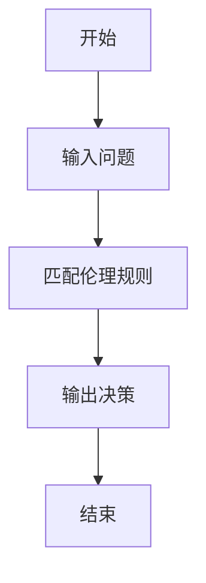
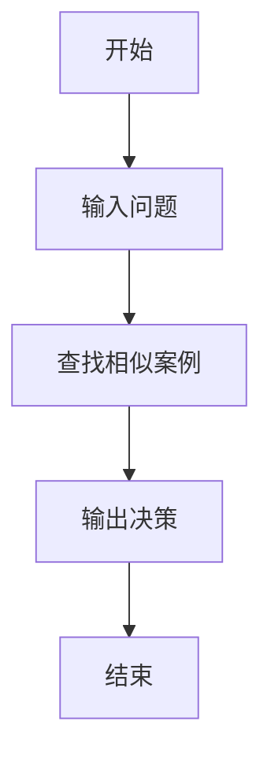
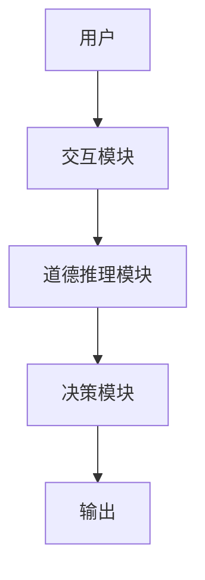
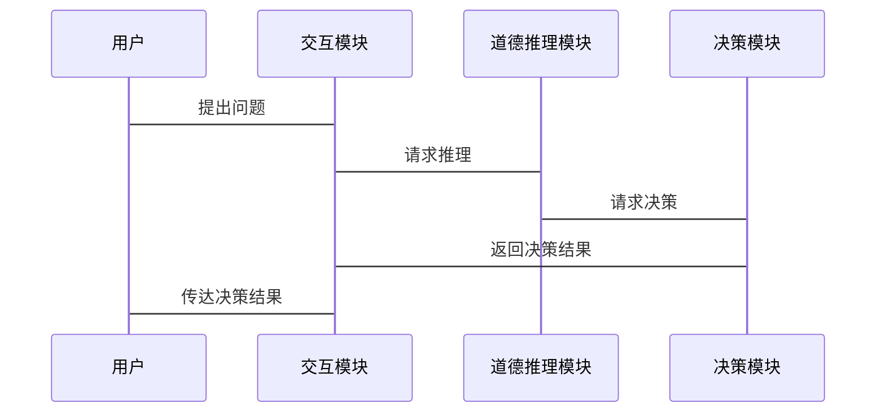

                 


## 第一部分：构建AI Agent的道德推理框架概述

## 第1章：AI Agent与道德推理的背景介绍

### 1.1 AI Agent的基本概念
#### 1.1.1 AI Agent的定义
人工智能代理（AI Agent）是指能够感知环境并采取行动以实现目标的智能实体。AI Agent可以是软件程序、机器人或其他智能系统，具备自主决策和问题解决的能力。

#### 1.1.2 AI Agent的核心特征
AI Agent的核心特征包括：
- **自主性**：能够自主决策，无需外部干预。
- **反应性**：能够感知环境并实时调整行为。
- **目标导向**：具有明确的目标，并采取行动以实现目标。
- **学习能力**：能够通过经验改进性能。

#### 1.1.3 AI Agent的分类与应用场景
AI Agent可以分为以下几类：
- **简单反射型AI Agent**：基于简单的规则进行反应，适用于重复性任务。
- **基于模型的AI Agent**：利用内部模型进行决策，适用于复杂环境。
- **目标驱动型AI Agent**：以目标为导向，优化决策过程。

应用场景包括自动驾驶、智能助手、机器人、医疗诊断、金融投资等。

### 1.2 道德推理的定义与核心要素
#### 1.2.1 道德推理的定义
道德推理是指通过伦理原则、价值观和规范来评估和选择行动的过程。它是AI Agent在复杂环境下做出决策时需要考虑的因素。

#### 1.2.2 道德推理的核心要素
道德推理的核心要素包括：
- **伦理原则**：如诚实、公正、尊重隐私等。
- **价值观**：如个人利益、公共利益、社会福利等。
- **规范**：如法律、行业标准、社会习俗等。

#### 1.2.3 道德推理与AI Agent的结合
AI Agent需要在决策过程中融入道德推理，以确保其行为符合伦理规范，避免造成负面影响。

---

## 第2章：AI Agent道德推理框架的构建背景

### 2.1 当前AI技术的快速发展
#### 2.1.1 AI技术的现状与趋势
人工智能技术近年来发展迅速，AI Agent作为其中的重要组成部分，广泛应用于各个领域。

#### 2.1.2 AI Agent在各领域的应用案例
- 自动驾驶：AI Agent负责车辆的决策和控制。
- 智能助手：如Siri、Alexa，提供信息查询、任务管理等服务。
- 医疗诊断：AI Agent辅助医生进行诊断和治疗方案的选择。

#### 2.1.3 AI Agent面临的伦理挑战
- **隐私问题**：AI Agent可能需要处理大量用户数据，存在隐私泄露风险。
- **决策责任**：当AI Agent的决策导致负面后果时，责任归属问题。
- **公平性问题**：AI Agent的决策可能受到训练数据的影响，存在偏见。

### 2.2 道德推理在AI Agent中的重要性
#### 2.2.1 道德推理的核心作用
道德推理是AI Agent在复杂环境中做出决策的关键，确保其行为符合伦理规范。

#### 2.2.2 道德推理与AI Agent决策的关系
- 道德推理为AI Agent提供伦理指导，帮助其在多种选择中做出符合道德的决策。
- 道德推理框架需要与AI Agent的决策算法相结合，确保决策的合理性和合法性。

#### 2.2.3 道德推理框架的必要性
- 为了应对AI Agent面临的伦理挑战，需要构建一个系统的道德推理框架。
- 道德推理框架能够帮助AI Agent在决策过程中考虑伦理因素，避免负面后果。

---

## 第3章：AI Agent道德推理框架的核心概念与联系

### 3.1 道德推理框架的定义与属性
#### 3.1.1 道德推理框架的定义
道德推理框架是指一组规则、原则和方法，用于指导AI Agent在决策过程中考虑伦理因素。

#### 3.1.2 道德推理框架的属性特征对比
| 属性 | 特征 |
|------|------|
| **目标导向** | 基于目标进行推理 |
| **规则驱动** | 基于伦理规则进行推理 |
| **案例驱动** | 基于相似案例进行推理 |
| **动态调整** | 根据环境变化动态调整推理 |

#### 3.1.3 道德推理框架的ER实体关系图
```mermaid
erDiagram
    actor 用户 {
        string 用户ID
        string 用户名
        string 密码
    }
    role 道德推理框架 {
        string 框架ID
        string 框架名称
        string 版本
    }
    entity AI Agent {
        string AgentID
        string Agent类型
        string 功能描述
    }
    entity 伦理规则 {
        string 规则ID
        string 规则内容
        string 规则来源
    }
    entity 道德推理结果 {
        string 推理ID
        string 推理内容
        string 推理时间
    }
    用户 --> 道德推理框架 : 使用
    道德推理框架 --> AI Agent : 集成
    道德推理框架 --> 伦理规则 : 基于
    AI Agent --> 道德推理结果 : 产生
```

### 3.2 AI Agent与道德推理框架的关系
#### 3.2.1 AI Agent作为道德推理的主体
AI Agent是道德推理框架的主体，负责执行决策和行动。

#### 3.2.2 道德推理框架作为AI Agent的决策支持系统
道德推理框架为AI Agent提供伦理指导，帮助其做出符合道德的决策。

#### 3.2.3 二者的协同作用
- AI Agent通过道德推理框架考虑伦理因素，确保决策的合理性。
- 道德推理框架通过AI Agent实现具体的伦理推理和行动。

---

## 第4章：AI Agent道德推理的算法原理

### 4.1 道德推理算法的分类
#### 4.1.1 基于规则的道德推理算法
- 基于预先定义的伦理规则进行推理。
- 适用于规则明确的场景，如法律规范。

#### 4.1.2 基于案例的道德推理算法
- 基于相似案例进行推理，适用于规则不明确的场景。

#### 4.1.3 基于情感的道德推理算法
- 结合情感计算进行推理，适用于需要考虑人类情感的场景。

### 4.2 基于规则的道德推理算法
#### 4.2.1 算法流程图


#### 4.2.2 算法实现代码
```python
def moral_reasoning():
    # 输入问题
    problem = input("请输入问题：")
    # 匹配伦理规则
    rules = {
        "隐私保护": "保护用户隐私",
        "公正性": "确保决策公正",
        "诚实守信": "遵守诚信原则"
    }
    matching_rule = None
    for rule in rules:
        if rule in problem:
            matching_rule = rule
            break
    if matching_rule:
        decision = rules[matching_rule]
    else:
        decision = "无法确定"
    print(f"决策结果：{decision}")
```

#### 4.2.3 算法数学模型与公式
$$ 决策 = \sum_{i=1}^{n} (规则_i \times 权重_i) $$

### 4.3 基于案例的道德推理算法
#### 4.3.1 算法流程图


#### 4.3.2 算法实现代码
```python
def case_based_moral_reasoning():
    # 输入问题
    problem = input("请输入问题：")
    # 查找相似案例
    cases = [
        {"案例1": "隐私泄露问题", "决策": "保护隐私"},
        {"案例2": "数据滥用问题", "决策": "限制数据使用"}
    ]
    matching_case = None
    for case in cases:
        if case["案例"] in problem:
            matching_case = case
            break
    if matching_case:
        decision = matching_case["决策"]
    else:
        decision = "无法确定"
    print(f"决策结果：{decision}")
```

#### 4.3.3 算法数学模型与公式
$$ 决策 = \max_{i} (相似度_i \times 决策权重_i) $$

---

## 第5章：AI Agent道德推理框架的系统架构设计

### 5.1 系统功能模块设计
#### 5.1.1 道德推理模块
- 负责接收输入问题，进行伦理推理，输出决策结果。

#### 5.1.2 决策模块
- 负责根据推理结果进行最终决策，并输出行动指令。

#### 5.1.3 交互模块
- 负责与用户或其他系统的交互，接收输入并传递输出。

### 5.2 系统架构图


### 5.3 系统接口设计
#### 5.3.1 系统输入接口
- 输入问题：从用户或其他系统接收输入问题。
- 输入数据：接收与问题相关的数据，如用户信息、环境信息等。

#### 5.3.2 系统输出接口
- 输出决策：道德推理框架输出的决策结果。
- 输出行动：AI Agent根据决策结果采取的行动指令。

### 5.4 系统交互序列图


---

## 第6章：项目实战——构建AI Agent道德推理框架

### 6.1 项目背景与目标
#### 6.1.1 项目背景
- 针对自动驾驶场景，构建一个基于道德推理框架的AI Agent。

#### 6.1.2 项目目标
- 实现AI Agent在自动驾驶中的道德推理功能，确保其决策符合伦理规范。

### 6.2 系统核心实现
#### 6.2.1 环境安装与配置
- **安装Python**：确保Python 3.8及以上版本已安装。
- **安装依赖库**：安装`mermaid`、`graphviz`等依赖库。

#### 6.2.2 核心实现代码
```python
class MoralReasoningFramework:
    def __init__(self):
        self.rules = {
            "隐私保护": "保护用户隐私",
            "公正性": "确保决策公正",
            "诚实守信": "遵守诚信原则"
        }

    def reason(self, problem):
        for rule in self.rules:
            if rule in problem:
                return self.rules[rule]
        return "无法确定"

# 使用示例
framework = MoralReasoningFramework()
print(framework.reason("自动驾驶中如何处理隐私泄露问题？"))  # 输出：保护用户隐私
```

#### 6.2.3 代码解读与分析
- **MoralReasoningFramework**：定义一个道德推理框架类，包含伦理规则和推理方法。
- **reason方法**：根据输入问题匹配相应的伦理规则，返回决策结果。

### 6.3 项目案例分析
#### 6.3.1 案例背景
- 自动驾驶汽车面临紧急情况，需要在毫秒内做出决策。

#### 6.3.2 案例分析
- **问题**：自动驾驶汽车在紧急情况下如何选择路径。
- **决策过程**：
  1. 识别问题：前方出现障碍物，需要紧急转向。
  2. 匹配伦理规则：优先保护车内乘客的安全，同时尽量减少对行人的伤害。
  3. 输出决策：选择转向避免撞向行人，但可能撞向护栏。

### 6.4 项目小结
- 通过项目实战，验证了道德推理框架的有效性。
- 在实际应用中，需要不断优化伦理规则和推理算法，以应对复杂多变的环境。

---

## 第7章：AI Agent道德推理框架的总结与展望

### 7.1 最佳实践 tips
- **伦理规则的动态调整**：根据实际场景和用户反馈，动态调整伦理规则。
- **多模态推理**：结合情感计算、情境感知等多种推理方式，提高决策的全面性。
- **透明性与可解释性**：确保道德推理过程的透明性和可解释性，方便用户理解和监督。

### 7.2 小结
- AI Agent的道德推理框架是实现伦理决策的关键技术。
- 通过合理的算法设计和系统架构，可以确保AI Agent在复杂环境中的决策符合伦理规范。

### 7.3 注意事项
- 道德推理框架的设计需要兼顾技术可行性和伦理合理性。
- 在实际应用中，需注意数据隐私和算法透明性，避免潜在的伦理风险。

### 7.4 拓展阅读
- 阅读相关伦理学经典著作，深入理解道德推理的理论基础。
- 关注AI伦理领域的最新研究和实践案例，保持对技术发展的敏感性。

---

通过以上章节的内容，我们可以系统地构建一个基于道德推理的AI Agent框架，确保其在复杂环境中的决策既符合伦理规范，又具备实际应用价值。

