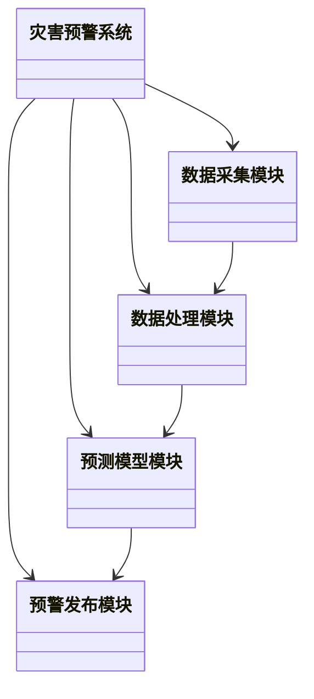
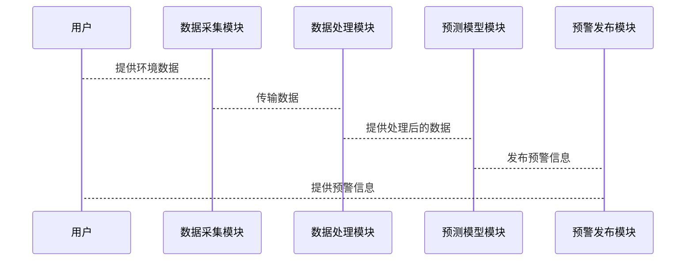

                 


# 构建AI Agent驱动的智能灾害预警系统

## 关键词：
AI Agent, 智能灾害预警系统, 强化学习, 灾害预防, 智能化预警

## 摘要：
本文详细探讨了构建AI Agent驱动的智能灾害预警系统的各个方面，从背景介绍到系统设计，再到项目实战，全面解析了如何利用AI Agent技术提升灾害预警的效率和准确性。文章通过理论分析和实际案例，展示了AI Agent在灾害预警中的核心作用，并提供了系统的架构设计和实现方法。通过本文的分析，读者将深入了解AI Agent驱动的智能灾害预警系统的构建过程及其在实际应用中的优势。

---

# 第一部分: AI Agent驱动的智能灾害预警系统背景介绍

## 第1章: 灾害预警系统概述

### 1.1 灾害预警系统的基本概念

#### 1.1.1 灾害预警的定义
灾害预警是指通过各种技术和方法，对可能发生的自然灾害（如地震、洪水、台风等）进行预测、警报和响应的系统。其目的是在灾害发生前发出预警，减少人员伤亡和财产损失。

#### 1.1.2 灾害预警系统的重要性
灾害预警系统的存在对于保护人民生命财产安全具有重要意义。及时的预警可以为相关部门和公众争取宝贵的应急时间，采取有效的防范措施。

#### 1.1.3 灾害预警系统的分类
灾害预警系统可以根据预警对象、技术手段和应用领域进行分类。常见的分类包括：
- **地震预警系统**
- **气象灾害预警系统（如台风、暴雨）**
- **地质灾害预警系统（如泥石流、滑坡）**
- **海洋灾害预警系统（如海啸、风暴潮）**

### 1.2 AI Agent在灾害预警中的作用

#### 1.2.1 AI Agent的基本概念
AI Agent（人工智能代理）是指能够感知环境、自主决策并采取行动的智能实体。它可以分为**反应式AI Agent**和**认知式AI Agent**，前者基于当前感知做出反应，后者则具备更复杂的推理和规划能力。

#### 1.2.2 AI Agent在灾害预警中的优势
AI Agent在灾害预警中的优势主要体现在以下几个方面：
1. **实时性**：AI Agent能够实时感知环境变化，快速做出反应。
2. **自主性**：AI Agent能够在没有人工干预的情况下自主运行。
3. **学习能力**：通过机器学习算法，AI Agent可以不断优化自身的预测模型。
4. **多任务处理**：AI Agent能够同时处理多种灾害预警任务，提高整体效率。

#### 1.2.3 AI Agent与传统灾害预警系统的区别
传统灾害预警系统通常依赖于固定的规则和模型，而AI Agent驱动的系统则具备更强的自主学习和适应能力。AI Agent能够根据实时数据动态调整预警策略，显著提高了预警的准确性和响应速度。

---

## 第2章: 灾害预警系统的背景与问题分析

### 2.1 灾害预警系统的现状

#### 2.1.1 当前灾害预警技术的发展现状
随着科技的进步，灾害预警技术取得了显著进展。例如，地震预警系统已经能够在地震波到达前几秒发出警报，为人们争取宝贵的逃生时间。然而，现有的系统仍存在一些局限性。

#### 2.1.2 灾害预警系统存在的问题
1. **数据不足**：某些地区缺乏足够的历史数据支持预警模型的训练。
2. **模型单一**：传统模型可能无法适应复杂的灾害变化。
3. **响应延迟**：传统预警系统可能因为数据处理和决策过程较长而导致响应延迟。

#### 2.1.3 灾害预警系统的技术挑战
- **数据多样性**：灾害预警需要处理多源异构数据，包括气象、地质、遥感等多种数据。
- **模型复杂性**：需要构建能够处理复杂关系的模型。
- **实时性要求**：系统必须能够在极短时间内完成数据处理和决策。

### 2.2 AI Agent驱动的灾害预警系统的需求

#### 2.2.1 灾害预警系统智能化的需求
智能化的灾害预警系统能够通过AI Agent实现自主学习、动态调整和多任务处理，显著提高预警的准确性和效率。

#### 2.2.2 AI Agent在灾害预警中的应用场景
- **实时监测与预警**：AI Agent实时监测环境数据，及时发出预警。
- **多灾害联动预警**：AI Agent能够同时监测多种灾害类型，实现联动预警。
- **动态调整预警策略**：根据实时数据和历史数据，动态调整预警阈值和策略。

#### 2.2.3 灾害预警系统智能化的必要性
智能化的灾害预警系统能够有效应对复杂多变的灾害情况，提高预警的准确性和响应速度，从而最大限度地减少灾害损失。

---

## 第3章: AI Agent驱动的灾害预警系统的核心概念

### 3.1 AI Agent的核心概念

#### 3.1.1 AI Agent的定义与特点
AI Agent是一种能够感知环境、自主决策并采取行动的智能实体。其特点包括：
- **自主性**：无需人工干预即可运行。
- **反应性**：能够实时感知环境并做出反应。
- **学习能力**：能够通过数据学习和优化自身模型。

#### 3.1.2 AI Agent的类型
- **反应式AI Agent**：基于当前感知做出反应，适用于实时性要求较高的场景。
- **认知式AI Agent**：具备推理和规划能力，适用于复杂任务。

#### 3.1.3 AI Agent的组成模块
- **感知模块**：负责收集环境数据。
- **决策模块**：基于感知数据做出决策。
- **行动模块**：执行决策并采取行动。

### 3.2 灾害预警系统的核心概念

#### 3.2.1 灾害预警系统的核心功能
- **数据采集**：收集气象、地质等多种数据。
- **数据处理**：对数据进行清洗、融合和分析。
- **预测模型**：基于历史数据和实时数据，预测灾害发生的时间、地点和强度。
- **预警发布**：根据预测结果，向相关部门和公众发布预警信息。

#### 3.2.2 AI Agent在灾害预警系统中的角色
AI Agent在灾害预警系统中主要负责实时监测、数据处理、预测模型优化和预警信息发布。通过AI Agent的自主学习和动态调整能力，系统能够不断提高预测的准确性。

#### 3.2.3 灾害预警系统的整体架构
灾害预警系统的整体架构可以分为数据采集层、数据处理层、预测模型层和预警发布层。AI Agent贯穿于整个系统，负责协调各部分的工作。

---

## 第4章: AI Agent驱动的灾害预警系统的实体关系图和领域模型

### 4.1 实体关系图（ER图）

```mermaid
er
  %% 灾害预警系统的实体关系图
  actor 用户
  actor 灾害监测中心
  actor 政府部门
  actor 公众
  actor 救援机构
  
  database 灾害预警数据库
  
  灾害监测设备
  灾害预警模型
  灾害预警信息发布平台
  
  灾害监测设备 --> 灾害预警数据库
  灾害预警数据库 --> 灾害预警模型
  灾害预警模型 --> 灾害预警信息发布平台
  
  用户 --> 灾害预警信息发布平台
  灾害监测中心 --> 灾害预警模型
  政府部门 --> 灾害预警模型
  公众 --> 灾害预警信息发布平台
  救援机构 --> 灾害预警信息发布平台
```

### 4.2 领域模型（类图）



---

## 第5章: AI Agent驱动的灾害预警系统的算法原理

### 5.1 强化学习算法

#### 5.1.1 强化学习的基本原理
强化学习是一种机器学习方法，通过智能体与环境的交互，学习最优策略以最大化累计奖励。其基本流程如下：

1. **环境感知**：智能体感知当前环境状态。
2. **决策**：智能体基于当前状态选择一个动作。
3. **执行动作**：智能体执行选择的动作，观察环境状态的变化，并获得奖励。
4. **更新策略**：智能体根据奖励调整策略，以提高未来奖励。

#### 5.1.2 强化学习的数学模型
强化学习的核心是Q-learning算法，其数学模型如下：

$$ Q(s, a) = Q(s, a) + \alpha [r + \max_{a'} Q(s', a') - Q(s, a)] $$

其中：
- \( Q(s, a) \)：状态 \( s \) 下采取动作 \( a \) 的价值。
- \( \alpha \)：学习率。
- \( r \)：获得的奖励。
- \( \max_{a'} Q(s', a') \)：下一状态 \( s' \) 下的最大价值动作。

#### 5.1.3 强化学习的实现步骤
1. 初始化Q表。
2. 进入循环：
   - 确定当前状态。
   - 根据策略选择动作。
   - 执行动作，观察下一个状态和奖励。
   - 更新Q表。
3. 直到满足终止条件。

### 5.2 监督学习算法

#### 5.2.1 监督学习的基本原理
监督学习是一种机器学习方法，通过训练数据学习输入与输出之间的映射关系。其基本流程如下：
1. **数据准备**：收集和标注训练数据。
2. **模型训练**：使用训练数据训练模型。
3. **模型预测**：使用训练好的模型进行预测。
4. **模型评估**：评估模型的性能并进行优化。

#### 5.2.2 监督学习的数学模型
监督学习的核心是回归和分类问题。例如，线性回归的数学模型如下：

$$ y = \theta^T x + b $$

其中：
- \( y \)：输出。
- \( \theta \)：权重向量。
- \( x \)：输入特征向量。
- \( b \)：偏置项。

---

## 第6章: AI Agent驱动的灾害预警系统的系统设计

### 6.1 系统需求分析

#### 6.1.1 问题场景介绍
灾害预警系统的应用场景包括地震、台风、洪水等自然灾害的预警。系统需要具备实时监测、数据处理、预测模型优化和预警发布等功能。

#### 6.1.2 项目介绍
本项目旨在构建一个基于AI Agent的智能灾害预警系统，利用强化学习和监督学习算法，实现对多种自然灾害的实时监测和预警。

### 6.2 系统功能设计

#### 6.2.1 系统功能模块
- **数据采集模块**：负责收集气象、地质等数据。
- **数据处理模块**：对数据进行清洗、融合和分析。
- **预测模型模块**：基于历史数据和实时数据，预测灾害发生的时间、地点和强度。
- **预警发布模块**：根据预测结果，向相关部门和公众发布预警信息。

#### 6.2.2 领域模型（类图）


### 6.3 系统架构设计

#### 6.3.1 系统架构设计（分层架构）


#### 6.3.2 系统交互流程图


### 6.4 系统接口设计

#### 6.4.1 系统接口
- **数据采集接口**：负责接收传感器数据。
- **数据处理接口**：负责对数据进行清洗和融合。
- **预测模型接口**：负责对数据进行预测并生成预警信息。
- **预警发布接口**：负责将预警信息发送给用户。

#### 6.4.2 接口交互流程
1. 数据采集模块通过数据采集接口接收环境数据。
2. 数据处理模块通过数据处理接口对数据进行处理。
3. 预测模型模块通过预测模型接口生成预警信息。
4. 预警发布模块通过预警发布接口将预警信息发送给用户。

---

## 第7章: AI Agent驱动的灾害预警系统的项目实战

### 7.1 环境安装

#### 7.1.1 安装Python
- 下载并安装Python 3.x版本。
- 配置环境变量。

#### 7.1.2 安装必要的库
- 使用pip安装numpy、pandas、scikit-learn等库。

#### 7.1.3 安装Jupyter Notebook
- 使用pip安装jupyter notebook。

### 7.2 系统核心实现源代码

#### 7.2.1 数据采集模块
```python
import requests

def collect_data():
    # 模拟数据采集
    response = requests.get('http://example.com/sensor_data')
    return response.json()
```

#### 7.2.2 数据处理模块
```python
import pandas as pd

def preprocess_data(data):
    df = pd.DataFrame(data)
    # 数据清洗和预处理
    df.dropna(inplace=True)
    return df
```

#### 7.2.3 预测模型模块
```python
from sklearn.linear_model import LinearRegression

def train_model(data):
    X = data[['temperature', 'humidity']]
    y = data['rainfall']
    model = LinearRegression()
    model.fit(X, y)
    return model
```

#### 7.2.4 预警发布模块
```python
def send预警(预测结果):
    print(f"预警信息：{预测结果}")
```

### 7.3 代码应用解读与分析

#### 7.3.1 数据采集模块
- 该模块负责从外部API获取传感器数据。
- 使用requests库发送HTTP请求并解析响应数据。

#### 7.3.2 数据处理模块
- 使用pandas库对数据进行清洗和预处理。
- 去除缺失值，确保数据完整性。

#### 7.3.3 预测模型模块
- 使用scikit-learn库中的线性回归模型进行训练。
- 输入特征包括温度和湿度，输出预测降雨量。

#### 7.3.4 预警发布模块
- 根据预测结果生成预警信息并输出。

### 7.4 实际案例分析和详细讲解剖析

#### 7.4.1 案例背景
假设我们正在构建一个洪水预警系统，需要预测未来24小时内的降雨量。

#### 7.4.2 数据准备
收集过去一年的气象数据，包括温度、湿度、降雨量等。

#### 7.4.3 模型训练
使用收集的数据训练线性回归模型，预测降雨量。

#### 7.4.4 预警发布
根据模型预测结果，当预测降雨量超过阈值时，向相关部门和公众发布预警信息。

### 7.5 项目小结

#### 7.5.1 核心代码实现
- 数据采集模块：从传感器获取数据。
- 数据处理模块：清洗和预处理数据。
- 预测模型模块：训练模型并进行预测。
- 预警发布模块：根据预测结果发布预警信息。

#### 7.5.2 项目总结
通过本项目的实践，我们成功构建了一个基于AI Agent的智能灾害预警系统。系统能够实时监测环境数据，通过数据处理和模型预测，生成预警信息并发布。这为灾害预防提供了有力的支持。

---

## 第8章: AI Agent驱动的灾害预警系统的最佳实践

### 8.1 小结

- AI Agent驱动的灾害预警系统通过智能化的监测和预测，显著提高了灾害预警的准确性和响应速度。
- 系统的核心在于AI Agent的自主学习和动态调整能力，能够适应复杂的灾害变化。

### 8.2 注意事项

- **数据质量**：确保数据的准确性和完整性，避免因数据问题影响模型预测。
- **模型优化**：定期更新和优化预测模型，以适应新的数据和灾害情况。
- **系统维护**：定期检查和维护系统，确保其稳定运行。

### 8.3 拓展阅读

- **《机器学习实战》**：学习机器学习的基本概念和算法。
- **《深度学习》**：深入了解深度学习的原理和应用。
- **《强化学习（Definitive Guide）》**：系统学习强化学习的理论和实践。

---

通过本文的详细讲解，读者可以全面了解AI Agent驱动的智能灾害预警系统的构建过程，掌握其核心技术和实际应用。希望本文能为相关领域的研究和实践提供有价值的参考。

