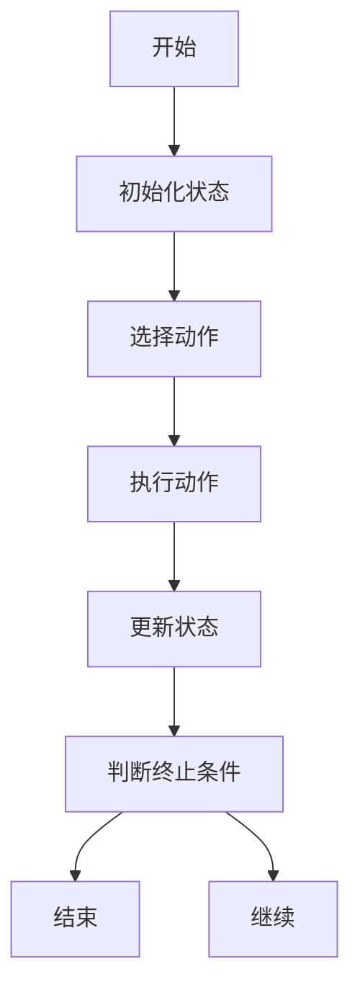
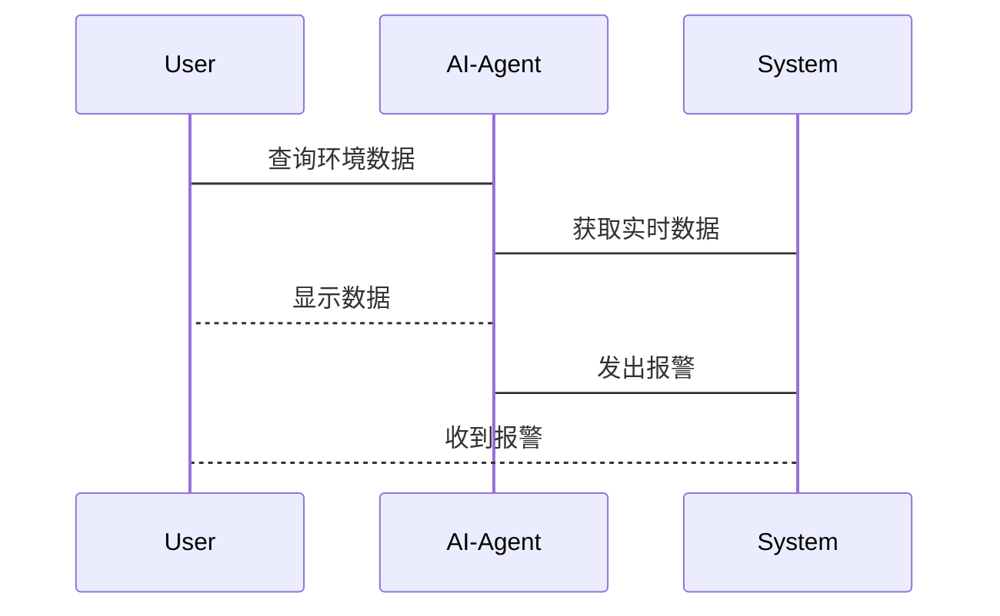

                 


# 构建AI Agent驱动的智能环境保护系统

## 关键词
AI Agent, 智能环境保护, 系统架构, 强化学习, 环境监测

## 摘要
随着环境问题的日益严重，传统的环境保护系统逐渐暴露出效率低下、实时性差等问题。本文提出了一种基于AI Agent的智能环境保护系统，通过结合人工智能技术，实现对环境数据的实时监测、智能分析和自主决策。本文详细探讨了AI Agent的核心原理、系统架构设计、算法实现以及项目实战，为构建高效、智能的环境保护系统提供了理论依据和实践指导。

---

# 第一部分: AI Agent驱动的智能环境保护系统概述

## 第1章: 背景介绍

### 1.1 问题背景
#### 1.1.1 环境保护的现状与挑战
随着工业化进程的加速，环境问题日益严重，包括空气污染、水污染、噪音污染等。传统的环境保护系统依赖人工监测和被动反应，存在效率低下、实时性差、覆盖范围有限等问题。

#### 1.1.2 传统环境保护系统的问题
- 数据采集不实时，响应速度慢。
- 系统缺乏自主决策能力，依赖人工干预。
- 环境数据复杂性高，传统方法难以处理。

#### 1.1.3 AI Agent技术的引入与潜力
AI Agent（人工智能代理）是一种能够感知环境、自主决策、执行任务的智能实体。通过引入AI Agent技术，可以实现环境数据的实时监测、智能分析和自主优化，显著提升环境保护系统的效率和性能。

### 1.2 问题描述
#### 1.2.1 环境保护系统的核心目标
- 实时监测环境数据，包括温度、湿度、空气质量等。
- 智能分析数据，识别异常情况。
- 自主决策，采取最优控制策略。

#### 1.2.2 AI Agent在环境保护中的应用场景
- 智能传感器数据采集与处理。
- 环境异常事件的预测与报警。
- 自动化控制，如调节设备运行参数。

#### 1.2.3 系统边界与外延
系统边界包括环境监测设备、AI Agent代理、数据存储与分析模块。外延部分涉及用户界面、远程控制和数据可视化。

### 1.3 问题解决
#### 1.3.1 AI Agent驱动环境保护的解决方案
通过部署多个AI Agent，实现对环境的全方位监测和智能控制。每个AI Agent负责特定区域的环境数据采集、分析和决策。

#### 1.3.2 系统设计的核心要素
- 数据采集模块：传感器网络。
- 数据处理模块：AI Agent算法。
- 决策控制模块：基于强化学习的优化算法。
- 人机交互模块：用户界面和报警系统。

#### 1.3.3 系统功能与性能指标
- 实时监测：秒级数据采集和处理。
- 智能分析：准确识别环境异常。
- 自主决策：优化控制策略，降低能耗。

---

## 第2章: 核心概念与联系

### 2.1 AI Agent的核心原理
#### 2.1.1 AI Agent的定义与分类
AI Agent是一种能够感知环境、自主决策、执行任务的智能实体。根据智能水平，可分为简单反射型、基于模型的反应型、目标驱动型和实用驱动型。

#### 2.1.2 AI Agent的基本属性特征
- 能动性：自主执行任务。
- 学习能力：适应环境变化。
- 适应性：动态调整行为。

#### 2.1.3 AI Agent与智能环境保护系统的关联
AI Agent作为系统的核心模块，负责数据处理、分析和决策，是实现智能环境保护的关键。

### 2.2 概念属性对比表
| 概念       | 能动性 | 学习能力 | 适应性 |
|------------|--------|----------|--------|
| AI Agent   | 高     | 高       | 高     |
| 环境保护系统 | 低     | 中       | 中     |

### 2.3 ER实体关系图
```mermaid
erDiagram
    class AI_Agent {
        id
        type
        status
        action
    }
    class Environment_System {
        id
        status
        data
        action
    }
    AI_Agent --> Environment_System : 驱动
    Environment_System --> AI_Agent : 监测
```

---

## 第3章: 算法原理讲解

### 3.1 AI Agent的核心算法
#### 3.1.1 状态空间搜索算法
状态空间搜索算法通过遍历所有可能的状态，找到最优路径。适用于简单环境下的任务规划。

#### 3.1.2 强化学习算法
强化学习通过奖惩机制，训练AI Agent在复杂环境中做出最优决策。

#### 3.1.3 贝叶斯网络推理
贝叶斯网络用于概率推理，帮助AI Agent在不确定环境中做出决策。

### 3.2 算法流程图


### 3.3 算法实现代码
```python
def ai_agent_algorithm(state):
    # 状态空间搜索
    if state == 'normal':
        return 'no action'
    else:
        # 强化学习决策
        return 'alarm'
```

---

## 第4章: 数学模型与公式

### 4.1 强化学习的数学模型
强化学习的核心公式是Q-learning：
$$ Q(s, a) = Q(s, a) + \alpha (r + \gamma \max Q(s', a') - Q(s, a)) $$
其中，\( Q(s, a) \) 表示状态s下动作a的值，\( \alpha \) 是学习率，\( \gamma \) 是折扣因子。

### 4.2 贝叶斯网络的概率公式
贝叶斯网络的概率公式为：
$$ P(A|B) = \frac{P(B|A)P(A)}{P(B)} $$
其中，\( P(A|B) \) 是A在B发生的条件下发生的概率。

---

## 第5章: 系统分析与架构设计

### 5.1 系统架构设计
系统架构包括数据采集层、数据处理层和应用层。数据采集层负责传感器数据采集，数据处理层通过AI Agent进行数据处理，应用层提供用户界面和报警功能。

### 5.2 系统功能设计
- 数据采集：传感器网络实时采集环境数据。
- 数据处理：AI Agent分析数据，识别异常。
- 决策控制：优化控制策略，降低能耗。

### 5.3 系统交互序列图


---

## 第6章: 项目实战

### 6.1 环境安装
需要安装Python、深度学习框架（如TensorFlow）和相关库。

### 6.2 核心实现
```python
class AIEnvironmentAgent:
    def __init__(self):
        self.data = []
        self.threshold = 0.8

    def monitor(self):
        # 实时监测环境数据
        pass

    def analyze(self, data):
        # 数据分析
        pass

    def decision(self, result):
        # 决策控制
        pass
```

### 6.3 案例分析
通过实际案例分析，展示AI Agent在环境监测中的应用效果。

### 6.4 项目小结
总结项目实施过程中的经验和教训，提出改进建议。

---

## 第7章: 最佳实践与总结

### 7.1 最佳实践
- 确保传感器数据的实时性和准确性。
- 定期更新AI Agent的模型和参数。
- 优化系统架构，提升性能。

### 7.2 小结
本文详细介绍了AI Agent驱动的智能环境保护系统的构建过程，从理论到实践，为后续研究提供了参考。

### 7.3 注意事项
- 系统的安全性和隐私保护。
- 数据的准确性和实时性。
- 系统的可扩展性和可维护性。

### 7.4 拓展阅读
推荐相关领域的书籍和论文，供读者深入学习。

---

# 结语

通过本文的详细讲解，读者可以全面了解如何利用AI Agent技术构建智能环境保护系统。未来，随着人工智能技术的不断发展，AI Agent在环境保护中的应用将更加广泛和深入。

