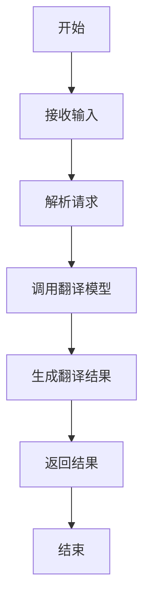
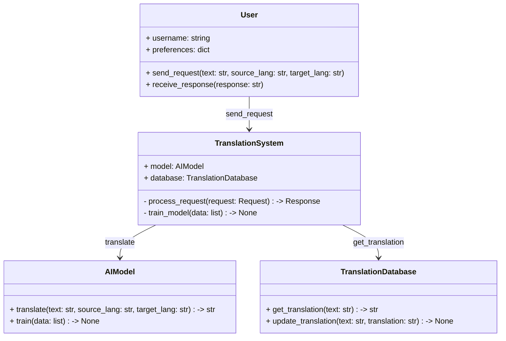
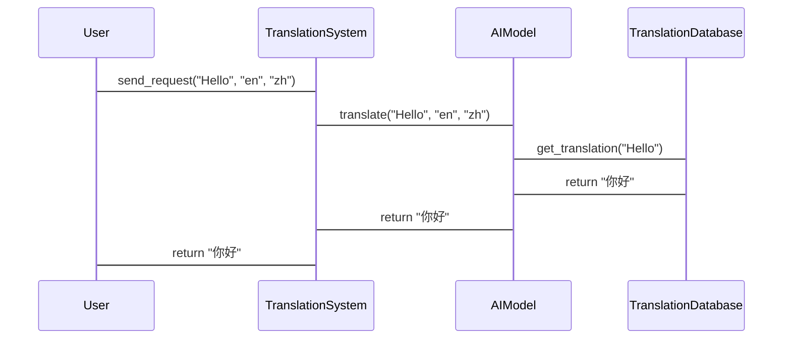
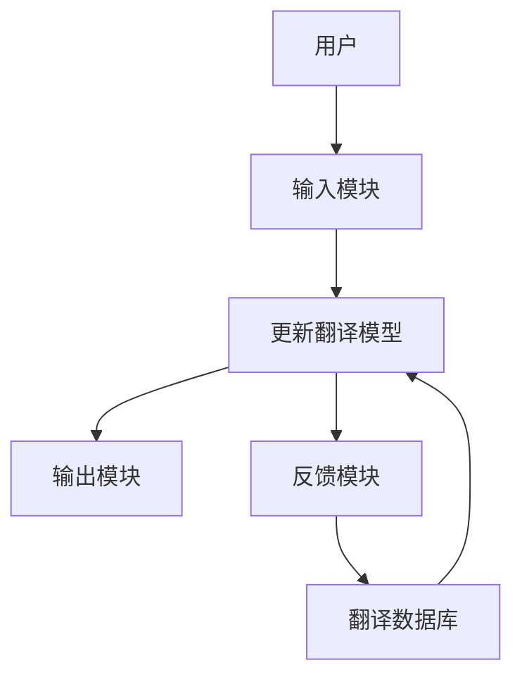
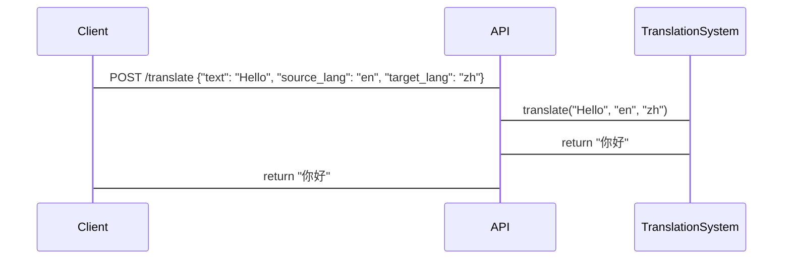

                 


# 构建AI Agent驱动的智能翻译系统

## 关键词：AI Agent，智能翻译系统，自然语言处理，机器学习，深度学习

## 摘要：  
本文将详细探讨如何利用AI Agent构建一个智能翻译系统。通过分析AI Agent的核心原理、翻译系统的架构设计、算法实现以及实际案例，本文旨在为读者提供一个全面的技术指南，帮助他们理解并实现一个高效、准确的智能翻译系统。

---

# 第1章: 背景介绍

## 1.1 问题背景

### 1.1.1 传统翻译系统的局限性
传统翻译系统主要依赖于规则引擎和双语对照词典，存在以下问题：
- **准确性不足**：无法处理复杂的语义关系和语境。
- **效率低下**：难以实时处理大量数据。
- **缺乏智能性**：无法根据上下文进行推理和优化。

### 1.1.2 AI技术在翻译领域的应用现状
随着自然语言处理（NLP）技术的发展，AI在翻译领域的应用日益广泛：
- **神经机器翻译（NMT）**：基于Transformer模型的翻译系统已经取得了突破性进展。
- **多语言支持**：AI能够处理多种语言，支持跨语言交流。
- **实时交互**：AI翻译系统能够实现实时翻译和语音识别的结合。

### 1.1.3 构建AI Agent驱动翻译系统的必要性
AI Agent（智能代理）能够通过感知环境、推理和执行任务，显著提升翻译系统的性能：
- **动态适应性**：AI Agent可以根据上下文优化翻译结果。
- **多模态交互**：支持文本、语音、图像等多种输入形式。
- **自适应学习**：AI Agent能够通过反馈不断优化自身的翻译能力。

## 1.2 问题描述

### 1.2.1 翻译系统的功能需求
智能翻译系统需要满足以下功能需求：
- 支持多种语言翻译。
- 提供上下文感知的翻译结果。
- 实现实时语音和文本交互。
- 支持用户自定义词典和偏好设置。

### 1.2.2 AI Agent在翻译中的角色定位
AI Agent在翻译系统中扮演多重角色：
- **翻译引擎**：负责语言理解和生成。
- **上下文推理**：分析语境，优化翻译结果。
- **用户交互**：通过自然语言处理实现人机交互。

### 1.2.3 系统边界与外延
系统边界包括：
- 输入接口：支持文本、语音、图像输入。
- 输出接口：提供翻译结果和反馈。
- 外部依赖：依赖AI模型和翻译数据库。

系统外延包括：
- 连接外部知识库。
- 支持多平台部署。
- 提供API接口供其他系统调用。

## 1.3 核心概念与组成

### 1.3.1 AI Agent的定义与特征
AI Agent的定义：
- AI Agent是一个智能实体，能够感知环境、推理问题、执行任务并提供解决方案。

AI Agent的特征：
- **自主性**：能够在没有人工干预的情况下执行任务。
- **反应性**：能够实时感知环境变化并调整行为。
- **学习能力**：能够通过经验优化自身性能。

### 1.3.2 智能翻译系统的组成要素
智能翻译系统的组成要素包括：
1. **输入模块**：接收用户输入，解析请求。
2. **翻译模块**：负责语言理解和生成。
3. **上下文推理模块**：分析语境，优化翻译结果。
4. **输出模块**：将翻译结果呈现给用户。
5. **反馈模块**：收集用户反馈，优化系统性能。

### 1.3.3 系统功能模块的划分
系统功能模块划分为：
- **文本预处理**：分词、句法分析。
- **翻译引擎**：基于AI模型的翻译。
- **后处理**：语法优化、语义增强。
- **反馈机制**：收集用户反馈，优化翻译模型。

---

# 第2章: 核心概念与联系

## 2.1 AI Agent的核心原理

### 2.1.1 知识表示与推理
知识表示：
- 使用符号逻辑和知识图谱表示领域知识。
- 通过图结构表示实体间的关系。

推理过程：
- **符号逻辑推理**：基于知识图谱进行逻辑推理。
- **概率推理**：利用贝叶斯网络进行不确定性推理。

### 2.1.2 任务规划与执行
任务规划：
- **目标分解**：将复杂任务分解为子任务。
- **优先级排序**：根据任务的重要性和紧急性排序。

任务执行：
- **子任务执行**：逐一执行分解后的子任务。
- **状态监控**：实时监控任务执行状态，调整执行策略。

### 2.1.3 多模态交互能力
多模态交互：
- 支持文本、语音、图像等多种输入输出形式。
- 通过自然语言处理技术实现人机对话。

## 2.2 智能翻译系统的架构分析

### 2.2.1 系统输入输出分析
输入分析：
- 文本输入：支持中英文翻译。
- 语音输入：支持实时语音识别。
- 图像输入：支持OCR识别和图像描述生成。

输出分析：
- 文本输出：提供翻译结果和建议。
- 语音输出：支持语音合成输出。
- 图像输出：生成翻译后的图像描述。

### 2.2.2 系统功能模块的实体关系图
系统功能模块的实体关系图：
```mermaid
er
actor: 用户
system: 智能翻译系统
model: AI翻译模型
database: 翻译数据库
```

### 2.2.3 核心概念对比表
核心概念对比表：
| 概念 | 属性 | 描述 |
|------|------|------|
| AI Agent | 知识库 | 包含领域知识和翻译规则 |
| 智能翻译系统 | 输入方式 | 支持文本、语音、图像输入 |
| 翻译模型 | 模型类型 | 基于Transformer的神经网络模型 |

## 2.3 本章小结

---

# 第3章: 算法原理讲解

## 3.1 AI Agent的算法流程

### 3.1.1 算法流程图
算法流程图：


### 3.1.2 算法实现代码
```python
def translate(text, source_lang, target_lang):
    # 文本预处理
    preprocessed_text = preprocess(text, source_lang)
    # 调用翻译模型
    translated_text = model.translate(preprocessed_text, source_lang, target_lang)
    # 后处理
    processed_text = postprocess(translated_text, target_lang)
    return processed_text
```

### 3.1.3 算法原理的数学模型
翻译模型的数学模型：
$$ P(y|x) = \text{argmax}_{y} p(y|x) $$

其中：
- $x$ 是输入文本。
- $y$ 是输出翻译文本。
- $p(y|x)$ 是条件概率。

---

# 第4章: 系统分析与架构设计方案

## 4.1 系统功能设计

### 4.1.1 功能模块划分
功能模块划分：
- **输入模块**：接收用户输入。
- **翻译模块**：核心翻译逻辑。
- **输出模块**：呈现翻译结果。
- **反馈模块**：收集用户反馈。

### 4.1.2 功能模块的类图
功能模块的类图：


### 4.1.3 功能模块的交互流程
功能模块的交互流程：


## 4.2 系统架构设计

### 4.2.1 系统架构图
系统架构图：


### 4.2.2 系统架构设计说明
系统架构设计说明：
- **输入模块**：接收用户输入并解析请求。
- **翻译模块**：核心翻译逻辑，调用AI模型进行翻译。
- **输出模块**：将翻译结果返回给用户。
- **反馈模块**：收集用户反馈，更新翻译模型。
- **翻译数据库**：存储翻译记录和优化建议。

## 4.3 系统接口设计

### 4.3.1 系统接口设计说明
系统接口设计说明：
- **输入接口**：支持文本、语音、图像输入。
- **输出接口**：提供翻译结果和反馈。
- **API接口**：提供RESTful API供其他系统调用。

### 4.3.2 系统接口的交互流程
系统接口的交互流程：


---

# 第5章: 项目实战

## 5.1 环境安装

### 5.1.1 安装Python环境
安装Python环境：
```bash
python --version
pip install --upgrade pip
```

### 5.1.2 安装翻译模型
安装翻译模型：
```bash
pip install transformers
pip install pytorch
```

## 5.2 系统核心实现

### 5.2.1 翻译模块实现
翻译模块实现：
```python
from transformers import AutoTokenizer, AutoModelForTranslation

class Translator:
    def __init__(self, model_name):
        self.tokenizer = AutoTokenizer.from_pretrained(model_name)
        self.model = AutoModelForTranslation.from_pretrained(model_name)

    def translate(self, text, source_lang, target_lang):
        inputs = self.tokenizer(text, return_tensors="pt")
        outputs = self.model.generate(**inputs, forced_bos_token_id=self.tokenizer.get_special_tokens_mask(text)[0])
        return self.tokenizer.decode(outputs[0], skip_special_tokens=True)
```

### 5.2.2 反馈模块实现
反馈模块实现：
```python
class FeedbackCollector:
    def __init__(self):
        self.feedback = {}

    def collect_feedback(self, user_id, translation_result, feedback_score):
        self.feedback[user_id] = {
            "translation_result": translation_result,
            "score": feedback_score
        }

    def get_feedback(self, user_id):
        return self.feedback.get(user_id, {})
```

## 5.3 实际案例分析

### 5.3.1 案例分析
案例分析：
```python
translator = Translator("facebook/mbart-large-50")
feedback_collector = FeedbackCollector()

input_text = "Hello, how are you?"
source_lang = "en"
target_lang = "zh"

result = translator.translate(input_text, source_lang, target_lang)
print(result)  # 输出："你好，你怎么样？"

feedback_collector.collect_feedback("user1", result, 5)
print(feedback_collector.get_feedback("user1"))  # 输出：{"translation_result": "你好，你怎么样？", "score": 5}
```

### 5.3.2 系统优化
系统优化：
- **模型优化**：通过反馈不断优化翻译模型。
- **性能优化**：优化系统响应速度。
- **功能扩展**：支持更多语言和输入形式。

## 5.4 项目小结

---

# 第6章: 最佳实践与总结

## 6.1 最佳实践

### 6.1.1 代码规范
代码规范：
- 遵循PEP 8编码规范。
- 使用有意义的变量命名。
- 提供详细的代码注释。

### 6.1.2 系统优化
系统优化：
- **模型优化**：使用更先进的AI模型。
- **性能优化**：优化系统架构，提高响应速度。
- **安全优化**：保护用户数据安全。

### 6.1.3 项目部署
项目部署：
- **本地部署**：部署在私有服务器上。
- **云部署**：使用云服务提供商部署。
- **容器化部署**：使用Docker容器化部署。

## 6.2 小结

## 6.3 注意事项

### 6.3.1 模型选择
模型选择：
- 选择适合任务的模型。
- 定期更新模型。

### 6.3.2 数据安全
数据安全：
- 保护用户隐私。
- 遵守数据保护法规。

## 6.4 拓展阅读

### 6.4.1 推荐书籍
推荐书籍：
- 《深度学习》—— Ian Goodfellow
- 《自然语言处理入门》—— 李航

### 6.4.2 推荐博客
推荐博客：
- [Hugging Face的Transformers库](https://huggingface.co/transformers)
- [Kubernetes中文社区](https://kubernetes.io/zh-cn/)

---

# 结语

通过本文的详细讲解，读者可以深入了解如何构建一个AI Agent驱动的智能翻译系统。从背景介绍到算法实现，再到项目实战，我们全面探讨了系统的各个组成部分和实现细节。希望本文能够为读者提供有价值的参考，帮助他们构建高效、智能的翻译系统。

--- 

**THE END**

