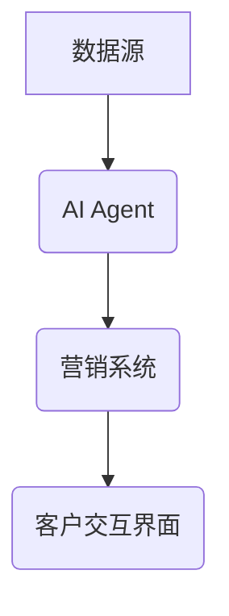
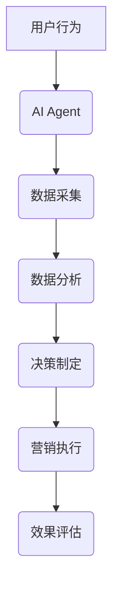
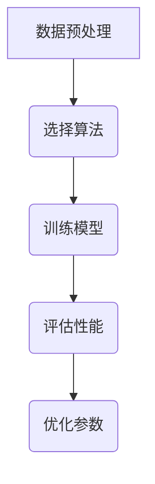
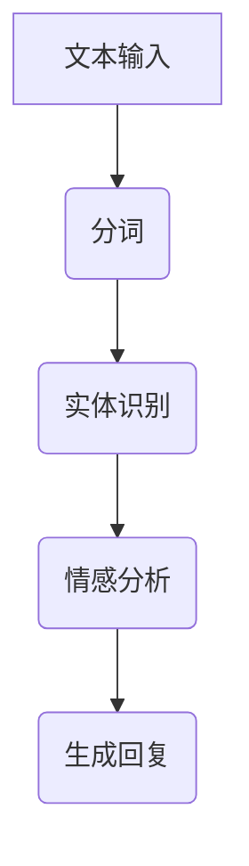
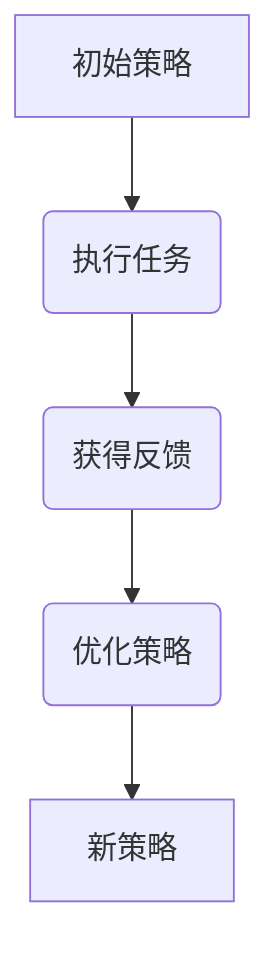
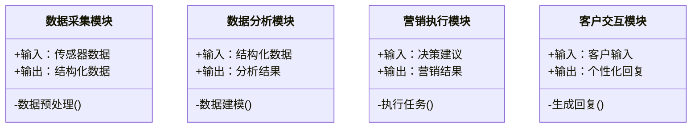
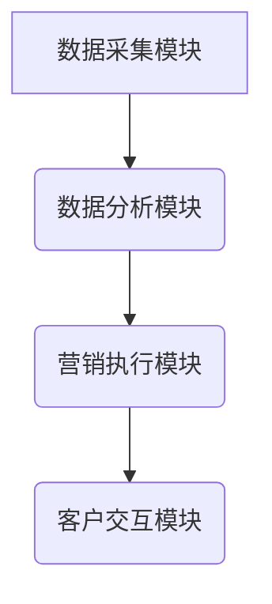
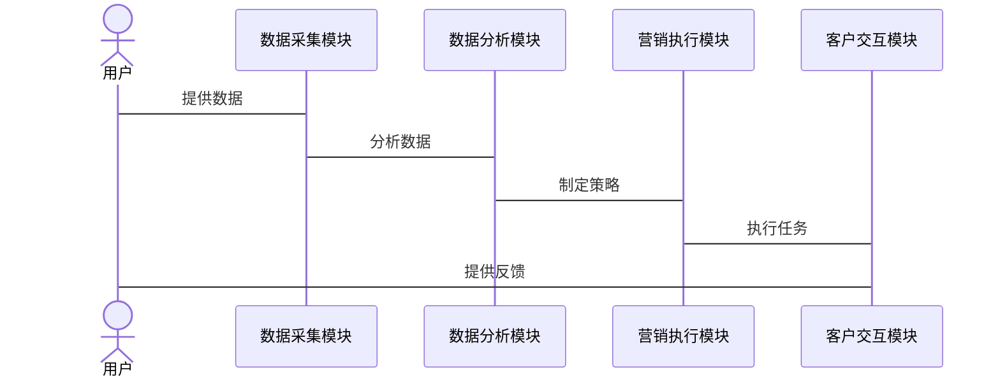

                 


# 构建AI Agent驱动的智能营销系统

> 关键词：AI Agent、智能营销系统、机器学习、自然语言处理、系统架构、项目实战

> 摘要：本文详细探讨了构建AI Agent驱动的智能营销系统的各个方面，从核心概念到系统架构设计，再到项目实战，旨在帮助读者全面理解并掌握这一技术。文章首先介绍了AI Agent的基本概念及其在智能营销中的作用，然后分析了AI Agent驱动的营销流程和核心算法，接着通过系统架构设计和项目实战，展示了如何将理论应用于实际场景。最后，本文总结了最佳实践和未来趋势，为读者提供了宝贵的参考。

---

# 第1章: AI Agent驱动的智能营销系统背景

## 1.1 AI Agent的基本概念

### 1.1.1 AI Agent的定义
AI Agent（人工智能代理）是一种能够感知环境、自主决策并执行任务的智能实体。它通过传感器获取信息，利用推理机制分析数据，并通过执行器采取行动以实现特定目标。

$$AI Agent = \{\text{感知} \times \text{推理} \times \text{决策} \times \text{执行}\}$$

### 1.1.2 AI Agent的核心特征
| 特征 | 描述 |
|------|------|
| 自主性 | 能够自主决策，无需人工干预 |
| 反应性 | 能够实时感知环境变化并做出反应 |
| 学习性 | 能够通过经验改进性能 |
| 社交性 | 能够与其他系统或用户交互协作 |

### 1.1.3 AI Agent与传统营销的区别
- **传统营销**：依赖人工分析和决策，效率低且难以实时响应。
- **AI Agent驱动的营销**：通过自动化数据分析、实时决策和个性化互动提升效率。

---

## 1.2 智能营销系统的定义与特点

### 1.2.1 智能营销的定义
智能营销是一种基于人工智能技术的营销方式，通过自动化数据处理、智能决策和实时互动优化营销效果。

### 1.2.2 智能营销的核心特点
| 特点 | 描述 |
|------|------|
| 数据驱动 | 基于海量数据进行分析和决策 |
| 实时性 | 能够实时感知市场变化并快速响应 |
| 个性化 | 提供个性化的产品推荐和客户服务 |
| 自适应性 | 系统能够根据反馈动态调整策略 |

### 1.2.3 智能营销与传统营销的对比
- **效率**：智能营销通过自动化提高效率，传统营销依赖人工操作。
- **精准度**：智能营销基于数据精准定位目标客户，传统营销覆盖面广但精准度低。

---

## 1.3 AI Agent在智能营销中的作用

### 1.3.1 AI Agent在营销自动化中的应用
AI Agent可以自动执行营销任务，如邮件发送、广告投放和客户提醒。

### 1.3.2 AI Agent如何提升营销效率
通过实时数据分析和决策优化，AI Agent能够快速响应市场变化，显著提升营销效率。

### 1.3.3 AI Agent在客户体验优化中的价值
AI Agent能够通过自然语言处理技术分析客户反馈，优化客户服务流程，提升客户满意度。

---

## 1.4 本章小结
本章介绍了AI Agent的基本概念和智能营销系统的核心特点，阐述了AI Agent在智能营销中的作用和优势。通过对比传统营销，进一步突出了AI Agent驱动的智能营销系统的价值。

---

# 第2章: AI Agent驱动的智能营销系统核心概念

## 2.1 AI Agent与智能营销的协同工作

### 2.1.1 AI Agent在智能营销中的角色
AI Agent作为智能营销系统的核心组件，负责数据采集、分析、决策和执行。

### 2.1.2 智能营销系统的整体架构
智能营销系统的整体架构包括数据源、AI Agent、营销系统和客户交互界面。



### 2.1.3 AI Agent与系统其他组件的交互关系
AI Agent通过与数据源、营销系统和客户交互界面的交互，完成数据处理、策略制定和执行任务。

---

## 2.2 AI Agent驱动的营销流程

### 2.2.1 数据采集与分析
AI Agent通过传感器采集市场数据，并利用机器学习算法进行分析。

### 2.2.2 智能决策与执行
AI Agent基于分析结果制定营销策略，并通过执行器进行广告投放和客户互动。

### 2.2.3 效果评估与优化
AI Agent实时监控营销效果，并根据反馈优化营销策略。

---

## 2.3 AI Agent的核心算法与技术

### 2.3.1 机器学习算法在AI Agent中的应用
- **监督学习**：用于分类任务，如客户画像。
- **无监督学习**：用于聚类分析，如市场细分。

### 2.3.2 自然语言处理技术在智能营销中的作用
NLP技术用于分析客户反馈，生成个性化回复。

### 2.3.3 强化学习在营销策略优化中的应用
强化学习通过不断试验和反馈优化营销策略。

---

## 2.4 本章小结
本章详细阐述了AI Agent在智能营销中的核心作用，分析了AI Agent驱动的营销流程，并介绍了相关的核心算法和技术。

---

# 第3章: AI Agent驱动的智能营销系统核心概念与联系

## 3.1 AI Agent与智能营销的核心概念对比

### 3.1.1 AI Agent的核心概念
- **感知**：数据采集与分析。
- **推理**：模式识别与预测。
- **决策**：策略制定与优化。
- **执行**：任务执行与反馈。

### 3.1.2 智能营销的核心概念
- **数据驱动**：基于数据分析制定策略。
- **实时性**：快速响应市场变化。
- **个性化**：精准定位目标客户。
- **自适应性**：动态调整营销策略。

### 3.1.3 两者的核心概念对比分析
AI Agent作为智能营销系统的核心，通过数据驱动和实时互动实现精准营销。

---

## 3.2 AI Agent与智能营销的实体关系图

```mermaid
er
actor: 用户
agent: AI Agent
system: 智能营销系统
action: 营销行为
data: 数据源
goal: 营销目标
```

---

## 3.3 AI Agent驱动的营销流程图



---

## 3.4 本章小结
本章通过对比分析AI Agent与智能营销的核心概念，构建了实体关系图和营销流程图，清晰地展示了AI Agent在智能营销系统中的作用。

---

# 第4章: AI Agent驱动的智能营销系统算法原理

## 4.1 机器学习算法在AI Agent中的应用

### 4.1.1 监督学习算法
- **线性回归**：用于预测客户购买概率。
- **决策树**：用于分类客户群体。

### 4.1.2 无监督学习算法
- **聚类分析**：用于市场细分。

### 4.1.3 算法流程图


---

## 4.2 自然语言处理技术在智能营销中的应用

### 4.2.1 分词与实体识别
- **分词**：将客户反馈文本分解成词语。
- **实体识别**：识别客户信息中的关键实体。

### 4.2.2 情感分析
- **情感分析模型**：判断客户对产品的整体情感倾向。

### 4.2.3 算法流程图


---

## 4.3 强化学习在营销策略优化中的应用

### 4.3.1 强化学习的基本原理
强化学习通过不断试验和反馈优化策略。

### 4.3.2 策略优化流程图


---

## 4.4 本章小结
本章详细介绍了机器学习、自然语言处理和强化学习在AI Agent驱动的智能营销系统中的应用，并通过流程图展示了算法的工作原理。

---

# 第5章: AI Agent驱动的智能营销系统架构设计

## 5.1 系统功能设计

### 5.1.1 数据采集模块
- **功能**：采集市场数据和客户反馈。
- **输入**：传感器数据和用户输入。
- **输出**：结构化数据。

### 5.1.2 数据分析模块
- **功能**：分析数据并生成报告。
- **输入**：结构化数据。
- **输出**：分析结果和决策建议。

### 5.1.3 营销执行模块
- **功能**：执行营销任务。
- **输入**：决策建议。
- **输出**：营销结果。

### 5.1.4 客户交互模块
- **功能**：与客户进行实时互动。
- **输入**：客户输入。
- **输出**：个性化回复。

---

## 5.2 系统架构设计

### 5.2.1 类图设计


### 5.2.2 架构图设计


### 5.2.3 接口设计
- **数据接口**：模块之间的数据传输接口。
- **用户接口**：与客户交互的界面。

---

## 5.3 系统交互流程设计



---

## 5.4 本章小结
本章详细设计了AI Agent驱动的智能营销系统的架构，包括功能设计、类图设计和系统交互流程设计，为后续的实现提供了理论基础。

---

# 第6章: AI Agent驱动的智能营销系统项目实战

## 6.1 环境安装与配置

### 6.1.1 系统环境要求
- **操作系统**：Windows/Mac/Linux。
- **编程语言**：Python 3.8+。
- **框架与库**：TensorFlow、Keras、Numpy、Pandas、Scikit-learn、NLTK。

### 6.1.2 安装依赖
```bash
pip install numpy pandas scikit-learn tensorflow keras nltk
```

---

## 6.2 核心代码实现

### 6.2.1 数据预处理代码
```python
import pandas as pd
import numpy as np

def data_preprocessing(data):
    # 删除缺失值
    data = data.dropna()
    # 标准化处理
    from sklearn.preprocessing import StandardScaler
    scaler = StandardScaler()
    data_scaled = scaler.fit_transform(data)
    return data_scaled
```

### 6.2.2 机器学习模型实现
```python
from sklearn.tree import DecisionTreeClassifier
from sklearn.model_selection import train_test_split
from sklearn.metrics import accuracy_score

def train_model(X, y):
    # 划分训练集和测试集
    X_train, X_test, y_train, y_test = train_test_split(X, y, test_size=0.2)
    # 初始化模型
    model = DecisionTreeClassifier()
    # 训练模型
    model.fit(X_train, y_train)
    # 预测
    y_pred = model.predict(X_test)
    # 计算准确率
    accuracy = accuracy_score(y_test, y_pred)
    return model, accuracy
```

### 6.2.3 自然语言处理代码
```python
import nltk
from nltk.tokenize import word_tokenize

def text_analyze(text):
    # 分词
    tokens = word_tokenize(text)
    # 实体识别
    from nltk import pos_tag
    tagged = pos_tag(tokens)
    # 提取名词
    nouns = [word for word, tag in tagged if tag == 'NN']
    return nouns
```

---

## 6.3 项目实战案例分析

### 6.3.1 案例背景
某电商平台希望通过AI Agent优化广告投放策略，提升转化率。

### 6.3.2 数据分析
- 数据预处理：清洗和标准化客户数据。
- 模型训练：利用决策树算法进行客户分类。

### 6.3.3 策略优化
- 利用强化学习优化广告投放策略。
- 实时监控广告效果并动态调整。

---

## 6.4 本章小结
本章通过项目实战展示了AI Agent驱动的智能营销系统的实现过程，从环境配置到代码实现，再到案例分析，帮助读者掌握系统的实际应用。

---

# 第7章: AI Agent驱动的智能营销系统最佳实践与未来展望

## 7.1 最佳实践

### 7.1.1 数据质量管理
- 确保数据的准确性和完整性。
- 定期更新数据。

### 7.1.2 模型优化
- 定期重新训练模型，确保模型性能。
- 引入新的算法和技术。

### 7.1.3 安全与隐私保护
- 遵守数据隐私法规。
- 加强系统安全性。

---

## 7.2 未来展望

### 7.2.1 技术发展趋势
- 更加智能化：AI Agent将更加智能化，能够处理更复杂的任务。
- 更加个性化：营销将更加个性化，客户体验将更上一层楼。

### 7.2.2 应用场景拓展
- 智能客服：通过AI Agent实现24/7的智能客服。
- 智能推荐：基于客户行为实时推荐产品。

---

## 7.3 本章小结
本章总结了AI Agent驱动的智能营销系统的最佳实践，并展望了未来的发展趋势，为读者提供了宝贵的参考。

---

# 总结

通过本文的详细讲解，读者可以全面理解并掌握构建AI Agent驱动的智能营销系统的核心技术。从背景介绍到系统架构设计，再到项目实战和未来展望，本文为读者提供了完整的知识框架。希望本文能够为相关领域的技术人员和研究人员提供有价值的参考。

