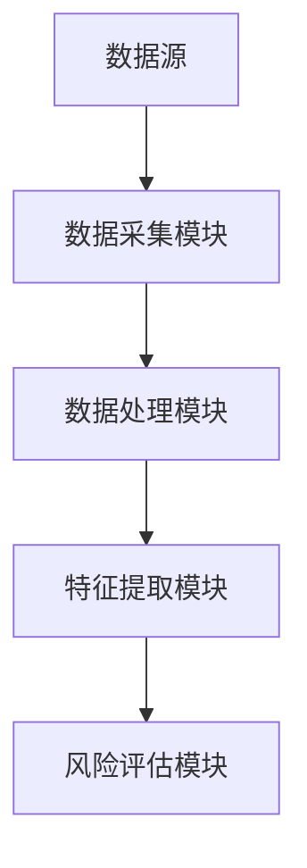

                 


# 构建AI Agent驱动的智能风险评估系统

---

## 关键词
AI Agent、风险评估、智能系统、算法实现、系统架构

---

## 摘要
随着人工智能技术的快速发展，AI Agent（人工智能代理）在各个领域的应用日益广泛。智能风险评估系统作为一类重要的应用，通过AI Agent的强大能力，能够实时、动态地评估和预测各种风险，从而为企业和个人提供更高效、更准确的决策支持。本文将详细探讨如何构建一个基于AI Agent的智能风险评估系统，涵盖系统设计、算法实现、数据处理、项目实战等关键环节，为读者提供全面的技术指导。

---

# 第1章 AI Agent与风险评估系统概述

## 1.1 AI Agent的基本概念
AI Agent（人工智能代理）是指能够感知环境、自主决策并执行任务的智能实体。它可以是一个软件程序、机器人或其他智能系统，具备以下核心特征：
1. **自主性**：能够在没有外部干预的情况下独立运行。
2. **反应性**：能够实时感知环境变化并做出反应。
3. **目标导向**：具有明确的目标，并通过行动实现这些目标。
4. **学习能力**：能够通过数据和经验不断优化自身性能。

AI Agent可以分为以下几类：
- **反应式AI Agent**：基于当前感知做出实时反应，如路径规划算法。
- **规划式AI Agent**：通过预定义的目标和规则进行任务规划，如强化学习模型。
- **组织式AI Agent**：在多智能体环境中协同工作，如分布式系统中的协作代理。

---

## 1.2 智能风险评估系统的定义
风险评估是指对潜在风险进行识别、量化和预测的过程。智能风险评估系统通过结合AI技术，能够更高效地处理复杂场景中的风险评估任务。其核心要素包括：
1. **数据采集**：从多源数据中获取相关信息。
2. **数据处理**：对数据进行清洗、转换和增强。
3. **风险建模**：利用数学模型对风险进行建模和分析。
4. **决策支持**：基于模型输出提供决策建议。

智能风险评估系统与传统风险评估的主要区别在于其智能化和动态性。传统方法通常依赖人工分析，而智能系统能够实时更新模型并适应环境变化。

---

## 1.3 AI Agent驱动的风险评估的优势
1. **提高评估效率**：AI Agent能够快速处理大量数据，显著提高评估速度。
2. **增强决策的智能化**：通过机器学习和深度学习技术，系统能够提供更精准的评估结果。
3. **实现动态监控**：AI Agent能够实时感知环境变化，及时调整评估策略。

---

# 第2章 AI Agent的核心原理与实现

## 2.1 AI Agent的体系结构
AI Agent的体系结构决定了其功能实现方式。以下是常见的三种体系结构：
1. **反应式体系结构**：基于当前感知做出实时反应，适用于需要快速响应的场景。
2. **规划式体系结构**：通过预定义的目标和规则进行任务规划，适用于复杂决策场景。
3. **混合式体系结构**：结合反应式和规划式的特点，适用于需要同时处理实时反应和复杂决策的场景。

---

## 2.2 多智能体系统的设计
多智能体系统是指由多个智能体组成的协作系统。其设计需要考虑以下关键问题：
1. **通信机制**：智能体之间如何进行信息交换。
2. **协作策略**：如何分配任务和协调行动。
3. **冲突解决**：如何处理智能体之间的冲突。

---

## 2.3 AI Agent的任务规划与决策
任务规划是AI Agent的核心功能之一。以下是几种常用的任务规划方法：
1. **基于规则的规划**：通过预定义的规则进行任务分解和执行。
2. **基于强化学习的规划**：通过试错和奖励机制优化任务执行策略。
3. **基于概率图模型的决策推理**：利用概率图模型进行不确定性推理和决策。

---

# 第3章 系统架构与功能模块设计

## 3.1 系统整体架构
智能风险评估系统的整体架构通常包括以下几个层次：
1. **数据采集层**：负责从多源数据中获取相关信息。
2. **数据处理层**：对数据进行清洗、转换和增强。
3. **模型计算层**：利用机器学习算法进行风险建模和分析。
4. **决策支持层**：基于模型输出提供决策建议。

---

## 3.2 功能模块设计
智能风险评估系统的主要功能模块包括：
1. **数据采集模块**：从数据库、API或其他数据源获取相关信息。
2. **数据处理模块**：对数据进行清洗、转换和增强。
3. **风险评估模块**：利用机器学习算法进行风险建模和分析。
4. **结果展示模块**：将评估结果以可视化形式呈现给用户。

---

## 3.3 系统交互设计
系统交互设计需要考虑以下方面：
1. **用户界面设计**：提供直观的用户界面，方便用户操作。
2. **系统接口设计**：定义清晰的接口规范，确保模块之间能够高效协作。
3. **交互流程优化**：通过优化交互流程提高用户体验。

---

# 第4章 数据采集与预处理

## 4.1 数据来源与类型
智能风险评估系统的数据来源可以包括：
1. **结构化数据**：如数据库中的表格数据。
2. **非结构化数据**：如文本、图像等。

---

## 4.2 数据流图
以下是一个典型的数据流图：


---

## 4.3 数据处理流程
数据处理流程通常包括以下步骤：
1. **数据清洗**：去除噪声数据和冗余信息。
2. **数据转换**：将数据转换为适合模型输入的形式。
3. **数据增强**：通过增加数据的多样性和复杂性提高模型的泛化能力。

---

# 第5章 算法实现与数学模型

## 5.1 算法原理
以下是基于概率图模型的风险评估算法：
1. **贝叶斯网络**：通过概率分布建模变量之间的关系。
2. **马尔可夫链**：用于描述系统的状态转移过程。

---

## 5.2 数学模型
以下是贝叶斯网络的数学模型：
$$ P(A|B) = \frac{P(B|A)P(A)}{P(B)} $$

---

## 5.3 代码实现
以下是一个简单的贝叶斯网络实现示例：
```python
import numpy as np
from sklearn.naive_bayes import GaussianNB

# 数据预处理
X_train = np.array([[...], [...]])  # 特征数据
y_train = np.array([...])           # 标签数据

# 模型训练
model = GaussianNB()
model.fit(X_train, y_train)

# 预测
X_test = np.array([[...], [...]])
y_pred = model.predict(X_test)
```

---

# 第6章 系统集成与测试

## 6.1 系统集成
系统集成需要考虑以下方面：
1. **模块接口设计**：确保各个模块之间能够高效协作。
2. **系统架构设计**：通过架构图明确各个模块的关系和功能。

---

## 6.2 系统测试
系统测试需要包括以下内容：
1. **单元测试**：对各个模块进行独立测试。
2. **集成测试**：对整个系统进行整体测试。

---

# 第7章 项目实战与优化

## 7.1 项目实战
以下是一个简单的项目实战示例：
1. **环境安装**：安装必要的库和工具。
2. **数据采集**：从数据源获取数据。
3. **数据处理**：对数据进行清洗和转换。
4. **模型训练**：训练风险评估模型。
5. **结果展示**：将结果以可视化形式呈现。

---

## 7.2 系统优化
系统优化需要考虑以下方面：
1. **模型优化**：通过调整模型参数提高评估精度。
2. **性能优化**：通过优化算法和数据结构提高系统运行效率。

---

# 第8章 总结与展望

## 8.1 总结
本文详细探讨了如何构建一个基于AI Agent的智能风险评估系统，涵盖了系统设计、算法实现、数据处理、项目实战等关键环节。

## 8.2 展望
未来，随着AI技术的不断发展，智能风险评估系统将更加智能化和动态化，能够更好地适应复杂多变的环境。

---

通过以上步骤，我们可以构建一个高效、智能的AI Agent驱动的智能风险评估系统，为企业和个人提供更精准的决策支持。

