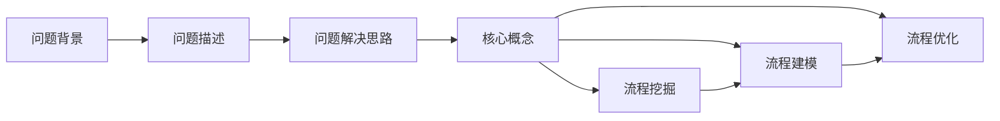

                 

# 构建AI工作流程优化系统：提升企业运营效率

> 关键词：AI，工作流程优化，企业运营效率，流程挖掘，流程建模，流程优化，系统架构，项目实战

> 摘要：本文系统地介绍了如何利用人工智能技术构建工作流程优化系统，以提升企业的运营效率。从问题背景和核心概念出发，深入探讨了流程挖掘、流程建模和流程优化的算法原理，结合实际项目案例，详细讲解了系统的架构设计、核心代码实现和最佳实践，帮助读者全面掌握AI驱动的工作流程优化方法。

---

## 目录

### 第一部分: AI工作流程优化系统背景与核心概念

### 第1章: 问题背景与问题描述

#### 1.1 问题背景
- 1.1.1 企业运营效率的痛点
- 1.1.2 AI技术在企业流程优化中的潜力
- 1.1.3 当前企业流程优化的挑战

#### 1.2 问题描述
- 1.2.1 工作流程优化的核心目标
- 1.2.2 AI在工作流程优化中的应用范围
- 1.2.3 需要解决的关键问题

#### 1.3 问题解决思路
- 1.3.1 AI驱动工作流程优化的基本思路
- 1.3.2 数据驱动的流程优化方法
- 1.3.3 智能算法在流程优化中的应用

### 第2章: 核心概念与概念关系

#### 2.1 核心概念
- 2.1.1 流程挖掘
- 2.1.2 流程建模
- 2.1.3 流程优化

#### 2.2 核心概念属性对比
- 2.2.1 流程挖掘与流程建模的对比
- 2.2.2 流程建模与流程优化的对比
- 2.2.3 流程优化与传统优化方法的对比

#### 2.3 概念关系图

### 第3章: 算法原理

#### 3.1 流程挖掘算法
- 3.1.1 基于Fp-Growth的流程挖掘算法
- 3.1.2 算法流程图
- 3.1.3 核心代码实现

#### 3.2 流程建模算法
- 3.2.1 基于K-Means的流程建模算法
- 3.2.2 算法流程图
- 3.2.3 数学模型和公式

#### 3.3 流程优化算法
- 3.3.1 基于模拟退火的流程优化算法
- 3.3.2 算法流程图
- 3.3.3 应用案例分析

### 第4章: 系统分析与架构设计

#### 4.1 项目背景
- 4.1.1 项目目标
- 4.1.2 项目范围
- 4.1.3 项目约束

#### 4.2 系统功能设计
- 4.2.1 领域模型类图
- 4.2.2 功能模块划分

#### 4.3 系统架构设计
- 4.3.1 模块化架构图
- 4.3.2 模块间交互关系

#### 4.4 系统接口设计
- 4.4.1 接口定义
- 4.4.2 接口交互流程

### 第5章: 项目实战

#### 5.1 环境安装
- 5.1.1 安装Python
- 5.1.2 安装依赖库
- 5.1.3 配置开发环境

#### 5.2 核心代码实现
- 5.2.1 数据预处理代码
- 5.2.2 模型训练代码
- 5.2.3 优化建议生成代码

#### 5.3 实际案例分析
- 5.3.1 案例背景
- 5.3.2 数据分析
- 5.3.3 结果展示

#### 5.4 项目小结
- 5.4.1 项目总结
- 5.4.2 经验与教训

### 第6章: 最佳实践与小结

#### 6.1 最佳实践
- 6.1.1 数据质量的重要性
- 6.1.2 模型调优的技巧
- 6.1.3 系统维护的注意事项

#### 6.2 项目小结
- 6.2.1 项目回顾
- 6.2.2 系统总结

#### 6.3 注意事项
- 6.3.1 可能遇到的挑战
- 6.3.2 解决方案建议

#### 6.4 未来展望
- 6.4.1 技术发展趋势
- 6.4.2 与其他技术的结合

---

## 附录

### 附录A: 工具安装指南
- Python安装
- TensorFlow安装
- Pandas安装

### 附录B: 数据集说明
- 数据格式
- 数据预处理步骤

---

**通过以上目录结构，我们可以系统地从理论到实践，深入探讨如何构建AI工作流程优化系统，以提升企业运营效率。**

