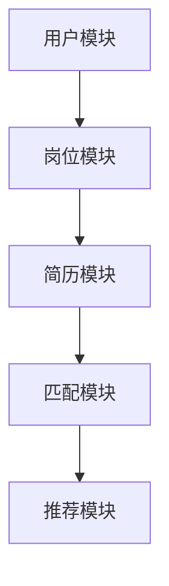

                 


# 构建AI招聘助手：提高人才筛选与匹配效率

---

## 关键词：AI招聘助手、人才筛选、人岗匹配、自然语言处理、机器学习、推荐系统

---

## 摘要：  
随着人工智能技术的快速发展，招聘行业正面临一场深刻的变革。传统的人才筛选和匹配方式效率低下，难以满足企业快速发展的需求。本文将详细探讨如何利用AI技术构建一个高效的人才招聘助手，从核心技术原理到系统设计，再到实际项目实现，全面解析如何通过AI技术优化招聘流程，提高人才匹配效率。文章将涵盖自然语言处理、机器学习和推荐系统的应用，系统架构设计，以及实际项目中的代码实现和优化建议，为读者提供一套完整的AI招聘解决方案。

---

## 正文

### 第一部分：AI招聘助手的背景与核心概念

#### 第1章：AI招聘助手的背景与问题描述

##### 1.1 招聘行业的现状与挑战  
现代企业面临着日益激烈的人才竞争，传统的招聘流程却效率低下。企业通常需要手动筛选大量简历，耗时耗力，且容易遗漏优秀候选人。同时，候选人也难以快速找到适合自己的岗位，导致双向匹配效率低下。  

##### 1.2 AI技术在招聘中的应用前景  
AI技术可以通过自然语言处理（NLP）、机器学习和推荐系统等技术，实现简历自动解析、岗位推荐和精准匹配。AI招聘助手能够帮助HR快速筛选候选人，提高招聘效率，同时为候选人提供更精准的岗位推荐。  

##### 1.3 本章小结  
AI招聘助手的核心目标是通过技术手段优化招聘流程，提高人才筛选和匹配效率。本文将从技术原理、系统设计到实际实现，全面解析AI招聘助手的构建过程。

---

### 第二部分：AI招聘助手的核心技术与原理

#### 第2章：AI招聘的核心技术解析

##### 2.1 自然语言处理（NLP）在招聘中的应用  
NLP技术可以用于解析岗位描述和简历内容，提取关键词和职位特征。例如，使用分词和实体识别技术，可以从简历中提取教育背景、工作经历和技能标签。  

##### 2.2 机器学习在人才筛选中的应用  
机器学习算法可以用于简历分类和预测。例如，使用支持向量机（SVM）对简历进行分类，筛选出符合条件的候选人；使用回归算法预测候选人的薪资水平。  

##### 2.3 推荐系统在人岗匹配中的作用  
推荐系统可以根据候选人的技能和经验，推荐合适的岗位。例如，基于协同过滤的推荐算法，可以根据候选人以往的工作经历推荐相似岗位；基于内容的推荐算法，可以根据岗位描述推荐相关候选人。  

---

#### 2.4 NLP与机器学习在招聘中的具体应用  
- **NLP技术**：用于简历解析和岗位描述分析，提取关键词和特征向量。  
- **机器学习技术**：用于简历分类、岗位匹配和预测模型的构建。  

---

### 第三部分：AI招聘助手的算法与数学模型

#### 第3章：人才筛选模型的设计与实现

##### 3.1 基于余弦相似度的简历匹配算法  
- **算法原理**：通过计算简历和岗位描述之间的余弦相似度，判断匹配程度。  
- **公式**：  
  $$ \text{余弦相似度} = \frac{\vec{A} \cdot \vec{B}}{|\vec{A}| \cdot |\vec{B}|} $$  
- **实现步骤**：  
  1. 对简历和岗位描述进行分词和向量化。  
  2. 计算两者的余弦相似度。  
  3. 根据相似度排序，筛选出匹配度高的简历。  

##### 3.2 机器学习模型的训练与优化  
- **数据预处理**：清洗数据，提取特征。  
- **模型训练**：使用支持向量机（SVM）或随机森林（Random Forest）进行分类。  
- **模型优化**：通过网格搜索（Grid Search）调整参数，提高准确率和召回率。  

---

#### 3.3 模型评估与调优  
- **评估指标**：准确率、召回率、F1分数。  
- **调优方法**：通过交叉验证和网格搜索优化模型参数。  

---

### 第四部分：系统设计与架构方案

#### 第4章：AI招聘助手的系统架构设计

##### 4.1 系统功能模块设计  
- **用户模块**：用户登录、注册和信息管理。  
- **岗位模块**：岗位发布、管理和查询。  
- **简历模块**：简历上传、解析和管理。  
- **匹配模块**：简历与岗位的匹配和推荐。  

##### 4.2 系统架构的选型与实现  
- **分层架构**：将系统分为数据层、业务逻辑层和表现层。  
- **微服务架构**：将功能模块拆分为独立的服务，便于扩展和维护。  

##### 4.3 系统接口设计与交互流程  
- **API接口**：定义RESTful API接口，如`/api/users/login`。  
- **交互流程**：用户登录 -> 发布岗位 -> 系统自动匹配简历 -> 推荐候选人。  

---

#### 4.4 系统架构图（Mermaid）  



---

### 第五部分：项目实战与代码实现

#### 第5章：从零开始构建AI招聘助手

##### 5.1 环境搭建与工具安装  
- 安装Python、Jupyter Notebook、Pip和虚拟环境。  
- 安装相关库：`nltk`、`scikit-learn`、`spacy`、`flask`。  

##### 5.2 核心代码实现  

```python
import numpy as np
from sklearn.metrics.pairwise import cosine_similarity

# 示例数据：简历和岗位描述的特征向量
resumes = [
    np.array([0.2, 0.3, 0.5]),
    np.array([0.6, 0.2, 0.1]),
    np.array([0.4, 0.4, 0.2])
]
jobs = [
    np.array([0.5, 0.3, 0.2]),
    np.array([0.1, 0.7, 0.2])
]

# 计算余弦相似度
similarity_matrix = cosine_similarity(resumes, jobs)

# 找出匹配度最高的简历
for i, job_similarities in enumerate(similarity_matrix):
    top_match = np.argmax(job_similarities)
    print(f"岗位{i+1}的最佳匹配简历是简历{top_match+1}")
```

##### 5.3 项目实战与案例分析  
- **案例分析**：一个互联网公司招聘Python开发工程师的案例，展示如何通过AI招聘助手快速找到合适的候选人。  
- **代码解读**：详细解释上述代码的实现逻辑和应用场景。  

---

### 第六部分：优化与维护

#### 第6章：AI招聘助手的优化与维护

##### 6.1 模型调优与数据更新  
- 定期更新模型，增加新的数据。  
- 使用自动化工具进行数据清洗和特征提取。  

##### 6.2 系统维护与性能优化  
- 监控系统性能，及时发现和解决问题。  
- 使用缓存技术优化查询速度。  

---

### 第七部分：总结与展望

#### 第7章：总结与未来展望

##### 7.1 本章总结  
本文详细介绍了AI招聘助手的构建过程，从核心技术到系统设计，再到项目实现，为读者提供了一套完整的解决方案。  

##### 7.2 未来展望  
随着AI技术的不断发展，招聘助手将更加智能化和个性化。未来的招聘助手可能会具备自适应学习能力，能够根据企业的反馈动态调整匹配策略，进一步提高招聘效率和准确性。  

---

## 参考文献与工具资源

- **参考文献**  
  1.《自然语言处理实战：基于Python的机器学习和深度学习》  
  2.《机器学习实战：基于Scikit-learn和TensorFlow》  

- **工具资源**  
  - Python库：nltk、spacy、scikit-learn  
  - 开发框架：Flask、Django  
  - 数据集：Kaggle、GitHub  

---

通过以上内容，您可以系统地了解如何构建一个高效的AI招聘助手，从技术原理到实际应用，全面掌握AI技术在招聘领域的应用。

