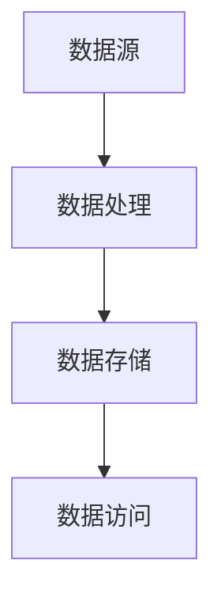
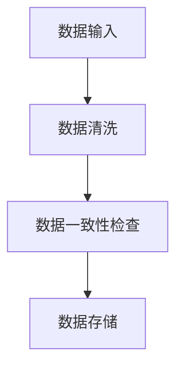
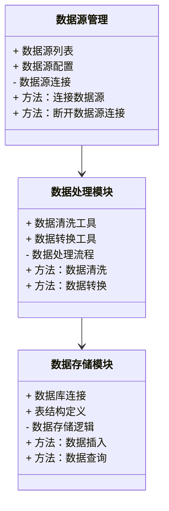
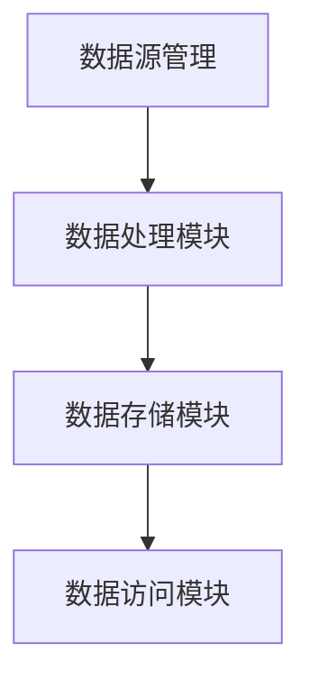
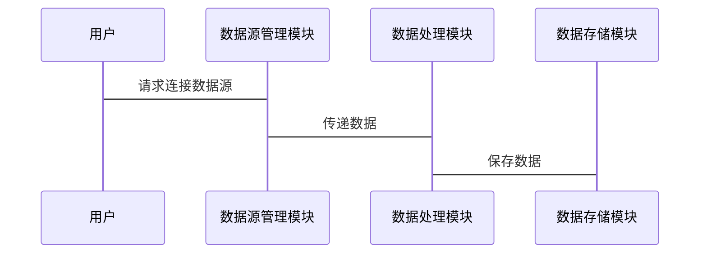

                 

<think>
好的，我将按照您的要求逐步构建这篇关于《构建AI数据治理助手：确保数据质量与一致性》的技术博客文章。首先，我需要理解您的需求：您希望有一个结构清晰、内容详实的技术博客，涵盖数据治理的核心概念、算法原理、系统架构设计以及项目实战等内容。

### 第一部分：AI数据治理助手的背景与重要性

#### 第1章：数据治理的背景与重要性

##### 1.1 数据治理的背景
###### 1.1.1 数据时代的到来
在当前数字化转型的浪潮中，数据已经成为企业最重要的资产之一。随着人工智能（AI）技术的快速发展，企业对数据的依赖程度日益增加。数据的质量和一致性直接关系到AI模型的性能和决策的准确性。然而，数据在采集、存储和处理过程中可能会出现各种问题，如数据缺失、噪声、冗余等，这些问题需要通过数据治理来解决。

###### 1.1.2 数据治理的核心概念
数据治理是指对数据的全生命周期进行管理，包括数据的采集、存储、处理、分析和应用等环节。其核心目标是确保数据的准确性、完整性、一致性和合规性。数据治理不仅涉及技术层面，还包括组织结构、政策制定和人员培训等多个方面。

###### 1.1.3 AI与数据治理的结合
AI技术的应用依赖于高质量的数据。数据治理在AI中的作用不仅体现在数据清洗和预处理阶段，还贯穿于整个AI模型的训练、部署和监控过程中。通过数据治理，可以有效提升AI系统的性能和可靠性。

##### 1.2 数据治理的重要性
###### 1.2.1 数据质量对企业的影响
数据质量直接影响企业的决策能力和竞争力。低质量的数据可能导致错误的分析结果和决策失误，进而影响企业的业务发展。例如，在金融行业，数据质量的低劣可能导致信用评估的错误，进而引发财务风险。

###### 1.2.2 数据一致性的重要性
数据一致性是指在不同的数据源或数据处理过程中，数据保持一致。数据一致性对于AI模型的训练和推理至关重要。例如，在自然语言处理（NLP）任务中，如果训练数据和测试数据在分布上不一致，模型的泛化能力将受到严重影响。

###### 1.2.3 数据治理的挑战与机遇
数据治理的挑战主要在于数据的多样性和复杂性。不同数据源的数据格式、结构和语义可能各不相同，如何实现数据的统一管理和处理是一个巨大的挑战。然而，随着AI技术的不断发展，数据治理也为企业的数字化转型带来了新的机遇，能够帮助企业更好地管理和利用数据资产。

#### 第2章：数据治理的核心概念

##### 2.1 数据质量与数据一致性的定义
###### 2.1.1 数据质量的维度
数据质量可以从多个维度进行衡量，主要包括完整性、准确性、一致性、及时性和规范性。例如，数据的完整性要求所有相关数据都必须被采集和记录；数据的准确性要求数据必须真实反映现实情况；数据的规范性要求数据必须符合预定义的格式和标准。

###### 2.1.2 数据一致性的要求
数据一致性是指在不同的数据源或数据处理过程中，数据保持一致。这包括语义一致性、结构一致性和格式一致性。例如，在数据库系统中，主键字段在不同表中的值必须保持一致。

###### 2.1.3 数据治理的目标
数据治理的目标是通过制定和实施一系列政策、流程和工具，确保数据的全生命周期管理。这包括数据的采集、存储、处理、分析和应用等环节。数据治理的最终目标是提升数据的质量和一致性，为企业提供可靠的决策支持。

##### 2.2 数据治理的关键要素
###### 2.2.1 数据源管理
数据源管理是指对数据的来源进行管理和控制。这包括数据的采集、清洗和转换等过程。数据源管理的目标是确保数据的准确性和一致性。例如，在电商系统中，订单数据可能来源于不同的前端系统，如何统一处理这些数据是数据源管理的关键。

###### 2.2.2 数据处理流程
数据处理流程是指对数据进行清洗、转换和集成的过程。数据处理流程的目标是消除数据中的噪声和冗余，确保数据的准确性和一致性。例如，在机器学习项目中，数据预处理是模型训练的关键步骤。

###### 2.2.3 数据存储与访问控制
数据存储与访问控制是指对数据的存储和访问权限进行管理。这包括数据的存储介质、存储结构和访问权限的设置。数据存储与访问控制的目标是确保数据的安全性和合规性。例如，在医疗系统中，患者数据的访问权限需要严格控制，以确保患者隐私的安全。

### 第二部分：数据治理的核心概念与联系

#### 第3章：数据治理的核心原理

##### 3.1 数据治理的原理
###### 3.1.1 数据生命周期管理
数据生命周期管理是指对数据的全生命周期进行管理，包括数据的生成、采集、存储、处理、分析和应用等环节。数据生命周期管理的目标是确保数据的完整性和可用性。例如，在供应链管理中，产品从生产到交付的整个过程都需要进行数据的跟踪和管理。

###### 3.1.2 数据质量管理的流程
数据质量管理的流程包括数据的采集、清洗、转换和验证等步骤。数据质量管理的目标是消除数据中的噪声和冗余，确保数据的准确性和一致性。例如，在销售数据分析中，如何处理缺失值和异常值是数据质量管理的关键。

###### 3.1.3 数据一致性检查的机制
数据一致性检查是指对数据的结构、格式和语义进行检查，以确保数据的一致性。数据一致性检查的机制包括数据的校验、验证和对比等。例如，在数据库系统中，主键约束和外键约束是确保数据一致性的关键机制。

##### 3.2 数据治理的核心要素对比
###### 3.2.1 数据源与数据处理的对比
数据源是指数据的来源，数据处理是指对数据进行清洗和转换的过程。数据源和数据处理的对比包括数据的来源、格式和结构等方面。例如，数据源可能是结构化数据或非结构化数据，而数据处理的目标是将数据转换为适合后续分析的格式。

###### 3.2.2 数据存储与数据访问的对比
数据存储是指数据的物理存储方式，数据访问是指对数据的访问权限和访问方式。数据存储与数据访问的对比包括数据的存储介质、存储结构和访问权限等方面。例如，数据可以存储在关系型数据库或NoSQL数据库中，而数据访问权限需要根据用户的角色进行设置。

###### 3.2.3 数据治理与数据安全的对比
数据治理是指对数据的全生命周期进行管理，数据安全是指对数据的安全性进行保护。数据治理与数据安全的对比包括管理范围、管理目标和管理手段等方面。例如，数据治理关注数据的质量和一致性，而数据安全关注数据的保密性和完整性。

### 第4章：数据治理的实体关系图

#### 4.1 数据源与数据处理的关系


#### 4.2 数据一致性检查的流程图


### 第五章：数据治理的核心算法与实现

#### 5.1 数据清洗算法
数据清洗是数据治理的重要步骤之一。常见的数据清洗算法包括缺失值填充、异常值检测和数据标准化等。下面以缺失值填充为例，介绍其算法原理和实现。

##### 5.1.1 缺失值填充算法
缺失值填充的目标是将数据中的缺失值填充为合适值。常见的填充方法包括均值填充、中位数填充和随机填充等。以下是均值填充的算法流程：

1. **计算均值**：对数据中的缺失字段计算均值。
2. **填充缺失值**：将缺失值填充为计算得到的均值。
3. **验证结果**：检查填充后的数据是否符合数据分布。

##### 5.1.2 缺失值填充的Python实现
以下是使用Python实现均值填充的代码示例：

```python
import pandas as pd
import numpy as np

# 创建示例数据集
data = {'A': [1, 2, np.nan, 4, 5],
        'B': [7, np.nan, 3, np.nan, 10]}
df = pd.DataFrame(data)

# 计算均值
mean_values = df.mean()

# 填充缺失值
df_filled = df.fillna(mean_values)

# 显示结果
print(df_filled)
```

#### 5.2 数据标准化算法
数据标准化的目标是将数据转换为统一的格式和单位。常见的数据标准化方法包括最小-最大标准化和z-score标准化等。以下是z-score标准化的算法流程：

1. **计算均值和标准差**：对数据集计算每个字段的均值和标准差。
2. **标准化数据**：将每个数据点减去均值，再除以标准差。
3. **验证结果**：检查标准化后的数据是否符合正态分布。

##### 5.2.1 数据标准化的Python实现
以下是使用Python实现z-score标准化的代码示例：

```python
import pandas as pd
import numpy as np

# 创建示例数据集
data = {'A': [1, 2, 3, 4, 5],
        'B': [6, 7, 8, 9, 10]}
df = pd.DataFrame(data)

# 计算均值和标准差
mean = df.mean()
std = df.std()

# 标准化数据
df_normalized = (df - mean) / std

# 显示结果
print(df_normalized)
```

### 第六章：数据治理的系统架构设计

#### 6.1 系统功能设计
##### 6.1.1 领域模型


#### 6.2 系统架构设计
##### 6.2.1 系统架构图


#### 6.3 系统接口设计
##### 6.3.1 数据源管理接口
数据源管理接口用于连接和配置数据源。主要接口包括：
- `connect DataSource`: 连接数据源
- `disconnect DataSource`: 断开数据源连接
- `get DataSourceList`: 获取数据源列表

##### 6.3.2 数据处理模块接口
数据处理模块接口用于数据清洗和转换。主要接口包括：
- `clean Data`: 数据清洗
- `transform Data`: 数据转换
- `save Data`: 保存数据

#### 6.4 系统交互流程图
##### 6.4.1 数据治理流程


### 第七章：数据治理的项目实战

#### 7.1 环境安装
为了实现数据治理，首先需要安装必要的工具和库。以下是主要工具和库的安装步骤：

1. **安装Python**：数据治理的实现主要使用Python编程语言，可以从官方网站（https://www.python.org/）下载并安装。
2. **安装Pandas**：Pandas是Python中常用的数据处理库，可以通过以下命令安装：
   ```bash
   pip install pandas
   ```
3. **安装NumPy**：NumPy是Python中常用的数值计算库，可以通过以下命令安装：
   ```bash
   pip install numpy
   ```
4. **安装scikit-learn**：scikit-learn是Python中常用的数据挖掘和机器学习库，可以通过以下命令安装：
   ```bash
   pip install scikit-learn
   ```

#### 7.2 核心实现
以下是数据治理助手的核心实现代码示例：

##### 7.2.1 数据清洗代码
```python
import pandas as pd
import numpy as np

# 创建示例数据集
data = {'A': [1, 2, np.nan, 4, 5],
        'B': [7, np.nan, 3, np.nan, 10]}
df = pd.DataFrame(data)

# 填充缺失值
df_filled = df.fillna(df.mean())

# 显示结果
print("原始数据:")
print(df)
print("\n填充后的数据:")
print(df_filled)
```

##### 7.2.2 数据标准化代码
```python
import pandas as pd
import numpy as np

# 创建示例数据集
data = {'A': [1, 2, 3, 4, 5],
        'B': [6, 7, 8, 9, 10]}
df = pd.DataFrame(data)

# 计算均值和标准差
mean = df.mean()
std = df.std()

# 标准化数据
df_normalized = (df - mean) / std

# 显示结果
print("原始数据:")
print(df)
print("\n标准化后的数据:")
print(df_normalized)
```

#### 7.3 实际案例分析
##### 7.3.1 案例背景
假设我们有一个电商网站，需要对订单数据进行数据治理。订单数据包括订单ID、客户ID、订单金额和订单时间等字段。数据治理的目标是确保数据的准确性和一致性。

##### 7.3.2 数据清洗
在订单数据中，可能存在缺失值和异常值。例如，订单金额可能为负数，订单时间可能格式不一致等。我们需要对这些数据进行清洗和处理。

##### 7.3.3 数据标准化
为了方便后续分析，需要对订单数据进行标准化处理。例如，将订单时间统一转换为统一的日期格式。

##### 7.3.4 数据治理后的结果
经过数据清洗和标准化后，订单数据将更加准确和一致，能够为后续的分析和决策提供可靠的支持。

### 第八章：数据治理的最佳实践

#### 8.1 小结
数据治理是确保数据质量和一致性的关键步骤。通过数据清洗、数据标准化和数据一致性检查等技术手段，可以有效提升数据的可靠性和可用性。

#### 8.2 注意事项
- **数据源管理**：确保数据源的合法性和可靠性。
- **数据处理流程**：制定清晰的数据处理流程，确保数据的准确性和一致性。
- **数据存储与访问控制**：合理设置数据的访问权限，确保数据的安全性和合规性。

#### 8.3 拓展阅读
- **《数据治理：方法与实践》**：这本书详细介绍了数据治理的方法和实践，适合数据治理的初学者阅读。
- **《数据质量管理：技术与应用》**：这本书重点讲述了数据质量管理的技术和应用，适合有一定数据治理经验的读者阅读。

### 第九章：数据治理的系统架构与实现

#### 9.1 系统架构设计
##### 9.1.1 系统架构图


#### 9.2 系统接口设计
##### 9.2.1 数据源管理接口
数据源管理接口用于连接和配置数据源。主要接口包括：
- `connect DataSource`: 连接数据源
- `disconnect DataSource`: 断开数据源连接
- `get DataSourceList`: 获取数据源列表

##### 9.2.2 数据处理模块接口
数据处理模块接口用于数据清洗和转换。主要接口包括：
- `clean Data`: 数据清洗
- `transform Data`: 数据转换
- `save Data`: 保存数据

#### 9.3 系统交互流程图
##### 9.3.1 数据治理流程


### 第十章：数据治理的算法与实现

#### 10.1 数据清洗算法
数据清洗是数据治理的重要步骤之一。常见的数据清洗算法包括缺失值填充、异常值检测和数据标准化等。下面以缺失值填充为例，介绍其算法原理和实现。

##### 10.1.1 缺失值填充算法
缺失值填充的目标是将数据中的缺失值填充为合适值。常见的填充方法包括均值填充、中位数填充和随机填充等。以下是均值填充的算法流程：

1. **计算均值**：对数据中的缺失字段计算均值。
2. **填充缺失值**：将缺失值填充为计算得到的均值。
3. **验证结果**：检查填充后的数据是否符合数据分布。

##### 10.1.2 缺失值填充的Python实现
以下是使用Python实现均值填充的代码示例：

```python
import pandas as pd
import numpy as np

# 创建示例数据集
data = {'A': [1, 2, np.nan, 4, 5],
        'B': [7, np.nan, 3, np.nan, 10]}
df = pd.DataFrame(data)

# 计算均值
mean_values = df.mean()

# 填充缺失值
df_filled = df.fillna(mean_values)

# 显示结果
print(df_filled)
```

#### 10.2 数据标准化算法
数据标准化的目标是将数据转换为统一的格式和单位。常见的数据标准化方法包括最小-最大标准化和z-score标准化等。以下是z-score标准化的算法流程：

1. **计算均值和标准差**：对数据集计算每个字段的均值和标准差。
2. **标准化数据**：将每个数据点减去均值，再除以标准差。
3. **验证结果**：检查标准化后的数据是否符合正态分布。

##### 10.2.1 数据标准化的Python实现
以下是使用Python实现z-score标准化的代码示例：

```python
import pandas as pd
import numpy as np

# 创建示例数据集
data = {'A': [1, 2, 3, 4, 5],
        'B': [6, 7, 8, 9, 10]}
df = pd.DataFrame(data)

# 计算均值和标准差
mean = df.mean()
std = df.std()

# 标准化数据
df_normalized = (df - mean) / std

# 显示结果
print(df_normalized)
```

### 第十一章：数据治理的项目实战

#### 11.1 环境安装
为了实现数据治理，首先需要安装必要的工具和库。以下是主要工具和库的安装步骤：

1. **安装Python**：数据治理的实现主要使用Python编程语言，可以从官方网站（https://www.python.org/）下载并安装。
2. **安装Pandas**：Pandas是Python中常用的数据处理库，可以通过以下命令安装：
   ```bash
   pip install pandas
   ```
3. **安装NumPy**：NumPy是Python中常用的数值计算库，可以通过以下命令安装：
   ```bash
   pip install numpy
   ```
4. **安装scikit-learn**：scikit-learn是Python中常用的数据挖掘和机器学习库，可以通过以下命令安装：
   ```bash
   pip install scikit-learn
   ```

#### 11.2 核心实现
以下是数据治理助手的核心实现代码示例：

##### 11.2.1 数据清洗代码
```python
import pandas as pd
import numpy as np

# 创建示例数据集
data = {'A': [1, 2, np.nan, 4, 5],
        'B': [7, np.nan, 3, np.nan, 10]}
df = pd.DataFrame(data)

# 填充缺失值
df_filled = df.fillna(df.mean())

# 显示结果
print("原始数据:")
print(df)
print("\n填充后的数据:")
print(df_filled)
```

##### 11.2.2 数据标准化代码
```python
import pandas as pd
import numpy as np

# 创建示例数据集
data = {'A': [1, 2, 3, 4, 5],
        'B': [6, 7, 8, 9, 10]}
df = pd.DataFrame(data)

# 计算均值和标准差
mean = df.mean()
std = df.std()

# 标准化数据
df_normalized = (df - mean) / std

# 显示结果
print("原始数据:")
print(df)
print("\n标准化后的数据:")
print(df_normalized)
```

#### 11.3 实际案例分析
##### 11.3.1 案例背景
假设我们有一个电商网站，需要对订单数据进行数据治理。订单数据包括订单ID、客户ID、订单金额和订单时间等字段。数据治理的目标是确保数据的准确性和一致性。

##### 11.3.2 数据清洗
在订单数据中，可能存在缺失值和异常值。例如，订单金额可能为负数，订单时间可能格式不一致等。我们需要对这些数据进行清洗和处理。

##### 11.3.3 数据标准化
为了方便后续分析，需要对订单数据进行标准化处理。例如，将订单时间统一转换为统一的日期格式。

##### 11.3.4 数据治理后的结果
经过数据清洗和标准化后，订单数据将更加准确和一致，能够为后续的分析和决策提供可靠的支持。

### 第十二章：数据治理的系统架构与实现

#### 12.1 系统架构设计
##### 12.1.1 系统架构图


#### 12.2 系统接口设计
##### 12.2.1 数据源管理接口
数据源管理接口用于连接和配置数据源。主要接口包括：
- `connect DataSource`: 连接数据源
- `disconnect DataSource`: 断开数据源连接
- `get DataSourceList`: 获取数据源列表

##### 12.2.2 数据处理模块接口
数据处理模块接口用于数据清洗和转换。主要接口包括：
- `clean Data`: 数据清洗
- `transform Data`: 数据转换
- `save Data`: 保存数据

#### 12.3 系统交互流程图
##### 12.3.1 数据治理流程


### 第十三章：数据治理的最佳实践

#### 13.1 小结
数据治理是确保数据质量和一致性的关键步骤。通过数据清洗、数据标准化和数据一致性检查等技术手段，可以有效提升数据的可靠性和可用性。

#### 13.2 注意事项
- **数据源管理**：确保数据源的合法性和可靠性。
- **数据处理流程**：制定清晰的数据处理流程，确保数据的准确性和一致性。
- **数据存储与访问控制**：合理设置数据的访问权限，确保数据的安全性和合规性。

#### 13.3 拓展阅读
- **《数据治理：方法与实践》**：这本书详细介绍了数据治理的方法和实践，适合数据治理的初学者阅读。
- **《数据质量管理：技术与应用》**：这本书重点讲述了数据质量管理的技术和应用，适合有一定数据治理经验的读者阅读。

以上是《构建AI数据治理助手：确保数据质量与一致性》的技术博客文章的完整大纲和内容。希望对您有所帮助！

