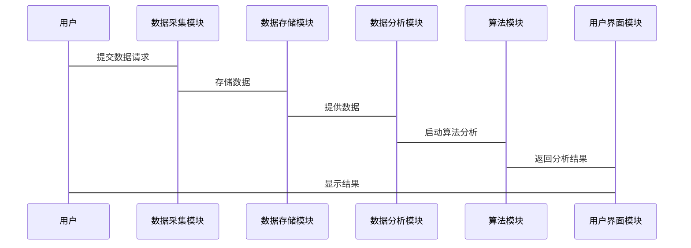

                 


# 构建AI辅助的金融产品设计系统

> 关键词：AI辅助设计、金融产品、机器学习、系统架构、数据挖掘

> 摘要：本文详细探讨了如何利用人工智能技术构建一个高效的金融产品设计辅助系统。通过分析金融产品设计的背景与挑战，介绍了AI辅助设计的核心概念，系统地阐述了系统架构与关键技术，深入讲解了算法原理与数学模型，并通过实际案例展示了系统的设计与实现。本文旨在为金融领域的从业者和技术人员提供一个全面的技术指南，帮助他们理解并应用AI技术来优化金融产品设计流程。

---

# 第一部分: AI辅助的金融产品设计系统概述

# 第1章: 金融产品设计与AI技术的结合

## 1.1 金融产品设计的背景与挑战

### 1.1.1 传统金融产品设计的流程与问题
传统金融产品设计流程通常包括需求分析、市场调研、产品定义、风险评估、合规性检查等环节。然而，这一过程存在以下问题：
- **数据量大**：需要处理大量的市场数据、用户行为数据和历史数据。
- **复杂性高**：涉及多维度的分析，如市场趋势、用户需求、政策法规等。
- **效率低下**：传统方法依赖人工分析，耗时长且容易出错。
- **个性化不足**：难以快速满足个性化需求。

### 1.1.2 AI技术在金融产品设计中的潜力
人工智能技术，尤其是机器学习和自然语言处理，在金融产品设计中展现出巨大潜力：
- **数据处理能力**：AI可以快速处理和分析海量数据，提取关键信息。
- **自动化分析**：通过算法模型，AI能够自动化完成市场趋势预测、用户需求分析等任务。
- **个性化推荐**：基于用户数据和行为分析，AI可以提供个性化的金融产品推荐。

### 1.1.3 当前行业痛点与需求分析
当前金融行业在产品设计方面面临的主要痛点包括：
- **效率问题**：传统设计流程耗时长，难以快速响应市场需求。
- **精准性问题**：人工分析容易受到主观因素影响，导致决策失误。
- **个性化需求**：用户需求多样化，传统方法难以快速满足。

---

## 1.2 AI辅助设计的核心概念

### 1.2.1 什么是AI辅助设计
AI辅助设计是指利用人工智能技术，通过自动化或半自动化的方式，帮助设计师完成从需求分析、方案设计到产品优化的全过程。在金融领域，AI辅助设计系统能够帮助设计人员快速生成产品方案、优化产品结构、预测市场反应等。

### 1.2.2 AI在金融产品设计中的应用场景
AI技术在金融产品设计中的主要应用场景包括：
- **需求分析**：通过自然语言处理技术分析用户反馈，提取需求特征。
- **市场预测**：利用机器学习模型预测市场趋势，评估产品可行性。
- **产品推荐**：基于用户行为数据，推荐适合的目标客户群体。
- **风险评估**：通过大数据分析和建模，评估产品的潜在风险。

### 1.2.3 系统设计的目标与核心功能
AI辅助设计系统的建设目标是实现金融产品设计的智能化、自动化和高效化。其核心功能包括：
- **数据采集与处理**：自动采集市场数据、用户反馈等信息。
- **需求分析与建模**：基于数据进行需求分析和产品建模。
- **方案生成与优化**：生成多个产品方案并进行优化。
- **风险评估与推荐**：评估方案的风险并推荐最优方案。

---

## 1.3 本章小结

### 1.3.1 金融产品设计的现状与挑战
传统金融产品设计流程存在效率低下、精准性不足等问题，难以应对快速变化的市场需求。

### 1.3.2 AI辅助设计的必要性与优势
AI技术能够显著提高金融产品设计的效率和精准度，通过自动化分析和预测，帮助设计人员快速生成和优化产品方案。

### 1.3.3 系统设计的核心目标
构建一个智能化的AI辅助设计系统，实现金融产品设计的自动化、高效化和个性化，满足市场和用户的需求。

---

# 第二部分: 系统核心概念与原理

# 第2章: 系统架构与核心模块

## 2.1 系统架构设计

### 2.1.1 分层架构概述
AI辅助设计系统的架构采用分层设计，主要包括数据层、算法层、业务层和用户层。

### 2.1.2 各模块的功能与交互关系
- **数据层**：负责数据的采集、存储和管理。
- **算法层**：实现机器学习算法，进行数据分析和预测。
- **业务层**：处理具体的业务逻辑，如需求分析和方案生成。
- **用户层**：提供用户界面，实现与用户的交互。

### 2.1.3 系统扩展性与可维护性
通过模块化设计，系统具备良好的扩展性和可维护性，能够根据需求快速添加新功能。

---

## 2.2 关键技术分析

### 2.2.1 自然语言处理技术
自然语言处理技术用于分析用户反馈和市场报告，提取关键信息。

### 2.2.2 机器学习算法
机器学习算法用于市场预测、需求分析和风险评估。

### 2.2.3 数据挖掘与分析
数据挖掘技术用于从海量数据中提取有价值的信息，支持决策。

---

## 2.3 数据流与实体关系图

### 2.3.1 数据流图展示
```mermaid
graph TD
    数据源 -> 数据采集模块
    数据采集模块 -> 数据存储模块
    数据存储模块 -> 数据分析模块
    数据分析模块 -> 算法模块
    算法模块 -> 结果输出模块
    结果输出模块 -> 用户界面
```

### 2.3.2 实体关系图（ER图）
```mermaid
erd
    客户
    产品
    需求
    市场数据
    用户反馈
    算法模型
```

---

## 2.4 本章小结

### 2.4.1 系统架构的核心模块
系统架构由数据层、算法层、业务层和用户层组成，各模块协同工作，实现设计目标。

### 2.4.2 关键技术的应用场景
自然语言处理、机器学习和数据挖掘技术分别应用于数据处理、分析和预测。

### 2.4.3 数据流与实体关系的重要性
数据流图和实体关系图展示了系统的数据流动和实体交互关系，为系统设计提供了清晰的指导。

---

# 第三部分: 算法原理与数学模型

# 第3章: 机器学习算法原理

## 3.1 机器学习基础

### 3.1.1 机器学习的定义与分类
机器学习是一种人工智能技术，通过数据训练模型，使其能够进行预测或分类。

### 3.1.2 监督学习、无监督学习与强化学习
- **监督学习**：基于标记数据进行训练，预测未知数据。
- **无监督学习**：在无标记数据上进行训练，发现数据中的结构。
- **强化学习**：通过奖励机制，训练模型做出最优决策。

### 3.1.3 深度学习的崛起
深度学习是一种基于人工神经网络的机器学习技术，能够处理复杂的非线性数据。

---

## 3.2 神经网络模型

### 3.2.1 神经网络的结构与功能
神经网络由输入层、隐藏层和输出层组成，能够进行非线性数据的处理。

### 3.2.2 卷积神经网络（CNN）
CNN用于图像识别和特征提取，适用于处理二维数据。

### 3.2.3 循环神经网络（RNN）
RNN用于序列数据的处理，适用于自然语言处理和时间序列预测。

---

## 3.3 算法流程图

### 3.3.1 数据预处理流程
```mermaid
graph TD
    数据源 -> 数据清洗
    数据清洗 -> 数据转换
    数据转换 -> 数据分割
```

### 3.3.2 模型训练流程
```mermaid
graph TD
    数据分割 -> 训练集
    数据分割 -> 验证集
    数据分割 -> 测试集
    训练集 -> 模型训练
    模型训练 -> 模型评估
```

### 3.3.3 模型评估与优化
```mermaid
graph TD
    模型评估 -> 调参优化
    调参优化 -> 模型改进
```

---

## 3.4 数学模型与公式

### 3.4.1 损失函数
$$
L = \frac{1}{n}\sum_{i=1}^{n}(y_i - \hat{y_i})^2
$$

### 3.4.2 优化器
$$
\theta = \theta - \eta \frac{\partial L}{\partial \theta}
$$

### 3.4.3 模型评估指标
$$
\text{准确率} = \frac{\text{正确预测数}}{\text{总预测数}}
$$

---

## 3.5 本章小结

### 3.5.1 机器学习算法的核心原理
机器学习算法通过数据训练模型，实现对未知数据的预测和分类。

### 3.5.2 神经网络模型的应用
神经网络模型在深度学习中表现出色，适用于图像识别和自然语言处理。

### 3.5.3 数学模型在算法中的作用
数学模型是机器学习算法的核心，决定了模型的性能和预测能力。

---

# 第四部分: 系统分析与架构设计

# 第4章: 项目背景与需求分析

## 4.1 项目背景介绍

### 4.1.1 项目来源与目标
项目来源于金融行业的实际需求，旨在通过AI技术优化产品设计流程。

### 4.1.2 项目团队与资源
项目团队包括数据科学家、软件工程师和金融专家，具备跨学科能力。

### 4.1.3 项目时间与预算
项目周期为6个月，预算包括硬件采购、人员成本和研发投入。

---

## 4.2 系统功能设计

### 4.2.1 用户需求分析
用户需求包括快速生成产品方案、优化产品结构和评估市场风险。

### 4.2.2 功能模块划分
- **数据采集模块**：负责数据的采集和存储。
- **算法模块**：实现机器学习算法，进行数据分析。
- **用户界面模块**：提供友好的用户界面，支持用户交互。

### 4.2.3 领域模型类图
```mermaid
classDiagram
    class 用户
    class 产品
    class 需求
    class 市场数据
    class 算法模型
    用户 -> 需求
    需求 -> 产品
    产品 -> 市场数据
    市场数据 -> 算法模型
```

---

## 4.3 系统架构设计

### 4.3.1 分层架构设计
系统采用分层架构，包括数据层、算法层、业务层和用户层。

### 4.3.2 微服务架构设计
通过微服务架构，系统能够实现模块化开发和独立部署。

### 4.3.3 系统交互流程


---

## 4.4 本章小结

### 4.4.1 项目背景的核心要素
项目来源于金融行业需求，目标明确，团队资源充足。

### 4.4.2 系统功能模块的划分
系统功能模块包括数据采集、算法分析和用户界面，各模块协同工作。

### 4.4.3 系统架构设计的重要性
分层架构和微服务架构设计保证了系统的扩展性和可维护性。

---

# 第五部分: 项目实战

# 第5章: 项目实施与代码实现

## 5.1 环境安装与配置

### 5.1.1 Python环境安装
安装Python 3.8及以上版本，并配置虚拟环境。

### 5.1.2 依赖库安装
安装必要的库，如TensorFlow、Pandas、Matplotlib等。

---

## 5.2 系统核心实现源代码

### 5.2.1 数据采集模块
```python
import requests
import json

def fetch_data(api_url):
    response = requests.get(api_url)
    return json.loads(response.text)
```

### 5.2.2 数据分析模块
```python
import pandas as pd

def process_data(data):
    df = pd.DataFrame(data)
    return df
```

### 5.2.3 算法模块
```python
import tensorflow as tf
from tensorflow.keras import layers

def build_model(input_shape):
    model = tf.keras.Sequential()
    model.add(layers.Dense(64, activation='relu', input_shape=input_shape))
    model.add(layers.Dense(1, activation='sigmoid'))
    model.compile(optimizer='adam', loss='binary_crossentropy', metrics=['accuracy'])
    return model
```

---

## 5.3 代码应用解读与分析

### 5.3.1 数据采集模块解读
数据采集模块通过API接口获取数据，返回结构化的数据格式。

### 5.3.2 数据分析模块解读
数据分析模块使用Pandas库对数据进行处理，生成适合算法分析的数据格式。

### 5.3.3 算法模块解读
算法模块基于TensorFlow框架，构建一个简单的神经网络模型，用于分类任务。

---

## 5.4 实际案例分析与详细讲解

### 5.4.1 案例背景
某银行希望通过AI辅助设计系统快速推出一款新的理财产品。

### 5.4.2 数据准备
从市场数据、用户反馈和历史销售数据中提取相关信息。

### 5.4.3 模型训练
使用训练数据对模型进行训练，评估模型的准确率和召回率。

### 5.4.4 模型部署
将训练好的模型部署到生产环境，提供实时预测服务。

---

## 5.5 本章小结

### 5.5.1 项目实施的核心步骤
项目实施包括环境配置、数据采集、数据分析和模型训练等步骤。

### 5.5.2 系统实现的关键代码
数据采集、数据分析和算法模块是系统实现的核心部分，代码清晰易懂。

### 5.5.3 案例分析的重要性
通过实际案例分析，验证系统的可行性和有效性。

---

# 第六部分: 总结与展望

# 第6章: 总结与未来展望

## 6.1 系统设计的核心总结

### 6.1.1 项目背景与目标
项目旨在通过AI技术优化金融产品设计流程，实现高效、智能的设计。

### 6.1.2 系统架构与关键技术
系统采用分层架构，结合机器学习和自然语言处理技术，实现数据采集、分析和预测。

### 6.1.3 项目实施与成果
通过项目实施，成功构建了一个高效的AI辅助设计系统，显著提高了设计效率。

---

## 6.2 未来展望与技术发展

### 6.2.1 系统优化方向
未来可以进一步优化算法模型，提高系统的预测精度和运行效率。

### 6.2.2 新技术的应用
随着技术的发展，可以引入更多新技术，如区块链和量子计算，进一步提升系统性能。

### 6.2.3 行业发展趋势
AI技术在金融领域的应用将更加广泛，未来可能会出现更多智能化的金融产品设计工具。

---

## 6.3 最佳实践 tips

### 6.3.1 数据处理建议
在数据处理过程中，要注意数据的完整性和准确性，避免噪声数据的影响。

### 6.3.2 算法选择建议
根据具体场景选择合适的算法，避免盲目追求复杂模型。

### 6.3.3 系统维护建议
定期更新模型和数据，保持系统的稳定性和先进性。

---

## 6.4 本章小结

### 6.4.1 系统设计的核心要点
系统设计需要结合实际需求，选择合适的架构和技术方案。

### 6.4.2 未来技术发展的方向
随着技术进步，AI辅助设计系统将更加智能化和高效化。

### 6.4.3 实践中的注意事项
在实际应用中，要注意数据质量、算法选择和系统维护。

---

# 结语

通过本文的详细讲解，我们了解了如何构建一个高效的AI辅助金融产品设计系统。从系统设计到算法实现，再到项目实战，每一个环节都至关重要。希望本文能够为相关领域的技术人员提供有价值的参考和指导，帮助他们更好地理解和应用AI技术，推动金融行业的创新与发展。

---

# 参考文献

1. 《深度学习》—— Ian Goodfellow
2. 《机器学习实战》—— 周志华
3. 《自然语言处理入门》—— 李航

