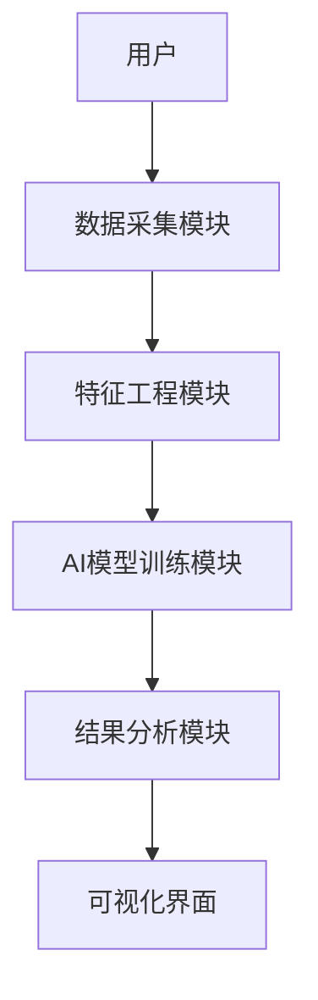
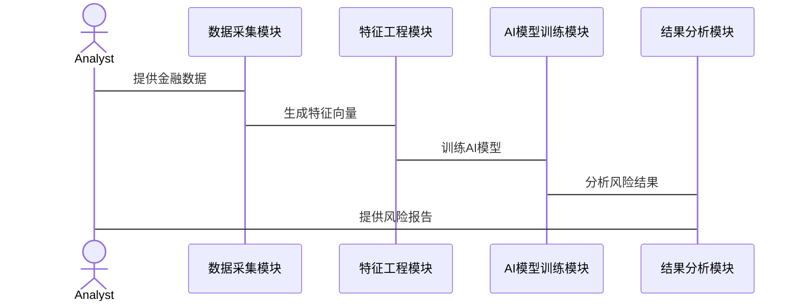

                 


# 构建AI辅助的金融风险度量系统

> 关键词：AI辅助、金融风险、度量系统、机器学习、深度学习、风险模型

> 摘要：本文详细探讨了如何利用人工智能技术构建金融风险度量系统，从背景介绍、核心概念、算法原理、系统架构到项目实战，系统地分析了构建AI辅助的金融风险度量系统的各个方面，旨在为读者提供从理论到实践的完整指南。

---

## 第一部分: 背景介绍

### 第1章: 问题背景与描述

#### 1.1 传统金融风险度量的局限性
- 传统金融风险度量方法（如VaR、ES）的局限性
- 数据依赖性高，难以捕捉非线性关系
- 计算复杂性高，难以实时应用

#### 1.2 AI技术在金融领域的应用潜力
- 机器学习在金融预测中的应用
- 深度学习在金融时间序列分析中的优势
- 自然语言处理在金融文本分析中的应用

#### 1.3 金融风险度量与AI结合的必要性
- 提高风险预测的准确性和实时性
- 发现传统模型难以捕捉的复杂关系
- 降低金融风险评估的成本和复杂性

### 第2章: 问题解决与边界

#### 2.1 AI辅助金融风险度量的核心问题
- 如何选择合适的AI算法
- 如何构建有效的特征工程
- 如何确保模型的可解释性

#### 2.2 系统的边界与外延
- 输入数据的范围与格式
- 输出结果的范围与格式
- 系统与其他模块的交互

#### 2.3 核心要素与组成结构
- 数据采集模块
- 特征工程模块
- AI模型训练模块
- 结果分析模块

---

## 第二部分: 核心概念与联系

### 第3章: 核心概念原理

#### 3.1 风险度量模型
- 传统风险度量模型（VaR、ES）
- 基于机器学习的风险度量模型（随机森林、支持向量机）
- 基于深度学习的风险度量模型（LSTM、图神经网络）

#### 3.2 AI技术在风险分析中的应用
- 机器学习在风险预测中的作用
- 深度学习在风险评估中的优势
- 自然语言处理在金融文本分析中的应用

### 第4章: 核心概念对比与ER实体关系

#### 4.1 核心概念对比分析
| 对比维度 | 传统风险模型 | AI驱动风险模型 |
|----------|---------------|----------------|
| 计算效率 | 低             | 高             |
| 预测精度 | 中             | 高             |
| 可解释性 | 高             | 低             |

#### 4.2 ER实体关系图
```mermaid
er
actor: Analyst
goal: Risk_Measurement
package: Risk_Data
class: Risk_Model
attribute: Risk_Level
```

---

## 第三部分: 算法原理与数学模型

### 第5章: 算法原理讲解

#### 5.1 机器学习算法
- 线性回归：简单线性回归模型
- 支持向量机：基于距离的分类与回归
- 随机森林：基于树的集成学习方法

#### 5.2 深度学习算法
- LSTM网络：用于时间序列分析
- 图神经网络：用于复杂金融网络的分析

### 第6章: 数学模型与公式

#### 6.1 风险度量模型
- 风险价值（VaR）：$$ \text{VaR} = \text{ percentile} \times \text{标准差} $$
- 预期短缺（ES）：$$ \text{ES} = \frac{1}{1-\alpha} \int_{\alpha}^{1} \text{VaR}(p) dp $$

#### 6.2 AI算法数学公式
- 线性回归公式：$$ y = \beta_0 + \beta_1x + \epsilon $$
- LSTM网络公式：$$ f_t = \text{tanh}(W_{f} [s_{t-1}, x_t]) $$

---

## 第四部分: 系统分析与架构设计方案

### 第7章: 系统分析与架构设计

#### 7.1 问题场景介绍
- 金融市场的风险评估需求
- 实时风险监控的必要性

#### 7.2 系统功能设计
- 数据采集与预处理模块
- 特征工程模块
- AI模型训练与部署模块
- 结果分析与可视化模块

#### 7.3 系统架构设计


#### 7.4 系统接口设计
- 数据接口：REST API
- 模型接口：Docker容器化部署

#### 7.5 系统交互流程


---

## 第五部分: 项目实战

### 第8章: 项目实战

#### 8.1 环境配置
- Python 3.8+
- scikit-learn、Keras、TensorFlow、PyTorch
- Jupyter Notebook

#### 8.2 系统核心实现源代码
```python
import numpy as np
from sklearn.linear_model import LinearRegression
from sklearn.ensemble import RandomForestRegressor
from keras.models import Sequential
from keras.layers import LSTM, Dense

# 数据预处理
X = ...
y = ...

# 线性回归模型
model_lr = LinearRegression()
model_lr.fit(X, y)
print("线性回归系数:", model_lr.coef_)

# 随机森林模型
model_rf = RandomForestRegressor(n_estimators=100)
model_rf.fit(X, y)
print("随机森林重要特征:", model_rf.feature_importances_)

# LSTM模型
model_lstm = Sequential()
model_lstm.add(LSTM(64, input_shape=(timesteps, features)))
model_lstm.add(Dense(1))
model_lstm.compile(loss='mean_squared_error', optimizer='adam')
model_lstm.fit(X_train, y_train, epochs=10, batch_size=32)
```

#### 8.3 案例分析与结果解读
- 信用风险评估案例
- 市场风险评估案例

---

## 第六部分: 最佳实践与总结

### 第9章: 最佳实践

#### 9.1 小结
- AI辅助金融风险度量的核心价值
- 系统设计的关键点

#### 9.2 注意事项
- 数据质量的重要性
- 模型可解释性的挑战
- 系统实时性的实现难点

#### 9.3 扩展阅读
- 《机器学习实战》
- 《深度学习》
- 《金融风险管理》

---

通过以上目录结构和内容安排，我们可以系统地构建一个AI辅助的金融风险度量系统，从理论到实践，逐步深入，确保系统设计的完整性和可操作性。

