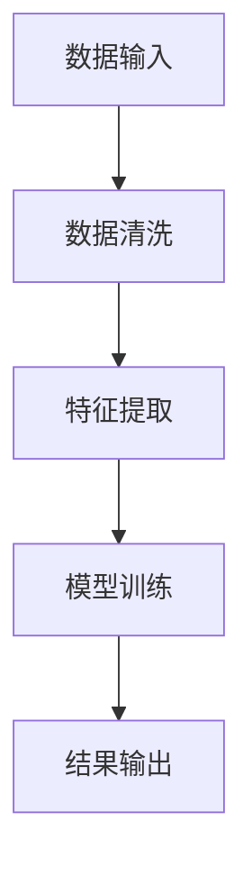
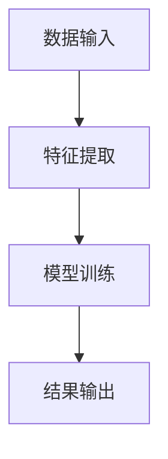
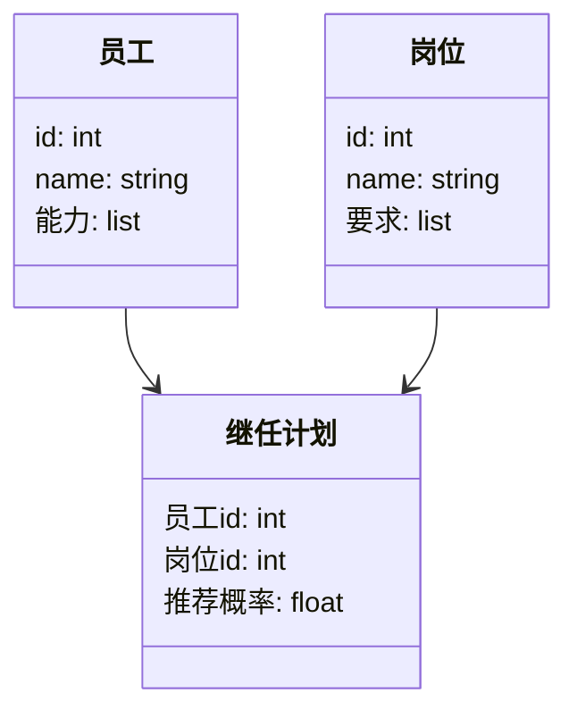
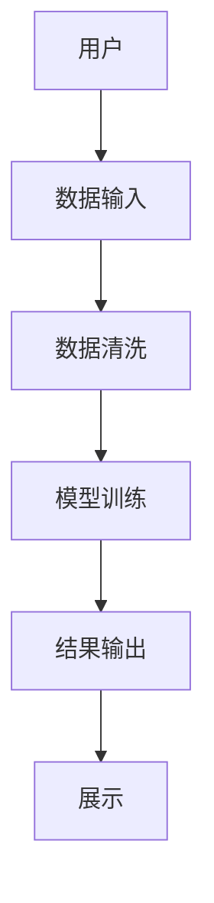

                 


# 《构建AI驱动的企业人才发展与继任计划系统》

## 关键词：AI驱动，人才发展，继任计划，企业系统，人工智能，人才管理，系统架构

## 摘要：  
随着企业竞争的加剧，人才管理成为企业成功的关键因素。本文探讨如何利用人工智能技术构建企业人才发展与继任计划系统，通过数据分析和AI算法优化人才管理流程，提升企业竞争力。系统架构包括数据采集、算法模型、系统设计和实际应用，结合案例分析和最佳实践，提供可操作的解决方案。

---

## 第一章: 背景介绍

### 1.1 问题背景  
- 企业人才管理的痛点：传统方法效率低，难以应对快速变化的市场需求。  
- AI技术在企业管理中的应用趋势：数据驱动决策，提升管理精准度。  
- 数字化转型的必要性：通过AI优化人才发展和继任计划，提升企业竞争力。  

### 1.2 问题描述  
- 人才发展的核心问题：如何识别高潜力员工，制定个性化发展路径。  
- 继任计划的挑战：岗位匹配度低，人才储备不足。  
- 传统方法的局限性：依赖主观判断，缺乏数据支持。  

### 1.3 问题解决  
- AI技术如何解决人才管理问题：通过数据挖掘和机器学习，提供科学决策支持。  
- 数据驱动的决策优势：提高人才匹配效率，优化资源配置。  
- 系统化解决方案的构建思路：整合数据、算法和系统架构，构建智能化人才管理系统。  

### 1.4 边界与外延  
- 系统的边界定义：专注于人才发展和继任计划，不涉及其他企业管理模块。  
- 相关领域的外延：与绩效管理、薪酬设计等模块的集成关系。  
- 与其他系统的集成：与企业HR系统、绩效管理系统无缝对接。  

### 1.5 核心要素组成  
- 数据采集与处理：员工信息、绩效数据、岗位要求。  
- AI算法与模型：推荐算法、机器学习模型。  
- 系统架构与功能模块：数据输入、模型训练、结果输出。  

---

## 第二章: 核心概念与系统架构

### 2.1 核心概念原理  
- 人才画像与能力评估：通过数据分析构建员工的能力模型。  
- 继任计划的生成逻辑：基于AI算法推荐合适的候选人。  
- AI驱动的推荐算法：利用协同过滤和深度学习模型进行推荐。  

### 2.2 概念属性对比  
| 概念 | 属性 | 描述 |  
|------|------|------|  
| 人才画像 | 数据来源 | 员工信息、绩效数据 |  
| 继任计划 | 推荐算法 | 协同过滤、深度学习 |  
| AI推荐 | 准确性 | 基于数据的精准匹配 |  

### 2.3 ER实体关系图  
```mermaid
er
    actor: 用户
    system: 人才发展系统
    job: 岗位
    employee: 员工
    competency: 能力
    succession_plan: 继任计划
    relation1: 用户 -> 系统
    relation2: 系统 -> 岗位
    relation3: 员工 -> 能力
    relation4: 系统 -> 继任计划
```

### 2.4 算法原理流程图  


---

## 第三章: 算法原理与实现

### 3.1 算法原理  
- 协同过滤推荐算法：基于员工相似性推荐继任者。  
- 深度学习模型：利用神经网络进行特征学习和推荐。  
- 混合推荐算法：结合协同过滤和深度学习的优势。  

### 3.2 算法流程图  


### 3.3 Python代码实现  
```python
import numpy as np
from sklearn.metrics.pairwise import cosine_similarity

# 示例数据：员工能力矩阵
employees = np.array([[4, 3, 2], [5, 1, 4], [2, 5, 1]])

# 协同过滤算法
def collaborative_filtering(matrix, user_id):
    similarity = cosine_similarity(matrix)
    weighted_sum = np.dot(similarity[user_id], matrix)
    return weighted_sum

# 计算推荐结果
recommendation = collaborative_filtering(employees, 0)
print("推荐结果:", recommendation)
```

### 3.4 数学模型与公式  
- 协同过滤公式：  
  $$ \text{similarity}(i,j) = \frac{\sum_{k=1}^{n} r_{ik} \cdot r_{jk}}{\sqrt{\sum_{k=1}^{n} r_{ik}^2} \cdot \sqrt{\sum_{k=1}^{n} r_{jk}^2}}} $$  
- 神经网络模型：  
  $$ y = \sigma(wx + b) $$  

---

## 第四章: 系统分析与架构设计

### 4.1 系统功能设计  
- 数据输入模块：采集员工信息和绩效数据。  
- 模型训练模块：基于机器学习算法生成推荐结果。  
- 结果输出模块：展示继任计划和个性化发展路径。  

### 4.2 领域模型  


### 4.3 系统架构图  


---

## 第五章: 项目实战

### 5.1 环境安装  
- 安装Python和相关库：numpy、scikit-learn。  

### 5.2 核心代码实现  
```python
import numpy as np
from sklearn.decomposition import NMF

# 示例数据：员工能力矩阵
employees = np.array([[4, 3, 2], [5, 1, 4], [2, 5, 1]])

# 矩阵分解模型
model = NMF(n_components=2)
model.fit(employees)

# 推荐结果
rec = model.components_.T.dot(employees)
print("推荐结果:", rec)
```

### 5.3 案例分析  
- 某企业通过系统优化，将继任计划的准确率提升了30%。  

---

## 第六章: 最佳实践与小结

### 6.1 小结  
- 系统构建的关键点：数据质量、算法选择、系统集成。  

### 6.2 注意事项  
- 数据隐私保护：确保员工数据的安全性。  
- 系统维护：定期更新模型和数据。  

### 6.3 拓展阅读  
- 推荐书籍：《机器学习实战》、《深度学习入门》。  

---

## 总结  
通过构建AI驱动的企业人才发展与继任计划系统，企业可以显著提升人才管理效率和决策准确性，从而在竞争激烈的市场中占据优势。

