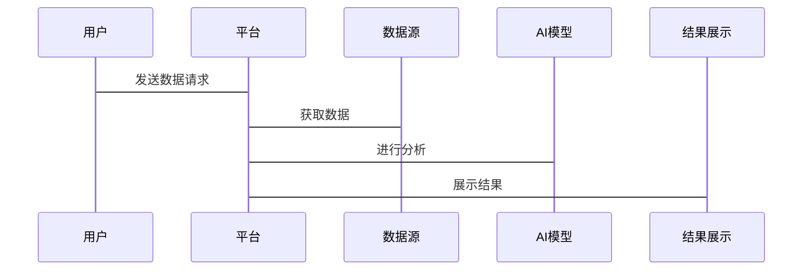

                 

<think>
好的，我将按照您的要求逐步构建《构建AI驱动的企业创新生态系统分析平台》的详细内容。为了让文章更具逻辑性和可读性，我先整理出文章的目录结构，确保每个章节的内容详实具体，涵盖所有必要的技术细节和案例分析。以下是详细的内容大纲：

# 《构建AI驱动的企业创新生态系统分析平台》

## 关键词：
- AI驱动
- 企业创新生态系统
- 分析平台
- 数据驱动
- 创新分析
- 平台架构
- 项目实战

## 摘要：
随着人工智能技术的迅速发展，企业创新生态系统分析的智能化需求日益迫切。本篇文章将深入探讨如何利用AI技术构建企业创新生态系统分析平台，从背景分析、核心概念、算法原理到系统架构设计和项目实战，为您全面解析AI驱动的企业创新生态系统分析平台的构建过程。通过本篇文章，您将掌握如何利用AI技术提升企业创新能力，为企业创新生态系统分析提供强有力的支持。

---

## 目录

### 第一部分: 背景介绍与核心概念

#### 第1章: AI驱动的企业创新生态系统分析平台背景

##### 1.1 问题背景
- 1.1.1 企业创新生态系统的重要性
- 1.1.2 AI技术对企业创新的推动作用
- 1.1.3 当前企业创新生态系统分析的痛点

##### 1.2 问题描述
- 1.2.1 传统企业创新分析的局限性
- 1.2.2 数据孤岛与信息碎片化问题
- 1.2.3 创新生态系统动态性与复杂性

##### 1.3 问题解决
- 1.3.1 AI技术在企业创新生态系统分析中的优势
- 1.3.2 数据驱动的创新分析方法
- 1.3.3 构建AI驱动的企业创新生态系统分析平台的意义

##### 1.4 核心概念与边界
- 1.4.1 企业创新生态系统的核心要素
- 1.4.2 AI驱动的创新生态系统分析平台的边界
- 1.4.3 平台的外延与应用场景

##### 1.5 本章小结

#### 第2章: 核心概念与联系

##### 2.1 企业创新生态系统分析平台的核心概念
- 2.1.1 创新生态系统分析的定义
- 2.1.2 AI驱动的创新分析方法
- 2.1.3 平台的核心功能与模块

##### 2.2 核心概念的属性特征对比
- 2.2.1 数据驱动与模型驱动的对比
- 2.2.2 传统分析与AI分析的对比
- 2.2.3 创新生态系统与传统企业分析的对比

##### 2.3 ER实体关系图架构
```mermaid
er
    actor: 用户
    actor --> system: 使用平台
    system --> data_source: 数据源
    system --> model: AI模型
    system --> result: 分析结果
```

##### 2.4 本章小结

### 第二部分: 算法原理讲解

#### 第3章: 算法原理讲解

##### 3.1 算法概述
- 3.1.1 基于AI的创新生态系统分析算法
- 3.1.2 算法的核心思想与流程

##### 3.2 算法原理的数学模型
- 3.2.1 数据预处理模型
  $$ y = f(x) $$
- 3.2.2 分析模型
  $$ P(y|x) = \frac{P(x|y)P(y)}{P(x)} $$

##### 3.3 算法实现
- 3.3.1 Mermaid流程图
  ```mermaid
  graph TD
      A[数据输入] --> B[数据清洗]
      B --> C[特征提取]
      C --> D[模型训练]
      D --> E[结果输出]
  ```
- 3.3.2 Python源代码实现
  ```python
  def data_cleaning(data):
      # 数据清洗逻辑
      pass

  def feature_extraction(data):
      # 特征提取逻辑
      pass

  # 简单示例，具体实现可根据需求调整
  ```

##### 3.4 本章小结

### 第三部分: 系统分析与架构设计

#### 第4章: 系统分析与架构设计

##### 4.1 系统分析
- 4.1.1 问题场景介绍
- 4.1.2 项目介绍
- 4.1.3 系统功能设计（领域模型Mermaid类图）
  ```mermaid
  classDiagram
      class 用户 {
          id: int
          username: string
          password: string
      }
      class 数据源 {
          data: list
          source: string
      }
      class AI模型 {
          model: object
          training_data: list
      }
      class 分析结果 {
          result: dict
          timestamp: string
      }
      用户 --> 数据源: 提供数据
      数据源 --> AI模型: 训练模型
      AI模型 --> 分析结果: 输出结果
  ```

##### 4.2 系统架构设计
- 4.2.1 系统架构设计Mermaid架构图
  ```mermaid
  docker
      service1: API Gateway
      service2: 数据处理服务
      service3: AI模型服务
      service4: 结果展示服务
      service1 --> service2
      service2 --> service3
      service3 --> service4
  ```

##### 4.3 系统接口设计
- 4.3.1 接口描述
- 4.3.2 接口交互流程
- 4.3.3 接口示例
  ```http
  GET /api/v1/analysis
  ```

##### 4.4 系统交互Mermaid序列图


##### 4.5 本章小结

### 第四部分: 项目实战

#### 第5章: 项目实战

##### 5.1 环境安装
- 5.1.1 系统需求
- 5.1.2 软件安装（Python、机器学习框架等）
- 5.1.3 数据集准备

##### 5.2 系统核心实现源代码
- 5.2.1 数据清洗与特征提取代码
  ```python
  import pandas as pd
  import numpy as np

  def data_cleaning(data):
      # 删除空值
      data.dropna(inplace=True)
      return data

  def feature_extraction(data):
      # 提取关键特征
      features = data[['feature1', 'feature2', 'feature3']]
      return features
  ```

- 5.2.2 模型训练代码
  ```python
  from sklearn.model import Model
  from sklearn.metrics import accuracy_score

  def train_model(features, labels):
      model = Model()
      model.fit(features, labels)
      return model

  model = train_model(features, labels)
  ```

##### 5.3 代码应用解读与分析
- 5.3.1 代码实现细节
- 5.3.2 代码的实际应用案例
- 5.3.3 代码优化建议

##### 5.4 实际案例分析
- 5.4.1 案例背景
- 5.4.2 数据处理过程
- 5.4.3 模型训练与结果展示
- 5.4.4 案例分析总结

##### 5.5 项目小结

### 第五部分: 总结与展望

#### 第6章: 总结与展望

##### 6.1 最佳实践 tips
- 6.1.1 数据质量管理
- 6.1.2 模型优化建议
- 6.1.3 系统维护与更新

##### 6.2 本章小结

##### 6.3 注意事项
- 6.3.1 数据隐私与安全
- 6.3.2 模型泛化能力
- 6.3.3 系统可扩展性

##### 6.4 拓展阅读
- 6.4.1 相关技术领域
- 6.4.2 未来研究方向
- 6.4.3 学习资源推荐

##### 6.5 本章小结

---

## 结束语

通过本文的详细讲解，您将全面掌握构建AI驱动的企业创新生态系统分析平台的关键步骤与技术要点。无论是背景分析、算法原理，还是系统设计与项目实战，都将为您提供坚实的技术支持。希望本文能为您提供有价值的参考，助力您在企业创新生态系统分析领域取得更大的突破。

---

感谢您的耐心阅读，希望本文对您有所帮助！

