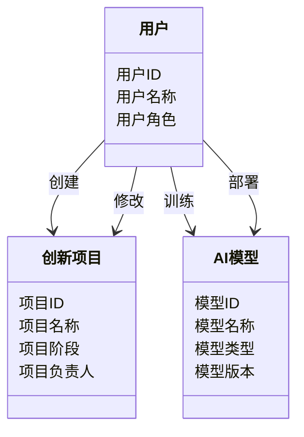
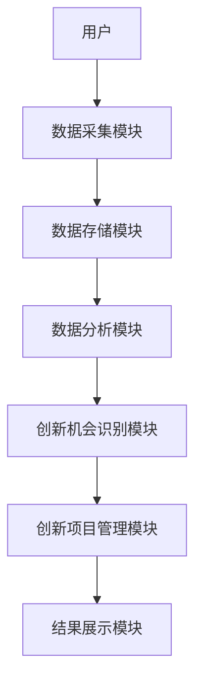
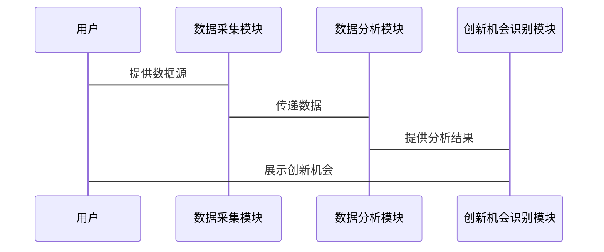

                 


# 构建AI驱动的企业创新管理系统

> 关键词：人工智能，企业创新管理，系统架构，机器学习，自然语言处理，数据挖掘

> 摘要：本文探讨了如何利用人工智能技术构建企业创新管理系统。通过分析创新管理的核心问题，结合机器学习和自然语言处理等技术，提出了一种基于AI的创新管理模式。文章详细介绍了系统的核心概念、算法原理、系统架构、项目实现等内容，为企业在AI时代实现高效创新管理提供了理论依据和实践指导。

---

## 第1章: 企业创新管理的现状与挑战

### 1.1 企业创新管理的背景介绍

#### 1.1.1 问题背景与问题描述
在当今快速变化的商业环境中，企业创新管理变得越来越重要。传统的创新管理模式依赖于人工判断和经验，这种方式效率低、主观性强，难以适应现代企业的需求。企业创新管理的核心问题在于如何快速识别潜在的创新机会、优化创新流程，并确保创新成果的高效转化。

#### 1.1.2 传统创新管理模式的局限性
传统的创新管理模式存在以下问题：
1. **信息孤岛**：各部门之间的信息难以共享，导致创新机会被遗漏。
2. **效率低下**：创新项目的评估和筛选过程耗时长，且依赖人工经验。
3. **主观性强**：创新项目的优先级评定主观性强，缺乏数据支持。
4. **难以量化**：创新成果难以量化，难以评估创新管理的效果。

#### 1.1.3 AI技术对企业创新管理的潜在价值
人工智能技术（AI）为企业创新管理带来了新的可能性。通过机器学习、自然语言处理（NLP）和数据挖掘等技术，企业可以更高效地识别创新机会、优化创新流程，并量化创新成果。AI技术可以帮助企业实现创新管理的自动化、智能化和数据驱动化。

### 1.2 AI驱动的企业创新管理的核心概念

#### 1.2.1 核心概念术语说明
- **创新管理**：指对企业内部的创新活动进行规划、组织、协调和控制的过程。
- **AI驱动**：利用人工智能技术（如机器学习、NLP等）来实现创新管理的智能化和自动化。
- **创新机会识别**：通过分析内外部数据，识别潜在的创新机会。
- **创新项目管理**：对创新项目进行全生命周期管理，包括项目评估、进度跟踪和成果评估。

#### 1.2.2 问题解决思路与方法
AI驱动的企业创新管理的核心思路是将创新管理过程数据化、模型化，并通过算法优化创新流程。具体方法包括：
1. **数据采集与分析**：收集企业内外部数据，利用数据挖掘技术识别潜在的创新机会。
2. **机器学习模型构建**：基于历史数据训练机器学习模型，预测创新项目的成功率和优先级。
3. **自然语言处理应用**：通过NLP技术分析文本数据（如市场报告、客户反馈），提取创新灵感。
4. **自动化决策支持**：利用AI算法提供创新项目管理的自动化支持，如自动分配资源、自动跟踪项目进度。

#### 1.2.3 系统的边界与外延
AI驱动的企业创新管理系统的边界包括：
- 输入：企业内外部数据、员工反馈、市场信息等。
- 输出：创新机会识别、项目优先级排序、创新项目管理建议等。
- 外延：通过API或其他接口与企业现有的管理系统（如ERP、CRM）集成。

#### 1.2.4 核心要素与组成结构
AI驱动的企业创新管理系统的核心要素包括：
1. **数据采集模块**：负责采集企业内外部数据。
2. **数据分析模块**：利用数据挖掘和机器学习技术对数据进行分析。
3. **自然语言处理模块**：通过NLP技术分析文本数据。
4. **创新机会识别模块**：基于分析结果识别潜在的创新机会。
5. **创新项目管理模块**：对创新项目进行全生命周期管理。

### 1.3 本章小结
本章主要介绍了企业创新管理的背景、传统管理模式的局限性以及AI技术在创新管理中的潜在价值。通过分析AI驱动的企业创新管理的核心概念，为后续章节的系统设计和实现奠定了基础。

---

## 第2章: AI驱动的企业创新管理核心概念与联系

### 2.1 AI驱动的企业创新管理原理

#### 2.1.1 机器学习在创新管理中的应用
机器学习在创新管理中的应用主要体现在：
1. **创新机会识别**：通过监督学习模型预测潜在的创新机会。
2. **创新项目评估**：利用无监督学习技术发现潜在的创新项目风险。
3. **创新成果预测**：基于历史数据训练回归模型，预测创新项目的成功概率。

#### 2.1.2 自然语言处理在创新管理中的应用
自然语言处理在创新管理中的应用包括：
1. **市场趋势分析**：通过文本挖掘技术分析市场报告、新闻等文本数据，识别市场趋势。
2. **客户反馈分析**：利用情感分析技术分析客户反馈，发现潜在的创新机会。
3. **内部沟通分析**：通过分析员工邮件、会议记录等内部沟通数据，挖掘潜在的创新灵感。

#### 2.1.3 数据挖掘与分析在创新管理中的应用
数据挖掘在创新管理中的应用包括：
1. **模式识别**：发现数据中的模式，识别潜在的创新机会。
2. **关联规则挖掘**：发现数据中的关联规则，优化创新项目的资源配置。
3. **聚类分析**：将创新项目按相似性进行分类，便于管理和分析。

### 2.2 核心概念对比分析

#### 2.2.1 创新管理与传统管理的对比
| **方面** | **传统管理** | **AI驱动创新管理** |
|----------|--------------|---------------------|
| **数据驱动** | 依赖人工经验 | 数据驱动，自动化决策 |
| **效率** | 低效 | 高效，自动化处理 |
| **灵活性** | 较低 | 高，适应快速变化的环境 |

#### 2.2.2 AI驱动与非AI驱动创新管理的对比
| **方面** | **非AI驱动创新管理** | **AI驱动创新管理** |
|----------|-------------------|---------------------|
| **决策速度** | 较慢，依赖人工判断 | 快速，基于数据驱动 |
| **资源利用率** | 低效，资源浪费 | 高效，资源优化配置 |
| **创新成果** | 有限，依赖经验 | 更多，数据驱动优化 |

### 2.3 系统架构的ER实体关系图

```mermaid
er
actor: 用户
|-----|
| 用户ID | 用户名称 | 用户角色 |
|---|---|---|
| 1 | 张三 | 管理员 |
| 2 | 李四 | 普通用户 |

actor: 创新项目
|-----|
| 项目ID | 项目名称 | 项目阶段 | 项目负责人 |
|---|---|---|---|
| 1 | 新产品开发 | 初期 | 张三 |
| 2 | 技术创新 | 中期 | 李四 |

actor: AI模型
|-----|
| 模型ID | 模型名称 | 模型类型 | 模型版本 |
|---|---|---|---|
| 1 | NLP模型 | 文本分析 | V1.0 |
| 2 | 机器学习模型 | 预测分析 | V2.0 |
```

### 2.4 本章小结
本章详细探讨了AI驱动的企业创新管理的核心概念和原理，并通过对比分析和ER实体关系图展示了系统的架构和核心要素。

---

## 第3章: AI驱动的企业创新管理算法原理

### 3.1 机器学习算法在创新管理中的应用

#### 3.1.1 机器学习算法概述
机器学习算法在创新管理中的应用主要体现在以下几个方面：
1. **监督学习**：用于创新项目的分类和预测。
2. **无监督学习**：用于发现数据中的潜在模式和关联。
3. **强化学习**：用于优化创新项目的决策过程。

#### 3.1.2 常见机器学习算法在创新管理中的应用
- **线性回归**：用于预测创新项目的成功概率。
- **决策树**：用于分类创新项目的优先级。
- **随机森林**：用于处理高维数据，提高模型的准确性。

#### 3.1.3 基于机器学习的创新项目预测模型
以下是基于机器学习的创新项目预测模型的实现步骤：

1. **数据预处理**：清洗数据，处理缺失值和异常值。
2. **特征选择**：选择对创新项目成功概率影响最大的特征。
3. **模型训练**：使用训练数据训练机器学习模型。
4. **模型评估**：通过测试数据评估模型的准确率和召回率。
5. **模型部署**：将模型部署到生产环境，用于创新项目的预测和评估。

以下是线性回归模型的Python实现代码：

```python
import pandas as pd
from sklearn.linear_model import LinearRegression
from sklearn.metrics import mean_squared_error

# 加载数据
data = pd.read_csv('innovation_projects.csv')

# 分离特征和目标变量
X = data[['预算', '团队规模', '技术难度']]
y = data['成功概率']

# 训练模型
model = LinearRegression()
model.fit(X, y)

# 预测
y_pred = model.predict(X)

# 评估模型
mse = mean_squared_error(y, y_pred)
print(f"均方误差: {mse}")
```

### 3.2 自然语言处理算法在创新管理中的应用

#### 3.2.1 自然语言处理算法概述
自然语言处理在创新管理中的应用主要体现在以下几个方面：
1. **文本挖掘**：用于从市场报告、客户反馈等文本数据中提取信息。
2. **情感分析**：用于分析客户对创新项目的看法。
3. **实体识别**：用于识别文本中的关键实体，如公司名称、产品名称等。

#### 3.2.2 基于NLP的情感分析模型
以下是基于NLP的情感分析模型的实现步骤：

1. **数据预处理**：清洗文本数据，去除停用词和标点符号。
2. **特征提取**：将文本数据转换为向量表示。
3. **模型训练**：使用训练数据训练情感分析模型。
4. **模型评估**：通过测试数据评估模型的准确率和召回率。
5. **模型部署**：将模型部署到生产环境，用于情感分析任务。

以下是情感分析模型的Python实现代码：

```python
from sklearn.feature_extraction.text import TfidfVectorizer
from sklearn.svm import SVC
from sklearn.metrics import accuracy_score

# 加载数据
data = pd.read_csv('market_reports.csv')

# 分离特征和目标变量
X = data['报告内容']
y = data['情感倾向']

# 特征提取
vectorizer = TfidfVectorizer()
X_vector = vectorizer.fit_transform(X)

# 训练模型
model = SVC()
model.fit(X_vector, y)

# 预测
y_pred = model.predict(X_vector)

# 评估模型
accuracy = accuracy_score(y, y_pred)
print(f"准确率: {accuracy}")
```

### 3.3 本章小结
本章详细探讨了机器学习和自然语言处理算法在创新管理中的应用，并通过具体的Python代码示例展示了算法的实现过程。

---

## 第4章: AI驱动的企业创新管理系统架构设计

### 4.1 系统功能设计

#### 4.1.1 领域模型设计
以下是创新管理系统的核心领域模型：



#### 4.1.2 系统架构设计
以下是创新管理系统的整体架构图：



#### 4.1.3 接口设计与交互流程
以下是创新管理系统的主要接口和交互流程：



### 4.2 本章小结
本章详细设计了AI驱动的企业创新管理系统的架构，包括功能模块设计、系统架构图和接口设计。

---

## 第5章: 项目实战

### 5.1 项目环境安装与配置

#### 5.1.1 安装Python和必要的库
```bash
pip install numpy
pip install pandas
pip install scikit-learn
pip install nltk
pip install transformers
```

#### 5.1.2 安装Jupyter Notebook
```bash
pip install jupyter
```

### 5.2 系统核心实现

#### 5.2.1 创新机会识别模块实现
以下是创新机会识别模块的Python代码：

```python
import pandas as pd
from sklearn.ensemble import RandomForestClassifier
from sklearn.metrics import accuracy_score

# 加载数据
data = pd.read_csv('opportunity.csv')

# 分离特征和目标变量
X = data[['市场趋势', '技术可行性', '团队能力']]
y = data['创新机会']

# 训练模型
model = RandomForestClassifier()
model.fit(X, y)

# 预测
y_pred = model.predict(X)

# 评估模型
accuracy = accuracy_score(y, y_pred)
print(f"准确率: {accuracy}")
```

#### 5.2.2 创新项目管理模块实现
以下是创新项目管理模块的Python代码：

```python
import pandas as pd
from sklearn.preprocessing import MinMaxScaler
from sklearn.cluster import KMeans

# 加载数据
data = pd.read_csv('projects.csv')

# 数据预处理
scaler = MinMaxScaler()
X_scaled = scaler.fit_transform(data[['预算', '团队规模', '技术难度']])

# 训练模型
model = KMeans(n_clusters=3)
model.fit(X_scaled)

# 预测
y_pred = model.predict(X_scaled)

# 展示结果
data['聚类结果'] = y_pred
print(data[['项目名称', '聚类结果']])
```

### 5.3 案例分析与详细解读
以下是创新机会识别模块的案例分析：

1. **数据来源**：市场报告、客户反馈、内部数据等。
2. **数据预处理**：清洗数据，处理缺失值和异常值。
3. **模型训练**：使用随机森林模型训练创新机会识别模型。
4. **模型评估**：通过准确率、召回率等指标评估模型性能。
5. **结果展示**：通过可视化工具展示创新机会识别结果。

---

## 第6章: 最佳实践与小结

### 6.1 最佳实践 Tips
1. **数据质量**：确保数据的准确性和完整性。
2. **模型优化**：通过交叉验证和超参数调优提高模型性能。
3. **系统集成**：将创新管理系统与企业现有的管理系统集成，提高系统的实用性和可操作性。

### 6.2 小结
本文详细探讨了AI驱动的企业创新管理系统的构建过程，包括系统设计、算法实现和项目实战。通过本文的介绍，读者可以全面了解AI技术在创新管理中的应用，并能够实际操作构建一个简单的AI驱动创新管理系统。

### 6.3 注意事项
1. **数据隐私**：在处理企业数据时，要注意数据隐私和安全问题。
2. **模型解释性**：在实际应用中，要注意模型的解释性，避免黑箱模型带来的风险。
3. **系统维护**：定期更新模型和数据，确保系统的稳定性和可靠性。

### 6.4 拓展阅读
1. **《机器学习实战》**：学习机器学习算法的实现和应用。
2. **《自然语言处理入门》**：学习自然语言处理技术的基础知识。
3. **《企业架构设计》**：学习系统架构设计的方法和技巧。

---

## 附录

### 附录 A: 代码实现
以下是本文中提到的Python代码的详细实现：

```python
import pandas as pd
from sklearn.ensemble import RandomForestClassifier
from sklearn.metrics import accuracy_score

# 加载数据
data = pd.read_csv('opportunity.csv')

# 分离特征和目标变量
X = data[['市场趋势', '技术可行性', '团队能力']]
y = data['创新机会']

# 训练模型
model = RandomForestClassifier()
model.fit(X, y)

# 预测
y_pred = model.predict(X)

# 评估模型
accuracy = accuracy_score(y, y_pred)
print(f"准确率: {accuracy}")
```

### 附录 B: 系统架构图
以下是创新管理系统的整体架构图：


---

## 结语

通过本文的详细介绍，读者可以系统地了解AI驱动的企业创新管理系统的构建过程，并能够实际操作构建一个简单的AI驱动创新管理系统。希望本文对企业的创新管理实践和AI技术的应用有所帮助。

