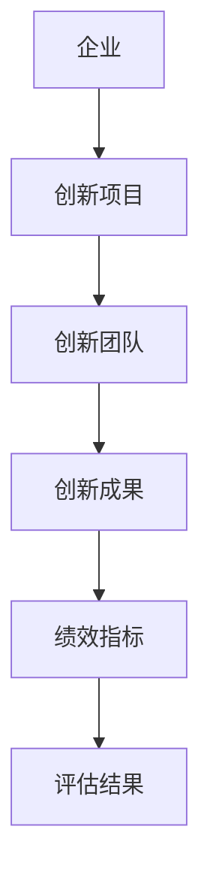
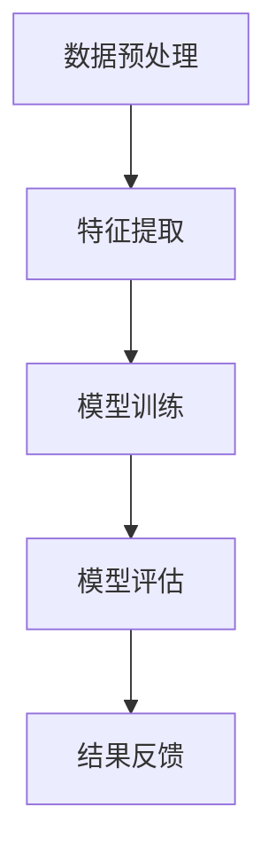
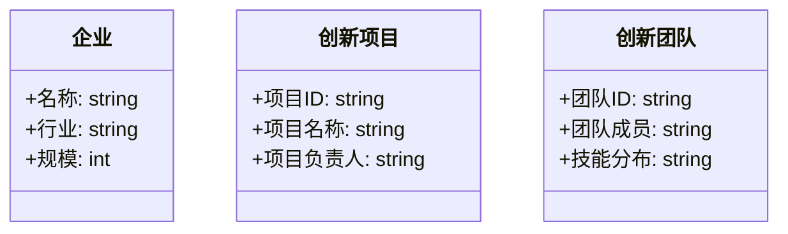
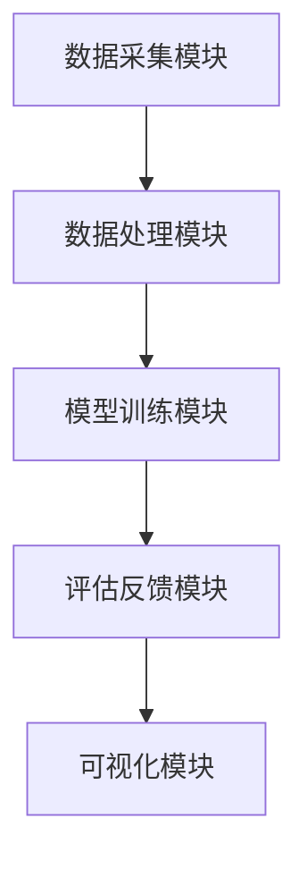
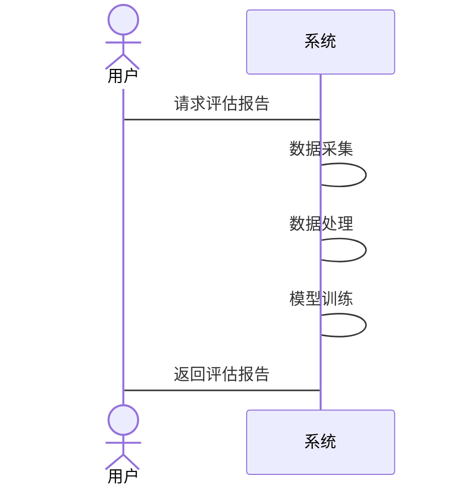

                 


# 《构建AI驱动的企业创新绩效评估系统》

## 关键词：AI驱动，企业创新，绩效评估，机器学习，系统架构

## 摘要：本文详细探讨了如何利用人工智能技术构建企业创新绩效评估系统。通过分析传统绩效评估的不足，介绍了AI驱动的创新方法，详细讲解了系统架构设计、核心算法实现、项目实战案例以及最佳实践建议，为企业的智能化管理提供了可行的解决方案。

---

# 第一部分: 背景介绍与核心概念

## 第1章: 问题背景与描述

### 1.1 传统企业绩效评估的局限性

#### 1.1.1 传统绩效评估的核心问题

传统的企业绩效评估主要依赖于人工数据收集和统计分析，存在以下核心问题：

- **主观性**：评估结果往往受到评估者主观判断的影响，导致结果不准确。
- **数据孤岛**：各部门数据分散，难以形成统一的评估标准。
- **滞后性**：评估周期长，难以及时反馈，影响决策效率。

#### 1.1.2 传统绩效评估的不足与挑战

传统绩效评估方法在实际应用中面临诸多挑战：

- **数据维度单一**：仅依赖财务数据或KPI指标，无法全面反映企业创新能力。
- **难以量化**：创新绩效往往难以量化，尤其是无形资产和创新能力的评估。
- **缺乏动态性**：无法实时捕捉市场变化和企业创新活动的动态。

### 1.2 AI驱动绩效评估的必要性

#### 1.2.1 AI技术在企业管理中的应用潜力

人工智能技术在企业管理中的应用潜力主要体现在以下几个方面：

- **数据整合与分析**：AI能够整合多源异构数据，提取有价值的信息，为绩效评估提供更全面的视角。
- **实时反馈与预测**：AI算法可以实时分析数据，预测绩效变化趋势，为企业提供及时的决策支持。
- **自动化评估**：通过机器学习模型，AI能够自动完成绩效评估，减少人工干预，提高效率。

#### 1.2.2 绩效评估智能化的需求

随着企业创新活动的复杂化和多样化，智能化绩效评估的需求日益迫切：

- **提升评估准确性**：AI通过多维度数据分析，减少人为误差，提高评估结果的准确性。
- **增强决策能力**：智能化评估能够提供实时数据和预测分析，帮助企业做出更明智的决策。
- **促进企业创新**：通过智能化评估，企业能够更好地识别创新机会，优化资源配置，推动创新进程。

### 1.3 问题解决与边界

#### 1.3.1 AI驱动绩效评估的核心目标

AI驱动的企业创新绩效评估系统的核心目标是：

- **量化创新能力**：通过AI技术，将企业的创新能力量化，提供可衡量的评估结果。
- **动态评估与反馈**：实现绩效评估的动态化和实时化，为企业提供及时的反馈和建议。
- **数据驱动决策**：利用AI分析数据，辅助企业制定科学的管理决策。

#### 1.3.2 系统的边界与外延

系统边界主要限定在企业内部的创新绩效评估，涵盖以下内容：

- **数据范围**：包括企业内部的研发数据、市场数据、财务数据等。
- **评估对象**：主要针对企业内部的创新项目、团队和部门绩效。
- **应用场景**：主要用于企业内部管理决策，如资源配置、创新战略制定等。

系统外延则扩展至与企业创新相关的外部数据，如行业趋势、竞争对手分析等，以提供更全面的评估视角。

### 1.4 概念结构与核心要素

#### 1.4.1 系统组成模块

AI驱动的企业创新绩效评估系统主要由以下几个模块组成：

1. **数据采集模块**：负责收集企业内外部相关数据。
2. **数据处理模块**：对采集的数据进行清洗、转换和预处理。
3. **模型构建模块**：基于机器学习算法构建绩效评估模型。
4. **评估与反馈模块**：生成评估结果，并提供反馈建议。
5. **可视化模块**：将评估结果以直观的形式展示给用户。

#### 1.4.2 核心要素的定义与关系

核心要素包括：

- **数据源**：企业内部和外部的相关数据。
- **评估指标**：构建的创新绩效评估指标体系。
- **算法模型**：用于评估的核心算法。
- **评估结果**：生成的绩效评估报告。

这些要素相互关联，共同构成了AI驱动的创新绩效评估系统。

## 第2章: 核心概念与联系

### 2.1 AI驱动绩效评估的原理

#### 2.1.1 数据驱动的评估方法

AI驱动的绩效评估方法基于数据驱动的分析，主要步骤如下：

1. **数据收集**：从企业内部和外部收集相关数据。
2. **特征提取**：从数据中提取有助于评估的关键特征。
3. **模型训练**：利用机器学习算法训练评估模型。
4. **评估与反馈**：基于模型预测结果，生成评估报告，并提供反馈建议。

#### 2.1.2 智能算法的核心作用

智能算法在绩效评估中的核心作用体现在以下几个方面：

- **特征提取**：通过算法自动提取数据中的关键特征，减少人工干预。
- **模式识别**：识别数据中的潜在模式，发现创新机会和潜在风险。
- **预测评估**：利用算法预测绩效变化趋势，提供前瞻性的评估结果。

### 2.2 模型属性特征对比

#### 2.2.1 监督学习 vs 无监督学习

监督学习和无监督学习在绩效评估中的应用对比：

| 特性                | 监督学习                     | 无监督学习                  |
|---------------------|-----------------------------|-----------------------------|
| 数据需求            | 需要标签数据                 | 不需要标签数据              |
| 适用场景            | 预测性评估                   | 聚类分析或异常检测           |
| 模型复杂度          | 较高                        | 较低                        |
| 应用案例            | 预测销售业绩                 | 发现市场趋势                |

#### 2.2.2 模型复杂度 vs 鲁棒性

模型复杂度和鲁棒性的对比：

| 特性                | 低复杂度模型                | 高复杂度模型                |
|---------------------|-----------------------------|-----------------------------|
| 鲁棒性              | 较高                        | 较低                        |
| 训练时间            | 较短                        | 较长                        |
| 性能                | 较低                        | 较高                        |

### 2.3 ER实体关系图



---

# 第二部分: 算法原理与数学模型

## 第3章: 算法原理讲解

### 3.1 算法流程图



### 3.2 算法实现

#### 3.2.1 代码实现

```python
import pandas as pd
from sklearn.model import LinearRegression

# 数据加载
data = pd.read_csv('performance.csv')

# 特征提取
X = data[['revenue', 'profit', 'growth']]
y = data['score']

# 模型训练
model = LinearRegression()
model.fit(X, y)

# 模型预测
predictions = model.predict(X)
print('预测结果:', predictions)
```

#### 3.2.2 数学模型

线性回归模型的数学表达式为：

$$ y = \beta_0 + \beta_1 x_1 + \beta_2 x_2 + \epsilon $$

其中，$\beta_0$ 是截距，$\beta_1$ 和 $\beta_2$ 是回归系数，$\epsilon$ 是误差项。

### 3.3 算法优化

#### 3.3.1 参数调整

在机器学习模型中，参数调整是优化模型性能的重要步骤。例如，在支持向量机（SVM）中，调节惩罚参数C和核函数参数gamma可以显著影响模型的性能。

#### 3.3.2 正则化方法

为了防止模型过拟合，可以采用Lasso回归（L1正则化）或Ridge回归（L2正则化）。Lasso回归的数学表达式为：

$$ Lasso: \quad \min \frac{1}{2m} \sum_{i=1}^{m}(y_i - \hat{y}_i)^2 + \alpha \sum_{j=1}^{n} |w_j| $$

Ridge回归的数学表达式为：

$$ Ridge: \quad \min \frac{1}{2m} \sum_{i=1}^{m}(y_i - \hat{y}_i)^2 + \alpha \sum_{j=1}^{n} w_j^2 $$

---

# 第三部分: 系统分析与架构设计

## 第4章: 系统分析与架构设计

### 4.1 问题场景介绍

企业创新绩效评估系统需要解决以下问题：

- 如何高效整合企业内外部数据？
- 如何构建高性能的AI评估模型？
- 如何确保系统的实时反馈能力？

### 4.2 项目介绍

本项目旨在构建一个基于AI的企业创新绩效评估系统，主要功能包括数据采集、模型训练、评估反馈和结果可视化。

### 4.3 系统功能设计

#### 4.3.1 领域模型



#### 4.3.2 系统架构



### 4.4 系统接口设计

#### 4.4.1 接口定义

系统主要接口包括：

1. 数据采集接口：`get_data()`
2. 模型训练接口：`train_model()`
3. 评估反馈接口：`generate_report()`

#### 4.4.2 交互序列图



---

# 第四部分: 项目实战

## 第5章: 项目实战

### 5.1 环境安装

安装所需的Python库：

```bash
pip install pandas numpy scikit-learn
```

### 5.2 核心实现

#### 5.2.1 数据预处理

```python
import pandas as pd
import numpy as np

# 数据加载
data = pd.read_csv('performance.csv')

# 数据清洗
data.dropna(inplace=True)
data = pd.get_dummies(data, columns=['部门'])
```

#### 5.2.2 模型实现

```python
from sklearn.model import RandomForestClassifier

# 特征选择
X = data[['销售额', '利润', '增长率']]
y = data['评估等级']

# 模型训练
model = RandomForestClassifier(n_estimators=100)
model.fit(X, y)

# 预测结果
predictions = model.predict(X)
print('预测准确率:', model.score(X, y))
```

### 5.3 案例分析

假设我们有一个科技公司的创新绩效评估案例：

- 数据来源：公司过去三年的财务数据和创新项目记录。
- 模型选择：随机森林分类器。
- 评估结果：预测公司今年的创新绩效等级为优秀。

---

# 第五部分: 最佳实践与小结

## 第6章: 最佳实践与小结

### 6.1 最佳实践 tips

- 数据预处理是关键，确保数据质量和完整性。
- 选择合适的算法，避免过拟合。
- 定期更新模型，适应数据变化。

### 6.2 小结

本文详细介绍了如何构建AI驱动的企业创新绩效评估系统，从背景分析到系统设计，再到项目实战，为企业的智能化管理提供了可行的解决方案。

### 6.3 注意事项

- 数据隐私保护是重中之重，确保数据安全。
- 模型的可解释性需要重视，避免黑箱操作。
- 定期监控模型性能，及时调整和优化。

### 6.4 拓展阅读

- 《机器学习实战》
- 《深度学习》
- 《企业绩效管理》

---

通过以上内容，读者可以系统地了解和掌握构建AI驱动的企业创新绩效评估系统的相关知识和技术。

