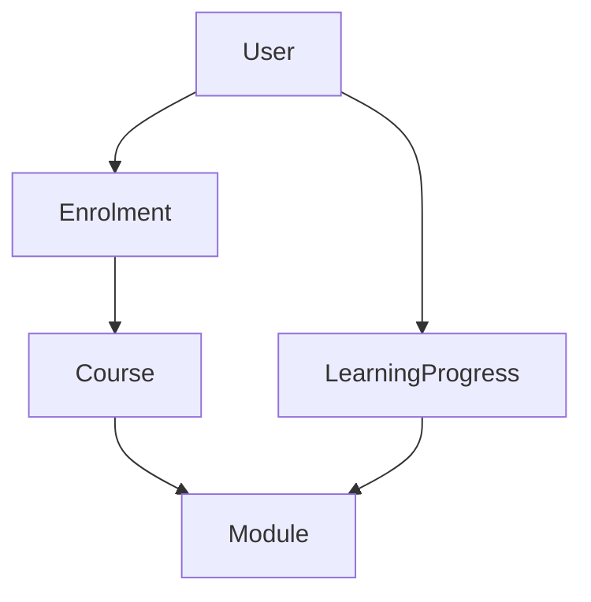
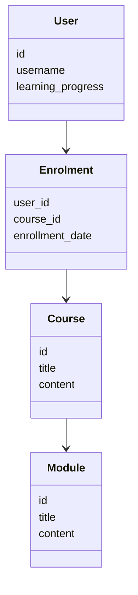
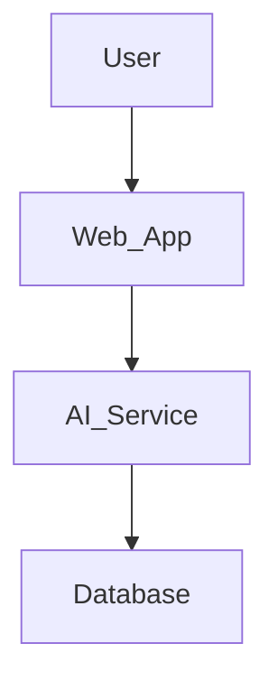
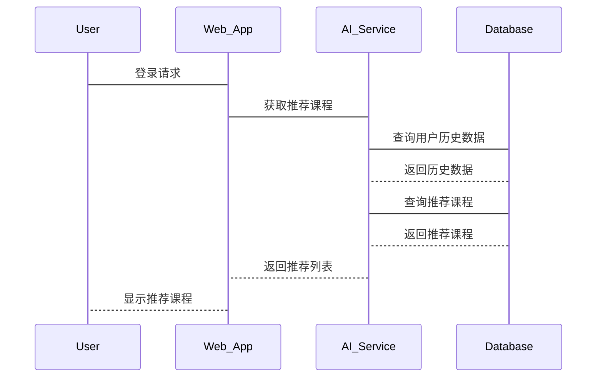

                 


# 构建AI驱动的企业学习管理系统(LMS)

## 关键词：AI，企业学习管理系统，LMS，机器学习，自适应学习，自然语言处理

## 摘要：本文详细探讨了如何利用人工智能技术构建一个高效、智能的企业学习管理系统。通过分析传统LMS的局限性，结合AI技术的核心优势，提出了基于数据驱动的学习分析、自适应学习推荐系统以及自然语言处理的应用方案。文章还详细介绍了推荐算法的实现、系统架构设计以及项目实战，为读者提供了一个从理论到实践的完整指南。

---

# 第一部分: AI驱动的企业学习管理系统背景与概述

## 第1章: AI驱动的企业学习管理系统背景

### 1.1 企业学习管理系统的概念与背景
#### 1.1.1 传统企业学习管理系统的局限性
传统的LMS（Learning Management System，学习管理系统）主要依赖于规则引擎和固定的学习路径，无法根据学习者的行为和需求进行实时调整，导致学习体验单一化，难以满足个性化学习需求。

#### 1.1.2 AI驱动的LMS的核心优势
AI驱动的LMS通过引入机器学习和自然语言处理技术，能够实时分析学习者的行为数据，自动生成个性化的学习路径和推荐内容，显著提升了学习效率和学习者满意度。

#### 1.1.3 企业学习管理系统的边界与外延
企业学习管理系统不仅包括课程管理、用户管理等功能，还延伸至学习效果评估、知识图谱构建等领域，形成了一个完整的知识管理生态。

### 1.2 问题背景与问题描述
#### 1.2.1 传统LMS的痛点分析
传统LMS存在学习内容单一、推荐算法简单、学习效果评估不精准等问题，难以满足现代企业对个性化学习的需求。

#### 1.2.2 AI驱动的LMS如何解决这些问题
通过引入AI技术，LMS能够实现智能化内容推荐、个性化学习路径设计以及精准的学习效果评估，有效解决了传统LMS的痛点。

#### 1.2.3 问题解决的边界与可行性分析
AI驱动的LMS需要结合企业的实际需求进行定制化开发，其可行性取决于数据质量、算法选型以及系统的可扩展性。

### 1.3 本章小结
本章通过分析传统LMS的局限性和AI驱动LMS的核心优势，明确了构建AI驱动LMS的必要性和可行性。

---

# 第二部分: AI驱动的企业学习管理系统核心概念与联系

## 第2章: AI在企业学习管理系统中的核心应用

### 2.1 数据驱动的学习分析
#### 2.1.1 数据驱动学习分析的原理
通过收集学习者的行为数据，利用机器学习算法进行分析，识别学习者的知识盲点和学习偏好，从而优化学习路径。

#### 2.1.2 学习者行为数据的采集与分析
数据采集包括学习时间、访问频率、互动次数等指标，通过聚类分析和关联规则挖掘，发现学习者的潜在需求。

#### 2.1.3 基于数据的学习效果评估
利用回归分析和分类算法，评估学习者的学习效果，预测其未来的学习表现。

### 2.2 自适应学习推荐系统
#### 2.2.1 自适应学习推荐的核心原理
通过协同过滤算法和深度学习模型，实时生成个性化推荐内容，满足学习者的需求。

#### 2.2.2 基于用户行为的推荐算法
协同过滤算法通过分析用户行为相似性，推荐相似课程；深度学习模型则通过特征提取，实现更精准的推荐。

#### 2.2.3 个性化学习路径的设计与实现
根据学习者的能力水平和学习目标，动态调整课程难度和学习顺序，确保学习者能够在最优路径中取得进步。

### 2.3 自然语言处理在学习管理系统中的应用
#### 2.3.1 NLP在学习内容生成中的应用
利用文本生成模型，自动生成学习材料，节省内容制作时间。

#### 2.3.2 基于NLP的智能问答系统
通过自然语言处理技术，实现智能客服功能，解答学习者的问题。

#### 2.3.3 NLP在学习效果评估中的作用
分析学习者的学习反馈，识别情感倾向，优化学习内容和推荐策略。

### 2.4 核心概念对比表
| 对比项          | 传统LMS                | AI驱动LMS              |
|-----------------|-------------------------|-------------------------|
| 学习推荐         | 固定推荐策略            | AI驱动的个性化推荐      |
| 学习路径         | 预设学习路径            | 动态调整的学习路径      |
| 学习效果评估     | 定期测试评估            | 实时数据分析评估        |

### 2.5 ER实体关系图


---

# 第三部分: AI驱动的企业学习管理系统算法原理

## 第3章: 基于协同过滤的推荐算法

### 3.1 协同过滤推荐算法原理
#### 3.1.1 基于用户的协同过滤
通过分析用户的行为相似性，推荐与用户兴趣相似的课程。

#### 3.1.2 基于物品的协同过滤
通过分析课程的相似性，推荐与当前课程相关的其他课程。

#### 3.1.3 混合协同过滤算法
结合用户和物品的特征，实现更精准的推荐。

### 3.2 协同过滤算法的实现
#### 3.2.1 数据预处理与特征提取
对用户行为数据进行清洗和标准化处理，提取关键特征。

#### 3.2.2 相似度计算与推荐生成
使用余弦相似度或Jaccard相似度计算用户或课程的相似度，生成推荐列表。

#### 3.2.3 算法优化与调优
通过交叉验证和网格搜索，优化算法参数，提升推荐准确率。

### 3.3 协同过滤算法的Python实现
```python
import numpy as np

def collaborative_filtering_similarity(user_matrix):
    # 计算余弦相似度
    user_matrix = normalize(user_matrix)
    similarity = user_matrix.T.dot(user_matrix)
    np.fill_diagonal(similarity, 0)
    return similarity
```

---

# 第四部分: AI驱动的企业学习管理系统系统分析与架构设计

## 第4章: 系统分析与架构设计

### 4.1 问题场景介绍
企业学习管理系统需要支持大规模用户同时在线学习，提供个性化的学习体验，实时分析学习者的行为数据。

### 4.2 项目介绍
本项目旨在构建一个基于AI的LMS，支持课程管理、用户管理、学习推荐等功能。

### 4.3 系统功能设计
#### 4.3.1 领域模型类图


### 4.4 系统架构设计
#### 4.4.1 系统架构图


### 4.5 系统接口设计
定义RESTful API接口，实现用户认证、课程推荐等功能。

### 4.6 系统交互序列图


---

# 第五部分: 项目实战

## 第5章: 项目实战

### 5.1 环境安装
安装Python、TensorFlow、Flask等开发工具和框架。

### 5.2 系统核心实现源代码
实现用户认证、课程推荐等功能的代码。

```python
from flask import Flask, request, jsonify
from tensorflow.keras import layers

app = Flask(__name__)

@app.route('/login', methods=['POST'])
def login():
    # 实现用户认证逻辑
    return jsonify({'status': 'success'})

@app.route('/recommend', methods=['POST'])
def recommend():
    # 实现推荐算法
    return jsonify({'recommendations': [...]})
```

### 5.3 代码应用解读与分析
分析代码实现，解释每个功能模块的作用和实现方式。

### 5.4 实际案例分析
通过具体案例，展示AI驱动LMS的实际应用效果和优势。

### 5.5 项目小结
总结项目开发过程中的经验教训，提出改进建议。

---

# 第六部分: 最佳实践与小结

## 第6章: 最佳实践

### 6.1 小结
总结全文内容，强调AI驱动LMS的核心优势和实际应用价值。

### 6.2 注意事项
在实际应用中，需要注意数据隐私保护、算法可解释性等问题。

### 6.3 拓展阅读
推荐相关领域的书籍和论文，供读者进一步学习和研究。

---

通过以上目录大纲，您可以逐步深入理解AI驱动的企业学习管理系统的构建过程，从理论到实践，掌握其核心技术和实际应用。

