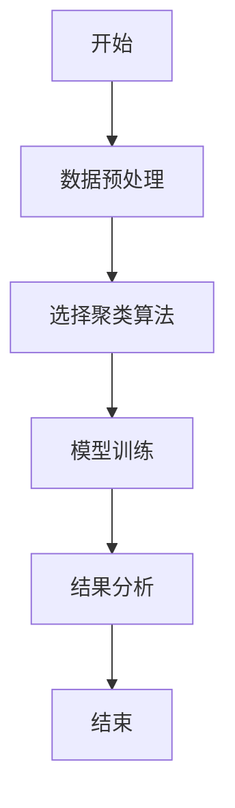
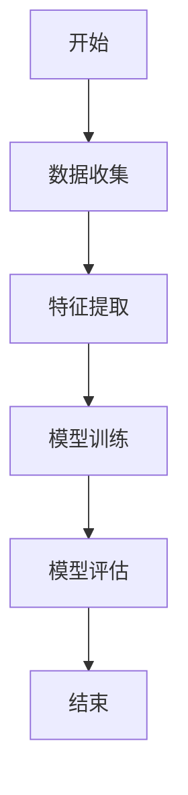
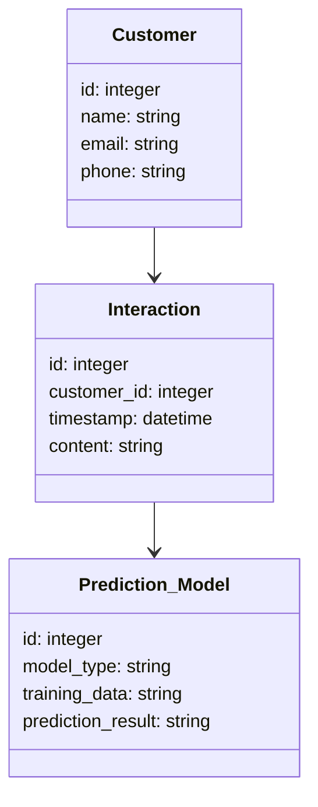
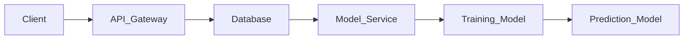
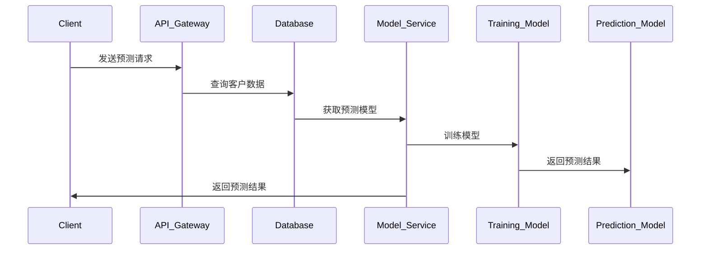

                 


# 《构建AI驱动的企业客户关系管理(CRM)系统》

> 关键词：AI驱动CRM、客户画像、客户分群、预测模型、NLP、系统架构

> 摘要：本文系统地介绍了如何构建一个AI驱动的企业客户关系管理(CRM)系统。从背景介绍、核心概念、算法原理到系统架构设计和项目实战，本文详细阐述了AI在CRM中的应用场景、技术实现和最佳实践。通过丰富的案例分析和代码实现，帮助读者全面掌握AI驱动CRM的核心技术和实施方法。

---

# 第一部分: AI驱动的企业CRM系统概述

## 第1章: 企业客户关系管理(CRM)概述

### 1.1 CRM的基本概念

#### 1.1.1 CRM的定义与核心功能
CRM（Customer Relationship Management，客户关系管理）是一种以客户为中心的企业管理方法，旨在通过优化与客户的互动，提升客户满意度和忠诚度，从而实现企业收益的最大化。CRM的核心功能包括客户信息管理、客户互动管理、销售管理、客户服务管理以及数据分析与预测。

#### 1.1.2 CRM在企业中的作用与价值
CRM在企业中的作用主要体现在以下几个方面：
1. 提高客户满意度和忠诚度。
2. 优化销售流程，提高销售效率。
3. 改善客户服务，降低客户流失率。
4. 通过数据分析，为企业决策提供支持。

#### 1.1.3 CRM系统的分类与特点
CRM系统可以根据不同的分类标准进行划分：
- 按部署方式：分为本地部署和云端部署。
- 按功能模块：分为基本CRM和高级CRM。
- 按行业应用：分为通用CRM和行业定制CRM。

### 1.2 AI驱动CRM的优势与挑战

#### 1.2.1 AI在CRM中的应用场景
AI在CRM中的应用场景主要包括客户画像、客户分群、预测模型和自然语言处理（NLP）应用。

#### 1.2.2 AI驱动CRM的核心优势
AI驱动CRM的核心优势体现在以下几个方面：
1. **自动化与智能化**：AI能够自动化处理大量的客户数据，提供智能化的客户互动体验。
2. **精准预测与决策**：通过机器学习算法，AI能够精准预测客户行为，帮助企业做出更明智的决策。
3. **个性化服务**：AI可以根据客户的需求和偏好，提供个性化的服务，增强客户满意度和忠诚度。

#### 1.2.3 实施AI驱动CRM的主要挑战
尽管AI驱动CRM具有诸多优势，但在实际应用中也面临一些挑战：
1. **数据质量与隐私问题**：AI模型的性能高度依赖数据质量，同时数据隐私问题也需要得到妥善处理。
2. **技术门槛高**：AI技术的复杂性对企业技术能力提出了更高的要求。
3. **成本与实施周期**：AI驱动CRM的实施需要较大的投入和较长的周期。

### 1.3 本书的目标与结构

#### 1.3.1 本书的目标
本书旨在通过理论与实践相结合的方式，帮助读者全面掌握AI驱动CRM的核心技术和实施方法。

#### 1.3.2 本书的章节安排
本书共分为六章，内容涵盖CRM概述、核心概念、算法原理、系统架构设计、项目实战以及小结与展望。

#### 1.3.3 学习本书的注意事项
为了更好地学习本书内容，读者需要具备一定的编程基础和数据分析能力，同时对机器学习和深度学习有一定的了解。

---

## 第2章: AI驱动CRM的核心概念与联系

### 2.1 核心概念与原理

#### 2.1.1 客户画像与行为分析
客户画像是通过对客户数据的分析，构建出客户的行为特征和偏好，从而帮助企业更好地理解客户。

#### 2.1.2 客户分群与需求预测
客户分群是将客户按照某些特征进行分类，以便更好地制定个性化营销策略。

#### 2.1.3 AI驱动的客户互动与反馈
AI可以通过自然语言处理技术，自动分析客户的反馈，从而优化客户互动体验。

### 2.2 核心概念对比与ER实体关系图

#### 2.2.1 核心概念对比表格
| 概念         | 客户画像       | 客户分群       | 预测模型       |
|--------------|----------------|----------------|----------------|
| 定义         | 客户特征的集合   | 客户的分类      | 预测客户行为的模型 |
| 应用场景     | 定制化服务      | 个性化营销      | 风险预测        |
| 数据输入     | 客户属性数据    | 客户属性数据    | 历史行为数据    |
| 输出结果     | 客户特征描述    | 客户分组       | 预测结果       |

#### 2.2.2 CRM系统ER实体关系图
以下是CRM系统的ER实体关系图：
```mermaid
er
    Customer --|{一对多}|--> Interaction
    Customer --|{一对多}|--> Attribute
    Interaction --|{一对一}|--> Prediction_Model
```

---

## 第3章: AI驱动CRM的算法原理与实现

### 3.1 常见算法与流程图

#### 3.1.1 聚类算法（客户分群）
以下是聚类算法的流程图：


#### 3.1.2 分类算法（客户 churn 预测）
以下是分类算法的流程图：


### 3.2 算法

#### 3.2.1 K-means 聚类算法
K-means是一种常用的聚类算法，其数学模型如下：
$$ \text{目标函数} = \sum_{i=1}^{k} \sum_{j=1}^{n_i} \|x_j - c_i\|^2 $$
其中，\(k\) 是聚类的数量，\(n_i\) 是第 \(i\) 个聚类中的样本数，\(x_j\) 是样本，\(c_i\) 是第 \(i\) 个聚类的中心。

#### 3.2.2 随机森林分类算法
随机森林是一种基于决策树的集成分类算法，其数学模型如下：
$$ y = \text{sign}(\sum_{i=1}^{n} \text{tree}_i(x)) $$
其中，\(n\) 是决策树的数量，\(\text{tree}_i(x)\) 是第 \(i\) 棵决策树的预测结果。

---

## 第4章: 系统架构设计

### 4.1 系统功能设计

#### 4.1.1 功能模块
以下是系统的主要功能模块：
1. **客户信息管理模块**：负责客户的信息录入、维护和查询。
2. **预测模型模块**：基于机器学习算法，预测客户行为和需求。
3. **客户互动模块**：通过自然语言处理技术，优化客户互动体验。

#### 4.1.2 领域模型类图
以下是系统的领域模型类图：


### 4.2 系统架构设计

#### 4.2.1 系统架构图
以下是系统的架构图：


#### 4.2.2 系统接口设计
以下是系统的接口设计：
1. **客户信息接口**：`GET /api/customers/{id}`，返回指定客户的详细信息。
2. **预测模型接口**：`POST /api/predictions`，接收客户数据，返回预测结果。

#### 4.2.3 系统交互序列图
以下是系统的交互序列图：


---

## 第5章: 项目实战

### 5.1 环境安装

#### 5.1.1 安装Python环境
建议使用Anaconda作为Python环境的管理工具，安装命令如下：
```bash
conda create -n crm_ai python=3.8
conda activate crm_ai
```

#### 5.1.2 安装依赖库
安装所需的依赖库，包括Pandas、Scikit-learn、NLTK和Flask：
```bash
pip install pandas scikit-learn nltk flask
```

### 5.2 系统核心实现

#### 5.2.1 客户画像实现
以下是客户画像的实现代码：
```python
import pandas as pd
from sklearn.manifold import TSNE

# 加载数据
df = pd.read_csv('customer.csv')

# 数据预处理
X = df.drop('label', axis=1)
y = df['label']

# t-SNE降维
tsne = TSNE(n_components=2, random_state=42)
X_tsne = tsne.fit_transform(X)

# 可视化
import matplotlib.pyplot as plt
plt.scatter(X_tsne[:, 0], X_tsne[:, 1], c=y)
plt.show()
```

#### 5.2.2 预测模型实现
以下是预测模型的实现代码：
```python
from sklearn.ensemble import RandomForestClassifier
from sklearn.metrics import accuracy_score

# 加载数据
df = pd.read_csv('customer.csv')

# 数据预处理
X = df.drop('label', axis=1)
y = df['label']

# 训练模型
model = RandomForestClassifier()
model.fit(X, y)

# 模型评估
y_pred = model.predict(X)
print('准确率:', accuracy_score(y, y_pred))
```

### 5.3 案例分析

#### 5.3.1 客户 churn 预测
假设我们有一个客户 churn 的数据集，我们可以使用随机森林算法进行预测：
```python
# 加载数据
df = pd.read_csv('customer_churn.csv')

# 数据预处理
X = df.drop('churn', axis=1)
y = df['churn']

# 训练模型
model = RandomForestClassifier()
model.fit(X, y)

# 模型评估
y_pred = model.predict(X)
print('准确率:', accuracy_score(y, y_pred))
```

#### 5.3.2 客户分群
假设我们有一个客户分群的数据集，我们可以使用K-means算法进行分群：
```python
from sklearn.cluster import KMeans

# 加载数据
df = pd.read_csv('customer_segmentation.csv')

# 数据预处理
X = df[['age', 'income', 'purchase_frequency']]

# 训练模型
model = KMeans(n_clusters=3, random_state=42)
model.fit(X)

# 获取聚类结果
clusters = model.predict(X)
print('聚类结果:', clusters)
```

---

## 第6章: 小结与展望

### 6.1 小结
通过本书的学习，我们掌握了AI驱动CRM的核心概念、算法原理和系统架构设计方法，同时通过项目实战，我们还学会了如何将理论应用于实践。

### 6.2 最佳实践 tips
- 数据质量是AI驱动CRM成功的关键。
- 在实施AI驱动CRM时，需要考虑数据隐私和合规性问题。
- 定期更新和优化模型，以保持系统的高性能。

### 6.3 小结与展望
随着AI技术的不断发展，AI驱动CRM的应用场景将更加广泛，企业的客户关系管理将更加智能化和个性化。未来，我们期待看到更多创新的技术和应用，为企业创造更大的价值。

---

# 结语
通过本书的学习，读者不仅能够掌握AI驱动CRM的核心技术和实施方法，还能通过实际案例和代码实现，提升自己的技术能力。希望本书能够成为您构建AI驱动CRM系统的有力指导。

