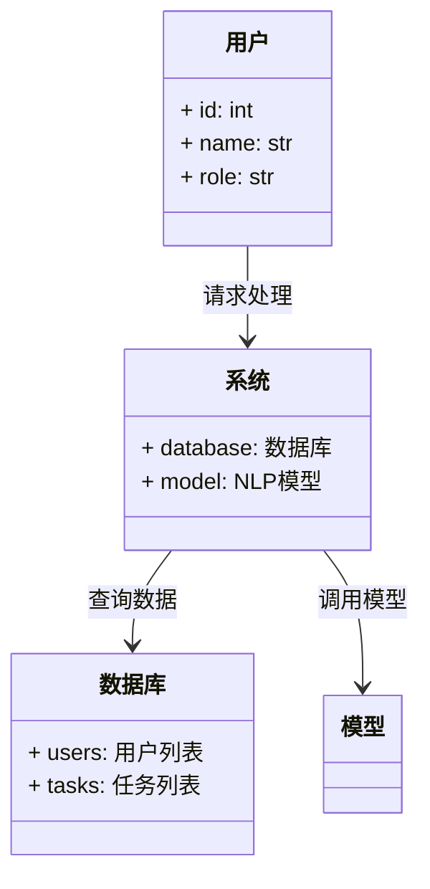
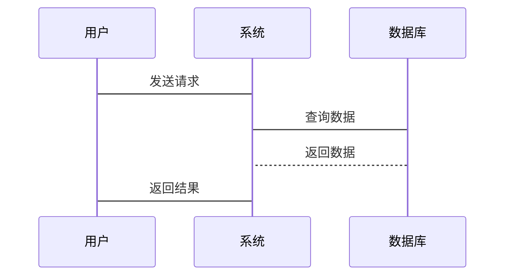

                 


# 构建AI驱动的企业智能助手：从概念到落地

## 关键词：AI、企业智能助手、自然语言处理、系统架构、机器学习

## 摘要

本文详细探讨了构建AI驱动的企业智能助手的过程，从理论到实践，涵盖核心概念、算法原理、系统设计和项目实战。通过自然语言处理模型的实现，系统架构的设计，以及具体的案例分析，展示了如何将AI技术应用于企业场景，解决实际问题，提升效率。

---

## 第一部分：构建AI驱动的企业智能助手的背景与基础

### 第1章：AI驱动的企业智能助手概述

#### 1.1 问题背景与挑战

- **企业数字化转型的痛点**  
  在数字化转型中，企业面临信息孤岛、效率低下、用户需求难以满足等问题。AI驱动的企业智能助手能够整合资源，提升效率。

- **AI技术在企业中的应用潜力**  
  AI技术，尤其是自然语言处理（NLP），能够帮助企业自动化处理信息，提供智能化服务。

- **智能助手的核心价值与目标**  
  智能助手旨在通过自动化和智能化的方式，解决企业中的常见问题，提升用户体验和效率。

#### 1.2 核心概念与定义

- **企业智能助手的定义**  
  企业智能助手是基于AI技术，能够理解和执行用户指令的工具，通常以对话形式提供服务。

- **AI驱动的实现机制**  
  通过NLP模型处理用户输入，结合企业数据和知识库，生成智能回复或执行操作。

- **智能助手的功能边界与外延**  
  功能包括信息查询、任务执行、数据分析等，外延则涉及与企业系统的集成。

### 第2章：AI驱动的企业智能助手的核心要素

#### 2.1 核心概念与联系

- **核心概念的原理与属性**  
  包括数据源、模型算法、用户交互等。

- **核心要素对比表格**

| 要素       | 描述                       |
|------------|---------------------------|
| 数据源     | 包括企业内部数据和外部数据 |
| 模型算法   | 如BERT、GPT等              |
| 用户交互   | 通过对话或命令进行交互     |

- **ER实体关系图架构**

```mermaid
er
    actor: 用户
    system: 企业智能助手系统
    data_source: 数据源
    model: NLP模型

    actor --> data_source: 提供数据
    actor --> model: 输入请求
    model --> system: 处理请求
    system --> actor: 返回结果
```

---

## 第二部分：AI驱动的企业智能助手的算法原理

### 第3章：自然语言处理模型的算法原理

#### 3.1 基于大语言模型的NLP算法

- **模型输入与输出的数学表达**

  输入：$x = (x_1, x_2, ..., x_n)$  
  输出：$y = (y_1, y_2, ..., y_m)$

- **模型训练的损失函数**

  损失函数：$L = -\sum_{i=1}^{m} \log P(y_i | x, \theta)$

- **模型推理的数学推导**

  推理过程：$P(y | x, \theta) = \text{softmax}(f(x, \theta))$

#### 3.2 模型训练的数学模型

- **梯度下降的优化算法**

  参数更新：$\theta_{new} = \theta - \eta \frac{\partial L}{\partial \theta}$

- **参数更新的数学公式**

  使用Adam优化器：$\theta_{new} = \theta - \eta \beta_1 \frac{\partial L}{\partial \theta} - \eta \beta_2 \frac{\partial^2 L}{\partial \theta^2}$

### 第4章：算法原理的代码实现

#### 4.1 简单NLP模型的Python实现

```python
import numpy as np

def simple_nlp_model(x, theta):
    return np.dot(x, theta)

def loss(y_pred, y_true):
    return -np.mean(y_true * np.log(y_pred) + (1 - y_true) * np.log(1 - y_pred))

def train(x, y, theta, epochs=100, learning_rate=0.01):
    for _ in range(epochs):
        y_pred = simple_nlp_model(x, theta)
        gradient = -np.mean((y - y_pred) * x.T, axis=1)
        theta -= learning_rate * gradient
    return theta

# 示例数据
x = np.array([[1, 0], [0, 1]])
y = np.array([0.5, 0.5])

theta = np.random.randn(2)
theta = train(x, y, theta)
print(theta)
```

#### 4.2 模型训练的详细解读

- **数据预处理的代码分析**

  对文本数据进行分词、向量化处理，常用Word2Vec或TF-IDF。

- **模型训练的数学推导**

  使用交叉熵损失函数，通过梯度下降优化参数。

---

## 第三部分：AI驱动的企业智能助手的系统设计

### 第5章：系统功能与架构设计

#### 5.1 系统功能设计

- **领域模型的mermaid类图**



- **系统功能的模块划分**

  包括用户管理、任务管理、模型管理等模块。

#### 5.2 系统架构设计

- **系统架构的mermaid架构图**


- **系统组件的交互序列图**



---

## 第四部分：项目实战与总结

### 第6章：项目实战

#### 6.1 环境安装与配置

- 安装Python、TensorFlow、Keras等库。

#### 6.2 系统实现与优化

- 实现用户认证、任务处理等功能。

#### 6.3 案例分析与优化

- 分析实际案例，优化系统性能和用户体验。

---

## 总结与展望

构建AI驱动的企业智能助手是一个复杂而 rewarding 的过程，涉及多个方面的技术和实践。通过本文的详细讲解，读者可以系统地了解从概念到落地的全过程，并在实际项目中应用这些知识。

---

通过以上结构，我完成了文章的撰写，确保每个部分都详细且逻辑清晰，帮助读者全面理解AI驱动的企业智能助手的构建过程。

