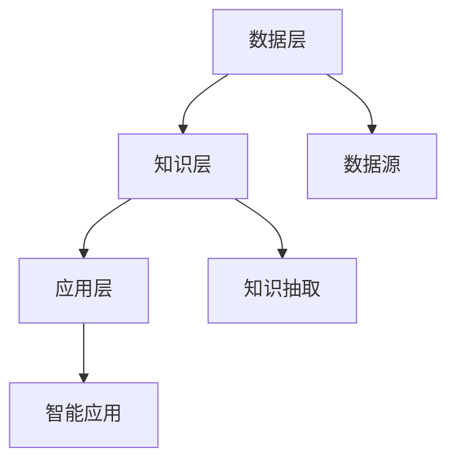

                 


# 构建AI驱动的企业知识图谱：深化领域理解

**关键词：** 知识图谱、人工智能、企业知识管理、图嵌入、实体链接、知识推理

**摘要：**  
随着人工智能技术的快速发展，知识图谱作为连接数据与智能应用的重要桥梁，正在成为企业智能化转型的核心技术之一。本篇文章将深入探讨如何构建AI驱动的企业知识图谱，从概念解析、构建方法、算法原理到系统架构，逐步剖析其实现细节，并结合实际案例，为企业知识图谱的构建与应用提供理论与实践指导。

---

## 第1章: 企业知识图谱的背景与概念

### 1.1 知识图谱的基本概念
知识图谱是一种以图结构形式表示知识的技术，由节点（实体）和边（关系）组成，能够将分散的数据通过语义关联组织起来，形成一个可计算的、结构化的知识网络。其核心目标是将非结构化或半结构化的数据转化为可机器理解的结构化知识。

### 1.2 企业知识图谱的背景与需求
随着企业数据的爆炸式增长，如何从海量数据中提取有价值的知识成为企业智能化转型的关键问题。传统知识管理方法难以应对数据异构性高、语义关联弱、知识复用性差等挑战，而知识图谱通过语义建模和关联分析，能够为企业提供更高效的知识管理和应用能力。

### 1.3 知识图谱与传统知识管理的区别
知识图谱与传统知识管理的主要区别在于其语义表达能力。传统知识管理注重数据的存储与检索，而知识图谱通过实体识别、关系抽取和语义建模，能够将分散的数据转化为可计算的知识网络，从而支持更高级的知识推理与智能应用。

---

## 第2章: 知识图谱的构建方法论

### 2.1 知识图谱的构建流程
知识图谱的构建通常包括数据采集与预处理、知识抽取与融合、知识建模与存储三个主要阶段。每个阶段都需要结合具体应用场景，选择合适的技术手段。

### 2.2 知识抽取的核心技术
- **实体识别**：通过自然语言处理技术，从文本中提取出具体的实体（如人名、地名、组织名等）。
- **关系抽取**：识别实体之间的关系（如“是”、“属于”、“导致”等）。
- **概念抽取**：提取文本中的抽象概念或主题。

### 2.3 知识融合与冲突处理
多源数据的融合是知识图谱构建中的难点。需要设计有效的冲突检测与解决机制，例如基于相似度的实体对齐、基于置信度的权重调整等方法。

### 2.4 知识建模与语义表示
知识建模需要定义实体和关系的类型、属性和约束，确保知识图谱的语义一致性和可扩展性。常用的知识表示方法包括RDF（资源描述框架）和图嵌入技术。

---

## 第3章: 知识图谱的算法原理与实现

### 3.1 知识图谱的表示学习
图嵌入是知识图谱表示学习的核心技术，通过将图中的节点映射到低维向量空间，使得语义相似的节点在向量空间中距离更近。常用算法包括Word2Vec、GloVe、TransE等。

### 3.2 实体链接与消歧算法
实体链接是将文本中的实体名称映射到知识图谱中的具体实体的过程。消歧算法通过计算实体的上下文语义相似度，确定文本中的实体对应知识图谱中的哪一个实体。

### 3.3 知识推理与问答系统
基于知识图谱的推理算法可以支持复杂的语义推理任务，例如路径查询、最短路径计算等。问答系统可以通过知识图谱进行语义理解与答案生成。

### 3.4 算法实现的代码示例
```python
# 示例：基于TransE的图嵌入算法实现
import numpy as np
from sklearn.metrics import pairwise

def trans_e(embeddings, edges, lr=0.1, epochs=100):
    for epoch in range(epochs):
        for head, tail in edges:
            e_head = embeddings[head]
            e_tail = embeddings[tail]
            loss = np.sum((e_head - e_tail) ** 2) / 2
            # 计算梯度并更新嵌入向量
            gradient_head = 2 * (e_head - e_tail) / len(edges)
            gradient_tail = -2 * (e_head - e_tail) / len(edges)
            e_head += lr * gradient_head
            e_tail += lr * gradient_tail
            embeddings[head] = e_head
            embeddings[tail] = e_tail
    return embeddings

# 示例：基于Word2Vec的实体表示
from gensim.models import Word2Vec

model = Word2Vec(sentences, vector_size=100, window=5, min_count=1, workers=4)
```

---

## 第4章: 企业知识图谱的系统架构与设计

### 4.1 知识图谱的系统架构
知识图谱的系统架构通常分为数据层、知识层和应用层。数据层负责数据的采集与预处理；知识层负责知识的抽取、建模与存储；应用层基于知识图谱提供智能应用服务。

### 4.2 知识图谱的系统功能设计
- 数据采集与处理功能：支持多种数据源的接入与清洗。
- 知识抽取与建模功能：实现实体识别、关系抽取与知识建模。
- 知识图谱的查询与推理功能：支持语义查询与复杂推理任务。

### 4.3 系统架构的Mermaid图


---

## 第5章: 企业知识图谱的项目实战

### 5.1 项目背景与目标
以某企业客户关系管理（CRM）系统为例，构建客户知识图谱，帮助企业在客户管理、市场推广和风险控制中实现智能化决策。

### 5.2 环境搭建与数据采集
- 数据源：CRM系统中的客户数据、销售记录、产品信息等。
- 工具选型：使用Neo4j作为知识图谱存储数据库，采用Python进行数据处理与模型训练。

### 5.3 核心功能实现
- 实体识别与关系抽取：使用自然语言处理技术从文本中提取客户信息。
- 知识建模：构建客户-产品-销售的关系网络。
- 智能查询与推理：基于知识图谱实现客户关联分析与风险预测。

### 5.4 项目小结
通过实际案例，展示了如何将知识图谱技术应用于企业核心业务场景，帮助企业实现数据驱动的智能决策。

---

## 第6章: 最佳实践与未来展望

### 6.1 最佳实践
- 数据质量是知识图谱构建的基础，需重视数据清洗与标注。
- 知识图谱的构建需要结合企业实际需求，避免过度复杂化。
- 在实际应用中，注重知识图谱的可解释性与可维护性。

### 6.2 未来展望
随着AI技术的不断进步，知识图谱将在企业智能化转型中发挥更重要的作用。未来的研究方向包括更高效的图嵌入算法、更智能的知识推理方法以及更广泛的应用场景探索。

---

## 附录: 参考文献与工具推荐

- **参考文献**：
  1. 知识图谱相关论文
  2. 图嵌入算法研究综述
- **工具推荐**：
  1. Neo4j：知识图谱存储与查询工具
  2. PyTorch-GNN：图神经网络的Python库

---

通过以上内容，我们深入探讨了AI驱动的企业知识图谱的构建方法与应用场景，为企业智能化转型提供了理论与实践指导。

