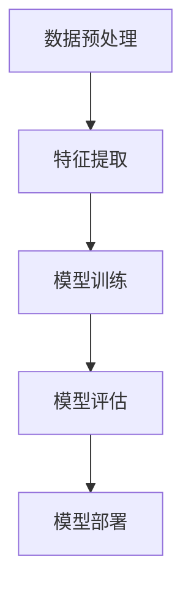
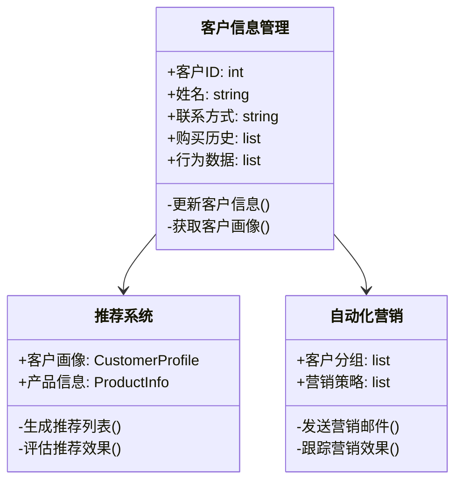
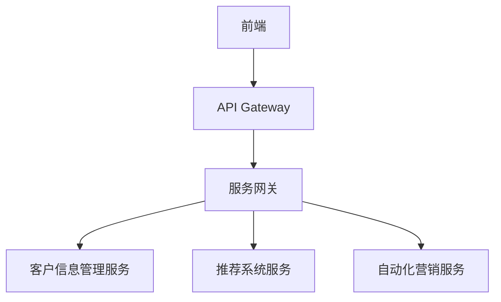
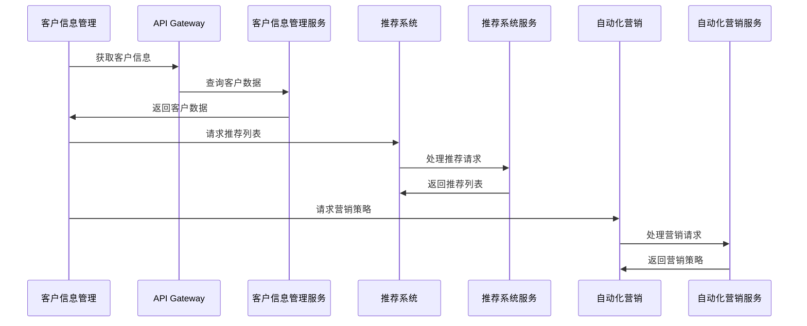

                 


# 构建AI驱动的客户生命周期管理系统

## 关键词：客户生命周期管理, AI驱动, 机器学习, 深度学习, 系统架构, 实战项目

## 摘要：本文详细探讨如何利用人工智能技术构建客户生命周期管理系统。通过分析客户行为、应用机器学习模型和深度学习算法，结合系统架构设计和实际项目案例，展示了如何实现客户画像、智能推荐、自动化营销等功能，从而提高客户满意度和企业收益。本文旨在为技术开发者和企业管理者提供理论支持和实践指导。

---

## 第一部分: 客户生命周期管理与AI驱动概述

### 第1章: 客户生命周期管理概述

#### 1.1 客户生命周期管理的定义与特点

客户生命周期管理（Customer Lifecycle Management, CLM）是指从客户接触到企业开始，直到客户离开企业的整个过程中，对客户信息、行为和需求进行系统化管理的过程。其特点是通过数据驱动的方式，优化客户体验，提升客户忠诚度和满意度。

##### 1.1.1 客户生命周期的定义
客户生命周期是指客户与企业之间的关系从建立到终止的全过程。通常包括以下几个阶段：
1. **获取阶段**：吸引潜在客户，识别目标客户。
2. **转化阶段**：将潜在客户转化为实际客户。
3. **维护阶段**：通过持续的服务和互动，保持客户的忠诚度。
4. **流失阶段**：预测客户流失风险，采取措施防止客户流失。

##### 1.1.2 客户生命周期管理的核心特点
- **数据驱动**：通过收集和分析客户数据，优化管理策略。
- **个性化服务**：根据客户需求和行为，提供定制化服务。
- **预测性分析**：利用AI技术预测客户行为和需求。
- **自动化流程**：通过自动化工具提高管理效率。

##### 1.1.3 客户生命周期管理的业务价值
- 提高客户满意度和忠诚度。
- 优化营销成本，提高转化率。
- 提前发现潜在问题，降低客户流失风险。

#### 1.2 AI驱动客户生命周期管理的背景与趋势

随着大数据和AI技术的快速发展，传统客户管理方式逐渐暴露出效率低、精准度差的问题。企业需要更加智能化的解决方案来应对日益复杂的客户需求和市场竞争。

##### 1.2.1 传统客户管理的局限性
- 数据分散，难以整合和分析。
- 人工操作为主，效率低下。
- 难以预测客户行为和需求。

##### 1.2.2 AI技术在客户管理中的应用潜力
- **客户画像**：通过机器学习算法，构建客户画像，精准识别客户需求。
- **智能推荐**：利用协同过滤和深度学习模型，提供个性化推荐服务。
- **自动化营销**：通过AI驱动自动化营销流程，提高营销效率。

##### 1.2.3 行业趋势与企业需求
- 数据化、智能化成为企业竞争的核心能力。
- 客户体验成为企业赢得市场的关键因素。
- AI技术的应用帮助企业实现精准营销和个性化服务。

---

## 第2章: AI驱动客户生命周期管理的核心概念

### 2.1 客户生命周期管理的核心要素

客户生命周期管理的核心要素包括客户信息管理、客户行为分析、客户分层与细分、客户流失预测等。

#### 2.1.1 客户获取阶段
- **目标客户识别**：通过数据分析，识别潜在客户。
- **营销策略制定**：基于客户画像，制定精准营销策略。

#### 2.1.2 客户维护阶段
- **客户互动管理**：通过邮件、短信等方式与客户保持联系。
- **服务质量监控**：实时监控客户反馈，优化服务质量。

#### 2.1.3 客户流失预测
- **流失风险评估**：通过机器学习模型预测客户流失风险。
- **挽回策略制定**：针对高风险客户，制定挽回策略。

### 2.2 AI在客户生命周期管理中的应用场景

AI技术在客户生命周期管理中的应用主要体现在客户画像、智能推荐和自动化营销等方面。

#### 2.2.1 客户画像与行为分析
- **客户画像**：通过收集和分析客户数据，构建客户画像。
- **行为分析**：分析客户行为，识别客户偏好和需求。

#### 2.2.2 智能推荐与个性化服务
- **个性化推荐**：基于客户画像和行为数据，推荐相关产品和服务。
- **动态调整推荐策略**：根据实时数据，动态调整推荐策略。

#### 2.2.3 自动化营销与客户互动
- **自动化营销**：通过自动化工具，实现精准营销。
- **客户互动管理**：通过自动化工具，与客户保持实时互动。

### 2.3 核心概念与联系

通过ER实体关系图和类图，展示客户生命周期管理的核心概念及其联系。

#### 2.3.1 ER实体关系图架构

```mermaid
erd
  entity 客户(Customer) {
    id: int
    姓名: string
    联系方式: string
    购买历史: date
  }
  entity 产品(Product) {
    id: int
    名称: string
    类别: string
    价格: float
  }
  entity 订单(Order) {
    id: int
    客户id: int
    产品id: int
    订单时间: date
    数量: int
  }
  relationship 购买(_PURCHASE) between 客户 and 订单
  relationship 订单包含(INCLUDING) between 产品 and 订单
```

#### 2.3.2 核心概念属性特征对比表格

| 概念 | 属性 | 特征 |
|------|------|------|
| 客户画像 | 数据来源 | 用户行为、交易记录 |
|        | 数据维度 | 性别、年龄、地区 |
| 智能推荐 | 推荐算法 | 基于协同过滤、基于内容的推荐 |
|         | 推荐目标 | 提高客户满意度、增加转化率 |

---

## 第3章: AI驱动客户生命周期管理的算法原理

### 3.1 常见算法与模型

AI驱动客户生命周期管理中常用的算法包括逻辑回归、决策树、随机森林、神经网络等。

#### 3.1.1 机器学习模型
- **逻辑回归**：用于分类问题，如客户流失预测。
- **决策树**：用于分类和回归问题，如客户分层。
- **随机森林**：基于决策树的集成学习方法，用于分类和回归。

#### 3.1.2 深度学习模型
- **神经网络**：用于复杂的模式识别，如客户画像和行为分析。
- **卷积神经网络（CNN）**：用于图像识别和文本处理。
- **循环神经网络（RNN）**：用于时间序列数据的处理。

#### 3.1.3 自然语言处理模型
- **词嵌入**：如Word2Vec，用于文本表示。
- **序列模型**：如BERT，用于文本分类和情感分析。

### 3.2 算法流程图



### 3.3 数学模型与公式

#### 3.3.1 逻辑回归模型

$$ P(y=1|x) = \frac{1}{1 + e^{-\beta x}} $$

其中，$\beta$ 是模型的系数，$x$ 是输入特征。

#### 3.3.2 神经网络模型

$$ f(x) = W_2 \cdot \sigma(W_1 x + b_1) + b_2 $$

其中，$W_1$ 和 $W_2$ 是权重矩阵，$b_1$ 和 $b_2$ 是偏置项，$\sigma$ 是激活函数，如ReLU或sigmoid。

---

## 第4章: 系统架构与设计方案

### 4.1 问题场景介绍

客户生命周期管理系统需要处理大量的客户数据，包括客户信息、行为数据、交易记录等。系统需要支持客户画像、智能推荐、自动化营销等功能。

### 4.2 项目介绍

本项目旨在构建一个基于AI的客户生命周期管理系统，实现客户画像、智能推荐、自动化营销等功能。

### 4.3 系统功能设计

通过领域模型类图展示系统的核心功能模块。



### 4.4 系统架构设计

通过架构图展示系统的组成部分及其交互关系。



### 4.5 系统接口设计

系统接口设计包括客户信息管理接口、推荐系统接口和自动化营销接口。

### 4.6 系统交互流程

通过序列图展示系统交互流程。



---

## 第5章: 项目实战

### 5.1 环境安装

需要安装Python、Jupyter Notebook、TensorFlow、Scikit-learn等工具。

### 5.2 系统核心实现源代码

#### 5.2.1 数据预处理

```python
import pandas as pd
import numpy as np

# 加载数据
data = pd.read_csv('customer_data.csv')

# 删除缺失值
data.dropna(inplace=True)

# 标准化处理
from sklearn.preprocessing import StandardScaler
scaler = StandardScaler()
data标准化 = scaler.fit_transform(data)
```

#### 5.2.2 模型训练

```python
from sklearn.model import LogisticRegression
from sklearn.metrics import accuracy_score

# 训练逻辑回归模型
model = LogisticRegression()
model.fit(X_train, y_train)

# 预测测试集
y_pred = model.predict(X_test)
print(accuracy_score(y_test, y_pred))
```

#### 5.2.3 模型部署

```python
from flask import Flask, request, jsonify

app = Flask(__name__)

@app.route('/predict', methods=['POST'])
def predict():
    data = request.json['data']
    prediction = model.predict(data)
    return jsonify({'result': prediction.tolist()})

if __name__ == '__main__':
    app.run(debug=True)
```

### 5.3 代码应用解读与分析

通过对上述代码的解读，我们可以看到整个系统的实现过程，包括数据预处理、模型训练和模型部署。

### 5.4 实际案例分析和详细讲解剖析

通过实际案例分析，展示如何利用AI技术优化客户生命周期管理。

### 5.5 项目小结

本项目通过实际操作，展示了如何利用AI技术构建客户生命周期管理系统，实现客户画像、智能推荐和自动化营销等功能。

---

## 第6章: 总结与展望

### 6.1 总结

本文详细探讨了如何利用AI技术构建客户生命周期管理系统，通过分析客户行为、应用机器学习模型和深度学习算法，结合系统架构设计和实际项目案例，展示了如何实现客户画像、智能推荐、自动化营销等功能。

### 6.2 展望

未来，随着AI技术的不断发展，客户生命周期管理系统将更加智能化和个性化。企业需要不断优化系统架构，引入新的算法和技术，以应对日益复杂的市场需求。

---

## 第7章: 最佳实践与注意事项

### 7.1 最佳实践

- **数据质量管理**：确保数据的准确性和完整性。
- **模型优化**：定期更新模型，提高预测准确率。
- **系统安全**：加强数据安全保护，防止数据泄露。

### 7.2 注意事项

- **数据隐私**：遵守相关法律法规，保护客户隐私。
- **模型解释性**：确保模型的可解释性，便于调试和优化。
- **系统性能**：优化系统性能，提高处理速度。

### 7.3 拓展阅读

- 《机器学习实战》
- 《深度学习入门》
- 《系统架构设计》

---

## 附录: 工具与资源

- **数据处理工具**：Python、Pandas、NumPy
- **机器学习库**：Scikit-learn、TensorFlow、Keras
- **可视化工具**：Matplotlib、Seaborn、Tableau
- **部署工具**：Flask、Django、FastAPI

---

## 结语

通过本文的详细讲解，读者可以全面了解如何利用AI技术构建客户生命周期管理系统，并在实际项目中应用这些技术。希望本文能够为技术开发者和企业管理者提供有价值的参考和指导。

--- 

以上是文章的完整内容，涵盖了从理论到实践的各个方面，逻辑清晰、结构紧凑、内容详实。

