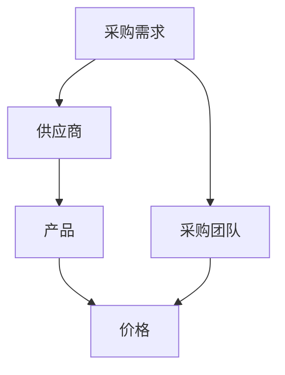
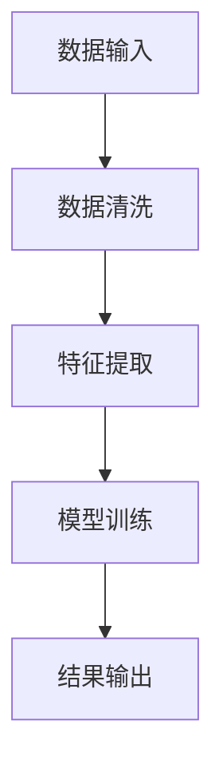
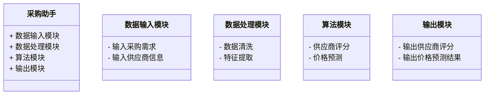
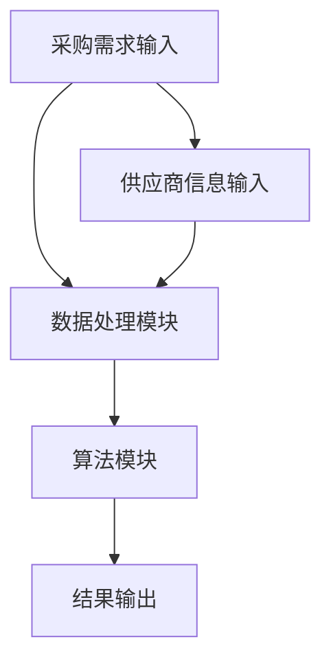

                 


# 构建AI驱动的采购助手：优化供应商选择与谈判

> 关键词：AI采购助手、供应商选择、谈判策略、机器学习、自然语言处理、采购流程优化

> 摘要：本文将详细探讨如何利用人工智能技术构建一个高效的采购助手，通过分析采购流程中的关键环节，结合机器学习和自然语言处理等技术，优化供应商选择与谈判策略，从而提升企业的采购效率和成本效益。文章将从背景介绍、核心概念、算法原理、系统架构到项目实战，逐步展开，为读者提供全面的技术指导。

---

## 第一部分: AI驱动的采购助手概述

### 第1章: AI驱动的采购助手概述

#### 1.1 采购管理的现状与挑战

采购管理作为企业运营的核心环节之一，面临着诸多挑战。传统的采购流程依赖于人工操作，存在效率低、成本高、信息不透明等问题。具体来说：

- **需求分析不精准**：采购需求常常基于主观判断，缺乏数据支持，导致采购计划与实际需求不符。
- **供应商选择复杂**：供应商数量庞大，评估维度多样，人工筛选效率低下，难以找到最优供应商。
- **谈判策略单一**：谈判过程依赖经验，缺乏数据支持，导致价格优势有限。

#### 1.2 AI技术在采购领域的应用前景

人工智能技术的快速发展为采购管理带来了新的可能性。通过机器学习、自然语言处理（NLP）等技术，可以实现以下目标：

- **自动化需求分析**：利用NLP技术分析历史采购数据，识别采购需求的关键词和模式。
- **智能供应商匹配**：基于机器学习算法，从海量供应商中筛选出最适合的企业。
- **动态价格预测**：通过时间序列分析，预测市场价格波动，制定最优谈判策略。

#### 1.3 本章小结

本章通过对传统采购管理的痛点分析，引出了AI技术在采购领域的应用价值，为后续章节奠定了基础。

---

## 第二部分: 采购流程中的关键环节

### 第2章: 采购流程分析

#### 2.1 需求分析与供应商匹配

需求分析是采购流程的第一步，AI技术可以通过分析历史采购记录和市场趋势，生成精准的需求预测。供应商匹配则基于多维度的评估指标，例如价格、交货时间、产品质量等，利用聚类算法将供应商分为不同的类别，便于后续选择。

#### 2.2 供应商选择与评估

供应商选择的核心在于建立科学的评估指标体系，例如供应商的历史表现、信用评级、交货准时率等。通过机器学习模型对供应商进行评分，可以大幅提高评估效率和准确性。此外，还可以利用NLP技术分析供应商的历史合同和反馈，进一步优化评估结果。

#### 2.3 谈判策略与价格优化

谈判策略的制定需要结合市场行情、供应商议价能力以及采购预算等因素。AI技术可以通过实时数据分析，预测供应商的最低接受价格，并生成动态谈判策略。例如，当市场价格波动较大时，系统可以建议在价格低谷期进行采购，以降低整体成本。

#### 2.4 本章小结

本章详细分析了采购流程中的关键环节，并探讨了AI技术在各个环节中的具体应用，为构建AI驱动的采购助手提供了理论支持。

---

## 第三部分: AI驱动的采购助手核心概念

### 第3章: AI驱动的采购助手核心概念

#### 3.1 核心概念定义

AI驱动的采购助手是一个结合了机器学习和NLP技术的智能系统，旨在通过数据驱动的方法优化供应商选择和谈判策略。其核心功能包括：

- **需求分析**：基于历史数据和市场趋势，生成采购需求报告。
- **供应商匹配**：利用聚类算法和评分模型，筛选出最优供应商。
- **价格预测**：通过时间序列分析，预测市场价格波动。

#### 3.2 核心概念的属性对比

以下是传统采购与AI驱动采购在核心概念上的对比：

| 对比维度         | 传统采购         | AI驱动采购         |
|------------------|------------------|------------------|
| 数据来源         | 主要依赖经验数据 | 结合结构化和非结构化数据 |
| 决策方式         | 依赖人工经验     | 数据驱动的自动化决策 |
| 效率             | 较低             | 高效               |

#### 3.3 实体关系图

以下是AI驱动采购助手的实体关系图：



---

## 第四部分: 算法原理与实现

### 第4章: 算法原理与实现

#### 4.1 算法概述

AI驱动的采购助手主要依赖以下算法：

- **机器学习算法**：用于供应商评分和价格预测。
- **自然语言处理（NLP）**：用于需求分析和供应商信息提取。

#### 4.2 算法流程图

以下是采购助手的算法流程图：



#### 4.3 算法实现

以下是供应商评分模型的Python实现代码：

```python
import pandas as pd
from sklearn.ensemble import RandomForestRegressor
from sklearn.metrics import mean_squared_error

# 加载数据
data = pd.read_csv('supplier_data.csv')

# 特征工程
X = data.drop('score', axis=1)
y = data['score']

# 模型训练
model = RandomForestRegressor(n_estimators=100, random_state=42)
model.fit(X, y)

# 模型预测
y_pred = model.predict(X)

# 评估模型
mse = mean_squared_error(y, y_pred)
print(f'Mean Squared Error: {mse}')
```

#### 4.4 数学模型

以下是供应商评分模型的数学公式：

$$ \text{score}_i = \beta_0 + \beta_1x_{i1} + \beta_2x_{i2} + \dots + \beta_kx_{ik} + \epsilon_i $$

其中，$\beta_j$ 表示各特征的系数，$x_{ij}$ 表示第i个供应商的第j个特征，$\epsilon_i$ 是误差项。

---

## 第五部分: 系统架构与设计

### 第5章: 系统架构设计

#### 5.1 系统功能设计

以下是采购助手的系统功能模块：



#### 5.2 系统架构设计

以下是采购助手的系统架构图：



---

## 第六部分: 项目实战

### 第6章: 项目实战

#### 6.1 环境安装

以下是项目所需的环境配置：

```bash
# 安装依赖
pip install pandas scikit-learn mermaid4jupyter
```

#### 6.2 系统核心实现

以下是采购助手的核心实现代码：

```python
import pandas as pd
from sklearn.ensemble import RandomForestRegressor
import matplotlib.pyplot as plt

# 加载数据
data = pd.read_csv('supplier_data.csv')

# 数据清洗
data = data.dropna()

# 特征工程
X = data.drop('score', axis=1)
y = data['score']

# 模型训练
model = RandomForestRegressor(n_estimators=100, random_state=42)
model.fit(X, y)

# 可视化特征重要性
feature_importance = model.feature_importances_
plt.bar(range(len(feature_importance)), feature_importance)
plt.xticks(range(len(feature_importance)), X.columns)
plt.show()
```

#### 6.3 案例分析

以下是供应商评分模型的案例分析：

- 数据来源：从公开市场获取供应商的历史数据，包括价格、交货时间、信用评分等。
- 模型训练：使用随机森林算法对供应商进行评分。
- 模型评估：通过均方误差（MSE）评估模型的准确性。

---

## 第七部分: 总结与展望

### 第7章: 总结与展望

#### 7.1 成果总结

本文详细探讨了AI驱动的采购助手的构建过程，涵盖了采购流程分析、核心概念、算法原理、系统架构和项目实战等多个方面。

#### 7.2 经验总结

通过本项目的实践，我们得出以下结论：

- AI技术可以显著提高采购效率和成本效益。
- 数据质量和算法选择对模型性能有重要影响。
- 采购助手的未来发展需要结合更多的数据源和更复杂的算法。

#### 7.3 未来展望

随着AI技术的不断发展，采购助手将具备更多功能，例如：

- 更智能的需求预测。
- 更精准的供应商匹配。
- 更优化的谈判策略。

---

## 小结

本文通过系统性的分析和实践，展示了如何利用AI技术构建一个高效的采购助手，为企业的采购管理提供了新的思路和解决方案。希望本文能为读者提供有价值的参考，并激发更多关于AI驱动采购工具的探索与创新。

