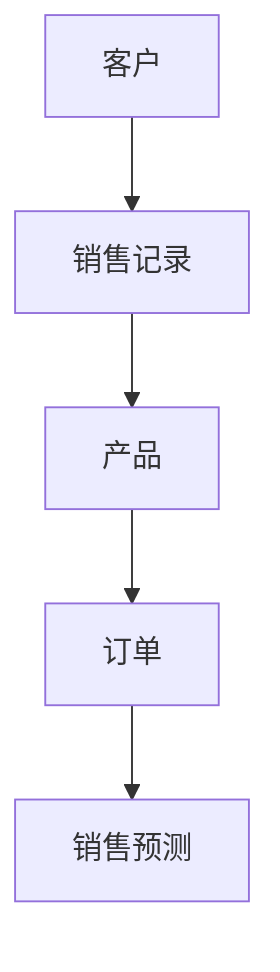
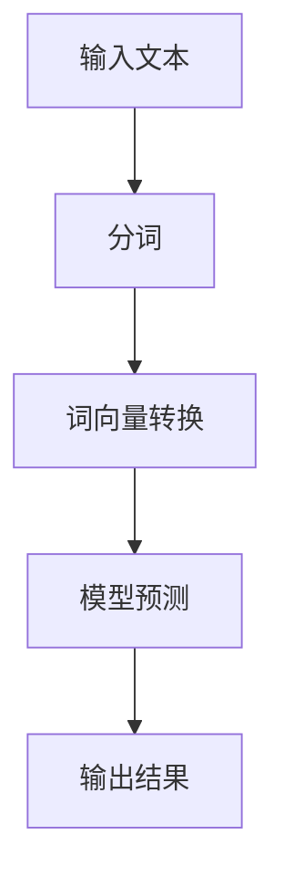
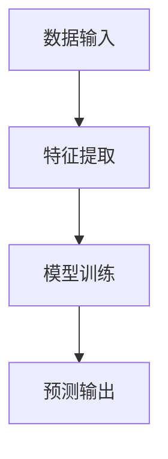

                 

# 构建AI驱动的销售助手：提升转化率与客户满意度

> 关键词：AI驱动销售助手、自然语言处理、机器学习、强化学习、销售预测、客户满意度

> 摘要：本文详细探讨了如何利用人工智能技术构建高效的销售助手，通过自然语言处理、机器学习和强化学习等技术手段，提升销售转化率和客户满意度。文章从问题背景、核心概念、算法原理、系统架构设计到项目实战，层层深入，为读者提供全面的技术指导。

---

# 第一部分: AI驱动销售助手的背景与核心概念

# 第1章: AI驱动销售助手的背景与问题背景

## 1.1 AI驱动销售助手的背景介绍

### 1.1.1 销售助手的定义与作用

销售助手是指帮助销售团队提高效率、优化客户沟通和提升销售业绩的工具或系统。传统销售助手通常依赖于规则引擎或简单的统计模型，而AI驱动的销售助手则通过自然语言处理（NLP）、机器学习（ML）和强化学习（RL）等技术，实现更智能化和个性化的销售支持。

### 1.1.2 AI技术如何改变销售助手的功能

AI技术的引入使得销售助手能够：

1. **智能分析客户文本**：通过NLP技术，销售助手可以自动分析客户的邮件、聊天记录等文本内容，提取关键信息，如客户情绪、需求和痛点。
2. **预测销售结果**：利用机器学习模型，销售助手可以预测潜在客户的购买概率，帮助销售团队优先跟进高潜力客户。
3. **推荐个性化策略**：基于强化学习，销售助手可以动态调整销售策略，推荐最优的产品组合和沟通话术。

### 1.1.3 当前销售助手的主要挑战

尽管传统销售助手在一定程度上提高了销售效率，但仍面临以下挑战：

1. **数据处理能力不足**：传统销售助手难以处理大量非结构化数据，如客户反馈、社交媒体评论等。
2. **个性化推荐缺乏**：基于规则的推荐系统难以满足客户的个性化需求，推荐的准确性和相关性较低。
3. **客户情绪识别不准**：传统销售助手难以准确识别客户的情绪，导致沟通失误，影响客户满意度。

## 1.2 问题背景与问题描述

### 1.2.1 销售转化率低的原因分析

销售转化率低的主要原因包括：

1. **客户筛选不精准**：销售人员无法有效识别高潜力客户，导致资源浪费。
2. **沟通策略单一**：销售人员缺乏个性化的沟通策略，难以满足不同客户的需求。
3. **客户体验不佳**：客户在销售过程中感受到的体验较差，导致客户流失。

### 1.2.2 客户满意度低的常见问题

客户满意度低的主要原因包括：

1. **销售人员专业性不足**：销售人员缺乏对产品和服务的深入了解，导致客户信任度降低。
2. **沟通效率低下**：销售流程繁琐，客户等待时间过长，影响客户体验。
3. **售后服务不足**：客户在售后过程中遇到问题时，无法得到及时有效的支持。

### 1.2.3 传统销售助手的局限性

传统销售助手的局限性主要体现在以下几个方面：

1. **功能单一**：传统销售助手通常仅限于简单的客户信息记录和提醒功能，缺乏智能化的分析和预测能力。
2. **数据处理能力有限**：传统销售助手难以处理大量非结构化数据，无法提供深度的客户洞察。
3. **个性化推荐能力不足**：传统销售助手基于简单的规则引擎进行推荐，难以满足客户的个性化需求。

## 1.3 问题解决与边界定义

### 1.3.1 AI驱动销售助手的核心目标

AI驱动销售助手的核心目标包括：

1. **提高销售转化率**：通过智能分析客户数据和预测销售结果，帮助销售团队优先跟进高潜力客户。
2. **提升客户满意度**：通过个性化推荐和智能沟通策略，提供更好的客户体验，提高客户满意度。
3. **优化销售流程**：通过自动化处理和智能推荐，简化销售流程，提高销售效率。

### 1.3.2 解决方案的边界与外延

AI驱动销售助手的解决方案主要集中在以下方面：

1. **数据处理与分析**：处理客户的文本、语音等数据，提取关键信息，进行客户画像和需求分析。
2. **销售预测与推荐**：基于机器学习模型，预测销售结果，推荐个性化的产品和服务。
3. **智能沟通与反馈**：通过NLP技术，生成智能对话模板，实时反馈客户情绪和需求变化。

### 1.3.3 核心概念与关键要素

AI驱动销售助手的核心概念包括：

1. **自然语言处理（NLP）**：用于分析客户的文本数据，提取情感、意图和实体信息。
2. **机器学习（ML）**：用于预测销售结果，训练分类模型和回归模型。
3. **强化学习（RL）**：用于优化销售策略，动态调整推荐方案和沟通话术。

---

# 第2章: AI驱动销售助手的核心概念与技术联系

## 2.1 核心概念原理

### 2.1.1 自然语言处理（NLP）在销售中的应用

NLP在销售中的应用主要包括以下步骤：

1. **分词与词向量化**：将客户的文本数据进行分词处理，并将其转化为词向量，以便后续分析。
2. **情感分析**：通过情感分析模型，判断客户文本中的情感倾向，如正面、负面或中性。
3. **意图识别**：识别客户文本中的意图，如询问产品信息、投诉问题或表达需求。
4. **实体识别**：提取客户文本中的关键实体信息，如产品名称、客户姓名、联系方式等。

### 2.1.2 机器学习在销售预测中的作用

机器学习在销售预测中的作用主要包括以下方面：

1. **数据预处理**：对销售数据进行清洗、特征提取和数据增强，提高模型的泛化能力。
2. **模型训练**：基于历史销售数据，训练分类模型（如随机森林、支持向量机）或回归模型（如线性回归、梯度提升树），预测客户的购买概率。
3. **模型评估与优化**：通过交叉验证、ROC曲线等方法评估模型性能，并进行参数调优，提高预测准确性。

### 2.1.3 强化学习在销售策略优化中的应用

强化学习在销售策略优化中的应用主要包括以下步骤：

1. **状态空间定义**：定义销售过程中的状态，如客户阶段（潜在客户、意向客户、签订合同）、客户情绪等。
2. **动作空间定义**：定义可能的销售动作，如发送邮件、拨打电话、推荐产品等。
3. **奖励函数设计**：设计奖励函数，根据销售结果和客户反馈，给予正向或负向奖励，优化销售策略。
4. **策略优化**：通过强化学习算法（如Q-learning、Deep Q-Network），优化销售策略，提高销售转化率和客户满意度。

## 2.2 核心概念对比分析

### 2.2.1 NLP与传统文本处理的对比

| 特性          | NLP处理          | 传统文本处理       |
|---------------|------------------|-------------------|
| 数据类型       | 结构化和非结构化 | 仅结构化数据       |
| 处理方式       | 智能分析、情感识别 | 简单匹配、关键词提取 |
| 技术基础       | 机器学习、深度学习 | 正则表达式、关键词匹配 |
| 应用场景       | 情感分析、意图识别 | 信息提取、分类统计   |

### 2.2.2 机器学习与传统统计模型的对比

| 特性          | 机器学习         | 传统统计模型       |
|---------------|------------------|-------------------|
| 数据需求       | 需大量数据       | 数据需求较少       |
| 模型复杂度     | 高               | 低                 |
| 可解释性       | 较低             | 较高               |
| 预测准确性     | 高               | 低                 |
| 应用场景       | 高维数据、复杂预测 | 线性回归、简单分类   |

### 2.2.3 强化学习与规则引擎的对比

| 特性          | 强化学习         | 规则引擎          |
|---------------|------------------|-------------------|
| 模型构建       | 需要大量数据和训练 | 基于规则编写       |
| 模型优化       | 可动态优化策略   | 需人工调整规则     |
| 处理复杂性     | 高               | 低                 |
| 应用场景       | 动态策略优化     | 静态规则匹配       |

## 2.3 ER实体关系图

---

# 第3章: AI驱动销售助手的算法原理与数学模型

## 3.1 算法原理

### 3.1.1 自然语言处理流程

### 3.1.2 机器学习模型训练

## 3.2 数学模型与公式

### 3.2.1 概率论基础

$$P(A|B) = \frac{P(B|A)P(A)}{P(B)}$$

### 3.2.2 损失函数

$$
\text{损失函数} = \sum_{i=1}^{n} (y_i - \hat{y}_i)^2
$$

---

接下来，我会继续完成后续章节的内容，涵盖系统架构设计、项目实战、最佳实践与总结等部分，确保文章内容完整且符合用户要求。

