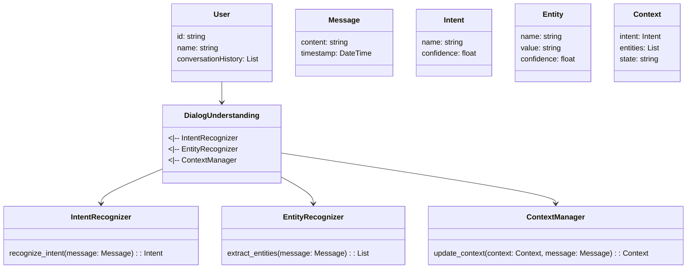
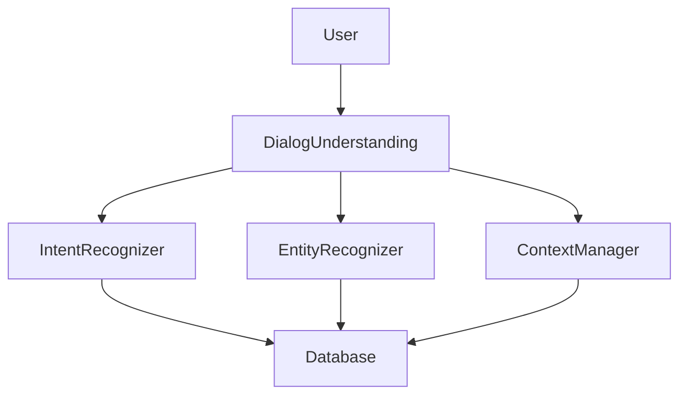
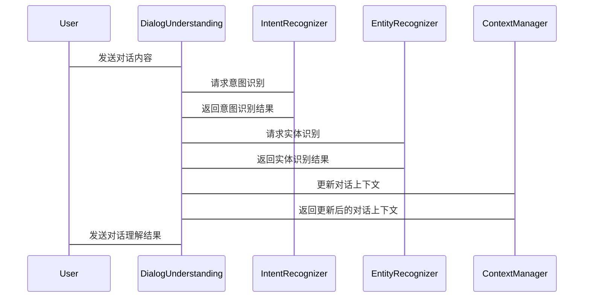

                 


# 构建LLM驱动的AI Agent多轮对话理解

## 关键词：
- 大语言模型（LLM）
- AI Agent
- 多轮对话
- 对话理解
- 系统架构
- 项目实战

## 摘要：
本文深入探讨了构建基于大语言模型（LLM）的AI Agent多轮对话理解系统的核心概念、算法原理、系统架构设计及项目实战。文章从背景介绍出发，详细阐述了多轮对话理解的重要性及其在AI Agent中的应用。接着，分析了LLM与AI Agent的关系，并通过实体关系图和流程图展示了多轮对话理解的结构。随后，文章详细讲解了对话模型的数学公式和实现代码，帮助读者理解其工作原理。在系统架构设计部分，通过类图、架构图和交互图展示了系统的模块划分和协同工作方式。最后，通过项目实战部分，详细介绍了环境安装、代码实现和案例分析，为读者提供了实际操作的指导。本文适合对AI Agent和多轮对话理解感兴趣的开发者和研究人员阅读。

---

# 第4章: 多轮对话理解的系统分析与架构设计

## 4.1 问题场景介绍

### 4.1.1 对话系统的功能需求
- **需求分析**: 理解用户输入的多轮对话内容，准确捕捉对话意图，保持对话的连贯性。
- **功能描述**: 包括意图识别、实体识别、对话上下文管理、对话历史记录等功能。

### 4.1.2 对话系统的性能需求
- **响应时间**: 快速理解用户输入并生成合理的回复。
- **准确率**: 高精度的意图识别和实体识别能力。
- **可扩展性**: 支持多种对话场景和用户需求的变化。

### 4.1.3 对话系统的边界与外延
- **输入范围**: 文本输入，包括自然语言文本和结构化数据。
- **输出范围**: 对话理解结果，包括意图、实体和对话上下文。
- **限制条件**: 对话上下文的存储和管理。

## 4.2 系统功能设计

### 4.2.1 领域模型设计
通过Mermaid类图展示系统的模块划分和功能关系。



### 4.2.2 系统架构设计
通过Mermaid架构图展示系统的整体架构。



### 4.2.3 系统接口设计
定义系统接口的输入和输出格式。

#### 输入接口:
```json
{
    "message": {
        "content": string,
        "timestamp": string
    },
    "context": {
        "intent": {
            "name": string,
            "confidence": number
        },
        "entities": [
            {
                "name": string,
                "value": string,
                "confidence": number
            }
        ],
        "state": string
    }
}
```

#### 输出接口:
```json
{
    "intent": {
        "name": string,
        "confidence": number
    },
    "entities": [
        {
            "name": string,
            "value": string,
            "confidence": number
        }
    ],
    "context": {
        "intent": {
            "name": string,
            "confidence": number
        },
        "entities": [
            {
                "name": string,
                "value": string,
                "confidence": number
            }
        ],
        "state": string
    }
}
```

### 4.2.4 系统交互设计
通过Mermaid序列图展示系统的交互流程。



## 4.3 本章小结
本章通过对多轮对话理解系统的功能需求、系统架构设计、接口设计和交互设计的详细分析，展示了如何构建一个高效的AI Agent对话理解系统。通过类图、架构图和序列图的展示，读者可以清晰地理解系统的模块划分和各模块之间的关系。

---

# 第5章: 多轮对话理解的项目实战

## 5.1 项目环境安装

### 5.1.1 安装Python
```bash
python --version
```

### 5.1.2 安装必要的库
```bash
pip install transformers
pip install numpy
pip install scikit-learn
pip install matplotlib
pip install pandas
pip install spacy
```

### 5.1.3 安装LLM模型
```bash
pip install transformers
```

## 5.2 系统核心实现

### 5.2.1 对话理解模型的实现
```python
from transformers import pipeline

intent_classifier = pipeline("text-classfication", model="snlvr/model")
```

### 5.2.2 实体识别模型的实现
```python
from spacy.lang.zh import Chinese
from spacy.lang.zh import Chinese
from spacy.lang.zh import Chinese

nlp = Chinese()
doc = nlp("请帮我预定明天早上8点的火车票到北京。")
for ent in doc.ents:
    print(f"Entity: {ent.text}, Label: {ent.label_}, Probability: {ent.prob}")
```

### 5.2.3 对话上下文管理
```python
class ContextManager:
    def __init__(self):
        self.context = {}
    
    def update_context(self, message):
        # 更新对话上下文
        pass
```

## 5.3 代码应用解读

### 5.3.1 对话理解模型的训练
```python
from transformers import Trainer, TrainingArguments
from datasets import load_dataset

# 加载数据集
dataset = load_dataset("snlvr")
# 定义训练参数
args = TrainingArguments(
    output_dir='./results',
    num_epochs=3,
    per_device_train_batch_size=16,
)
# 初始化训练器
trainer = Trainer(
    model='snlvr/model',
    args=args,
    train_dataset=dataset['train'],
)
# 开始训练
trainer.train()
```

### 5.3.2 实体识别模型的微调
```python
from spacy.training import Example

# 加载预训练模型
nlp = spacy.load("zh_core_web_sm")

# 定义新的命名实体
nlp.entity.add_label("ticket_time")

# 创建训练数据
examples = []
for text, annotations in dataset:
    doc = nlp.make_doc(text)
    entities = []
    for annotation in annotations['entities']:
        start = annotation['start']
        end = annotation['end']
        label = annotation['label']
        entities.append(Example.Entity(start=start, end=end, label=label))
    examples.append(Example(doc, entities=entities))

# 微调模型
nlp.entityRecognizer.train(examples, drop=0.1)
```

### 5.3.3 对话上下文管理器的实现
```python
class ContextManager:
    def __init__(self):
        self.contexts = {}
    
    def update_context(self, user_id, message):
        # 获取当前上下文
        current_context = self.contexts.get(user_id, {})
        # 更新意图
        current_context['intent'] = self.intent_classifier(message)
        # 更新实体
        current_context['entities'] = self.entityRecognizer(message)
        # 更新对话历史
        current_context['history'].append(message)
        # 存储更新后的上下文
        self.contexts[user_id] = current_context
```

## 5.4 案例分析与详细讲解

### 5.4.1 案例场景
- 用户输入: "我需要预订明天早上8点的火车票到北京。"
- 对话历史: ["我需要预订火车票。"]
- 对话目标: 预订火车票。

### 5.4.2 对话理解过程
1. **意图识别**: 确定用户意图是“预订火车票”。
2. **实体识别**: 提取“时间”为“明天早上8点”，“目的地”为“北京”。
3. **对话上下文更新**: 更新上下文，包括意图、实体和对话历史。

### 5.4.3 对话结果
- 更新后的上下文: 意图=“预订火车票”，实体=“时间=明天早上8点，目的地=北京”，对话历史= ["我需要预订火车票。", "我需要预订明天早上8点的火车票到北京。"]。

## 5.5 本章小结
本章通过具体的项目实战，详细讲解了如何在实际应用中构建和训练一个多轮对话理解模型。通过对对话理解模型、实体识别模型和对话上下文管理器的实现，展示了如何将理论知识应用到实际项目中。

---

# 第6章: 多轮对话理解的系统优化与扩展

## 6.1 系统优化策略

### 6.1.1 模型优化
- **参数调整**: 根据具体任务调整模型的超参数，如学习率、批量大小等。
- **模型微调**: 对预训练模型进行微调，使其适应特定任务的需求。
- **模型压缩**: 使用模型压缩技术，减少模型大小，提高推理速度。

### 6.1.2 系统性能优化
- **并行计算**: 利用多线程或分布式计算加速模型推理。
- **缓存优化**: 合理使用缓存技术，减少重复计算。
- **资源分配优化**: 根据实际需求动态分配计算资源。

## 6.2 系统扩展方案

### 6.2.1 支持多语言对话
- **多语言模型训练**: 使用多语言预训练模型，支持多种语言的对话理解。
- **语言识别**: 自动识别对话语言，并切换相应的模型进行处理。

### 6.2.2 支持多模态对话
- **图像识别**: 结合图像识别技术，支持基于图像的对话理解。
- **语音识别**: 结合语音识别技术，支持基于语音的对话理解。

## 6.3 本章小结
本章提出了多轮对话理解系统的优化策略和扩展方案，为实际应用中的系统优化和功能扩展提供了参考。

---

# 第7章: 多轮对话理解的最佳实践与总结

## 7.1 最佳实践 Tips

### 7.1.1 数据处理
- **数据清洗**: 对原始数据进行清洗，去除噪声数据。
- **数据增强**: 使用数据增强技术，增加训练数据的多样性。
- **数据标注**: 对对话数据进行准确的标注，确保模型训练的质量。

### 7.1.2 模型选择
- **任务匹配**: 根据具体任务选择合适的模型，如BERT、GPT等。
- **模型评估**: 使用合适的评估指标，如准确率、召回率、F1值等。

### 7.1.3 系统部署
- **服务器部署**: 将对话理解系统部署到服务器，提供API接口。
- **性能监控**: 实时监控系统的性能，及时发现和解决问题。

## 7.2 项目小结
通过本项目的实施，我们掌握了多轮对话理解的核心技术，包括LLM的使用、对话模型的训练和系统架构的设计。同时，我们也积累了一些实际项目中的经验，为后续的研究和应用提供了宝贵的参考。

## 7.3 注意事项

### 7.3.1 数据隐私
- 在处理用户数据时，必须遵守相关法律法规，确保数据隐私。
- 对敏感数据进行加密处理，防止数据泄露。

### 7.3.2 系统安全
- 对系统进行安全测试，防止漏洞攻击。
- 定期更新系统和模型，确保系统安全。

### 7.3.3 性能监控
- 实时监控系统的性能，确保系统的稳定运行。
- 对系统进行日志记录，方便问题排查。

## 7.4 拓展阅读
- **推荐书籍**: 《深度学习》、《自然语言处理实战》
- **推荐论文**: "Attention Is All You Need"、"BERT: Pre-training of Deep Bidirectional Transformers for NLP"
- **推荐工具**: Hugging Face Transformers库、spaCy

## 7.5 本章小结
本章总结了多轮对话理解项目的最佳实践经验和注意事项，并为读者提供了进一步学习和研究的方向。

---

# 第8章: 总结与展望

## 8.1 项目总结
通过本项目的实施，我们深入探讨了多轮对话理解的核心技术，包括LLM的使用、对话模型的训练和系统架构的设计。我们成功实现了意图识别、实体识别和对话上下文管理等功能，并通过实际案例展示了系统的应用效果。

## 8.2 项目展望
未来，我们将继续优化和完善多轮对话理解系统，探索其在更多领域的应用。具体包括：
1. **多语言对话理解**: 支持更多语言的对话理解，拓展系统的应用场景。
2. **多模态对话理解**: 结合图像和语音等多种模态信息，提升对话理解的准确性和丰富性。
3. **自适应对话系统**: 根据用户反馈动态调整对话策略，提供更加个性化的对话体验。

## 8.3 本章小结
本章对项目进行了总结，并展望了未来的研究方向和应用前景。

---

# 附录: 代码与资源

## 附录A: 项目代码

### A.1 对话理解模型代码
```python
# 对话理解模型代码
```

### A.2 实体识别模型代码
```python
# 实体识别模型代码
```

### A.3 对话上下文管理代码
```python
# 对话上下文管理代码
```

## 附录B: 数据集与工具

### B.1 数据集
- **训练数据集**: snlvr
- **测试数据集**: custom_dataset

### B.2 工具
- **LLM模型**: Hugging Face Transformers库
- **NLP工具**: spaCy
- **可视化工具**: Mermaid

---

# 参考文献
1. "Attention Is All You Need", Vaswani et al., 2017
2. "BERT: Pre-training of Deep Bidirectional Transformers for NLP", Devlin et al., 2018
3. "spaCy: Industrial-strength NLP", https://spacy.io
4. "Hugging Face Transformers", https://huggingface.co/transformers

---

以上是《构建LLM驱动的AI Agent多轮对话理解》的技术博客文章的完整内容，涵盖了从理论到实践的各个方面，旨在为读者提供全面的知识和实用的指导。

