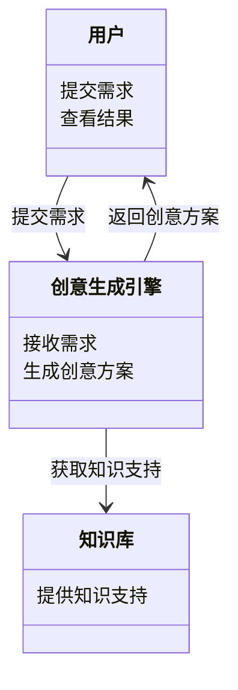
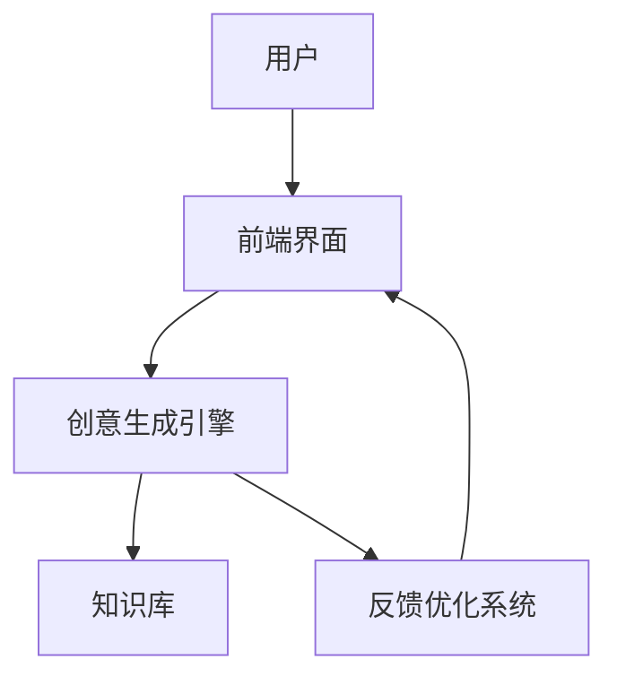
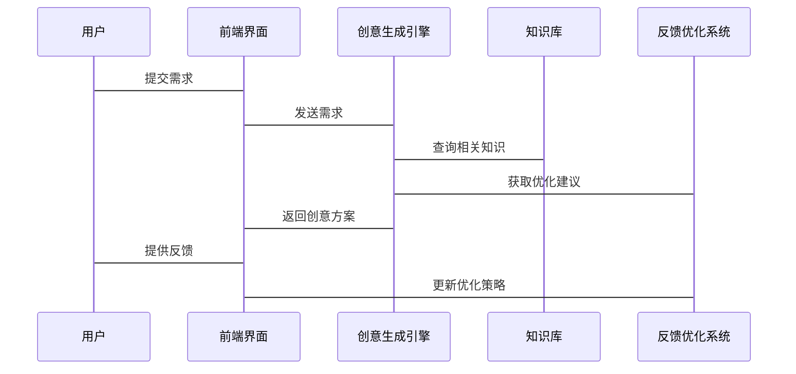

                 


# 构建企业AI创意助手：促进创新与产品开发

## 关键词：企业AI，创意助手，创新，产品开发，人工智能，自然语言处理

## 摘要：本文系统地探讨了企业AI创意助手的构建过程，分析了其在促进企业创新和产品开发中的重要作用。通过详细的技术分析和实际案例，本文揭示了如何利用AI技术提升企业的创意能力和开发效率。内容涵盖从背景介绍到系统架构设计，再到项目实战的全过程，为企业技术决策者和开发者提供了深刻的洞见和实践指导。

---

# 第一部分: 企业AI创意助手的背景与价值

# 第1章: 企业AI创意助手的背景与概念

## 1.1 问题背景与挑战

### 1.1.1 传统企业创新面临的挑战
- **企业创新的低效性**：传统创新过程依赖人工 brainstorming 和试错，效率低下且资源浪费。
- **创意生成的局限性**：人类创造力受经验限制，难以突破固有思维模式。
- **跨领域融合的困难**：企业难以快速整合不同领域的知识，形成创新性的解决方案。

### 1.1.2 创意与产品开发中的效率瓶颈
- **创意验证的高成本**：从创意到产品需要大量的资源投入，失败风险高。
- **知识整合的复杂性**：不同部门之间的信息孤岛导致知识利用效率低下。
- **市场变化的快速响应**：企业需要快速适应市场变化，传统开发模式难以应对。

### 1.1.3 AI技术在创意与开发中的潜在价值
- **AI的创造力辅助**：利用生成式AI快速生成创意，并提供多维度的优化建议。
- **数据驱动的决策支持**：通过大数据分析，帮助企业更精准地定位市场需求。
- **自动化开发流程**：AI技术可以自动化处理部分开发任务，提高效率。

## 1.2 问题描述与目标

### 1.2.1 企业创新与产品开发的核心问题
- **如何快速生成并验证创意？**
- **如何高效整合跨领域知识？**
- **如何快速响应市场变化？**

### 1.2.2 AI创意助手的目标与功能定位
- **目标**：辅助企业快速生成创意，并提供从创意到产品的全生命周期支持。
- **功能定位**：作为企业的智能助手，提供创意生成、需求分析、方案优化等服务。

### 1.2.3 边界与外延
- **边界**：专注于创意生成和初步开发支持，不涉及产品的实际制造。
- **外延**：可以扩展到市场分析、用户反馈收集等领域。

## 1.3 企业AI创意助手的定义与核心要素

### 1.3.1 核心概念的结构与组成
- **输入**：用户需求描述。
- **输出**：创意方案、开发建议。
- **核心模块**：创意生成引擎、知识库、反馈优化系统。

### 1.3.2 功能模块与能力体系
- **创意生成模块**：基于输入生成多种创意方案。
- **知识整合模块**：整合企业内外部知识资源。
- **反馈优化模块**：根据用户反馈优化创意方案。

### 1.3.3 与其他AI应用的对比分析
| 特性       | 创意助手 | 通用AI工具 |
|------------|----------|------------|
| 核心功能   | 创意生成 | 数据分析   |
| 输入类型   | 文本描述  | 结构化数据  |
| 输出类型   | 创意方案 | 分析报告    |

## 1.4 本章小结
通过本章的介绍，我们明确了企业AI创意助手的背景、目标和核心要素，为后续的技术实现奠定了基础。

---

# 第二部分: 企业AI创意助手的核心技术与原理

# 第2章: AI创意助手的核心技术原理

## 2.1 自然语言处理（NLP）技术

### 2.1.1 NLP在创意生成中的应用
- **文本生成**：利用NLP技术生成创意文案。
- **语义理解**：理解用户需求并生成相关的创意方案。

### 2.1.2 常见NLP模型及其特点
| 模型名称   | 特点       | 适用场景         |
|------------|------------|------------------|
| GPT        | 大型预训练语言模型 | 创意文案生成       |
| Bert       | 基于Transformer的双向模型 | 语义理解           |
| Seq2Seq    | 基于编码器-解码器结构 | 简单文本生成       |

### 2.1.3 NLP技术的创新与优化
- **模型优化**：通过微调和参数调整提升生成质量。
- **数据增强**：通过数据增强技术扩大训练数据。

## 2.2 生成式AI模型

### 2.2.1 生成式AI的基本原理
- **生成过程**：通过解码器将向量空间映射到文本空间。
- **对抗训练**：通过生成器和判别器的对抗训练提升生成质量。

### 2.2.2 主流生成式模型的对比分析
| 模型名称   | 基本原理       | 优缺点         |
|------------|----------------|----------------|
| GAN        | 对抗网络       | 生成质量高，训练不稳定 |
| VAE        | 变分自编码器   | 稳定性高，生成多样性不足 |
| GPT        | 预训练语言模型 | 易于部署，生成质量高 |

### 2.2.3 模型的训练与调优
- **训练策略**：使用大规模数据进行预训练。
- **参数调优**：通过网格搜索或随机搜索找到最优参数。

## 2.3 知识图谱与创意关联

### 2.3.1 知识图谱的构建与应用
- **构建方法**：通过信息抽取、知识融合和知识推理构建知识图谱。
- **应用场景**：将知识图谱应用于创意生成，提供跨领域的知识支持。

### 2.3.2 创意与知识关联的实现
- **关联规则**：定义创意与知识之间的关联规则。
- **推理过程**：利用推理算法生成新的创意。

### 2.3.3 知识图谱的动态更新与维护
- **动态更新**：根据新数据更新知识图谱。
- **维护策略**：定期检查和修复知识图谱中的错误。

## 2.4 本章小结
通过本章的介绍，我们深入探讨了企业AI创意助手的核心技术，包括NLP技术、生成式AI模型和知识图谱的应用。

---

# 第三部分: 企业AI创意助手的算法实现与优化

# 第3章: 创意生成算法原理

## 3.1 Transformer模型原理

### 3.1.1 Transformer的基本结构
- **编码器**：将输入序列映射到向量空间。
- **解码器**：将向量空间映射回文本空间。

### 3.1.2 注意力机制的数学公式
$$
\text{Attention}(Q, K, V) = \text{softmax}\left(\frac{QK^T}{\sqrt{d_k}}\right)V
$$

### 3.1.3 模型的训练与推理过程
1. **训练**：通过反向传播算法优化模型参数。
2. **推理**：输入创意需求，生成创意方案。

## 3.2 生成对抗网络（GAN）原理

### 3.2.1 GAN的基本组成
- **生成器**：生成创意方案。
- **判别器**：判别生成方案是否为真实方案。

### 3.2.2 判别器与生成器的对抗过程
- **生成过程**：生成器通过对抗训练生成高质量的创意方案。
- **判别过程**：判别器不断优化以区分真实和生成的方案。

### 3.2.3 GAN在创意生成中的应用
- **文本生成**：生成创意文案。
- **图像生成**：生成创意图形。

## 3.3 算法优化与调优策略

### 3.3.1 模型训练的优化方法
- **学习率调整**：使用学习率衰减策略。
- **批量归一化**：加速训练过程。

### 3.3.2 参数调节与超参数优化
- **超参数选择**：通过网格搜索选择最优超参数。
- **早停机制**：防止过拟合。

### 3.3.3 模型的评估与改进
- **评估指标**：使用BLEU、ROUGE等指标评估生成质量。
- **改进策略**：根据评估结果优化模型结构。

## 3.4 本章小结
本章详细介绍了创意生成算法的实现与优化策略，为后续的系统设计提供了技术基础。

---

# 第四部分: 企业AI创意助手的系统架构与设计

# 第4章: 企业AI创意助手的系统架构设计

## 4.1 问题场景介绍
- **目标用户**：企业研发人员、产品经理。
- **核心功能**：创意生成、需求分析、方案优化。

## 4.2 系统功能设计

### 4.2.1 领域模型


### 4.2.2 系统架构


### 4.2.3 系统接口设计
- **输入接口**：接收用户需求描述。
- **输出接口**：返回创意方案和优化建议。

### 4.2.4 系统交互流程


## 4.3 本章小结
通过本章的介绍，我们详细设计了企业AI创意助手的系统架构，并展示了系统的交互流程。

---

# 第五部分: 企业AI创意助手的项目实战

# 第5章: 企业AI创意助手的实现

## 5.1 环境搭建

### 5.1.1 开发工具安装
- **Python**：安装Python 3.8及以上版本。
- **深度学习框架**：安装TensorFlow或PyTorch。

### 5.1.2 数据集准备
- **训练数据**：收集创意文案和相关领域的知识数据。
- **测试数据**：用于模型评估和优化。

## 5.2 系统核心实现

### 5.2.1 创意生成引擎实现
```python
class CreativeEngine:
    def __init__(self):
        self.models = {
            'nlp_model': NLPModel(),
            'gan_model': GANModel()
        }

    def generate_creativity(self, input_text):
        # 使用NLP模型进行初步生成
        initial_output = self.models['nlp_model'].generate(input_text)
        # 使用GAN模型进行优化
        optimized_output = self.models['gan_model'].improve(initial_output)
        return optimized_output
```

### 5.2.2 知识库接口实现
```python
class KnowledgeBase:
    def __init__(self):
        self.knowledge = {}

    def get_knowledge(self, query):
        return self.knowledge.get(query, [])
```

### 5.2.3 反馈优化系统实现
```python
class FeedbackSystem:
    def __init__(self):
        self.feedback_rules = {}

    def optimize(self, feedback):
        # 根据反馈规则优化创意方案
        optimized = {}
        for key, value in feedback.items():
            optimized[key] = value * self.feedback_rules[key]
        return optimized
```

## 5.3 代码应用解读与分析

### 5.3.1 创意生成引擎
- **输入**：用户需求描述。
- **输出**：生成的创意方案。

### 5.3.2 知识库接口
- **功能**：根据查询返回相关知识。

### 5.3.3 反馈优化系统
- **功能**：根据用户反馈优化创意方案。

## 5.4 实际案例分析

### 5.4.1 案例背景
- **行业**：互联网。
- **需求**：生成一个新的移动应用创意。

### 5.4.2 案例分析
1. **需求输入**：用户输入“开发一个健康类应用”。
2. **创意生成**：系统生成多个创意方案，如“健康饮食计划”、“运动习惯养成”。
3. **知识整合**：系统整合健康类应用的相关知识，提供优化建议。
4. **反馈优化**：用户反馈后，系统优化创意方案。

## 5.5 本章小结
通过本章的实战，我们详细讲解了企业AI创意助手的实现过程，并展示了如何通过实际案例应用这些技术。

---

# 第六部分: 企业AI创意助手的最佳实践与未来展望

# 第6章: 最佳实践与未来展望

## 6.1 最佳实践

### 6.1.1 技术选型建议
- **模型选择**：根据需求选择合适的NLP模型和生成式模型。
- **数据准备**：确保数据质量，进行数据清洗和预处理。

### 6.1.2 系统优化策略
- **模型优化**：通过参数调整和架构改进提升生成质量。
- **系统维护**：定期更新模型和知识库，确保系统稳定性。

### 6.1.3 用户体验优化
- **界面设计**：设计直观易用的用户界面。
- **反馈机制**：提供及时的用户反馈和优化建议。

## 6.2 未来展望

### 6.2.1 技术发展趋势
- **多模态生成**：结合文本、图像等多种模态生成创意方案。
- **自适应学习**：系统能够根据用户行为动态调整生成策略。

### 6.2.2 应用场景扩展
- **跨领域应用**：将创意助手应用到更多领域，如教育、医疗等。
- **智能化协作**：与企业现有系统无缝集成，提供智能化协作支持。

## 6.3 本章小结
通过本章的总结，我们展望了企业AI创意助手的未来发展方向，并提出了技术优化和应用扩展的建议。

---

# 附录

## 附录A: 相关术语表

## 附录B: 参考文献

## 附录C: 项目代码

---

通过以上详细的目录结构和内容安排，我们可以系统地构建出一本关于《构建企业AI创意助手：促进创新与产品开发》的专业技术书籍。每一章都深入探讨了相关主题，确保内容全面且具有实际应用价值。

