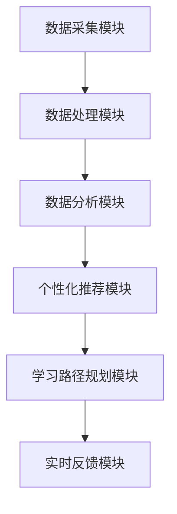
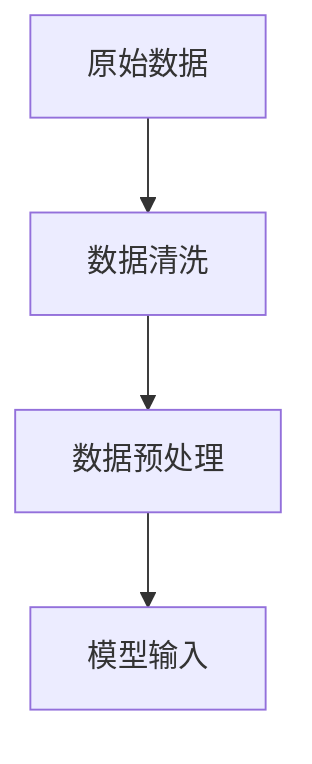
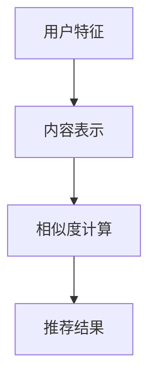
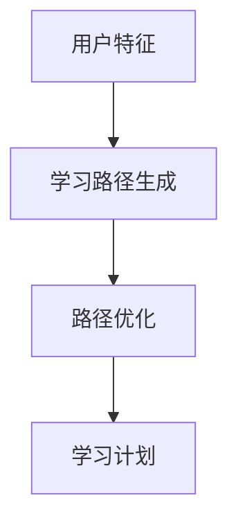
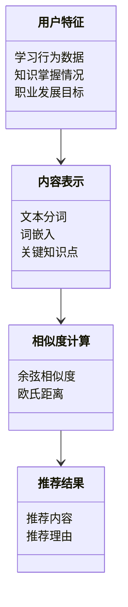
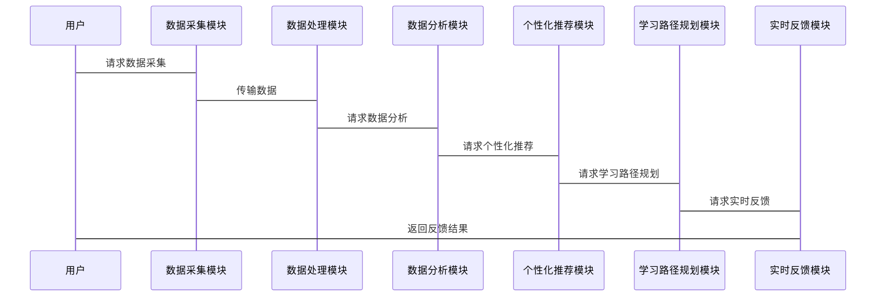

                 


```markdown
# 构建企业专属AI培训师：员工技能提升助手

---

## 关键词
- 企业AI培训师
- 技能提升助手
- 个性化学习
- 自然语言处理
- 机器学习
- 系统架构

---

## 摘要
本文将详细介绍如何构建一个企业专属的AI培训师，用于员工技能提升。通过结合自然语言处理、机器学习和系统架构设计，我们能够为企业提供一个智能化的培训解决方案。文章从背景、核心概念、算法原理、系统架构到项目实战，全面解析AI培训师的构建过程，并通过案例分析展示其实际应用价值。

---

## 第一部分：企业专属AI培训师的背景与概述

### 第1章：企业专属AI培训师的背景与需求

#### 1.1 企业培训现状与挑战

##### 1.1.1 传统企业培训的痛点
传统的企业培训方式通常依赖于线下课程、内部培训师或外部培训机构。然而，这种方式存在以下痛点：
- **成本高昂**：线下培训需要场地、讲师和时间的投入，成本较高。
- **灵活性不足**：员工可能因为工作安排无法参加培训，导致培训效果不佳。
- **个性化不足**：统一的培训内容难以满足员工的个性化需求。

##### 1.1.2 企业对智能化培训工具的需求
随着人工智能技术的快速发展，企业对智能化培训工具的需求日益增长。AI培训师能够通过自动化学习路径规划、个性化推荐和实时反馈，解决传统培训方式的痛点。

##### 1.1.3 AI技术在企业培训中的应用潜力
AI技术在企业培训中的应用潜力主要体现在以下几个方面：
- **智能化学习路径规划**：根据员工的知识水平和职业发展目标，动态调整学习计划。
- **个性化推荐**：基于员工的学习偏好和知识盲点，推荐适合的学习资源。
- **实时反馈与评估**：通过自然语言处理和机器学习技术，实时评估员工的学习效果并提供反馈。

#### 1.2 AI培训师的定义与核心功能

##### 1.2.1 AI培训师的定义
AI培训师是一种基于人工智能技术的企业培训解决方案，能够通过数据分析、自然语言处理和机器学习算法，为员工提供个性化的学习建议、动态的学习计划和实时的学习反馈。

##### 1.2.2 核心功能模块解析
AI培训师的核心功能模块包括：
- **数据采集与分析**：收集员工的学习行为数据、知识掌握情况和职业发展目标。
- **自然语言处理**：对学习内容进行语义分析，提取关键知识点。
- **个性化推荐**：基于员工的学习数据，推荐适合的学习资源。
- **学习路径规划**：根据员工的学习进度和知识盲点，动态调整学习计划。
- **实时反馈与评估**：评估员工的学习效果，并提供个性化的反馈。

##### 1.2.3 与传统培训方式的区别
AI培训师与传统培训方式的主要区别在于：
- **个性化**：AI培训师能够根据员工的个性化需求提供定制化的学习方案。
- **实时性**：AI培训师能够实时跟踪员工的学习进度并提供反馈。
- **成本效益**：AI培训师能够显著降低企业的培训成本，同时提高培训效果。

#### 1.3 企业专属AI培训师的价值与优势

##### 1.3.1 提高培训效率
AI培训师通过自动化学习路径规划和个性化推荐，能够显著提高培训效率，减少员工的学习时间。

##### 1.3.2 个性化学习体验
AI培训师能够为每个员工提供个性化的学习体验，满足不同员工的学习需求。

##### 1.3.3 成本与资源优化
通过自动化和智能化的方式，AI培训师能够显著优化企业的培训资源，降低培训成本。

---

## 第二部分：AI培训师的核心概念与原理

### 第2章：AI培训师的核心概念与原理

#### 2.1 数据驱动的培训体系

##### 2.1.1 数据采集与处理
数据采集与处理是AI培训师的核心环节之一。以下是具体的步骤：
1. **数据采集**：通过企业内部系统（如学习管理系统、员工绩效系统）收集员工的学习行为数据、知识掌握情况和职业发展目标。
2. **数据清洗**：对采集到的数据进行清洗，去除噪声数据，确保数据质量。
3. **数据预处理**：对数据进行标准化、归一化等预处理操作，以便后续的分析和建模。

##### 2.1.2 数据分析与挖掘
数据分析与挖掘是AI培训师的核心环节之一。以下是具体的步骤：
1. **数据探索**：通过可视化工具（如Tableau、Power BI）对数据进行探索性分析，发现数据中的潜在规律和趋势。
2. **数据建模**：基于机器学习算法（如逻辑回归、随机森林、神经网络等），建立预测模型，预测员工的学习效果和知识掌握情况。
3. **模型评估**：通过交叉验证、ROC曲线等方法，评估模型的性能，并进行参数调优。

##### 2.1.3 数据驱动的决策支持
数据驱动的决策支持是AI培训师的重要功能之一。以下是具体的步骤：
1. **学习效果评估**：通过数据分析，评估员工的学习效果，识别知识盲点。
2. **学习路径优化**：基于数据分析结果，优化学习路径，提高培训效果。
3. **资源分配**：根据数据分析结果，合理分配培训资源，提高资源利用效率。

#### 2.2 自然语言处理在培训中的应用

##### 2.2.1 自然语言处理技术简介
自然语言处理（NLP）是AI培训师的重要技术之一。NLP能够对文本进行语义分析、情感分析、实体识别等操作，帮助我们更好地理解和处理学习内容。

##### 2.2.2 培训内容的语义分析
通过NLP技术，我们可以对培训内容进行语义分析，提取关键知识点和核心内容。例如，使用分词工具（如jieba）对学习内容进行分词，提取关键词。

##### 2.2.3 个性化推荐算法
基于NLP技术，我们可以建立个性化推荐算法。以下是具体的步骤：
1. **内容表示**：将学习内容表示为向量，通常使用词袋模型或词嵌入模型（如Word2Vec）。
2. **相似度计算**：计算员工学习内容与推荐内容的相似度，基于余弦相似度或欧氏距离。
3. **推荐结果**：根据相似度排序，推荐最相关的学习资源。

#### 2.3 个性化学习路径设计

##### 2.3.1 基于用户特征的学习路径生成
个性化学习路径生成是AI培训师的核心功能之一。以下是具体的步骤：
1. **用户特征提取**：提取员工的学习行为数据、知识掌握情况和职业发展目标。
2. **学习路径生成**：基于用户特征，生成个性化的学习路径，动态调整学习计划。
3. **路径优化**：根据学习效果反馈，不断优化学习路径，提高培训效果。

##### 2.3.2 动态调整学习计划
通过实时跟踪员工的学习进度和知识掌握情况，AI培训师能够动态调整学习计划，确保员工的学习效果。

##### 2.3.3 学习效果评估与反馈
AI培训师能够实时评估员工的学习效果，并提供个性化的反馈，帮助员工改进学习策略。

---

## 第三部分：AI培训师的系统架构与设计

### 第3章：AI培训师的系统架构与设计

#### 3.1 系统整体架构

##### 3.1.1 模块划分与功能分配
AI培训师的系统架构可以划分为以下几个模块：
1. **数据采集模块**：负责采集员工的学习行为数据、知识掌握情况和职业发展目标。
2. **数据处理模块**：对采集到的数据进行清洗、预处理和存储。
3. **数据分析模块**：基于机器学习算法，对数据进行分析和建模。
4. **个性化推荐模块**：基于NLP技术，生成个性化推荐内容。
5. **学习路径规划模块**：基于用户特征，生成个性化的学习路径。
6. **实时反馈模块**：实时评估员工的学习效果，并提供反馈。

##### 3.1.2 系统架构图（Mermaid）



#### 3.2 核心算法与流程

##### 3.2.1 数据预处理流程



##### 3.2.2 个性化推荐算法



##### 3.2.3 学习路径规划流程



#### 3.3 系统功能设计

##### 3.3.1 领域模型（Mermaid类图）



#### 3.4 系统架构设计（Mermaid架构图）

```mermaid
docker
    service 数据采集模块 {
        container_data
    }
    service 数据处理模块 {
        container_data
    }
    service 数据分析模块 {
        container_ml
    }
    service 个性化推荐模块 {
        container_nlp
    }
    service 学习路径规划模块 {
        container_path
    }
    service 实时反馈模块 {
        container_feedback
    }
```

#### 3.5 系统接口设计

##### 3.5.1 API接口
以下是系统主要的API接口：
- `/api/data采集`：数据采集接口。
- `/api/数据处理`：数据处理接口。
- `/api/数据分析`：数据分析接口。
- `/api/个性化推荐`：个性化推荐接口。
- `/api/学习路径规划`：学习路径规划接口。
- `/api/实时反馈`：实时反馈接口。

##### 3.5.2 接口交互流程（Mermaid序列图）



---

## 第四部分：AI培训师的项目实战

### 第4章：AI培训师的项目实战

#### 4.1 环境安装与配置

##### 4.1.1 安装Python环境
安装Python 3.8及以上版本，并安装必要的库：
```bash
pip install numpy pandas scikit-learn jieba transformers
```

##### 4.1.2 安装NLP库
安装NLP相关的库：
```bash
pip install spacy
python -m spacy download en
```

##### 4.1.3 安装可视化工具
安装Matplotlib和Seaborn：
```bash
pip install matplotlib seaborn
```

#### 4.2 系统核心实现源代码

##### 4.2.1 数据采集模块
```python
import pandas as pd

def collect_data(file_path):
    data = pd.read_csv(file_path)
    return data

if __name__ == "__main__":
    data = collect_data("employees.csv")
    print(data.head())
```

##### 4.2.2 数据处理模块
```python
import numpy as np

def preprocess_data(data):
    # 去除缺失值
    data = data.dropna()
    # 标准化处理
    from sklearn.preprocessing import StandardScaler
    scaler = StandardScaler()
    data[['age', 'experience']] = scaler.fit_transform(data[['age', 'experience']])
    return data

if __name__ == "__main__":
    data = preprocess_data(data)
    print(data.head())
```

##### 4.2.3 数据分析模块
```python
from sklearn.ensemble import RandomForestClassifier
from sklearn.metrics import accuracy_score

def train_model(data, target):
    model = RandomForestClassifier()
    model.fit(data, target)
    return model

if __name__ == "__main__":
    target = data['performance']
    features = data.drop('performance', axis=1)
    model = train_model(features, target)
    print("训练完成，准确率为：", accuracy_score(target, model.predict(features)))
```

##### 4.2.4 个性化推荐模块
```python
import jieba

def text_processing(text):
    words = jieba.lcut(text)
    return words

if __name__ == "__main__":
    text = "如何提高Python编程能力"
    words = text_processing(text)
    print(words)
```

##### 4.2.5 学习路径规划模块
```python
from sklearn.metrics.pairwise import cosine_similarity

def generate_recommendations(user_profile, content_embedding):
    similarities = cosine_similarity(user_profile, content_embedding)
    return similarities.argsort()

if __name__ == "__main__":
    user_profile = data[['age', 'experience', 'performance']]
    content_embedding = data[['age', 'experience', 'performance']]
    recommendations = generate_recommendations(user_profile, content_embedding)
    print(recommendations)
```

#### 4.3 实际案例分析与解读

##### 4.3.1 案例背景
某企业希望通过AI培训师提升员工的编程能力。

##### 4.3.2 数据分析与建模
通过对员工的编程能力数据进行分析，建立预测模型，预测员工的学习效果。

##### 4.3.3 个性化推荐与学习路径规划
基于员工的学习行为数据和知识掌握情况，生成个性化的学习路径，并推荐相关的学习资源。

##### 4.3.4 系统实现与优化
通过系统实现，优化学习路径，提高员工的学习效果，并实时反馈学习进度。

#### 4.4 项目小结
通过本项目，我们成功构建了一个企业专属的AI培训师，能够为员工提供个性化的学习方案，显著提高培训效率和效果。

---

## 第五部分：最佳实践与总结

### 第5章：最佳实践与总结

#### 5.1 最佳实践

##### 5.1.1 数据隐私与安全
在数据采集和处理过程中，需要注意数据隐私和安全问题，确保员工数据的安全。

##### 5.1.2 模型迭代与优化
定期对模型进行迭代和优化，确保模型的准确性和稳定性。

##### 5.1.3 系统维护与升级
定期对系统进行维护和升级，确保系统的稳定性和高效性。

#### 5.2 小结

##### 5.2.1 全文总结
本文详细介绍了如何构建企业专属的AI培训师，从背景、核心概念、算法原理到系统架构和项目实战，全面解析了AI培训师的构建过程。

##### 5.2.2 未来展望
随着人工智能技术的不断发展，企业专属的AI培训师将会更加智能化和个性化，为企业培训带来更多的价值和潜力。

#### 5.3 注意事项

##### 5.3.1 数据质量问题
在数据采集和处理过程中，需要注意数据质量，确保数据的准确性和完整性。

##### 5.3.2 模型可解释性
在模型设计和优化过程中，需要注意模型的可解释性，确保模型的透明性和可信度。

##### 5.3.3 系统可扩展性
在系统设计和实现过程中，需要注意系统的可扩展性，确保系统的灵活性和适应性。

#### 5.4 拓展阅读

##### 5.4.1 推荐书籍
1. 《Python机器学习实战》
2. 《自然语言处理入门》
3. 《深度学习与神经网络》

##### 5.4.2 推荐在线资源
1. [Kaggle](https://www.kaggle.com/)
2. [Towards Data Science](https://towardsdatascience.com/)
3. [Medium - AI与机器学习](https://medium.com/ai-and-machine-learning)

---

## 结语

通过本文的详细讲解，我们成功构建了一个企业专属的AI培训师，能够为员工提供个性化的学习方案，显著提高培训效率和效果。希望本文的内容能够为企业的智能化培训提供有价值的参考和指导。
```

