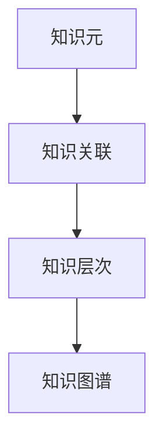
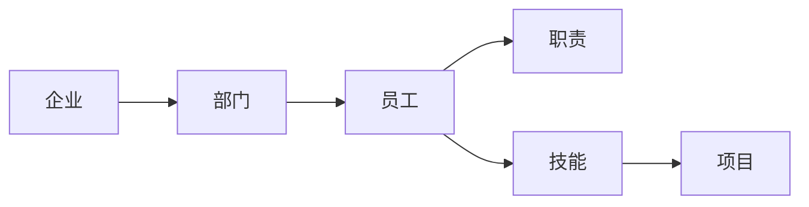
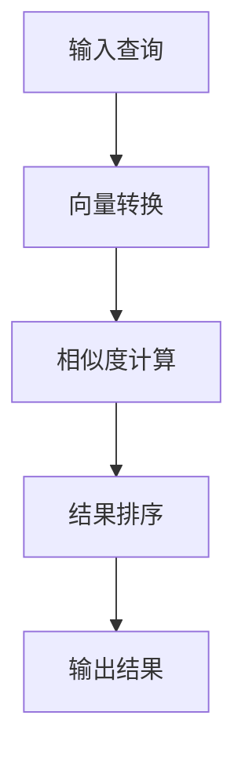
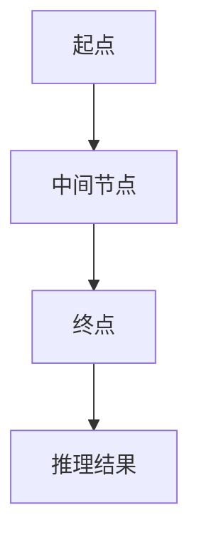
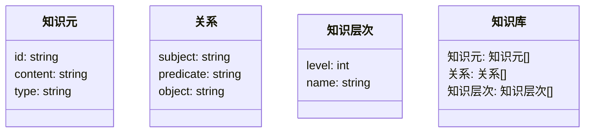
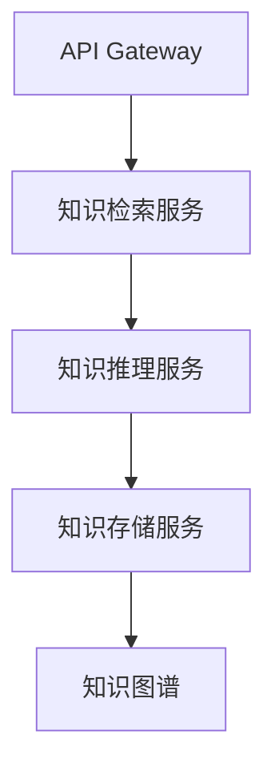
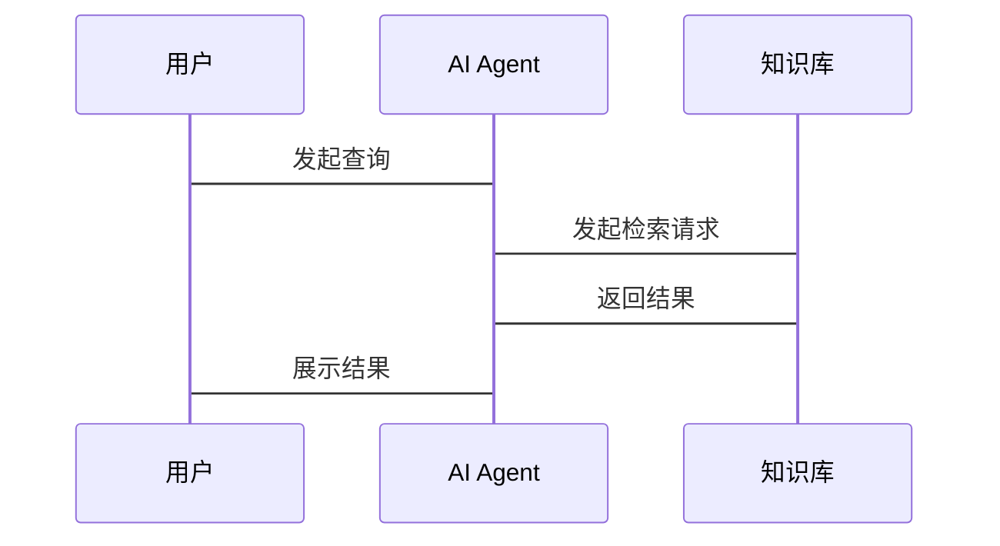

                 


# 构建企业知识库：为AI Agent提供专业领域支持

> 关键词：企业知识库、AI Agent、知识管理、知识图谱、向量数据库、系统架构设计、算法原理

> 摘要：本文将详细探讨如何构建企业知识库，为AI Agent提供专业领域支持。通过分析企业知识管理的现状与挑战，介绍知识库的核心概念、算法原理、系统架构设计以及项目实战，帮助读者掌握构建企业知识库的关键技术和方法。

---

# 第一部分：企业知识库与AI Agent概述

## 第1章：企业知识库的背景与需求

### 1.1 问题背景

#### 1.1.1 传统企业知识管理的局限性
传统企业知识管理（KM）依赖于文档、数据库和员工记忆，存在以下问题：
- **知识分散**：知识分散在各个部门、系统和员工头脑中，难以集中管理和利用。
- **知识孤岛**：不同部门之间缺乏知识共享机制，导致知识重复存储和浪费。
- **知识检索效率低**：传统知识检索依赖关键词匹配，无法进行语义理解和关联推理。
- **知识更新不及时**：知识更新依赖人工操作，难以实时反映企业动态。

#### 1.1.2 AI Agent对企业知识库的需求
AI Agent（人工智能代理）需要实时获取和处理企业知识库中的信息，以完成以下任务：
- **自动化决策**：基于历史数据和实时信息，快速做出决策。
- **智能交互**：通过自然语言处理与用户交互，提供精准的知识支持。
- **知识推理**：利用知识库中的关联信息，进行推理和预测。

#### 1.1.3 知识库在企业智能化转型中的作用
知识库是企业智能化转型的核心基础设施，能够：
- **提升效率**：通过自动化知识检索和推理，提高企业运营效率。
- **增强决策能力**：基于实时数据和历史信息，提供数据驱动的决策支持。
- **促进协作**：通过知识共享和复用，打破部门间的信息孤岛。

### 1.2 问题描述

#### 1.2.1 企业知识分散与孤岛问题
- 知识分散在不同的系统、部门和员工头脑中，难以统一管理。
- 不同部门使用不同的知识存储方式，导致信息重复和不一致。

#### 1.2.2 知识检索与应用效率低下
- 传统知识检索依赖关键词匹配，无法理解语义和上下文。
- 知识库的查询效率低下，难以满足AI Agent的实时需求。

#### 1.2.3 AI Agent对实时知识的需求
- AI Agent需要实时获取最新的知识，以应对动态变化的环境。
- 知识库需要支持高效的查询、推理和更新。

### 1.3 问题解决

#### 1.3.1 知识库构建的目标与方法
- **目标**：构建一个集中、统一、动态更新的知识库，支持AI Agent的实时需求。
- **方法**：采用知识图谱和向量数据库等技术，实现知识的结构化存储和语义检索。

#### 1.3.2 AI Agent与知识库的协同工作模式
- **数据流模式**：AI Agent向知识库发起查询请求，知识库返回结构化或语义化的结果。
- **事件驱动模式**：知识库实时更新，AI Agent根据事件触发条件，主动获取相关信息。

#### 1.3.3 知识库在企业中的应用场景
- **客户服务**：基于知识库实现智能客服，提供精准的问题解答。
- **内部协作**：通过知识库实现跨部门协作，提高工作效率。
- **数据分析**：利用知识库中的关联信息，进行深度数据分析和预测。

### 1.4 边界与外延

#### 1.4.1 企业知识库的边界
- **数据范围**：仅包含企业的内部知识，不包括外部数据。
- **功能范围**：仅提供知识存储、检索和推理功能，不包括数据采集和处理。

#### 1.4.2 知识库与其他企业系统的区别
- **区别**：
  - 数据库：数据库存储结构化数据，不支持语义理解和关联推理。
  - 数据仓库：数据仓库用于数据分析和决策支持，不支持实时知识检索。
  - 知识图谱：知识图谱用于语义检索和关联分析，不支持动态更新。

#### 1.4.3 知识库的外延与扩展方向
- **外延**：知识库可以扩展到外部知识库，如行业知识库和公开数据集。
- **扩展方向**：
  - 支持多模态数据（如图像、视频）。
  - 支持实时更新和动态扩展。

### 1.5 概念结构与核心要素

#### 1.5.1 知识库的核心概念
- **知识元**：最小的知识单元，如“公司名称”、“职位”。
- **知识关联**：知识元之间的关联关系，如“属于”、“包含”。
- **知识层次**：知识的分类层次，如“公司→部门→员工”。

#### 1.5.2 核心要素的特征对比
| 特征 | 数据库 | 知识库 |
|------|--------|--------|
| 数据结构 | 结构化 | 结构化+语义化 |
| 数据存储 | 关系型 | 图形化 |
| 数据操作 | CRUD | 查询、推理 |

#### 1.5.3 知识库的组成结构


---

## 第2章：企业知识库的核心概念与联系

### 2.1 核心概念原理

#### 2.1.1 知识表示与存储
- **知识表示**：通过结构化的形式表示知识，如RDF（资源描述框架）。
- **知识存储**：采用数据库或知识图谱的形式存储知识元和关联关系。

#### 2.1.2 知识组织与关联
- **知识组织**：将知识元按照层次结构组织起来，形成知识树或知识图谱。
- **知识关联**：通过关系（如“属于”、“包含”）将知识元连接起来，形成关联网络。

#### 2.1.3 知识检索与推理
- **知识检索**：基于关键词或语义进行知识检索。
- **知识推理**：基于关联关系进行推理和预测。

### 2.2 核心概念对比

#### 2.2.1 不同知识库类型对比
| 类型 | RDF数据库 | 三元组存储 | 向量数据库 |
|------|-----------|-----------|------------|
| 数据存储 | 基于RDF三元组 | 基于三元组 | 基于向量 |
| 查询方式 | SPARQL | 基于谓词 | 向量相似度 |
| 应用场景 | 知识图谱 | 简单关联 | 语义检索 |

#### 2.2.2 知识库与数据库的对比
| 特性 | 数据库 | 知识库 |
|------|--------|--------|
| 数据结构 | 结构化 | 结构化+语义化 |
| 查询方式 | SQL | SPARQL/向量检索 |
| 应用场景 | 数据存储 | 知识检索与推理 |

#### 2.2.3 知识图谱与向量数据库的对比
| 特性 | 知识图谱 | 向量数据库 |
|------|---------|-----------|
| 数据结构 | 图形化 | 向量化 |
| 查询方式 | 关联查询 | 相似度检索 |
| 应用场景 | 关联分析 | 语义检索 |

### 2.3 ER实体关系图



---

## 第3章：企业知识库的算法原理

### 3.1 知识表示与嵌入

#### 3.1.1 向量空间模型
- **向量空间模型**：将知识表示为向量，通过向量运算进行相似度计算。
- **数学模型**：向量空间模型可以表示为：
  $$ 
  \text{similarity}(v_1, v_2) = \frac{v_1 \cdot v_2}{\|v_1\| \|v_2\|}
  $$
  其中，\(v_1\) 和 \(v_2\) 是两个向量，\(\cdot\) 表示点积，\(\|v\|\) 表示向量的模长。

#### 3.1.2 Word2Vec与句向量
- **Word2Vec**：将单词映射为向量，通过CBOW（连续词袋）或skip-gram模型训练。
- **句向量**：将整个句子映射为一个向量，常用的模型包括：
  - **Doc2Vec**：基于Word2Vec扩展，将句子表示为向量。
  - **BERT**：基于Transformer的预训练模型，能够捕捉句法和语义信息。

#### 3.1.3 知识嵌入的数学模型
- **训练目标**：最小化向量的余弦相似度与实际相似度的差异。
- **优化方法**：使用反向传播算法（Backpropagation）进行参数优化。

### 3.2 知识检索与匹配

#### 3.2.1 余弦相似度计算
- **余弦相似度**：
  $$
  \text{similarity}(v_1, v_2) = \frac{v_1 \cdot v_2}{\|v_1\| \|v_2\|}
  $$
  - 余弦相似度用于衡量两个向量在方向上的相似程度。
  - 余弦相似度的范围是[-1, 1]，值越接近1，表示相似度越高。

#### 3.2.2 基于向量的检索算法
- **步骤**：
  1. 将查询向量化。
  2. 计算查询向量与知识库中所有向量的余弦相似度。
  3. 根据相似度排序，返回Top-N结果。

#### 3.2.3 算法流程图


### 3.3 知识推理与关联

#### 3.3.1 基于规则的推理
- **规则表示**：使用逻辑规则（如“如果A，则B”）进行推理。
- **推理过程**：
  1. 基于规则匹配知识库中的事实。
  2. 根据匹配结果进行推理，得到新的事实。

#### 3.3.2 基于图的推理
- **知识图谱表示**：将知识表示为图结构，节点表示实体，边表示关系。
- **推理算法**：
  - **深度优先搜索（DFS）**：从起点出发，沿着边遍历，寻找目标节点。
  - **广度优先搜索（BFS）**：层序遍历，寻找最短路径。

#### 3.3.3 知识图谱推理流程


---

## 第4章：企业知识库的系统架构设计

### 4.1 问题场景介绍

#### 4.1.1 企业知识库的典型应用场景
- **内部知识管理**：员工培训、政策法规。
- **客户服务**：智能问答、产品咨询。
- **数据分析**：市场趋势、竞争对手分析。

### 4.2 项目介绍

#### 4.2.1 项目目标
- 构建一个支持AI Agent的企业知识库。
- 提供知识检索、推理和更新功能。

#### 4.2.2 系统功能设计
- **知识存储**：支持知识元、关系和层次结构的存储。
- **知识检索**：支持基于关键词和语义的检索。
- **知识推理**：支持基于规则和图的推理。

### 4.3 系统架构设计

#### 4.3.1 领域模型


#### 4.3.2 系统架构


#### 4.3.3 系统接口设计
- **API接口**：
  - `GET /knowledge/search?q=查询词`
  - `POST /knowledge/reasoning?q=推理条件`

#### 4.3.4 系统交互


### 4.4 系统实现

#### 4.4.1 知识库的实现
- **技术选型**：
  - 数据库：使用Neo4j（图数据库）存储知识图谱。
  - 检索引擎：使用Elasticsearch进行全文检索。
  - 推理引擎：使用RDF4J进行基于规则的推理。

#### 4.4.2 API接口的实现
- **代码示例**（Python）：
  ```python
  from neo4j import GraphDatabase
  from elasticsearch import Elasticsearch

  class KnowledgeBase:
      def __init__(self, uri):
          self.graph = GraphDatabase(uri)
          self.es = Elasticsearch()

      def search(self, query):
          # 使用Elasticsearch进行全文检索
          res = self.es.search(index="knowledge", query=query)
          return res['hits']['hits']

      def reasoning(self, query):
          # 使用RDF4J进行基于规则的推理
          # 示例：推理规则：如果A属于B，则B包含A
          pass
  ```

---

## 第5章：企业知识库的项目实战

### 5.1 环境安装

#### 5.1.1 安装依赖
- **Python**：3.8+
- **依赖包**：
  - `neo4j`：用于连接图数据库。
  - `elasticsearch`：用于全文检索。
  - `spacy`：用于自然语言处理。

#### 5.1.2 安装命令
```bash
pip install neo4j elasticsearch spacy
python -m spacy download en_core_web_sm
```

### 5.2 系统核心实现

#### 5.2.1 知识库的构建
- **数据准备**：将企业知识整理为知识元和关系。
- **数据存储**：将知识元存储在数据库中，关系存储在知识图谱中。

#### 5.2.2 知识检索与推理
- **代码示例**：
  ```python
  import spacy

  nlp = spacy.load("en_core_web_sm")

  def get_similarity(text1, text2):
      doc1 = nlp(text1)
      doc2 = nlp(text2)
      return doc1.similarity(doc2)

  def search_knowledge(query):
      # 使用Elasticsearch进行全文检索
      res = es.search(index="knowledge", query=query)
      return res['hits']['hits']

  def infer_knowledge(query):
      # 使用Word2Vec进行语义推理
      pass
  ```

### 5.3 代码应用解读与分析

#### 5.3.1 代码结构
- **知识库构建**：
  ```python
  from neo4j import GraphDatabase

  def create_knowledge_base(uri):
      graph = GraphDatabase(uri)
      # 创建知识元
      graph.run("CREATE (a:Knowledge {id: '1', content: '公司介绍'})")
      # 创建关系
      graph.run("MATCH (a:Knowledge {id: '1'}), (b:Knowledge {id: '2'}) CREATE (a)-[r:BELONGS_TO]->(b)")
      return graph
  ```

- **知识检索**：
  ```python
  from elasticsearch import Elasticsearch

  def search_knowledge(es, index, query):
      res = es.search(index=index, body=query)
      return res['hits']['hits']
  ```

- **知识推理**：
  ```python
  from spacy import load

  nlp = load("en_core_web_sm")

  def infer_knowledge(query):
      doc = nlp(query)
      # 基于Word2Vec进行推理
      pass
  ```

### 5.4 实际案例分析

#### 5.4.1 案例背景
- **企业知识库**：存储公司介绍、部门职责、员工信息等。
- **AI Agent**：用于内部问答系统，帮助员工快速获取信息。

#### 5.4.2 案例分析
- **查询**：查找某个员工的职责。
- **步骤**：
  1. AI Agent接收查询请求。
  2. 转化为向量或关键词。
  3. 知识库检索相关知识元。
  4. 返回结果。

### 5.5 项目小结

#### 5.5.1 实战总结
- 通过项目实战，掌握了知识库的构建、检索和推理的关键技术。
- 熟悉了Neo4j、Elasticsearch和spaCy等技术的使用。

#### 5.5.2 经验教训
- 数据清洗和预处理是构建知识库的关键。
- 知识库的规模和复杂度直接影响检索和推理的效率。

---

## 第6章：总结与展望

### 6.1 总结

#### 6.1.1 核心知识点回顾
- 知识库的构建目标和方法。
- 知识库的核心概念和联系。
- 知识库的算法原理和系统架构设计。
- 知识库的项目实战和经验总结。

#### 6.1.2 最佳实践
- 知识库的构建需要结合企业的具体需求。
- 知识库的管理和维护需要持续投入。
- 知识库的扩展需要考虑多模态数据和实时更新。

### 6.2 展望

#### 6.2.1 未来发展方向
- **多模态知识库**：支持图像、视频等多种数据类型。
- **动态知识库**：支持实时更新和增量学习。
- **智能知识库**：结合大语言模型（LLM）实现更强大的语义理解。

#### 6.2.2 挑战与机遇
- **挑战**：知识库的规模和复杂度增加，需要更高效的存储和检索技术。
- **机遇**：随着AI技术的发展，知识库在企业智能化转型中将发挥越来越重要的作用。

---

# 结语

构建企业知识库是企业智能化转型的关键一步。通过本文的详细讲解，读者可以掌握知识库的核心概念、算法原理和系统架构设计，并通过项目实战提升实际操作能力。未来，随着AI技术的不断进步，企业知识库将为企业带来更大的价值和竞争优势。

