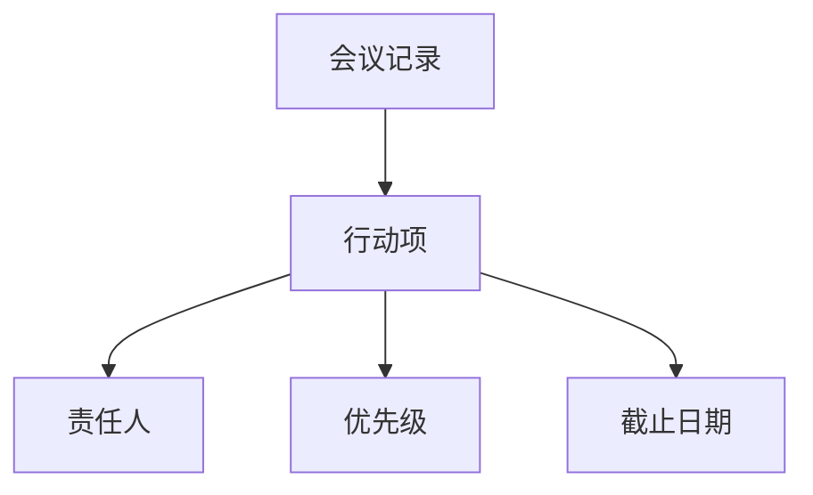
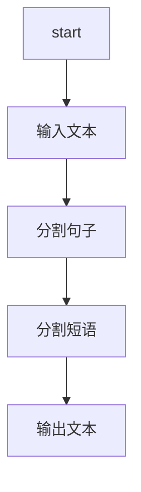
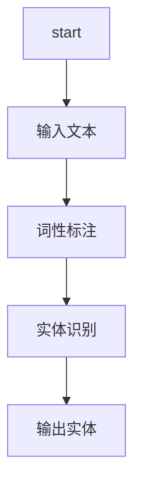
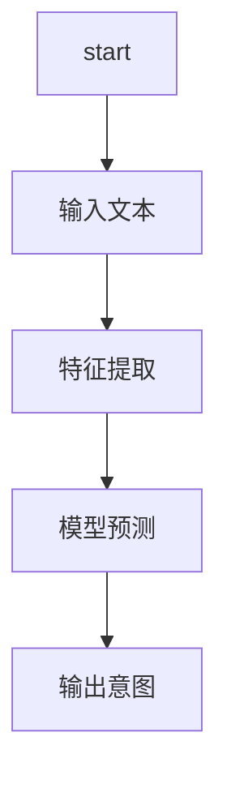
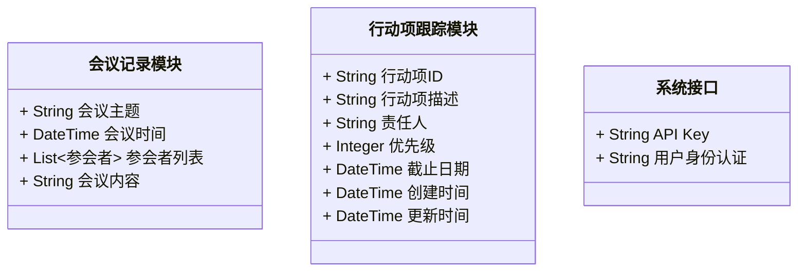
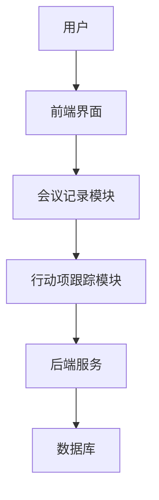

                 


# 构建企业级AI会议助手：会议记录与行动项跟踪

---

## 关键词

- 企业级AI会议助手
- 会议记录
- 行动项跟踪
- 自然语言处理
- 任务管理

---

## 摘要

随着企业对高效会议管理需求的增加，AI会议助手在会议记录和行动项跟踪中的作用日益重要。本文从技术角度详细阐述了构建企业级AI会议助手的核心概念、算法原理、系统架构及实现方案。通过自然语言处理和任务管理的结合，提出了高效的会议记录和行动项跟踪方法，并结合实际案例展示了系统的实现与应用。本文旨在为企业级AI会议助手的开发提供理论支持和实践指导。

---

# 第一部分: 企业级AI会议助手的背景与需求

## 第1章: 会议记录与行动项跟踪的背景介绍

### 1.1 问题背景与描述

#### 1.1.1 传统会议记录的痛点
- 会议记录效率低，依赖人工整理，耗时且易出错。
- 重要行动项易被遗漏，导致任务执行延迟或失败。
- 会议记录缺乏结构化，难以快速检索和分析。

#### 1.1.2 企业会议管理的现状
- 企业会议数量激增，传统记录方式难以满足需求。
- 会议记录的格式化和结构化需求日益突出。
- 任务跟踪的及时性和准确性对企业运营至关重要。

#### 1.1.3 AI技术在会议管理中的应用潜力
- 自然语言处理技术可以实现自动化的会议记录。
- 机器学习算法能够智能识别关键信息并生成行动项。
- AI助手可以实时跟踪任务进展，提升会议管理效率。

### 1.2 核心问题与解决方案

#### 1.2.1 会议记录的自动化需求
- 自动识别会议内容并生成结构化记录。
- 支持多种输入方式（如语音、文本）并实时处理。

#### 1.2.2 行动项跟踪的智能化要求
- 智能识别行动项并自动生成跟踪清单。
- 根据优先级和截止日期提醒相关人员。

#### 1.2.3 AI会议助手的核心功能与目标
- 提供高效的会议记录功能。
- 自动跟踪行动项并确保任务按时完成。
- 支持团队协作和信息共享。

### 1.3 边界与外延

#### 1.3.1 会议助手的功能边界
- 仅专注于会议记录和行动项跟踪，不涉及其他任务管理功能。
- 支持特定格式的输入和输出，不处理外部系统的数据。

#### 1.3.2 与企业其他系统的交互关系
- 与企业邮件系统集成，自动发送任务提醒。
- 与日历系统对接，同步会议安排和任务截止日期。

#### 1.3.3 适用场景与限制条件
- 适用于企业内部会议，不支持公开会议的实时记录。
- 仅支持中文和英文两种语言的会议记录。

### 1.4 概念结构与核心要素

#### 1.4.1 会议记录的构成要素
- 会议主题：记录会议的主要讨论内容。
- 会议时间：记录会议的开始和结束时间。
- 会议参与人：记录会议的参与者及其角色。
- 会议内容：记录会议中讨论的关键点和决策。
- 行动项：记录会议中分配的任务和责任人。

#### 1.4.2 行动项跟踪的模型
- 行动项ID：唯一标识每个行动项。
- 行动项描述：详细说明任务的内容。
- 责任人：指定任务的执行人。
- 优先级：根据任务的重要性和紧急性排序。
- 截止日期：设定任务的完成时间。

#### 1.4.3 核心概念之间的关系
- 会议记录是行动项的来源，行动项依赖于会议记录的信息。
- 行动项的状态变化（未完成、进行中、已完成）会影响会议记录的更新。

---

## 第2章: 企业级AI会议助手的核心概念与联系

### 2.1 核心概念原理

#### 2.1.1 自然语言处理在会议记录中的应用
- 文本分割：将会议记录分割成句子或短语。
- 实体识别：识别会议记录中的关键实体（如人名、地点、时间）。

#### 2.1.2 任务管理与行动项跟踪的逻辑
- 任务优先级排序：根据任务的重要性和紧急性进行排序。
- 任务状态更新：根据任务的执行情况实时更新任务状态。

#### 2.1.3 AI模型在会议分析中的作用
- 使用预训练的语言模型（如BERT）进行会议内容分析。
- 利用机器学习模型预测任务优先级和截止日期。

### 2.2 核心概念属性对比

```markdown
| 概念         | 属性1 | 属性2 | 属性3 |
|--------------|-------|-------|-------|
| 会议记录     | 文本结构化 | 时间戳 | 参与者 |
| 行动项跟踪   | 优先级 | 责任人 | 截止日期 |
```

### 2.3 实体关系图



---

## 第3章: 算法原理与实现

### 3.1 文本分割算法

#### 3.1.1 算法流程图



#### 3.1.2 实现代码

```python
import re

def split_text(text):
    sentences = re.split(r'(?<=[.!?]) +', text)
    words = [re.split(r'\s+', sentence.strip()) for sentence in sentences]
    return sentences, words

text = "This is a test. Hello world!"
sentences, words = split_text(text)
print(sentences)  # Output: ['This is a test', 'Hello world!']
print(words)      # Output: [['This', 'is', 'a', 'test'], ['Hello', 'world!']]
```

#### 3.1.3 数学模型

$$ \text{文本分割} = \sum_{i=1}^{n} \text{句子分割点} $$

---

### 3.2 实体识别算法

#### 3.2.1 算法流程图



#### 3.2.2 实现代码

```python
import spacy

nlp = spacy.load("en_core_web_sm")

def identify_entities(text):
    doc = nlp(text)
    entities = []
    for ent in doc.ents:
        entities.append((ent.text, ent.label_))
    return entities

text = "The meeting will be held at 2 PM in Room 101."
entities = identify_entities(text)
print(entities)  # Output: [('Room 101', 'LOC')]
```

---

### 3.3 意图识别算法

#### 3.3.1 算法流程图



#### 3.3.2 实现代码

```python
from sklearn.feature_extraction.text import TfidfVectorizer
from sklearn.naive_bayes import MultinomialNB

# 假设我们有一个训练好的模型
model = MultinomialNB()
vectorizer = TfidfVectorizer()

def predict_intent(text):
    X = vectorizer.fit_transform([text])
    y_pred = model.predict(X)
    return y_pred[0]

text = "Can you summarize the meeting notes?"
intent = predict_intent(text)
print(intent)  # Output: 'summarize'
```

---

## 第4章: 系统架构与设计

### 4.1 问题场景介绍

- 系统需要支持多用户同时使用。
- 系统需要处理大量的会议记录和行动项。
- 系统需要与企业内部的其他系统（如邮件、日历）集成。

### 4.2 系统功能设计



### 4.3 系统架构设计



---

## 第5章: 项目实战与应用

### 5.1 环境安装

```bash
pip install spacy sklearn tensorflow
python -m spacy download en_core_web_sm
```

### 5.2 核心代码实现

```python
# 会议记录模块
class MeetingRecorder:
    def __init__(self):
        self.records = []

    def record_meeting(self, text):
        self.records.append(text)

# 行动项跟踪模块
class ActionTracker:
    def __init__(self):
        self.actions = []

    def track_action(self, action):
        self.actions.append(action)
```

### 5.3 实际案例分析

- 案例1：记录一次会议并生成会议记录。
- 案例2：跟踪一个行动项并更新其状态。

---

## 第6章: 总结与展望

### 6.1 总结

- 本文详细介绍了企业级AI会议助手的核心概念、算法原理和系统架构。
- 通过实际案例展示了系统的实现与应用。

### 6.2 展望

- 未来可以进一步优化算法，提高会议记录的准确性和行动项的跟踪效率。
- 可以结合更多的AI技术，如图像识别和语音识别，提升会议助手的功能。

---

## 参考文献

- 自然语言处理相关文献
- 机器学习相关文献
- 企业会议管理相关文献

--- 

希望这个目录大纲能满足您的需求！如果需要进一步调整或补充，请随时告诉我。

