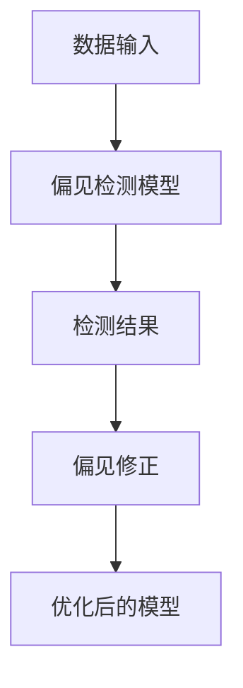
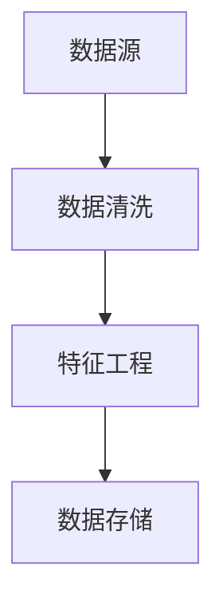
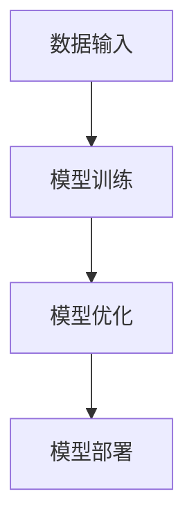
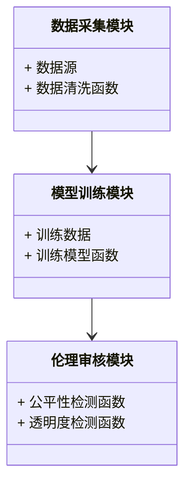
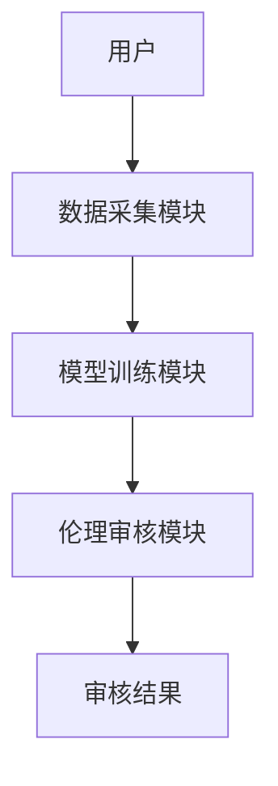
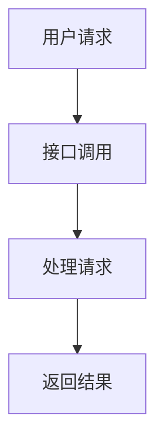
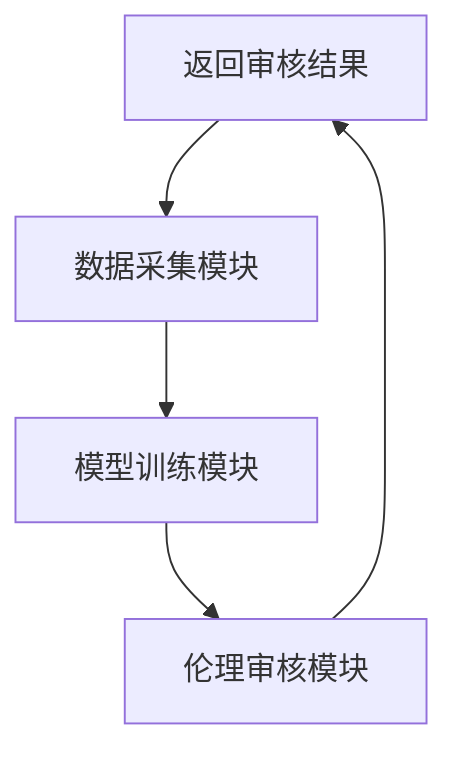

                 


# 构建企业级AI伦理审核框架：确保AI应用的公平性与透明度

## 关键词：
AI伦理审核框架, 公平性, 透明度, 模型可解释性, 伦理审核, AI技术

## 摘要：
在人工智能技术迅速发展的今天，AI应用的公平性和透明度问题日益凸显。本文旨在探讨如何构建一个企业级的AI伦理审核框架，确保AI应用的公平性和透明度。文章从背景介绍、核心概念、算法原理、系统分析与架构设计，到项目实战，全面解析构建AI伦理审核框架的必要性、方法和实现步骤，为企业提供可操作的指导和建议。

---

# 第1章: AI伦理审核框架的背景介绍

## 1.1 AI技术的现状与挑战

### 1.1.1 AI技术的快速发展
人工智能技术近年来取得了突飞猛进的发展，深度学习、自然语言处理和计算机视觉等技术的突破使得AI应用广泛渗透到各个领域。然而，随着AI技术的普及，一些问题也逐渐浮现，如算法偏见、数据隐私和决策透明度等。

### 1.1.2 AI应用中的伦理问题
AI技术的应用并非没有争议。例如，招聘系统中的算法偏见可能导致不公平的就业机会分配，自动驾驶系统在决策时的透明度问题可能引发公众信任危机。这些问题不仅影响用户体验，还可能引发法律和道德风险。

### 1.1.3 构建AI伦理审核框架的重要性
为了应对上述问题，企业需要构建一个系统化的AI伦理审核框架，从数据、算法和决策等多个层面进行全面审查，确保AI应用的公平性和透明度。

## 1.2 AI伦理问题的背景

### 1.2.1 公平性问题
公平性问题主要体现在AI算法在不同群体中的表现差异。例如，某些招聘系统可能因为历史数据中的偏见，导致某些群体的候选人被不公平地筛选。

### 1.2.2 透明度问题
透明度问题指的是AI系统的决策过程是否清晰、可解释。如果用户无法理解AI的决策逻辑，可能会降低对系统的信任。

### 1.2.3 隐私保护问题
AI系统的数据使用可能涉及大量个人隐私信息，如何在确保AI功能的同时保护用户隐私，是一个亟待解决的问题。

## 1.3 构建AI伦理审核框架的意义

### 1.3.1 企业责任与合规性
企业有责任确保其AI应用符合伦理规范和相关法律法规。

### 1.3.2 保护用户权益
通过审核框架，可以减少AI应用对用户权益的侵害，提升用户体验。

### 1.3.3 提升企业信任度
一个透明、公平的AI系统能够增强用户和企业的信任，有助于企业长期发展。

## 1.4 本章小结
本章从AI技术的现状出发，分析了AI应用中的伦理问题，并探讨了构建AI伦理审核框架的重要性和意义。

---

# 第2章: AI伦理审核框架的核心概念

## 2.1 AI伦理审核的定义与特点

### 2.1.1 AI伦理审核的定义
AI伦理审核是对AI系统的数据、算法和决策过程进行系统性审查，确保其符合伦理规范。

### 2.1.2 AI伦理审核的核心特点
- **系统性**：覆盖AI系统的全生命周期。
- **动态性**：随着数据和模型的变化，审核过程需要动态调整。
- **可操作性**：提供具体的审核标准和方法。

### 2.1.3 AI伦理审核与传统伦理审核的区别
AI伦理审核具有更强的技术性和数据驱动特性，需要结合算法和数据进行分析。

## 2.2 公平性与透明度的内涵

### 2.2.1 公平性在AI中的表现
- **结果公平性**：AI系统的输出是否对所有用户公平。
- **过程公平性**：AI系统的决策过程是否公平。

### 2.2.2 透明度在AI中的表现
- **模型透明度**：模型的决策逻辑是否清晰。
- **数据透明度**：数据的来源和处理过程是否透明。

### 2.2.3 公平性与透明度的关系
公平性是结果层面的，透明度是过程层面的，两者相辅相成，共同确保AI系统的可信度。

## 2.3 AI伦理审核框架的核心要素

### 2.3.1 数据收集与处理
- 数据来源的合法性。
- 数据处理的公平性。

### 2.3.2 模型训练与部署
- 模型训练的公平性。
- 模型部署的透明度。

### 2.3.3 伦理审核流程
- 审核标准的制定。
- 审核过程的执行。

### 2.3.4 审核结果的反馈与优化
- 审核结果的分析。
- 系统优化的建议。

## 2.4 本章小结
本章详细阐述了AI伦理审核的定义、特点，以及公平性与透明度的内涵，并提出了审核框架的核心要素。

---

# 第3章: AI伦理审核框架的算法原理

## 3.1 公平性检测算法

### 3.1.1 偏见检测算法
- 基于统计的方法检测数据中的偏见。
- 使用对抗训练检测模型中的偏见。



### 3.1.2 基于对抗训练的公平性优化
- 对抗训练通过两个网络相互对抗，优化模型的公平性。

### 3.1.3 基于解释性的公平性评估
- 使用SHAP值分析模型的决策过程，评估公平性。

### 3.1.4 代码实现
```python
import pandas as pd
from sklearn.metrics import accuracy_score

def detect_bias(model, X, y):
    # 计算模型在不同群体中的准确率
    groups = X['group'].unique()
    for group in groups:
        mask = X['group'] == group
        acc = accuracy_score(y[mask], model.predict(X[mask]))
        print(f'Group {group}: {acc}')
```

### 3.1.5 公平性检测的数学公式
$$ P(y|x) = \frac{P(y|x, g)}{P(g)} $$
其中，$g$表示群体，$P(y|x, g)$表示在群体$g$中，$y$在$x$条件下的概率。

## 3.2 透明度增强算法

### 3.2.1 模型可解释性技术
- 使用LIME进行局部解释。
- 使用SHAP值进行整体解释。

### 3.2.2 通过特征重要性分析提升透明度
- 使用随机森林模型提取特征重要性。

### 3.2.3 通过可视化技术提升透明度
- 使用决策树可视化工具展示模型结构。

### 3.2.4 代码实现
```python
import xgboost as xgb

def feature_importance(model, X):
    # 使用XGBoost模型提取特征重要性
    importance = model.feature_importances_
    print(importance)
```

### 3.2.5 透明度增强的数学公式
$$ SHAP = \phi_i = f(x_i) - \mathbb{E}_{z \sim P}[f(z)] $$
其中，$\mathbb{E}[f(z)]$表示模型的平均值，$\phi_i$表示特征$i$的贡献值。

## 3.3 公平性与透明度的权衡与优化

### 3.3.1 公平性与透明度的权衡
- 高透明度可能降低模型性能，需要在两者之间找到平衡点。

### 3.3.2 基于目标函数的优化方法
- 使用多目标优化算法同时优化公平性和透明度。

### 3.3.3 多目标优化算法
$$ \text{目标函数} = \lambda_1 \cdot \text{公平性} + \lambda_2 \cdot \text{透明度} $$

### 3.3.4 代码实现
```python
import numpy as np

def multi_objective_optimization(fairness, transparency, lambda1=0.5, lambda2=0.5):
    return lambda1 * fairness + lambda2 * transparency
```

## 3.4 本章小结
本章从算法角度分析了公平性检测和透明度增强的方法，并通过代码示例和公式推导，详细讲解了实现过程。

---

# 第4章: AI伦理审核框架的系统分析与架构设计

## 4.1 问题场景介绍

### 4.1.1 典型AI应用场景分析
- 招聘系统中的公平性审核。
- 自动驾驶系统中的透明度问题。

### 4.1.2 伦理审核框架的应用场景
- 企业内部AI系统的合规性检查。
- 第三方AI服务的审核。

### 4.1.3 系统目标与需求分析
- 提供公平性检测工具。
- 提供透明度增强工具。

## 4.2 系统功能设计

### 4.2.1 数据采集与预处理模块
- 数据清洗和特征工程。



### 4.2.2 模型训练与部署模块
- 模型训练和优化。



### 4.2.3 伦理审核模块
- 公平性检测。
- 透明度审核。

### 4.2.4 审核结果的反馈与优化模块
- 审核结果分析。
- 模型优化建议。

## 4.3 系统架构设计

### 4.3.1 领域模型类图


### 4.3.2 系统架构图


## 4.4 系统接口设计

### 4.4.1 API接口设计
- 公平性检测接口。
- 透明度检测接口。

### 4.4.2 接口交互流程


## 4.5 系统交互序列图



## 4.6 本章小结
本章从系统设计的角度，详细分析了AI伦理审核框架的模块划分、架构设计和接口设计。

---

# 第5章: AI伦理审核框架的项目实战

## 5.1 环境安装与配置

### 5.1.1 安装依赖
- Python 3.8+
- Scikit-learn, XGBoost, SHAP等库。

```bash
pip install scikit-learn xgboost shap
```

## 5.2 核心功能实现

### 5.2.1 数据采集与预处理
```python
import pandas as pd

# 加载数据
data = pd.read_csv('data.csv')

# 数据清洗
data.dropna(inplace=True)

# 特征工程
from sklearn.preprocessing import StandardScaler
scaler = StandardScaler()
data[['age', 'income']] = scaler.fit_transform(data[['age', 'income']])
```

### 5.2.2 模型训练与部署
```python
from xgboost import XGBClassifier

# 训练模型
model = XGBClassifier()
model.fit(X_train, y_train)

# 预测结果
y_pred = model.predict(X_test)
```

### 5.2.3 伦理审核
```python
# 公平性检测
from fairness_check import detect_bias

detect_bias(model, X_test, y_test)

# 透明度增强
from shap import Explainer
explainer = Explainer(model)
shap_values = explainer.shap_values(X_test)
```

### 5.2.4 审核结果的反馈与优化
```python
# 分析审核结果
# 优化模型参数
```

## 5.3 项目实战案例分析

### 5.3.1 案例背景
- 某招聘平台AI系统存在性别偏见。

### 5.3.2 案例分析
- 数据预处理阶段发现性别相关的特征存在偏见。
- 模型训练阶段通过对抗训练优化模型。

### 5.3.3 解决方案
- 数据层面：去除性别相关特征。
- 模型层面：使用对抗训练消除偏见。

### 5.3.4 实施效果
- 招聘系统的公平性显著提升。
- 用户满意度提高。

## 5.4 本章小结
本章通过一个实际案例，详细讲解了AI伦理审核框架的项目实战过程，从环境配置到功能实现，再到案例分析，为读者提供了可操作的指导。

---

# 第6章: 总结与展望

## 6.1 本章总结
- 本文系统性地探讨了构建企业级AI伦理审核框架的必要性、方法和实现步骤。
- 提出了公平性检测和透明度增强的具体算法和系统设计。
- 通过项目实战案例，验证了框架的有效性和实用性。

## 6.2 最佳实践tips
- 在数据采集阶段就考虑伦理问题。
- 使用可解释性模型提升透明度。
- 定期审查AI系统的公平性。

## 6.3 未来展望
- 研究更高效的公平性检测算法。
- 探索AI系统的动态伦理审核方法。
- 提升AI系统的可解释性技术。

## 6.4 本章小结
本文总结了构建AI伦理审核框架的重要性和实现方法，并对未来的研究方向进行了展望。

---

# 结语

随着AI技术的不断发展，构建企业级AI伦理审核框架的重要性日益凸显。本文从背景、概念、算法、系统设计到项目实战，全面解析了构建AI伦理审核框架的各个方面。希望本文能够为企业提供有价值的参考，推动AI技术的健康发展。

