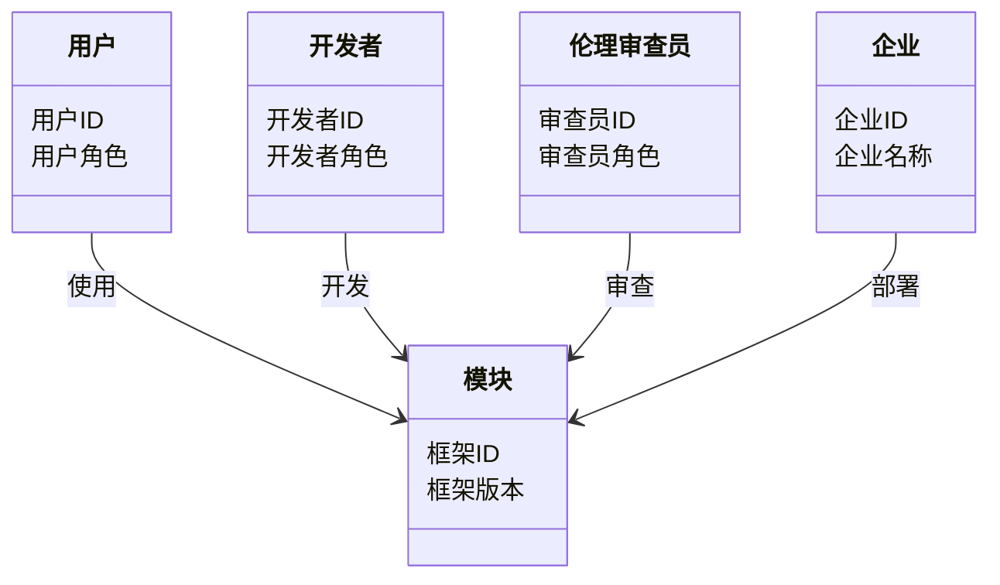

                 


# 构建企业级AI伦理框架：确保AI应用的公平性、透明度与问责制

---

## 关键词  
企业级AI伦理框架、公平性、透明度、问责制、AI系统设计、伦理审查、系统架构  

---

## 摘要  
随着人工智能技术的快速发展，AI在企业中的应用越来越广泛。然而，AI系统的决策过程可能会引发公平性、透明度和问责制等问题。本文旨在构建一个企业级AI伦理框架，确保AI应用的公平性、透明度与问责制。文章通过分析核心概念、算法原理、系统架构设计以及项目实战，详细阐述了如何在企业中有效实施AI伦理框架。  

---

## 第一部分：AI伦理框架的背景与核心概念  

### 第1章：问题背景与描述  

#### 1.1 问题背景  
随着AI技术的快速发展，企业级AI应用日益普及。然而，AI系统在决策过程中可能会出现以下问题：  
- **公平性问题**：AI算法可能对某些群体存在偏见，导致不公平的结果。  
- **透明度问题**：AI决策过程复杂，用户难以理解。  
- **问责制问题**：当AI系统出现问题时，责任归属不明确。  

#### 1.2 问题描述  
企业级AI应用的伦理问题主要体现在以下方面：  
1. **公平性**：AI系统在招聘、信贷评估等领域可能因数据偏差导致不公平决策。  
2. **透明度**：用户需要了解AI决策的依据和过程，以便信任和使用。  
3. **问责制**：当AI系统造成损害时，需要明确责任人和追责机制。  

#### 1.3 问题解决与边界  
构建企业级AI伦理框架的目标是：  
- 确保AI应用的决策过程公平、透明。  
- 建立明确的问责机制，便于问题追溯和处理。  

**边界与外延**：  
- **边界**：仅关注AI系统的伦理问题，不涉及技术实现细节。  
- **外延**：涵盖AI系统的全生命周期，包括设计、开发、部署和维护。  

### 第2章：核心概念与联系  

#### 2.1 核心概念原理  
1. **公平性**：确保AI系统对所有用户一视同仁，避免偏见和歧视。  
2. **透明度**：向用户解释AI决策的依据和过程，增强信任。  
3. **问责制**：明确AI系统出现问题时的责任归属和处理机制。  

#### 2.2 核心概念对比  
以下是公平性、透明度和问责制的对比表格：  

| **概念** | **定义** | **特征** |  
|----------|----------|----------|  
| 公平性 | AI系统对所有用户公平对待 | 数据无偏见、决策无歧视 |  
| 透明度 | AI决策过程可解释 | 用户可理解、过程可追溯 |  
| 问责制 | 明确责任归属 | 问题可追溯、责任人可追责 |  

#### 2.3 ER实体关系图  

```mermaid
erDiagram
    用户: 用户ID, 用户角色
    开发者: 开发者ID, 开发者角色
    审查员: 审查员ID, 审查员角色
    企业: 企业ID, 企业名称
    框架: 框架ID, 框架版本
    用户 --> 框架 : 使用
    开发者 --> 框架 : 开发
    审查员 --> 框架 : 审查
    企业 --> 框架 : 部署
```

---

## 第二部分：AI伦理框架的算法与数学模型  

### 第3章：算法原理讲解  

#### 3.1 公平性评估算法  
**目标**：检测AI系统是否存在偏见。  
**流程**：  
1. 收集不同群体的决策结果数据。  
2. 使用统计方法（如偏差检测）分析数据是否存在显著差异。  

**代码示例**：  

```python
import pandas as pd
from sklearn.metrics import confusion_matrix

# 假设y_true是真实标签，y_pred是模型预测结果
y_true = [0, 1, 0, 1, 0, 1]
y_pred = [0, 1, 1, 1, 0, 1]

# 统计不同群体的预测结果
def calculate_bias(y_true, y_pred, group):
    tn, fp, fn, tp = confusion_matrix(y_true[group], y_pred[group]).flatten()
    return {"TP": tp, "FP": fp, "FN": fn, "TN": tn}

# 示例：计算女性群体的偏见
group = y_true == 0
bias = calculate_bias(y_true, y_pred, group)
print(bias)
```

#### 3.2 透明度增强算法  
**目标**：提高AI决策过程的可解释性。  
**流程**：  
1. 使用可解释性模型（如LIME）生成解释。  
2. 将解释结果以可视化方式呈现给用户。  

**代码示例**：  

```python
import lime
from lime import lime_explainer

# 初始化LIME解释器
explainer = lime_explainer.LimeExplainer()
# 生成解释
explanation = explainer.explain_instance(X_sample, model.predict, num_features=5)
# 可视化解释
explanation.as_pyplot()
```

#### 3.3 问责制追踪算法  
**目标**：记录AI决策的全过程，便于追溯。  
**流程**：  
1. 在AI系统中记录每一步决策的输入、输出和日志信息。  
2. 当出现问题时，根据日志回溯问题原因。  

**代码示例**：  

```python
import logging

# 记录日志
logging.basicConfig(level=logging.INFO)
logger = logging.getLogger(__name__)

def log_decision(input_data, prediction, model_id):
    logger.info(f"Model {model_id}输入数据：{input_data}")
    logger.info(f"预测结果：{prediction}")

# 示例日志记录
log_decision(X_sample, y_pred_sample, model_id=1)
```

---

## 第三部分：AI伦理框架的系统架构设计  

### 第4章：系统架构与交互设计  

#### 4.1 系统功能设计  
**模块**：  
- **用户模块**：用户与AI系统交互，获取决策结果和解释。  
- **开发者模块**：开发和维护AI模型，确保符合伦理要求。  
- **伦理审查模块**：审查AI系统的公平性、透明度和问责制。  
- **企业模块**：部署和管理AI系统，确保合规性。  

**领域模型**：  



#### 4.2 系统架构设计  
**架构图**：  


#### 4.3 系统接口与交互设计  
**交互流程**：  

```mermaid
sequenceDiagram
    用户 ->> 开发者模块 : 提交数据
    开发者模块 ->> 模块 : 处理数据
    模块 ->> 伦理审查模块 : 审查结果
    伦理审查模块 ->> 企业模块 : 部署
    用户 <- 处理结果
```

---

## 第四部分：项目实战与案例分析  

### 第5章：项目实战  

#### 5.1 环境安装与配置  
**工具**：  
- Python 3.8+  
- Scikit-learn、LIME库  
- Mermaid、PlantUML  

**安装命令**：  
```bash
pip install scikit-learn lime mermaid
```

#### 5.2 核心代码实现  
**公平性评估代码**：  

```python
import pandas as pd
from sklearn.metrics import confusion_matrix

def calculate_bias(y_true, y_pred, group_mask):
    tn, fp, fn, tp = confusion_matrix(y_true[group_mask], y_pred[group_mask]).flatten()
    return {"TP": tp, "FP": fp, "FN": fn, "TN": tn}

# 示例数据
y_true = [0, 1, 0, 1, 0, 1]
y_pred = [0, 1, 1, 1, 0, 1]
group_mask = y_true == 0  # 假设group_mask为女性群体

bias = calculate_bias(y_true, y_pred, group_mask)
print(bias)
```

**透明度增强代码**：  

```python
import lime
from lime import lime_explainer

explainer = lime_explainer.LimeExplainer()
explanation = explainer.explain_instance(X_sample, model.predict, num_features=5)
explanation.as_pyplot()
```

**问责制追踪代码**：  

```python
import logging

logging.basicConfig(level=logging.INFO)
logger = logging.getLogger(__name__)

def log_decision(input_data, prediction, model_id):
    logger.info(f"Model {model_id}输入数据：{input_data}")
    logger.info(f"预测结果：{prediction}")

log_decision(X_sample, y_pred_sample, model_id=1)
```

#### 5.3 案例分析与解读  
**案例背景**：某企业招聘系统存在性别偏见。  
**问题发现**：通过公平性评估算法检测到女性群体通过率低于男性。  
**解决方案**：  
1. 使用LIME解释模型，发现性别特征对结果影响显著。  
2. 调整模型参数，消除性别偏见。  
3. 记录日志，确保问题可追溯。  

---

## 第五部分：总结与展望  

### 第6章：总结与建议  

#### 6.1 总结  
本文详细阐述了构建企业级AI伦理框架的核心概念、算法原理、系统架构设计和项目实战。通过公平性、透明度和问责制的实现，确保AI系统的伦理合规性。  

#### 6.2 最佳实践  
- **公平性**：定期检测模型偏见，确保数据无偏见。  
- **透明度**：使用可解释性工具，增强用户信任。  
- **问责制**：建立完善的日志系统和追责机制。  

#### 6.3 注意事项  
- 在实际应用中，需结合企业具体情况调整框架。  
- 定期审查和更新伦理框架，确保其适应技术发展。  

#### 6.4 拓展阅读  
- 《AI的伦理与治理》  
- 《机器学习模型的可解释性》  
- 《企业级AI系统的安全与合规》  

---

通过本文的详细讲解，读者可以全面了解如何构建企业级AI伦理框架，并在实际项目中应用这些方法，确保AI系统的公平性、透明度和问责制。

