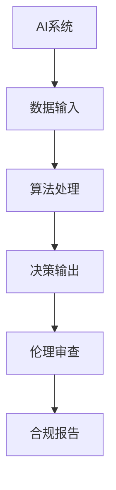
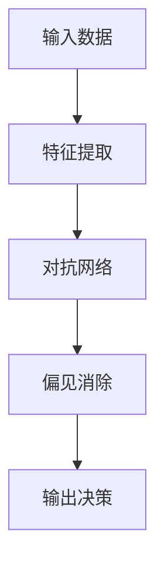
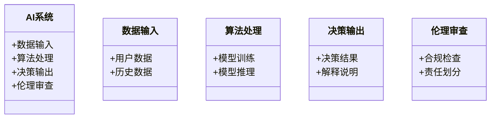

                 


# 《构建企业级AI伦理框架：确保负责任的AI应用》

## 关键词：AI伦理框架、企业级AI、伦理合规、负责任AI、AI算法偏见、AI决策透明性

## 摘要：
随着人工智能技术的快速发展，企业级AI应用日益广泛，但随之而来的伦理问题也日益凸显。本文将系统地介绍构建企业级AI伦理框架的核心概念、算法原理、系统架构和实际应用，帮助读者理解如何在企业中确保AI应用的负责任和合规性。文章将从背景介绍、核心概念、算法原理、系统架构、项目实战到最佳实践，全面解析AI伦理框架的构建过程，并通过实际案例分析，帮助读者掌握构建和实施AI伦理框架的技巧和注意事项。

---

## 第一部分: AI伦理框架的背景与核心概念

### 第1章: AI伦理框架的背景与问题背景

#### 1.1 人工智能的快速发展与伦理挑战
- 从AI技术发展的历史看伦理问题的演变
- 当前企业级AI应用中的伦理问题
- 伦理框架在企业中的必要性

#### 1.2 企业级AI应用的伦理问题
- 数据隐私与个人权利
- AI算法的公平性与偏见
- AI决策的透明性与可解释性
- 伦理框架的边界与外延

#### 1.3 伦理框架的核心要素与组成
- 伦理原则体系
- 伦理审查机制
- 伦理合规框架
- 伦理监控与反馈机制

---

## 第二部分: AI伦理框架的核心概念与联系

### 第2章: AI伦理框架的核心概念与联系

#### 2.1 AI伦理框架的核心原理
- 公平性与透明性
- 责任归属与可追溯性
- 数据隐私与伦理合规

#### 2.2 核心概念对比表
| 概念 | 属性 | 描述 |
|------|------|------|
| 公平性 | 数据分布 | 确保AI系统在不同群体中的公平性 |
| 透明性 | 算法可解释性 | 用户能够理解AI决策过程 |
| 责任归属 | 可追溯性 | 明确AI决策的责任主体 |

#### 2.3 ER实体关系图（Mermaid流程图）


---

## 第三部分: AI伦理框架的算法原理

### 第3章: AI伦理框架的算法原理

#### 3.1 基于对抗训练的偏见消除算法


#### 3.2 偏见消除算法的Python实现
```python
import tensorflow as tf
from tensorflow.keras import layers

# 定义对抗网络
def adversarial_network(input_shape):
    model = tf.keras.Sequential()
    model.add(layers.Dense(64, activation='relu', input_shape=input_shape))
    model.add(layers.Dense(32, activation='relu'))
    model.add(layers.Dense(1, activation='sigmoid'))
    return model

# 训练对抗网络以消除偏见
def train_adversarial_model(X_train, y_train, X_test, y_test):
    model = adversarial_network(X_train.shape[1:])
    model.compile(optimizer='adam', loss='binary_crossentropy', metrics=['accuracy'])
    model.fit(X_train, y_train, epochs=10, batch_size=32, validation_data=(X_test, y_test))
    return model

# 应用对抗网络消除偏见
def remove_bias(input_data, model):
    predictions = model.predict(input_data)
    return predictions
```

#### 3.3 偏见消除的数学模型
$$ P(y|x) = \frac{P(x|y)P(y)}{P(x)} $$
其中：
- $P(y|x)$ 是在给定特征 $x$ 下的标签 $y$ 的后验概率
- $P(x|y)$ 是在标签 $y$ 下的特征 $x$ 的条件概率
- $P(y)$ 是标签 $y$ 的先验概率
- $P(x)$ 是特征 $x$ 的边缘概率

---

## 第四部分: AI伦理框架的系统分析与架构设计

### 第4章: AI伦理框架的系统分析与架构设计

#### 4.1 问题场景介绍
- 医疗AI系统的伦理问题
- 金融AI系统的伦理风险

#### 4.2 系统功能设计（领域模型Mermaid类图）


#### 4.3 系统架构设计（Mermaid架构图）


#### 4.4 系统接口设计
- 输入接口：用户请求
- 输出接口：决策结果
- 交互流程：用户请求 --> API网关 --> AI模型服务 --> EthicalReviewService --> 返回结果

---

## 第五部分: AI伦理框架的项目实战

### 第5章: AI伦理框架的项目实战

#### 5.1 环境安装
```bash
pip install tensorflow==2.5.0
pip install keras==2.5.0
pip install mermaid
```

#### 5.2 核心代码实现
```python
def build_ethical_framework():
    # 初始化AI系统
    ai_system = AISystem()
    # 加载数据
    data = load_data()
    # 训练模型
    model = train_model(data)
    # 进行伦理审查
    ethical_review(model)
    return ai_system

def train_model(data):
    # 训练AI模型
    pass

def ethical_review(model):
    # 进行伦理审查
    pass
```

#### 5.3 代码应用解读与分析
- 核心代码实现AI系统的构建
- 数据加载与模型训练
- 伦理审查的具体实现

#### 5.4 案例分析与详细讲解
- 医疗AI系统的伦理框架应用
- 金融AI系统的伦理审查

#### 5.5 项目小结
- 项目总结
- 经验与教训

---

## 第六部分: AI伦理框架的最佳实践

### 第6章: AI伦理框架的最佳实践

#### 6.1 最佳实践 tips
- 数据隐私保护
- 透明性的重要性
- 动态伦理框架

#### 6.2 小结
- AI伦理框架的重要性
- 未来发展趋势
- 持续改进的必要性

#### 6.3 注意事项
- 数据隐私保护
- 透明性的重要性
- 动态伦理框架

#### 6.4 拓展阅读
- 推荐书籍
- 推荐文章
- 推荐课程

---

通过以上目录，您可以系统地学习和构建企业级AI伦理框架，确保AI应用的负责任和合规性。

