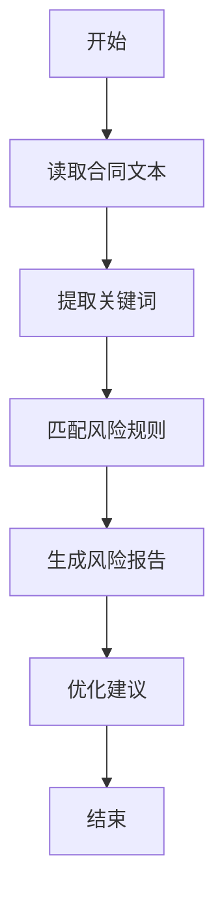
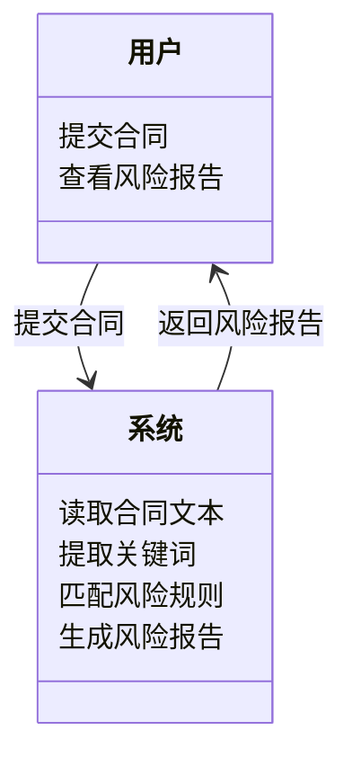
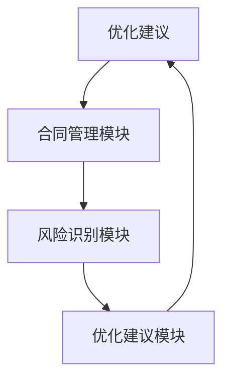
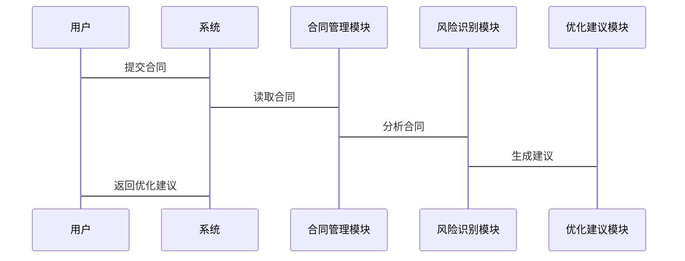

                 


# 《构建企业级AI合同管理助手：风险识别与优化》

---

## 关键词：
企业级AI、合同管理、风险识别、深度学习、自然语言处理、系统架构

---

## 摘要：
本文将深入探讨如何利用人工智能技术构建企业级合同管理助手，重点分析合同管理中的风险识别与优化问题。通过结合自然语言处理（NLP）和深度学习技术，我们提出了一种高效的合同风险识别方法，并设计了相应的优化策略。文章从背景、核心概念、算法原理、系统架构到项目实战，逐步展开，为企业级合同管理的智能化转型提供理论和实践指导。

---

# 第一部分: 背景与目标

## 第1章: 问题背景与目标

### 1.1 合同管理的挑战与痛点
#### 1.1.1 传统合同管理的效率问题
- 合同数量庞大，人工审查耗时且效率低。
- 容易出现遗漏风险点的情况，导致法律纠纷。

#### 1.1.2 合同风险识别的难点
- 合同条款复杂，涉及法律术语和专业领域知识。
- 风险点分布隐性，难以通过简单规则识别。

#### 1.1.3 企业对智能化合同管理的需求
- 提高合同处理效率，降低人工成本。
- 实现合同风险的智能化识别与预警。

### 1.2 企业级AI合同管理助手的核心目标
#### 1.2.1 提升合同处理效率
- 自动化合同分类、提取关键信息。
- 快速生成合同摘要，减少人工操作。

#### 1.2.2 实现合同风险的智能化识别
- 识别合同中的潜在法律风险。
- 提供风险点的详细解释和优化建议。

#### 1.2.3 优化合同管理流程
- 通过AI辅助减少人为错误。
- 提供合同模板优化建议，降低风险。

### 1.3 本章小结
本章通过分析传统合同管理的痛点和企业对智能化合同管理的需求，明确了构建企业级AI合同管理助手的目标和意义。

---

# 第二部分: 核心概念与联系

## 第2章: 核心概念与原理

### 2.1 AI技术在合同管理中的应用
#### 2.1.1 自然语言处理（NLP）在合同分析中的作用
- 合同文本的分词与实体识别。
- 关键条款的抽取与分类。

#### 2.1.2 深度学习模型在风险识别中的应用
- 使用BERT模型进行合同文本表示。
- 基于深度学习的风险分类与预测。

### 2.2 合同管理的领域模型
#### 2.2.1 合同的基本要素
- 合同主题、合同主体、合同客体。
- 合同生效条件、履行期限、违约责任。

#### 2.2.2 风险识别的关键因素
- 合同条款的合规性。
- 合同履行的可能性。
- 合同的可执行性。

#### 2.2.3 优化建议的生成逻辑
- 针对性建议：修改条款、补充条款。
- 风险排序：优先处理高风险条款。

### 2.3 AI合同管理助手的核心原理
#### 2.3.1 数据预处理与特征提取
- 合同文本的清洗与标准化。
- 词袋模型与词嵌入的构建。

#### 2.3.2 风险识别的算法选择
- 基于规则的浅层方法。
- 基于深度学习的端到端模型。

#### 2.3.3 优化建议的生成机制
- 基于模板的生成。
- 基于相似案例的迁移学习。

## 第3章: 核心概念与联系的Mermaid图

### 3.1 实体关系图
```mermaid
erDiagram
    actor 用户
    actor 系统
    actor 合同数据库
    actor 风险规则库
    用户 --> 系统: 提交合同
    系统 --> 合同数据库: 查询合同信息
    系统 --> 风险规则库: 查询风险规则
    系统 --> 用户: 返回风险报告
```

### 3.2 算法流程图


---

# 第三部分: 算法原理与数学模型

## 第4章: 自然语言处理与合同分析

### 4.1 NLP基础
- 分词、实体识别、文本表示。
- 使用预训练模型（如BERT）进行合同文本分析。

#### BERT模型在合同分析中的应用
- 输入合同文本，输出文本向量。
- 通过BERT模型获取上下文语义。

#### 文本相似度计算
- 使用余弦相似度衡量合同条款相似性。
- $$\text{similarity} = \frac{\vec{a} \cdot \vec{b}}{\|\vec{a}\| \|\vec{b}\|}$$

---

## 第5章: 风险识别的算法实现

### 5.1 基于深度学习的风险分类
- 使用预训练模型进行合同文本分类。
- 通过微调模型提升风险识别准确率。

#### 深度学习模型的训练流程
1. 数据预处理：清洗、标注。
2. 模型选择：BERT、LSTM等。
3. 模型训练：监督学习，端到端优化。

### 5.2 风险识别的数学模型
- 使用条件概率公式计算风险概率。
- $$P(\text{风险} | \text{条款}) = \frac{P(\text{条款} | \text{风险}) \cdot P(\text{风险})}{P(\text{条款})}$$

---

# 第四部分: 系统分析与架构设计

## 第6章: 系统功能设计

### 6.1 问题场景介绍
- 合同提交、风险识别、优化建议生成。
- 系统功能包括：合同上传、风险报告生成、优化建议输出。

#### 系统功能模块
- 合同上传模块：用户上传合同文本。
- 风险识别模块：系统自动识别风险点。
- 优化建议模块：生成优化方案。

### 6.2 系统功能的Mermaid类图


---

## 第7章: 系统架构设计

### 7.1 系统架构的Mermaid图


### 7.2 系统接口设计
- 合同上传接口：`POST /api/upload`
- 风险识别接口：`GET /api/risk/{contractId}`
- 优化建议接口：`GET /api/optimization/{contractId}`

### 7.3 系统交互的Mermaid序列图


---

# 第五部分: 项目实战

## 第8章: 项目实战与实现

### 8.1 环境安装与配置
- 安装Python、TensorFlow、BERT库。
- 安装Jupyter Notebook进行开发。

#### 安装命令示例
```bash
pip install python-transformers
pip install tensorflow
pip install jupyter
```

### 8.2 核心代码实现

#### 合同文本预处理代码
```python
import transformers

def preprocess_contract(text):
    tokenizer = transformers.BertTokenizer.from_pretrained('bert-base-uncased')
    inputs = tokenizer(text, return_tensors='np', padding=True, truncation=True)
    return inputs
```

#### 风险识别模型训练代码
```python
from tensorflow.keras import layers, Model

def build_model(tokenizer):
    bert_model = transformers.BertModel.from_pretrained('bert-base-uncased')
    input_ids = layers.Input(shape=(128,), dtype='int64')
    attention_mask = layers.Input(shape=(128,), dtype='int64')
    outputs = bert_model(input_ids, attention_mask=attention_mask)
    pooled_output = outputs.last_hidden_state[:, 0, :]
    dense_layer = layers.Dense(64, activation='relu')(pooled_output)
    prediction = layers.Dense(2, activation='softmax')(dense_layer)
    model = Model(inputs=[input_ids, attention_mask], outputs=prediction)
    model.compile(optimizer='adam', loss='sparse_categorical_crossentropy', metrics=['accuracy'])
    return model
```

### 8.3 案例分析与优化建议
- 案例一：租赁合同中的押金条款。
- 案例二：采购合同中的交货期限。

#### 案例分析代码
```python
import transformers

tokenizer = transformers.BertTokenizer.from_pretrained('bert-base-uncased')
model = build_model(tokenizer)

def predict_risk(text):
    inputs = preprocess_contract(text)
    prediction = model.predict([inputs['input_ids'], inputs['attention_mask']])[0]
    return prediction
```

### 8.4 项目总结
- 成功实现了合同风险识别与优化建议生成。
- 系统具备良好的可扩展性和可维护性。

---

# 第六部分: 总结与展望

## 第9章: 总结与展望

### 9.1 全文总结
- 本文提出了构建企业级AI合同管理助手的方法。
- 通过NLP和深度学习技术实现了合同风险识别与优化。

### 9.2 未来展望
- 增加更多合同类型的支持。
- 引入实时监控功能，动态识别风险。

### 9.3 注意事项
- 数据隐私保护。
- 模型的可解释性问题。

### 9.4 最佳实践Tips
- 定期更新模型，保持高准确率。
- 结合企业内部规则，优化模型表现。

---

通过以上目录结构，文章系统地介绍了企业级AI合同管理助手的构建过程，从理论到实践，为读者提供了全面的技术指导和实践方案。

