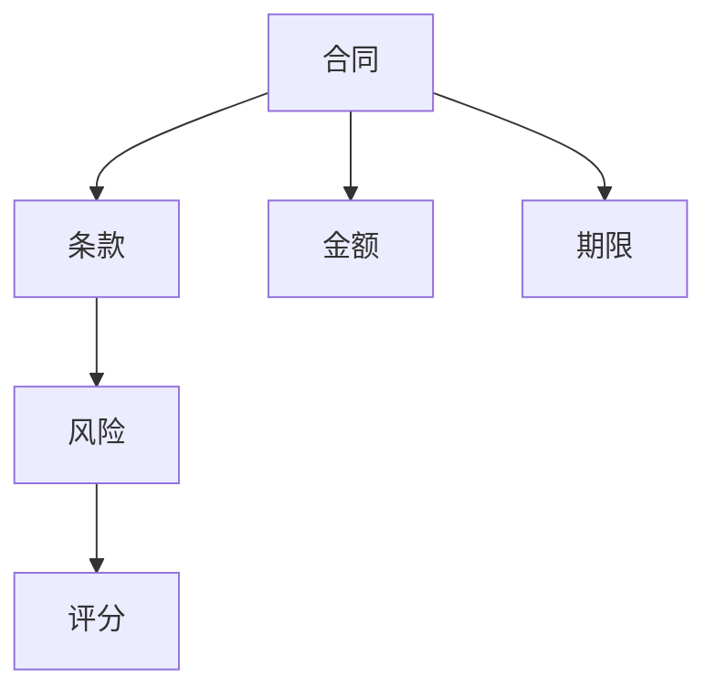
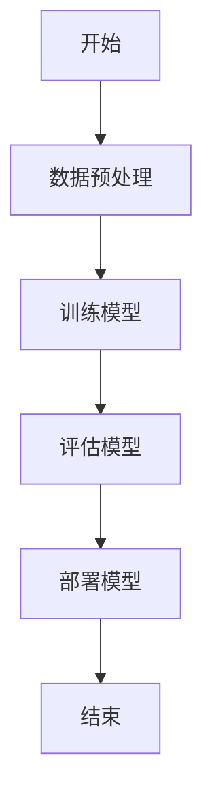
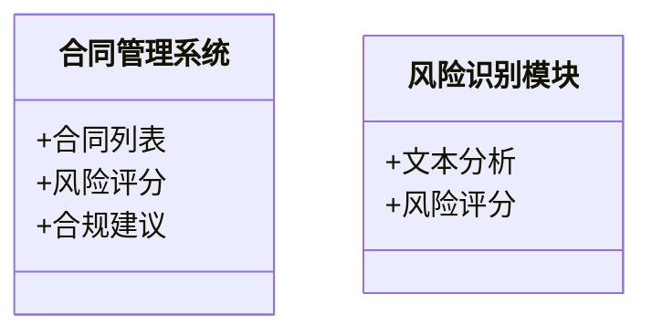
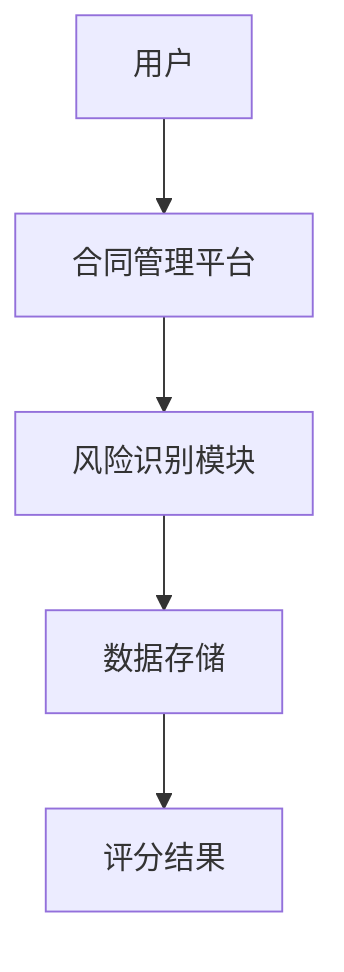
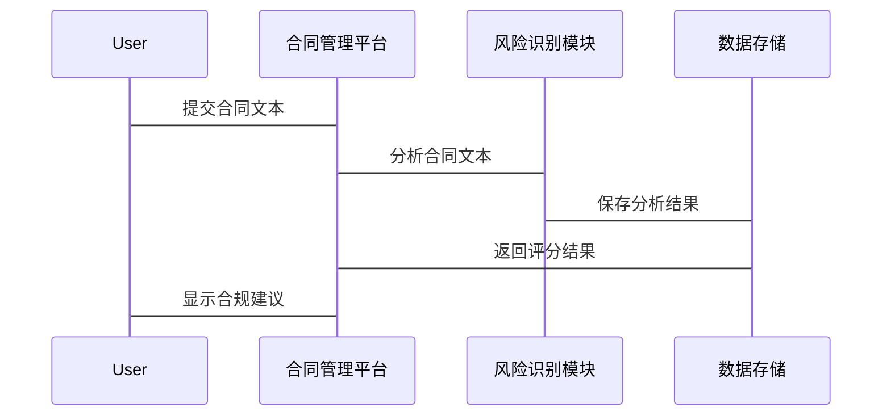

                 


# 构建企业级AI合同管理系统：风险识别与优化

## 关键词：企业级AI，合同管理系统，风险识别，NLP技术，系统优化，系统架构设计，数学模型

## 摘要

本文将详细介绍如何构建一个高效的企业级AI合同管理系统，重点探讨其中的风险识别与优化策略。通过结合人工智能、自然语言处理（NLP）和机器学习技术，我们能够有效识别合同中的潜在风险，并通过系统优化提升整体管理效率。文章将从背景介绍、核心概念、算法原理、系统架构设计到项目实战进行详细阐述，帮助读者全面理解如何在企业级合同管理中应用AI技术。

---

## 第一章：背景介绍

### 1.1 问题背景

#### 1.1.1 合同管理的痛点与挑战
合同管理是企业运营中的核心环节，但传统合同管理方式存在以下痛点：
- **效率低下**：人工审核合同耗时长，容易遗漏关键条款。
- **风险难以识别**：合同中的潜在风险（如违约风险、法律风险）难以提前发现。
- **数据孤岛**：合同数据分散，难以与其他系统（如财务系统、CRM系统）集成。
- **合规性问题**：合同条款是否符合法律法规难以快速验证。

#### 1.1.2 AI技术在合同管理中的应用价值
AI技术能够通过以下方式解决上述问题：
- **自动化合同分析**：利用NLP技术快速提取合同中的关键信息。
- **风险预测**：基于机器学习模型识别潜在风险。
- **智能匹配**：自动匹配合同条款与企业标准或法律法规。

#### 1.1.3 企业级合同管理系统的边界与外延
企业级合同管理系统的核心边界包括：
- **输入**：结构化或非结构化的合同文档。
- **输出**：合同关键信息提取、风险评分、合规建议。
- **外延**：与企业其他系统（如ERP、CRM）的集成。

---

### 1.2 问题描述

#### 1.2.1 合同管理中的风险类型
合同中的风险主要分为以下几类：
- **法律风险**：合同条款不符合法律法规。
- **商业风险**：合同中存在不公平条款或违约风险。
- **合规风险**：合同未通过企业内部审核流程。

#### 1.2.2 风险识别的难点与关键点
- **难点**：
  - 合同文本的非结构化特征。
  - 不同合同类型（如采购合同、销售合同）的风险点不同。
- **关键点**：
  - 精准提取合同中的关键信息。
  - 建立高效的训练数据集。

#### 1.2.3 系统优化的目标与核心要素
- **目标**：
  - 提升合同管理效率。
  - 实现风险的智能化识别与预警。
- **核心要素**：
  - 高精度的NLP模型。
  - 可扩展的系统架构。

---

### 1.3 问题解决

#### 1.3.1 AI技术如何解决合同管理问题
- **自动化处理**：AI能够快速处理大量合同文档。
- **智能分析**：通过NLP技术识别合同中的关键信息。
- **风险预警**：基于机器学习模型预测潜在风险。

#### 1.3.2 风险识别与优化的具体实现路径
1. 数据预处理：清洗和标注合同数据。
2. 模型训练：基于标注数据训练风险识别模型。
3. 系统集成：将模型部署到企业级合同管理系统中。

#### 1.3.3 系统优化的边界与实现方式
- **边界**：仅处理合同文本，不涉及其他业务系统。
- **实现方式**：通过模块化设计优化系统性能。

---

## 第二章：核心概念与联系

### 2.1 核心概念原理

#### 2.1.1 风险识别的原理
- 风险识别基于NLP技术，通过分析合同文本中的关键词和语义关系，判断潜在风险。

#### 2.1.2 NLP技术在合同分析中的应用
- **分词**：将合同文本分割成词语。
- **实体识别**：识别合同中的关键实体（如公司名称、金额）。
- **情感分析**：判断合同条款的公平性。

#### 2.1.3 系统架构设计的逻辑
- 采用分层架构：数据层、业务逻辑层、用户界面层。

---

### 2.2 核心概念属性特征对比表

| **核心概念** | **属性特征** | **描述** |
|--------------|--------------|----------|
| 合同管理系统 | 数据处理能力 | 支持结构化与非结构化数据 |
| 风险识别模型 | 准确率 | 基于训练数据的分类准确率 |
| NLP模型 | 可解释性 | 模型输出的可解释性高低 |

---

### 2.3 ER实体关系图



---

## 第三章：算法原理讲解

### 3.1 算法原理概述

#### 3.1.1 基于规则的风险识别模型
- **规则设定**：例如，识别“违约金”关键词即标记为高风险。

#### 3.1.2 基于深度学习的风险识别模型
- **模型选择**：采用双向LSTM网络。
- **训练数据**：需要大量标注数据。

#### 3.1.3 混合模型的优势与劣势
- **优势**：结合规则和深度学习的优点。
- **劣势**：模型复杂度较高。

---

### 3.2 算法流程图



---

### 3.3 算法实现代码

```python
# 基于规则的模型实现
def risk_rule(text):
    risk_keywords = ['违约', '罚款', '赔偿']
    for keyword in risk_keywords:
        if keyword in text:
            return '高风险'
    return '低风险'

# 基于深度学习的模型实现
import tensorflow as tf
from tensorflow.keras import layers

model = tf.keras.Sequential([
    layers.Embedding(input_dim=10000, output_dim=16),
    layers.Dropout(0.5),
    layers.LSTM(64),
    layers.Dense(1, activation='sigmoid')
])

model.compile(loss='binary_crossentropy', optimizer='adam', metrics=['accuracy'])
```

---

### 3.4 数学模型与公式

#### 基于规则的模型公式
$$ P(\text{风险} | \text{关键词存在}) = 1 $$

#### 基于深度学习的模型公式
$$ P(\text{风险}) = \sigma(w_1x_1 + w_2x_2 + \dots + w_nx_n) $$
其中，$\sigma$为sigmoid函数，$w_i$为模型参数，$x_i$为输入特征。

---

## 第四章：系统分析与架构设计方案

### 4.1 问题场景介绍

#### 4.1.1 项目介绍
- **项目目标**：构建企业级AI合同管理系统。
- **项目范围**：支持多种合同类型，提供风险识别功能。

#### 4.1.2 系统功能设计（领域模型）


---

### 4.2 系统架构设计

#### 4.2.1 系统架构图


---

### 4.3 系统接口设计

#### 4.3.1 接口描述
- **输入接口**：接收合同文本。
- **输出接口**：返回风险评分和合规建议。

---

### 4.4 系统交互流程



---

## 第五章：项目实战

### 5.1 环境安装

#### 5.1.1 安装Python环境
```bash
python --version
pip install --upgrade pip
```

#### 5.1.2 安装依赖包
```bash
pip install numpy pandas scikit-learn tensorflow
```

---

### 5.2 系统核心实现源代码

#### 5.2.1 风险识别模块实现
```python
import pandas as pd
from sklearn.feature_extraction.text import TfidfVectorizer
from sklearn.svm import SVC

# 数据加载
data = pd.read_csv('contract_risk.csv')

# 特征提取
vectorizer = TfidfVectorizer()
X = vectorizer.fit_transform(data['text'])
y = data['label']

# 模型训练
model = SVC()
model.fit(X, y)

# 预测
def predict_risk(text):
    X_test = vectorizer.transform([text])
    return model.predict(X_test)[0]
```

---

### 5.3 代码应用解读与分析

#### 5.3.1 代码解读
- **数据加载**：读取合同文本数据。
- **特征提取**：使用TF-IDF提取文本特征。
- **模型训练**：基于SVM算法训练风险识别模型。

#### 5.3.2 代码实现
- 预测合同文本的风险等级。

---

### 5.4 实际案例分析

#### 5.4.1 案例描述
- **合同文本**：采购合同，包含“违约金”条款。

#### 5.4.2 系统输出
- **风险评分**：高风险。
- **合规建议**：建议法律顾问复核。

---

## 第六章：最佳实践与小结

### 6.1 最佳实践

#### 6.1.1 数据质量管理
- 确保数据的准确性和完整性。

#### 6.1.2 模型优化
- 定期更新模型，确保识别准确率。

---

### 6.2 小结

本文详细介绍了如何构建企业级AI合同管理系统，重点探讨了风险识别与优化策略。通过结合AI技术、NLP和机器学习，我们可以显著提升合同管理效率，降低企业风险。

---

### 6.3 注意事项

- **数据隐私**：确保合同数据的安全性。
- **模型解释性**：选择可解释性较高的模型。

---

### 6.4 拓展阅读

- 《深度学习实战》
- 《自然语言处理入门》

---

以上是构建企业级AI合同管理系统：风险识别与优化的技术博客文章的完整目录大纲。如需进一步细化各部分内容或调整结构，请随时告知！

