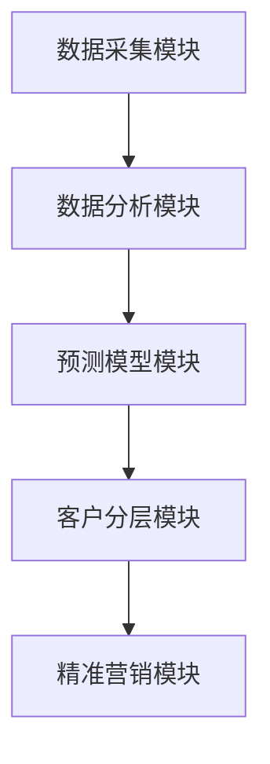
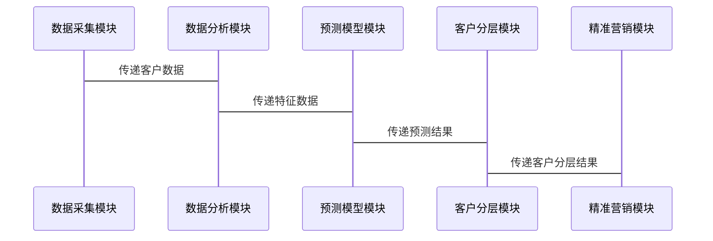
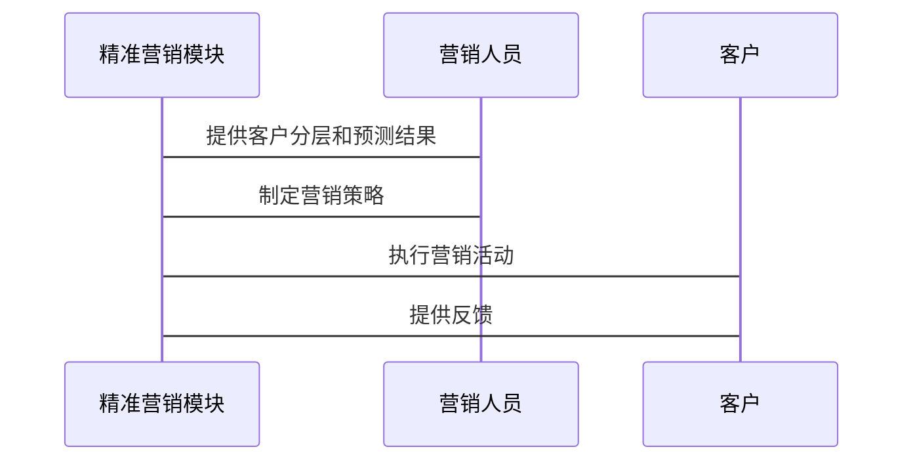

                 


# 《构建企业级AI客户生命周期管理助手》

> 关键词：客户生命周期管理，人工智能，机器学习，客户画像，行为预测，精准营销

> 摘要：本文详细探讨了如何利用人工智能技术构建企业级的客户生命周期管理助手。通过分析客户生命周期的核心概念、AI技术在各阶段的应用、系统架构设计以及实际项目实现，为读者提供从理论到实践的全面指导。

---

# 第一部分：企业级AI客户生命周期管理助手的背景与概念

## 第1章：客户生命周期管理概述

### 1.1 客户生命周期管理的定义与重要性

#### 1.1.1 客户生命周期的定义
客户生命周期（Customer Life Cycle）是指客户从首次接触到企业，到成为忠实客户，最终可能流失的整个过程。这一过程通常包括以下几个阶段：
- **获取阶段**：吸引新客户。
- **激活阶段**：促使客户首次使用或购买。
- **留存阶段**：提升客户粘性和满意度。
- **增长阶段**：通过交叉销售或升级服务增加客户价值。
- **流失阶段**：客户终止与企业的关系。

客户生命周期管理的目标是通过分析客户在不同阶段的行为和需求，制定相应的策略，以提高客户满意度、忠诚度和生命周期价值。

#### 1.1.2 客户生命周期管理的重要性
- **提高客户满意度**：通过个性化服务和精准营销，满足客户的个性化需求。
- **提升客户忠诚度**：通过持续的价值提供，增强客户对企业品牌的黏性。
- **降低客户流失率**：通过预测客户流失风险，提前采取措施。
- **提高企业效率**：自动化客户管理流程，减少人工干预，提升效率。

#### 1.1.3 客户生命周期管理的核心目标
- **最大化客户生命周期价值**：通过优化客户在各个阶段的体验，提升客户为企业带来的收益。
- **提高客户 retention 率**：通过精准的客户管理策略，减少客户流失。
- **降低客户获取成本**：通过精准营销，降低获取新客户的成本。

---

## 第2章：AI在客户生命周期管理中的作用

### 2.1 AI技术如何优化客户管理
人工智能技术在客户生命周期管理中的应用主要体现在以下几个方面：
- **客户画像构建**：通过机器学习算法，分析客户的 demographic（人口统计）、psychographic（心理特征）、 behavioral（行为特征）和 transactional（交易特征）数据，构建精准的客户画像。
- **客户行为预测**：通过时间序列分析、回归分析和分类算法，预测客户在不同阶段的行为，如购买意愿、流失风险等。
- **个性化推荐**：基于客户画像和行为预测结果，为客户提供个性化的产品推荐和营销策略。

### 2.2 AI在客户生命周期各阶段的应用

#### 2.2.1 获取阶段
- **潜在客户识别**：通过数据分析，识别具有高潜力的潜在客户。
- **精准营销**：利用机器学习模型，预测潜在客户的转化概率，制定精准的营销策略。

#### 2.2.2 激活阶段
- **客户激活策略**：通过自动化流程，推动客户完成首次购买或使用。
- **客户教育**：通过推荐系统和知识库，帮助客户更好地理解和使用产品。

#### 2.2.3 留存阶段
- **客户满意度预测**：通过 sentiment analysis 和情感计算，预测客户的满意度。
- **客户反馈分析**：通过自然语言处理（NLP）技术，分析客户反馈，识别改进点。

#### 2.2.4 增长阶段
- **交叉销售和升级销售**：通过关联规则挖掘和推荐算法，发现客户的潜在需求，推荐相关产品或服务。
- **客户价值提升**：通过客户分层和价值评估，制定差异化策略，提升高价值客户的产品使用深度。

#### 2.2.5 流失阶段
- **客户流失预测**：通过机器学习模型，预测客户流失的风险。
- **客户挽回策略**：针对高风险客户，制定个性化的挽回方案，降低客户流失率。

---

## 第3章：企业级AI客户生命周期管理助手的核心概念

### 3.1 客户画像的构建

#### 3.1.1 客户画像的维度
- ** demographic 信息**：年龄、性别、职业、收入水平等。
- **心理特征**：兴趣爱好、价值观、消费习惯等。
- **行为特征**：购买频率、购买时间、渠道偏好等。
- **交易特征**：交易金额、忠诚度、复购率等。

#### 3.1.2 客户画像的构建过程
1. 数据采集：收集客户的相关数据，包括历史交易数据、行为数据、问卷调查数据等。
2. 数据清洗：去除重复数据、缺失数据和异常数据。
3. 数据分析：通过聚类分析、主成分分析（PCA）等技术，提取客户画像的关键特征。
4. 可视化展示：通过图表和仪表盘，直观展示客户画像。

### 3.2 客户行为预测模型

#### 3.2.1 预测模型的构建
- **数据准备**：收集客户的历史行为数据和目标变量（如购买行为、流失行为等）。
- **特征选择**：选择对目标变量影响较大的特征。
- **模型训练**：使用逻辑回归、决策树、随机森林等算法，训练预测模型。
- **模型评估**：通过准确率、召回率、F1分数等指标，评估模型的性能。

#### 3.2.2 预测模型的应用
- **客户流失预测**：通过预测客户流失概率，制定挽回策略。
- **客户购买预测**：通过预测客户的购买概率，制定精准营销策略。

### 3.3 客户分层与精准营销

#### 3.3.1 客户分层
- **客户分层方法**：基于 RFM（Recency、Frequency、Monetary）模型，将客户分为不同的层级，如高价值客户、中价值客户、低价值客户等。
- **客户分层的意义**：通过客户分层，制定差异化策略，提高客户管理效率。

#### 3.3.2 精准营销策略
- **个性化推荐**：基于客户画像和行为预测结果，推荐个性化的产品和服务。
- **动态定价**：根据客户的价值和需求，动态调整产品价格。

---

## 第4章：企业级AI客户生命周期管理助手的系统架构设计

### 4.1 系统功能设计

#### 4.1.1 核心功能模块
- **数据采集模块**：负责收集客户的多源数据，包括交易数据、行为数据、反馈数据等。
- **数据分析模块**：负责对客户数据进行清洗、特征提取和建模分析。
- **预测模型模块**：负责构建客户流失预测、购买预测等模型。
- **客户分层模块**：负责基于 RFM 模型对客户进行分层。
- **精准营销模块**：根据客户画像和预测结果，制定个性化营销策略。

#### 4.1.2 功能模块之间的关系
- 数据采集模块为数据分析模块提供基础数据。
- 数据分析模块为预测模型模块提供特征和建模支持。
- 预测模型模块为精准营销模块提供客户行为预测结果。
- 客户分层模块为精准营销模块提供客户分层依据。

### 4.2 系统架构设计

#### 4.2.1 系统架构图


#### 4.2.2 数据流方向
- 数据采集模块将收集到的客户数据传递给数据分析模块。
- 数据分析模块对数据进行清洗和特征提取后，传递给预测模型模块。
- 预测模型模块根据特征数据，训练预测模型，并将结果传递给客户分层模块。
- 客户分层模块根据预测结果和 RFM 模型，对客户进行分层，并将结果传递给精准营销模块。
- 精准营销模块根据客户分层结果和预测模型结果，制定个性化营销策略。

### 4.3 系统接口设计

#### 4.3.1 数据接口
- 数据采集模块与外部数据源的接口：API 接口。
- 数据分析模块与预测模型模块的接口：数据文件或数据库接口。

#### 4.3.2 用户接口
- 管理员界面：用于系统管理、模型训练和参数配置。
- 营销人员界面：用于查看客户分层结果、预测结果和制定营销策略。
- 客户界面：用于客户互动、个性化推荐和反馈提交。

### 4.4 系统交互流程

#### 4.4.1 客户数据采集与分析


#### 4.4.2 精准营销流程


---

## 第5章：企业级AI客户生命周期管理助手的项目实战

### 5.1 项目背景与目标

#### 5.1.1 项目背景
某电子商务公司希望通过构建 AI 客户生命周期管理助手，优化客户的获取、激活、留存、增长和流失管理，提升客户满意度和忠诚度，降低客户流失率。

#### 5.1.2 项目目标
- 实现客户画像的构建和分析。
- 构建客户流失预测模型，预测客户流失风险。
- 基于客户分层结果，制定精准的营销策略。

### 5.2 环境与工具安装

#### 5.2.1 环境要求
- 操作系统：Linux/Windows/MacOS
- Python 版本：3.6+

#### 5.2.2 工具安装
- Python 包管理工具：pip
- 数据处理库：pandas、numpy
- 可视化库：matplotlib、seaborn
- 机器学习库：scikit-learn
- 自然语言处理库：nltk
- 数据库：MySQL、MongoDB

#### 5.2.3 安装命令示例
```bash
pip install pandas numpy matplotlib seaborn scikit-learn nltk
```

---

## 第6章：企业级AI客户生命周期管理助手的核心代码实现

### 6.1 数据采集与清洗

#### 6.1.1 数据采集代码
```python
import pandas as pd
import requests

# 数据采集代码示例：从 API 获取客户数据
url = "https://api.example.com/customers"
response = requests.get(url)
data = response.json()
df = pd.DataFrame(data)
```

#### 6.1.2 数据清洗代码
```python
# 删除缺失值
df.dropna(inplace=True)

# 处理异常值
df[df['age'] > 100] = 0
```

---

### 6.2 客户画像构建

#### 6.2.1 数据分析与建模
```python
from sklearn.cluster import KMeans

# 客户画像构建代码示例
features = df[['age', 'income', 'purchase_frequency']]
model = KMeans(n_clusters=3, random_state=42)
model.fit(features)
df['customer_segment'] = model.predict(features)
```

---

## 第7章：企业级AI客户生命周期管理助手的总结与展望

### 7.1 总结
通过构建企业级 AI 客户生命周期管理助手，企业可以实现客户管理的自动化和智能化，提升客户满意度和忠诚度，降低客户流失率，最终实现客户生命周期价值的最大化。

---

## 第8章：企业级AI客户生命周期管理助手的最佳实践

### 8.1 小结
- 确保数据的准确性和完整性。
- 选择合适的机器学习算法，提升模型的准确性和可解释性。
- 定期更新模型，适应市场和客户需求的变化。

### 8.2 注意事项
- 数据隐私和安全问题需要高度重视。
- 在实际应用中，需要结合企业的具体业务场景和目标。

### 8.3 拓展阅读
- 《机器学习实战》
- 《数据分析的实践与技巧》
- 《客户关系管理的创新与实践》

---

通过以上目录和内容的设计，您可以开始撰写完整的文章，确保每章内容详细且逻辑清晰。

