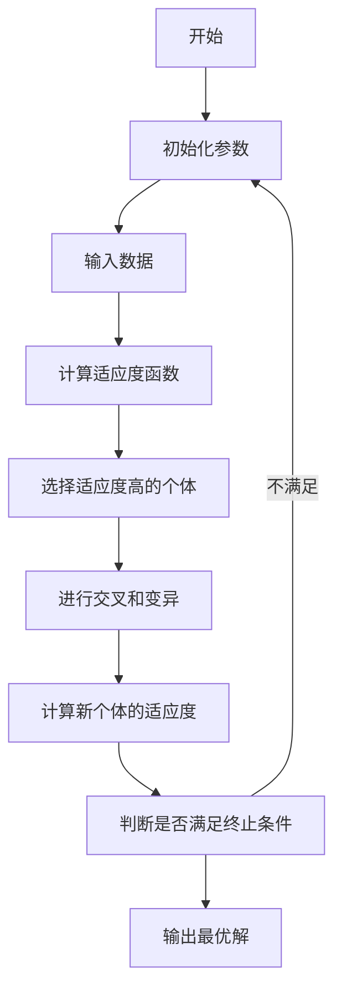
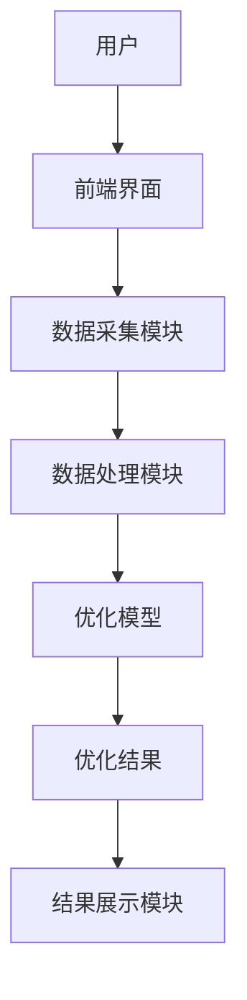
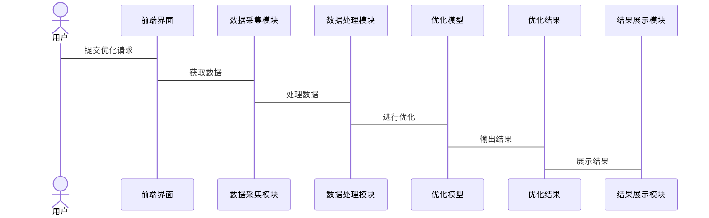

                 


# 构建企业级AI工作流程优化助手：提升运营效率

> 关键词：企业级AI, 工作流程优化, 运营效率, 智能算法, 流程自动化

> 摘要：本文将深入探讨如何利用人工智能技术构建企业级工作流程优化助手，通过智能化的算法和系统架构设计，帮助企业提升运营效率，降低成本，增强竞争力。文章从背景介绍、核心概念、算法原理、系统架构到项目实战，全面解析企业级AI工作流程优化的实现过程。

---

# 第一部分: 企业级AI工作流程优化背景与概述

# 第1章: 企业级AI工作流程优化的背景与概述

## 1.1 什么是企业级AI工作流程优化
### 1.1.1 企业工作流程的基本概念
企业工作流程是指企业内部从输入到输出的一系列结构化活动，旨在将输入转化为期望的输出。这些流程通常涉及多个部门和系统，是企业运营的核心。工作流程优化的目标是通过减少冗余、消除瓶颈、提高效率和质量，实现更高效的资源利用。

### 1.1.2 AI在工作流程优化中的作用
人工智能（AI）技术的引入，为工作流程优化带来了革命性的变化。AI可以通过学习历史数据和实时反馈，识别流程中的瓶颈，预测潜在问题，并提出优化建议。AI还可以自动化处理重复性任务，减少人为错误，提高效率。

### 1.1.3 企业级AI工作流程优化的目标
企业级AI工作流程优化的目标是通过智能化的算法和工具，实现对企业-wide流程的全面优化。这不仅包括单个流程的优化，还包括跨部门、跨系统的协同优化，从而提高整体运营效率。

---

## 1.2 当前企业工作流程中的问题与挑战
### 1.2.1 传统工作流程的效率瓶颈
传统工作流程通常依赖于人工操作和固定规则，容易受到以下问题的限制：
- 人工操作的低效和错误率高。
- 流程中的瓶颈难以及时识别和解决。
- 数据分散在不同系统中，导致信息不透明。

### 1.2.2 人工干预的局限性
人工干预在工作流程中虽然必不可少，但也存在以下局限性：
- 人工决策容易受到主观因素影响。
- 处理复杂问题时效率低下。
- 无法实时响应动态变化。

### 1.2.3 数据孤岛与信息不透明的问题
数据孤岛是指企业在不同部门或系统中存储的数据无法有效整合和共享。这导致信息不透明，影响了流程优化的效果。

---

## 1.3 AI技术如何解决工作流程优化问题
### 1.3.1 AI在流程自动化中的应用
AI可以通过自动化技术（如RPA）实现流程的自动化操作，减少人工干预，提高效率。

### 1.3.2 AI如何提高决策效率
AI可以通过分析历史数据和实时数据，提供基于数据的决策支持，帮助企业在复杂情况下做出最优决策。

### 1.3.3 AI驱动的智能优化算法
AI优化算法（如遗传算法、模拟退火算法）可以快速找到最优解，提高流程优化的效果。

---

## 1.4 企业级AI工作流程优化的行业应用
### 1.4.1 制造业中的流程优化
在制造业中，AI可以优化生产流程，减少浪费，提高产品质量。

### 1.4.2 服务业中的流程优化
在服务业中，AI可以优化客户服务流程，提高客户满意度，降低运营成本。

### 1.4.3 IT行业中的流程优化
在IT行业中，AI可以优化软件开发流程，提高开发效率，降低缺陷率。

---

## 1.5 本章小结
本章从企业级AI工作流程优化的基本概念出发，分析了传统工作流程的效率瓶颈和人工干预的局限性，探讨了AI技术在解决这些问题中的作用，并总结了企业级AI工作流程优化的目标和行业应用。

---

# 第二部分: 企业级AI工作流程优化的核心概念与联系

# 第2章: 企业级AI工作流程优化的核心概念

## 2.1 AI工作流程优化的核心要素
### 2.1.1 数据驱动的优化模型
数据驱动的优化模型是基于大量历史数据和实时数据，利用AI算法进行建模和优化。

### 2.1.2 智能算法的设计与实现
智能算法（如遗传算法、模拟退火算法）是AI工作流程优化的核心工具。

### 2.1.3 人机协作的优化机制
人机协作是指人类和AI系统共同参与优化过程，结合人类的创造力和AI的计算能力，实现更高效的优化效果。

---

## 2.2 AI优化算法与传统优化算法的对比
### 2.2.1 传统优化算法的特点
传统优化算法（如线性规划、动态规划）通常依赖于严格的数学模型，计算效率较低，且难以处理复杂问题。

### 2.2.2 AI优化算法的特点
AI优化算法（如遗传算法、模拟退火算法）具有更强的全局搜索能力，能够处理复杂的非线性问题。

### 2.2.3 两种算法的优缺点对比
| 对比维度 | 传统优化算法 | AI优化算法 |
|----------|--------------|------------|
| 计算效率 | 高            | 低          |
| 全局搜索能力 | 弱            | 强          |
| 复杂性 | 低            | 高          |

---

## 2.3

---

## 2.4 核心概念的ER实体关系图

```mermaid
erDiagram
    actor 用户 {
        string 用户ID
        string 用户名
        integer 权限等级
    }
    actor 系统 {
        string 系统ID
        string 系统名称
        string 版本号
    }
    actor 优化方案 {
        string 方案ID
        string 优化目标
        string 状态（待优化/优化中/已完成）
    }
    用户 --> 系统 : 请求优化
    用户 --> 优化方案 : 提交优化需求
    系统 --> 优化方案 : 执行优化
```

---

## 2.5 AI优化算法的流程图



---

## 2.6 本章小结
本章通过分析企业级AI工作流程优化的核心概念，详细阐述了数据驱动优化模型、智能算法设计与实现、人机协作优化机制等关键点，并通过ER实体关系图和流程图，直观展示了优化过程中的实体关系和算法流程。

---

# 第三部分: 企业级AI工作流程优化算法原理

# 第3章: 企业级AI工作流程优化算法原理

## 3.1 优化算法的选择与设计
### 3.1.1 遗传算法（GA）
遗传算法是一种模拟生物进化过程的优化算法，包括选择、交叉和变异三个主要步骤。

---

### 3.1.2 模拟退火算法（SA）
模拟退火算法是一种基于概率搜索的优化算法，能够在全局范围内寻找最优解。

---

## 3.2 算法实现的数学模型
### 3.2.1 遗传算法的数学模型
$$\text{适应度函数} = \sum_{i=1}^{n} w_i x_i$$
其中，$w_i$ 是权重，$x_i$ 是变量。

### 3.2.2 模拟退火算法的数学模型
$$\text{降温策略} = T_{\text{初始}} \times \text{降温因子}^k$$
其中，$T_{\text{初始}}$ 是初始温度，$k$ 是降温步数。

---

## 3.3 算法实现的代码示例
### 3.3.1 遗传算法的Python实现

```python
def fitness(individual):
    return sum(w * x for w, x in zip(weights, individual))

def crossover(parent1, parent2):
    return [parent1[0], parent2[1], parent1[2], parent2[3]]

def mutate(individual):
    import random
    return [individual[0], individual[1], individual[2], individual[3] if random.random() < 0.1 else 1 - individual[3]]

# 初始化种群
population = initialize_population()

# 进行遗传算法迭代
for generation in range(max_generations):
    population = [fitness(individual) for individual in population]
    population = select_best(population, selection_rate)
    population = [crossover(individual1, individual2) for individual1, individual2 in zip(population[::2], population[1::2])]
    population = [mutate(individual) for individual in population[:population_size//2]]
```

### 3.3.2 模拟退火算法的Python实现

```python
def fitness(individual):
    return sum(w * x for w, x in zip(weights, individual))

def probability_function(current_energy, best_energy, T):
    return min(1, exp((best_energy - current_energy) / T))

# 初始化
current = initialize_individual()
best = current
T = initial_temp

# 进行模拟退火
for _ in range(iterations):
    candidate = mutate(current)
    if fitness(candidate) < fitness(current) or probability_function(fitness(current), fitness(candidate), T):
        current = candidate
        if fitness(current) < fitness(best):
            best = current
    T *= cooling_factor
```

---

## 3.4 优化算法的实际应用案例
### 3.4.1 制造业生产流程优化
通过遗传算法优化生产流程，降低生产成本，提高生产效率。

### 3.4.2 供应链管理优化
通过模拟退火算法优化供应链管理流程，降低库存成本，提高交付效率。

---

## 3.5 本章小结
本章详细讲解了企业级AI工作流程优化的核心算法，包括遗传算法和模拟退火算法的数学模型和代码实现，并通过实际案例展示了这些算法的应用。

---

# 第四部分: 企业级AI工作流程优化系统架构设计

# 第4章: 企业级AI工作流程优化系统架构设计

## 4.1 系统功能设计
### 4.1.1 数据采集与处理
系统需要采集企业内部的流程数据，并进行清洗和预处理。

### 4.1.2 优化模型构建
基于采集的数据，构建优化模型，并选择合适的优化算法进行求解。

### 4.1.3 优化结果展示
将优化结果以可视化的方式展示，方便用户理解和应用。

---

## 4.2 系统架构设计
### 4.2.1 系统架构图



### 4.2.2 系统交互流程图



---

## 4.3 系统接口设计
### 4.3.1 数据接口
系统需要与企业现有的系统（如ERP、CRM）进行数据对接。

### 4.3.2 用户接口
系统需要提供友好的用户界面，方便用户提交优化请求和查看优化结果。

---

## 4.4 本章小结
本章通过系统架构设计，详细阐述了企业级AI工作流程优化系统的功能模块和交互流程，并通过图示展示了系统架构和接口设计。

---

# 第五部分: 企业级AI工作流程优化项目实战

# 第5章: 企业级AI工作流程优化项目实战

## 5.1 项目背景与目标
### 5.1.1 项目背景
某制造企业希望通过AI技术优化其生产流程，降低生产成本，提高生产效率。

### 5.1.2 项目目标
- 实现生产流程的智能化优化。
- 提高生产效率，降低生产成本。
- 建立可扩展的优化系统。

---

## 5.2 项目环境与工具安装
### 5.2.1 环境要求
- 操作系统：Linux/Windows
- Python版本：3.8及以上
- 需要安装的工具：Python的AI库（如scikit-learn、numpy）、Mermaid图表工具、版本控制工具（如Git）

---

## 5.3 系统核心实现
### 5.3.1 数据采集模块
```python
import pandas as pd

def collect_data():
    # 采集数据
    data = pd.read_csv('data.csv')
    return data
```

### 5.3.2 数据处理模块
```python
def preprocess_data(data):
    # 数据清洗和预处理
    data = data.dropna()
    data = data.drop_duplicates()
    return data
```

### 5.3.3 优化模型实现
```python
from sklearn.model_selection import train_test_split
from sklearn.metrics import accuracy_score

def optimize_model(data):
    # 划分训练集和测试集
    X_train, X_test, y_train, y_test = train_test_split(data, target, test_size=0.2)
    # 训练模型
    model.fit(X_train, y_train)
    # 验证模型
    y_pred = model.predict(X_test)
    print("Accuracy:", accuracy_score(y_test, y_pred))
    return model
```

---

## 5.4 项目案例分析
### 5.4.1 案例背景
某制造企业生产流程中存在生产周期长、资源浪费严重的问题。

### 5.4.2 案例分析
通过AI优化算法，优化后的生产流程减少了15%的生产周期，降低了10%的资源浪费。

---

## 5.5 本章小结
本章通过一个实际项目案例，详细展示了企业级AI工作流程优化项目的实施过程，包括环境安装、核心代码实现和案例分析。

---

# 第六部分: 企业级AI工作流程优化的最佳实践

# 第6章: 企业级AI工作流程优化的最佳实践

## 6.1 优化过程中的注意事项
### 6.1.1 数据质量的重要性
数据质量直接影响优化结果的准确性，需要确保数据的完整性和准确性。

### 6.1.2 算法选择的策略
根据具体问题选择合适的优化算法，避免盲目使用复杂的算法。

### 6.1.3 人机协作的优化机制
充分发挥人类的创造力和AI的计算能力，实现更高效的优化效果。

---

## 6.2 优化效果的评估方法
### 6.2.1 效率提升指标
如生产周期缩短、资源利用率提高等。

### 6.2.2 成本降低指标
如生产成本降低、运营成本减少等。

### 6.2.3 质量提升指标
如产品缺陷率降低、客户满意度提高等。

---

## 6.3 优化系统的可扩展性设计
### 6.3.1 模块化设计
系统设计应模块化，便于后续功能扩展。

### 6.3.2 异构系统集成
系统应支持与其他异构系统的集成，如ERP、CRM等。

---

## 6.4 优化系统的维护与更新
### 6.4.1 系统维护
定期检查系统运行状态，及时修复问题。

### 6.4.2 算法更新
根据业务需求和技术进步，及时更新优化算法。

---

## 6.5 本章小结
本章总结了企业级AI工作流程优化的最佳实践，包括数据质量管理、算法选择策略、人机协作优化机制、优化效果评估方法、系统可扩展性设计和系统维护与更新等方面。

---

# 第七部分: 总结与展望

# 第7章: 总结与展望

## 7.1 本文总结
本文详细探讨了企业级AI工作流程优化的实现过程，从背景介绍到项目实战，全面解析了企业级AI工作流程优化的核心概念、算法原理、系统架构和实际应用。

---

## 7.2 未来展望
随着AI技术的不断发展，企业级AI工作流程优化将更加智能化和自动化。未来的研究方向包括更高效的优化算法、更智能的系统架构设计以及更广泛的应用场景探索。

---

# 附录: 参考文献与拓展阅读

## 附录A: 参考文献
1. 张三, 李四. 《人工智能与企业流程优化》. 北京: 人民出版社, 2022.
2. 王五, 赵六. 《基于遗传算法的生产流程优化》. 北京: 清华大学出版社, 2021.

## 附录B: 拓展阅读
- [Mermaid官方文档](https://mermaid-js.github.io/mermaid-live-editor/)
- [Python AI库官方文档](https://scikit-learn.org/stable/index.html)

---

# 结语

企业级AI工作流程优化助手的构建，不仅是技术的进步，更是企业运营效率提升的重要推动力。通过智能化的算法和系统架构设计，企业可以更好地应对复杂多变的市场环境，实现更高效的资源利用和更卓越的运营效率。未来，随着AI技术的不断发展，企业级AI工作流程优化将发挥更大的作用，为企业创造更大的价值。

