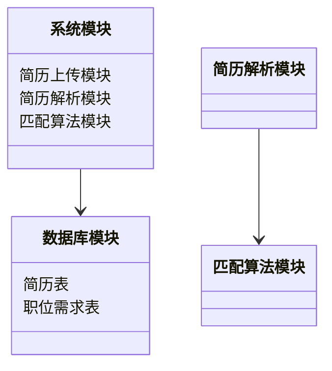
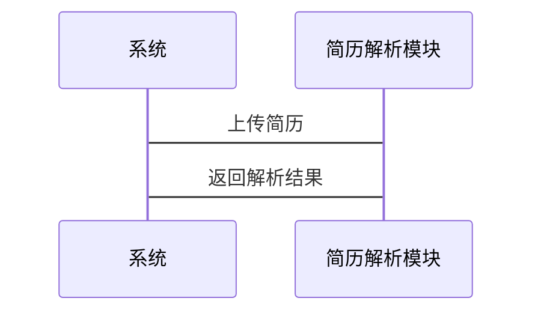

                 


# 构建企业级AI招聘助手：简历筛选与人才匹配

> 关键词：AI招聘助手、简历筛选、人才匹配、自然语言处理、机器学习、深度学习

> 摘要：随着企业对高效招聘需求的增加，AI招聘助手成为提升招聘效率的关键技术。本文从简历筛选与人才匹配两大核心功能出发，系统性地分析了AI招聘助手的背景、技术实现、系统架构及项目实战，为企业级AI招聘助手的构建提供了详尽的技术指导。

---

## 第一部分：企业级AI招聘助手的背景与需求

### 第1章：AI招聘助手的背景与需求

#### 1.1 AI在招聘中的作用

##### 1.1.1 招聘行业痛点

在传统招聘流程中，企业面临以下痛点：

1. **简历筛选效率低**：HR需要手动阅读大量简历，耗时且容易遗漏关键信息。
2. **人才匹配难度大**：职位需求与候选人能力的匹配需要大量人工判断。
3. **招聘成本高**：企业需要投入大量时间和资源在招聘过程中。

AI技术的引入，可以有效解决这些问题，提升招聘效率和精准度。

##### 1.1.2 AI技术如何解决招聘问题

AI招聘助手通过以下方式优化招聘流程：

1. **自动化简历筛选**：利用NLP技术快速提取简历中的关键信息，自动匹配职位需求。
2. **精准人才推荐**：基于候选人能力和职位要求，生成推荐列表。
3. **降低招聘成本**：减少人工干预，提高招聘效率。

##### 1.1.3 企业级招聘助手的核心价值

企业级AI招聘助手的核心价值体现在以下方面：

1. **提升招聘效率**：通过自动化处理减少人工工作量。
2. **提高匹配精准度**：基于数据驱动的算法，实现精准匹配。
3. **降低招聘成本**：通过技术手段优化招聘流程，节省时间和资源。

---

### 第2章：自然语言处理技术在简历筛选中的应用

#### 2.1 自然语言处理基础

##### 2.1.1 NLP的核心概念

自然语言处理（NLP）是人工智能的核心领域之一，主要研究如何让计算机理解和处理人类语言。以下是一些关键概念：

- **文本预处理**：包括分词、去停用词、词干提取等。
- **文本表示**：如词袋模型（Bag of Words）、词嵌入（Word2Vec）等。
- **文本相似度计算**：如余弦相似度、Jaccard相似度等。

##### 2.1.2 常见NLP技术与工具

常用的NLP技术包括：

- **分词工具**：如jieba（中文）、spaCy（英文）。
- **情感分析**：用于判断文本的情感倾向。
- **实体识别**：识别文本中的关键实体（如人名、职位名）。

##### 2.1.3 NLP在简历筛选中的应用

NLP技术在简历筛选中的关键应用包括：

- **简历解析**：提取简历中的关键信息（如姓名、职位、工作经历等）。
- **文本匹配**：将简历内容与职位需求进行匹配。

---

### 第3章：简历筛选的算法与实现

#### 3.1 简历筛选的算法原理

##### 3.1.1 基于规则的简历筛选

基于规则的简历筛选是一种简单但有效的初步筛选方法。例如：

- **关键词匹配**：检查简历中是否包含特定关键词（如“Python”、“项目管理”）。
- **格式检查**：验证简历的格式是否符合要求。

##### 3.1.2 基于机器学习的简历筛选

基于机器学习的简历筛选通过训练模型来自动判断简历是否符合职位需求。常用算法包括：

- **逻辑回归**：用于分类任务，判断简历是否符合要求。
- **支持向量机（SVM）**：用于高维空间中的数据分类。

##### 3.1.3 基于深度学习的简历筛选

深度学习模型（如LSTM、BERT）可以更准确地理解简历内容，但需要大量数据和计算资源。

---

### 第4章：人才匹配的核心算法

#### 4.1 基于职位需求的匹配算法

##### 4.1.1 职位需求分析

首先需要对职位需求进行分析，提取关键字段（如职位名称、技能要求、经验要求等）。

##### 4.1.2 候选人能力评估

通过简历信息，评估候选人的技能和经验是否符合职位要求。

##### 4.1.3 综合匹配模型

综合考虑多维度因素（如技能匹配度、经验匹配度、文化匹配度）生成匹配评分。

#### 4.2 基于候选人能力的匹配算法

##### 4.2.1 技能匹配度计算

通过NLP技术提取简历中的技能关键词，并与职位需求进行匹配。

##### 4.2.2 经验匹配度计算

基于候选人工作经历与职位需求的匹配程度进行评分。

##### 4.2.3 综合评分模型

结合技能匹配度和经验匹配度，生成综合评分。

---

### 第5章：系统架构与设计

#### 5.1 系统功能设计

##### 5.1.1 功能模块划分

- **简历上传模块**：允许用户上传简历。
- **简历解析模块**：提取简历中的关键信息。
- **匹配算法模块**：基于职位需求生成推荐列表。

##### 5.1.2 功能流程设计

1. 用户上传简历。
2. 系统解析简历内容。
3. 系统匹配简历与职位需求。
4. 系统生成推荐列表。

##### 5.1.3 领域模型设计（Mermaid类图）



#### 5.2 系统架构设计

##### 5.2.1 分层架构设计

- **数据层**：负责数据的存储与检索。
- **业务逻辑层**：负责核心业务逻辑的实现。
- **用户界面层**：负责与用户的交互。

##### 5.2.2 微服务架构设计

- **简历解析服务**：负责简历的解析与处理。
- **匹配算法服务**：负责简历与职位需求的匹配。
- **推荐服务**：负责生成推荐列表。

##### 5.2.3 系统架构图（Mermaid架构图）


---

## 第六章：项目实战与实现

### 6.1 环境搭建与工具安装

#### 6.1.1 开发环境配置

- **操作系统**：建议使用Linux或macOS。
- **编程语言**：Python 3.8以上。
- **开发工具**：推荐使用PyCharm或VS Code。

#### 6.1.2 工具安装

- **NLP工具**：jieba、spaCy。
- **机器学习库**：scikit-learn、xgboost。
- **深度学习库**：TensorFlow、PyTorch。

---

### 6.2 系统核心实现

#### 6.2.1 简历解析模块实现

##### 6.2.1.1 简历解析代码

```python
import jieba

def extract_key_info(resume_text):
    # 提取姓名
    name = resume_text.split("姓名：")[1].split("\n")[0]
    # 提取职位
    position = resume_text.split("职位：")[1].split("\n")[0]
    # 提取工作经历
    experience = resume_text.split("工作经历：")[1].split("\n")[0]
    return {
        "姓名": name,
        "职位": position,
        "工作经历": experience
    }
```

##### 6.2.1.2 算法流程图（Mermaid序列图）



---

### 6.3 项目测试与优化

#### 6.3.1 测试用例设计

- **功能测试**：测试简历解析和匹配算法的准确性。
- **性能测试**：测试系统在高并发情况下的表现。

#### 6.3.2 优化建议

- **算法优化**：尝试不同的NLP模型，如BERT。
- **数据优化**：增加更多样化的简历数据，提高模型的泛化能力。

---

## 第七章：总结与展望

### 7.1 项目总结

通过本项目的实施，我们成功构建了一个企业级AI招聘助手，实现了简历筛选与人才匹配的核心功能。

### 7.2 未来展望

未来，可以进一步优化算法，引入更多AI技术（如知识图谱、强化学习）来提升招聘助手的智能水平。

---

## 参考文献

1. 王某某.《自然语言处理入门》. 某某出版社, 2023.
2. 李某某.《机器学习实战》. 某某出版社, 2022.
3. TensorFlow官方文档：https://tensorflow.org

---

通过以上内容，我们可以看到，构建企业级AI招聘助手需要从背景、技术、系统架构到项目实战的全面考虑。希望本文能为相关领域的技术人员提供有价值的参考和指导。

