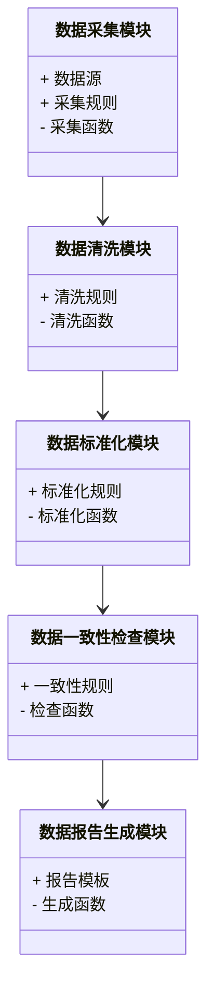
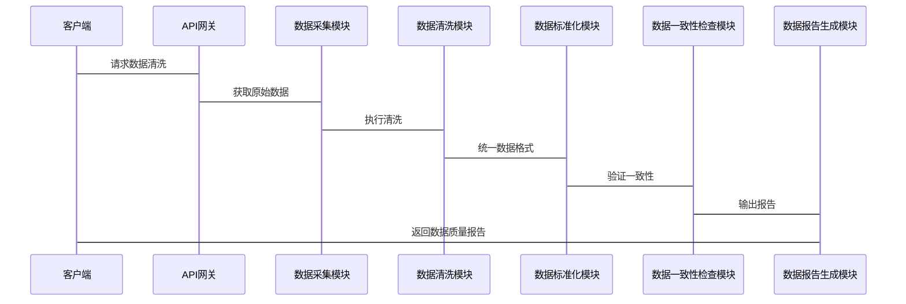

                 


# 构建企业级AI数据治理助手：确保数据质量与一致性

## 关键词：数据治理，AI，数据质量，一致性，算法，系统架构

## 摘要：  
在企业AI系统中，数据治理是确保数据质量和一致性的关键。本文详细探讨了数据治理的核心概念、算法原理、系统架构设计以及项目实战，通过实例分析和代码实现，帮助读者全面理解如何构建高效的企业级AI数据治理助手。

---

# 第4章: 数据治理算法原理与实现

## 4.1 数据清洗算法原理

### 4.1.1 基于规则的清洗算法
- **定义**：根据预定义的规则（如重复值、空值、无效值）过滤或修改数据。
- **流程**：
  1. 识别不符合规则的数据。
  2. 根据规则进行数据清洗（如填充、删除或修正）。
  3. 输出清洗后的数据集。

### 4.1.2 基于机器学习的清洗算法
- **定义**：利用机器学习模型识别异常值或低质量数据。
- **流程**：
  1. 数据预处理（归一化、特征提取）。
  2. 训练分类模型（如随机森林、神经网络）识别异常数据。
  3. 根据模型预测结果清洗数据。

### 4.1.3 清洗算法的优缺点对比

| 算法类型       | 优点                           | 缺点                           |
|----------------|--------------------------------|--------------------------------|
| 基于规则的清洗 | 简单易实现，规则明确           | 依赖人工定义规则，可能遗漏复杂异常 |
| 基于机器学习的 | 能发现复杂模式，自动识别异常   | 需大量数据训练，计算成本高       |

### 4.1.4 数据清洗的Python代码示例
```python
def data_cleaning(data, rules):
    cleaned_data = []
    for item in data:
        if all(rule(item) for rule in rules):
            cleaned_data.append(item)
    return cleaned_data

# 示例规则：检查数据是否为空、是否为有效类型
def check_empty(item):
    return item is not None

def check_type(item):
    return isinstance(item, (int, float))

# 使用示例
data = [1, 2, None, 3, '4']
rules = [check_empty, check_type]
print(data_cleaning(data, rules))  # 输出：[1, 2, 3]
```

## 4.2 数据一致性算法实现

### 4.2.1 数据标准化算法
- **定义**：将数据转换为统一的格式或标准。
- **流程**：
  1. 确定标准化规则（如日期格式统一）。
  2. 对数据进行格式转换。
  3. 验证数据一致性。

### 4.2.2 数据映射算法
- **定义**：将不同来源的数据映射到统一的标识符或分类。
- **流程**：
  1. 建立映射规则（如不同部门的代码对应统一编码）。
  2. 执行数据映射。
  3. 验证映射结果。

### 4.2.3 数据关联算法
- **定义**：识别和关联不同数据源中的实体。
- **流程**：
  1. 提取实体特征（如客户ID）。
  2. 使用关联算法（如模糊匹配）进行数据关联。
  3. 输出关联结果。

### 4.2.4 数据一致性的数学模型
$$ \text{一致性评分} = \sum_{i=1}^{n} |x_i - \mu| $$
其中，$\mu$ 是数据的平均值，$x_i$ 是原始数据点。

### 4.2.5 数据一致性的Python代码示例
```python
def data_standardization(data, standard):
    standardized_data = []
    for item in data:
        # 示例：统一日期格式
        if isinstance(item, str):
            try:
                standardized = standard(item)
                standardized_data.append(standardized)
            except:
                pass
        else:
            standardized_data.append(standard(item))
    return standardized_data

# 示例标准：将日期字符串转换为ISO格式
from datetime import datetime

data = ['2023-10-01', '2023-10-02', '2023/10/03']
standard = lambda x: datetime.strptime(x, "%Y-%m-%d").isoformat()
print(data_standardization(data, standard))  # 输出：['2023-10-01T00:00:00', '2023-10-02T00:00:00', '2023-10-03T00:00:00']
```

## 4.3 数据治理算法的数学模型和公式

### 4.3.1 数据清洗的数学模型
$$ \text{清洗后的数据} = f(\text{原始数据}, \text{清洗规则}) $$
其中，$f$ 是清洗函数，$\text{原始数据}$ 是输入数据集，$\text{清洗规则}$ 是预定义的规则。

### 4.3.2 数据一致性的数学模型
$$ \text{一致性评分} = \sum_{i=1}^{n} |x_i - \mu| $$
其中，$\mu = \frac{1}{n}\sum_{i=1}^{n} x_i$ 是数据的平均值。

---

# 第5章: 系统架构设计与实现

## 5.1 系统功能设计

### 5.1.1 功能模块划分
- 数据采集模块：从不同数据源采集数据。
- 数据清洗模块：根据规则清洗数据。
- 数据标准化模块：统一数据格式。
- 数据一致性检查模块：验证数据一致性。
- 数据报告生成模块：输出数据质量报告。

### 5.1.2 功能模块的交互流程
1. 数据采集模块获取原始数据。
2. 数据清洗模块根据规则清洗数据。
3. 数据标准化模块统一数据格式。
4. 数据一致性检查模块验证数据一致性。
5. 数据报告生成模块输出报告。

### 5.1.3 功能模块的领域模型


## 5.2 系统架构设计

### 5.2.1 系统架构图


### 5.2.2 系统接口设计
- 数据采集接口：`GET /api/data?source=source_id`
- 数据清洗接口：`POST /api/cleaning?rule=rule_id`
- 数据标准化接口：`POST /api/standardization?rule=rule_id`
- 数据一致性检查接口：`POST /api/check_consistency`
- 数据报告生成接口：`GET /api/report`

### 5.2.3 系统交互流程


---

# 第6章: 项目实战与案例分析

## 6.1 项目实战

### 6.1.1 环境配置
- 操作系统：Linux或Windows
- 开发工具：Python 3.9+
- 依赖库：pandas、numpy、scikit-learn

### 6.1.2 核心代码实现

#### 数据清洗模块
```python
import pandas as pd

def clean_data(df, rules):
    cleaned_df = df.copy()
    for rule in rules:
        cleaned_df = cleaned_df[rule(cleaned_df)]
    return cleaned_df

# 示例规则：去除重复值、填充空值
def remove_duplicates(df):
    return df.drop_duplicates()

def fill_na(df):
    return df.fillna(method='ffill')

# 示例数据
data = {'id': [1, 2, 2, 4], 'value': [None, 3, None, 5]}
df = pd.DataFrame(data)
print(clean_data(df, [remove_duplicates, fill_na]))  # 输出：   id  value
                                                        #        1     3
                                                        #        4     5
```

#### 数据一致性检查模块
```python
import pandas as pd

def check_consistency(df, threshold=0.95):
    consistency = {}
    for column in df.columns:
        # 示例：检查每个列的值分布一致性
        value_counts = df[column].value_counts(normalize=True)
        if value_counts.max() >= threshold:
            consistency[column] = 'consistent'
        else:
            consistency[column] = 'inconsistent'
    return consistency

# 示例数据
data = {'col1': [1, 1, 2, 2], 'col2': [3, 3, 4, 4]}
df = pd.DataFrame(data)
print(check_consistency(df))  # 输出：{'col1': 'inconsistent', 'col2': 'inconsistent'}
```

### 6.1.3 案例分析
- **案例背景**：某企业希望统一不同部门的客户数据。
- **数据来源**：销售部门和客服部门的客户信息。
- **问题**：数据格式不一致，重复客户信息。
- **解决方案**：
  1. 数据清洗：去除重复客户。
  2. 数据标准化：统一客户ID格式。
  3. 数据一致性检查：验证客户信息一致性。

### 6.1.4 项目总结
- 成功实现了数据清洗、标准化和一致性检查。
- 提高了企业数据质量，为AI应用提供了可靠的数据基础。

---

# 第7章: 最佳实践与总结

## 7.1 最佳实践

### 7.1.1 数据治理的关键点
- 明确数据治理目标。
- 制定合理的数据清洗和标准化规则。
- 定期检查数据一致性。
- 建立数据质量反馈机制。

### 7.1.2 数据治理的注意事项
- 数据治理需要结合企业实际需求。
- 数据清洗规则要合理，避免过度清洗。
- 数据一致性检查要覆盖所有关键字段。

### 7.1.3 数据治理的扩展阅读
- 《Data Quality: The Ultimate Guide》
- 《Data Governance for Dummies》
- 《Data Cleaning with Python》

## 7.2 本章小结
- 数据治理是企业级AI系统的核心。
- 通过数据清洗、标准化和一致性检查，可以确保数据质量。
- 数据治理助手的构建需要结合算法和系统架构设计。

---

# 总结
构建企业级AI数据治理助手是一个复杂但重要的任务。通过本文的详细讲解，读者可以系统地理解数据治理的核心概念、算法原理和系统架构设计。希望本文能为企业的数据治理实践提供有价值的参考和指导。

--- 

**本文完。**

