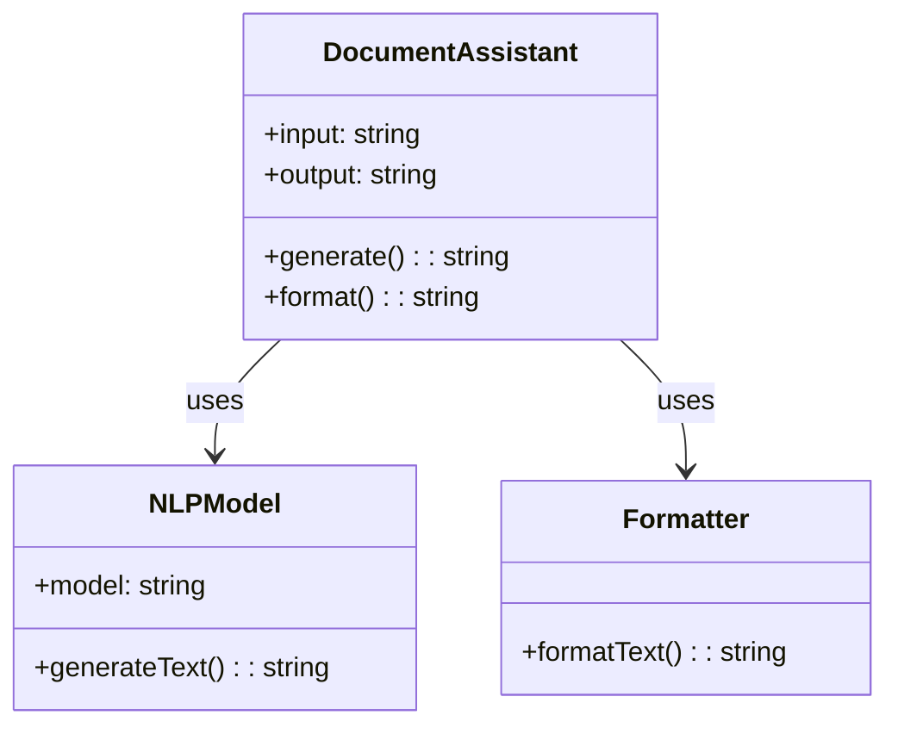
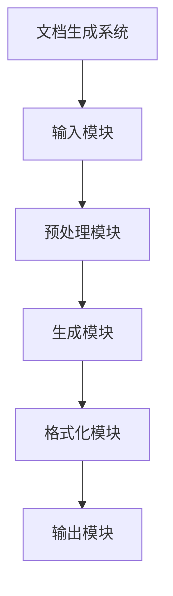
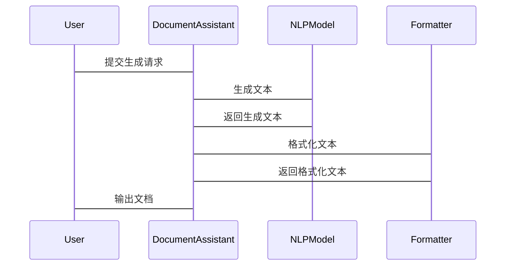

                 


# 构建企业级AI文档助手：自动生成报告与提案

## 关键词：
- 企业级AI文档助手
- 文本生成
- 自然语言处理
- 大语言模型
- 报告自动生成
- 提案生成

## 摘要：
本文详细探讨了如何构建企业级AI文档助手，利用自然语言处理（NLP）技术和大语言模型实现自动化的报告和提案生成。文章从背景介绍、核心概念、算法原理、系统架构到项目实战和最佳实践，全面解析了构建AI文档助手的各个方面。通过详细的技术分析和实际案例，展示了如何利用AI技术提升企业文档处理效率。

---

# 第一部分：AI文档助手的背景与核心概念

## 第1章：AI文档助手的背景与问题背景

### 1.1 问题背景

#### 1.1.1 企业文档处理的现状与挑战
企业在日常运营中会产生大量的文档，包括报告、提案、合同等。传统的文档生成方式依赖人工撰写，效率低、耗时长且容易出错。随着企业规模的扩大，文档数量激增，人工处理的成本和时间成本急剧上升。此外，文档质量的不一致也会影响企业的专业形象和决策效率。

#### 1.1.2 AI技术在文档生成中的应用潜力
人工智能（AI）和自然语言处理（NLP）技术的快速发展为企业文档生成带来了革命性的变化。大语言模型（如GPT系列）具备强大的文本生成能力，可以自动生成结构完整、内容准确的文档。AI文档助手能够根据用户提供的需求快速生成报告和提案，大幅提高了文档处理的效率。

#### 1.1.3 企业级AI文档助手的定义与目标
企业级AI文档助手是一种基于AI技术的企业级工具，能够根据用户提供的需求自动生成各种类型的文档，包括报告、提案、合同等。其目标是通过自动化文档生成，降低企业的人力成本，提高文档生成效率和质量，同时支持多种语言和格式，满足企业的多样化需求。

### 1.2 问题描述

#### 1.2.1 文档生成的痛点分析
- **效率低下**：人工撰写文档耗时长，尤其是在需要频繁生成类似文档的情况下。
- **质量不一致**：不同人员撰写的内容可能存在风格不统一、信息遗漏等问题。
- **成本高昂**：高薪聘请专业写手或团队的成本对企业来说是一个沉重的负担。
- **灵活性不足**：传统文档生成方式难以快速适应企业需求的变化。

#### 1.2.2 企业需求与AI技术的结合点
- **自动化生成**：AI文档助手能够快速生成结构完整、内容准确的文档。
- **智能化调整**：AI可以根据企业的具体需求动态调整文档内容。
- **多语言支持**：AI助手能够生成多种语言的文档，满足全球化企业的需求。

#### 1.2.3 问题边界与外延
AI文档助手的目标是辅助企业生成高质量的文档，但不涵盖文档的最终审阅和校对工作。其外延包括文档管理、内容优化等扩展功能。

### 1.3 核心概念与联系

#### 1.3.1 AI文档助手的核心要素
- **输入接口**：用户输入需求、参数和约束条件。
- **文档生成引擎**：基于大语言模型生成文本内容。
- **输出格式转换**：将生成的文本转换为指定的文档格式（如PDF、Word）。
- **反馈机制**：根据用户反馈优化生成内容。

#### 1.3.2 NLP技术在文档生成中的作用
- **文本生成**：利用大语言模型生成高质量的文本内容。
- **意图识别**：理解用户的生成需求，提取关键信息。
- **文本校对**：自动检测语法错误，优化文本表达。

#### 1.3.3 大语言模型的文本生成机制
大语言模型通过预训练掌握了大量的语言知识和模式，能够根据输入的上下文生成连贯的文本内容。生成过程基于概率模型，通过最大化条件概率来预测下一个词。

### 1.4 本章小结
本章介绍了企业级AI文档助手的背景、问题背景和核心概念。通过分析企业文档生成的痛点，阐述了AI技术在其中的应用潜力和具体目标。

---

## 第2章：大语言模型与文本生成原理

### 2.1 大语言模型的原理

#### 2.1.1 语言模型的基本概念
语言模型是一种用于预测文本序列的概率模型。给定一个文本序列，语言模型能够计算出下一个词的概率分布。

#### 2.1.2 大语言模型的训练过程
大语言模型通过监督学习的方式进行训练，使用海量的文本数据进行预训练。训练目标是最小化预测错误，即最大化条件概率。

#### 2.1.3 概率生成机制
生成过程基于最大概率原则，通过贪心算法或随机采样生成最可能的文本序列。

### 2.2 文本生成的算法原理

#### 2.2.1 解码过程的数学模型
解码过程是文本生成的核心，基于以下数学模型：

$$
P(y|x) = \prod_{i=1}^{n} P(y_i|x_{<i})
$$

其中，$x$ 是输入序列，$y$ 是生成的文本序列。

#### 2.2.2 梯度下降与损失函数
训练过程使用交叉熵损失函数：

$$
\mathcal{L} = -\sum_{i=1}^{n} \log P(y_i|x_{<i})
$$

通过梯度下降优化模型参数，最小化损失函数。

#### 2.2.3 attention机制的实现
attention机制通过计算输入序列中每个词的关注度，生成注意力权重矩阵：

$$
\alpha_{i,j} = \frac{\exp(s_{i,j})}{\sum_{k} \exp(s_{i,k})}
$$

其中，$s_{i,j}$ 是查询和键的相似度。

### 2.3 模型调优与优化策略

#### 2.3.1 参数调整与训练技巧
- **学习率调整**：使用学习率衰减策略。
- **批量大小选择**：平衡训练效率和内存使用。
- **模型剪裁**：减少模型参数数量，降低计算成本。

#### 2.3.2 模型压缩与轻量化
- **知识蒸馏**：将大模型的知识迁移到小模型。
- **量化技术**：将模型参数压缩到较低的位数。

#### 2.3.3 多任务学习与迁移训练
通过多任务学习，模型可以在多个任务上共享参数，提升整体性能。

### 2.4 本章小结
本章详细讲解了大语言模型的原理和文本生成的算法实现，包括解码过程、损失函数和attention机制等关键部分。

---

## 第3章：文档生成的NLP技术实现

### 3.1 文本预处理与特征提取

#### 3.1.1 文本分词与词向量表示
使用分词工具将文本切分为词语，并将其映射为词向量。

#### 3.1.2 基于上下文的特征提取
通过上下文分析提取关键词和主题信息，提升生成内容的相关性。

#### 3.1.3 预处理流程优化
优化预处理流程，减少冗余操作，提高处理效率。

### 3.2 文本生成的实现细节

#### 3.2.1 文本生成的实现步骤
1. **输入处理**：接收用户需求和约束条件。
2. **内容生成**：调用大语言模型生成文本。
3. **格式转换**：将生成的文本转换为目标格式。
4. **结果输出**：输出生成的文档。

#### 3.2.2 多语言支持
通过多语言模型支持多种语言的文档生成，满足全球化需求。

#### 3.2.3 文档结构优化
根据目标文档的结构要求，优化生成内容的逻辑和格式。

### 3.3 本章小结
本章详细讲解了文档生成的NLP技术实现，包括文本预处理、生成过程和格式优化等关键步骤。

---

## 第4章：系统分析与架构设计

### 4.1 系统功能设计

#### 4.1.1 领域模型设计
使用Mermaid绘制领域模型类图，展示系统的主要组件和交互关系。



#### 4.1.2 系统架构设计
使用Mermaid绘制系统架构图，展示系统的整体结构和模块划分。



#### 4.1.3 接口设计
定义系统接口，包括输入接口和输出接口。

### 4.2 系统交互流程

#### 4.2.1 交互流程图
使用Mermaid绘制系统交互流程图，展示用户与系统之间的交互过程。



### 4.3 本章小结
本章通过系统架构设计和交互流程图，详细展示了AI文档助手的整体结构和实现过程。

---

## 第5章：项目实战与代码实现

### 5.1 环境安装

#### 5.1.1 安装Python环境
```bash
python --version
pip install --upgrade pip
```

#### 5.1.2 安装依赖库
```bash
pip install numpy pandas torch transformers
```

### 5.2 核心实现代码

#### 5.2.1 文本生成代码
```python
from transformers import GPT2LMHeadModel, GPT2Tokenizer

def generate_document(prompt, max_length=500):
    model = GPT2LMHeadModel.from_pretrained('gpt2')
    tokenizer = GPT2Tokenizer.from_pretrained('gpt2')
    inputs = tokenizer.encode(prompt, return_tensors='np')
    outputs = model.generate(inputs, max_length=max_length, do_sample=True)
    return tokenizer.decode(outputs[0], skip_special_tokens=True)
```

#### 5.2.2 格式化模块代码
```python
def format_document(text, output_format='pdf'):
    # 示例代码，具体实现取决于目标格式
    print(f"生成的文本已格式化为{output_format}格式。")
    return text
```

### 5.3 代码解读与分析
- **文本生成模块**：使用GPT-2模型生成文本内容。
- **格式化模块**：将生成的文本转换为目标格式。

### 5.4 实际案例分析
通过具体案例展示AI文档助手的生成过程和结果，分析生成内容的质量和效率。

### 5.5 本章小结
本章通过具体的代码实现和案例分析，展示了如何构建企业级AI文档助手。

---

## 第6章：最佳实践与经验总结

### 6.1 最佳实践

#### 6.1.1 模型选择
根据具体需求选择合适的模型，平衡生成速度和质量。

#### 6.1.2 数据处理
确保训练数据的质量和多样性，避免生成内容偏见。

#### 6.1.3 性能优化
通过模型压缩和并行计算优化生成效率。

### 6.2 小结
总结构建企业级AI文档助手的关键点和注意事项。

### 6.3 注意事项
- **数据隐私**：确保生成过程中数据的安全性和隐私性。
- **生成内容校对**：生成内容需要人工校对，确保准确性和专业性。
- **用户体验优化**：设计友好的用户界面，提升用户体验。

### 6.4 拓展阅读
推荐相关领域的书籍和论文，供读者深入学习。

---

## 附录：参考文献

- [1] Radford, A. et al. "Language models are few-shot learners". arXiv preprint arXiv:1909.08899, 2019.
- [2] Vaswani, A. et al. "Attention is all you need". arXiv preprint arXiv:1706.03798, 2017.

---

# 结语

通过本文的详细讲解，读者可以系统地了解如何构建企业级AI文档助手，从理论到实践，全面掌握AI文档生成的技术与方法。未来，随着AI技术的不断发展，企业级AI文档助手将变得更加智能和高效，为企业文档处理带来更大的价值。

