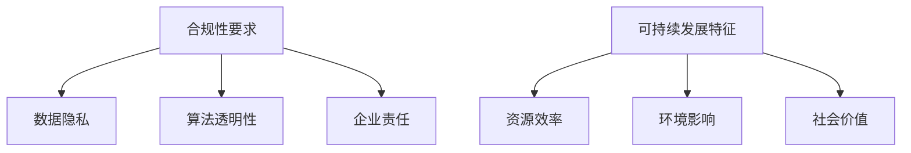
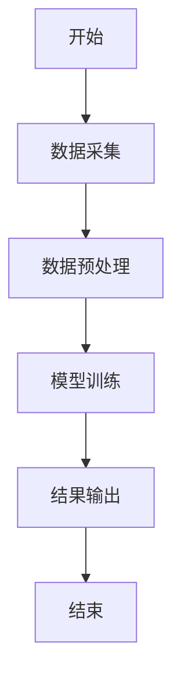
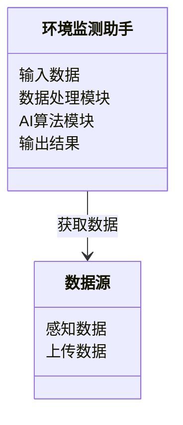
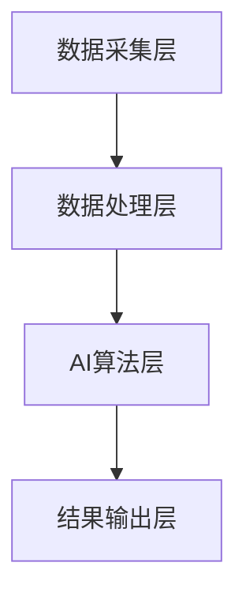
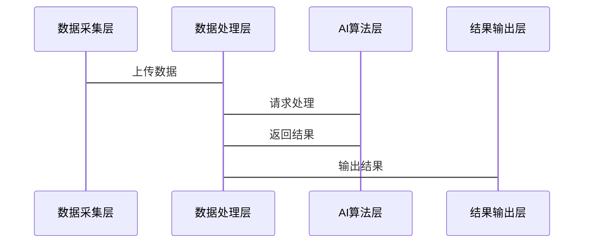

                 


# 构建企业级AI环境监测助手：合规与可持续发展

> 关键词：企业级AI环境监测助手，合规性要求，可持续发展，AI算法，环境监测系统，系统架构

> 摘要：本文将详细探讨如何构建一个企业级AI环境监测助手，重点分析合规性要求与可持续发展之间的关系，同时涵盖算法原理、系统设计、项目实战等内容。文章从问题背景出发，逐步分析核心概念，深入探讨算法原理，结合实际案例，提供系统化解决方案，最终总结最佳实践与注意事项。

---

## 目录大纲

### 第一部分：企业级AI环境监测助手概述

#### 第1章：问题背景与目标

- **1.1 问题背景**
  - 1.1.1 企业AI环境监测的必要性
  - 1.1.2 当前企业AI环境监测的挑战
  - 1.1.3 合规与可持续发展的核心地位

- **1.2 问题描述**
  - 1.2.1 AI环境监测的主要目标
  - 1.2.2 合规性要求的具体内容
  - 1.2.3 可持续发展面临的挑战

- **1.3 问题解决**
  - 1.3.1 构建AI环境监测助手的思路
  - 1.3.2 合规与可持续发展的实现路径
  - 1.3.3 边界与外延的明确

- **1.4 核心概念与组成**
  - 1.4.1 核心概念的定义与属性
  - 1.4.2 核心要素的组成与关系
  - 1.4.3 概念结构的图示化展示

- **1.5 本章小结**

---

### 第二部分：核心概念与联系

#### 第2章：合规与可持续发展核心概念

- **2.1 合规性要求**
  - 2.1.1 数据隐私与安全合规
  - 2.1.2 AI算法的透明性与可解释性
  - 2.1.3 企业责任与义务

- **2.2 可持续发展特征**
  - 2.2.1 资源效率优化
  - 2.2.2 环境影响评估
  - 2.2.3 长期发展与社会价值

- **2.3 核心概念对比分析**
  - 2.3.1 合规性与可持续发展的异同
  - 2.3.2 核心概念的属性特征对比表
  - 2.3.3 ER实体关系图的 mermaid 代码

```


---

### 第三部分：算法原理与数学模型

#### 第3章：AI环境监测助手的算法原理

- **3.1 算法原理概述**
  - 3.1.1 算法输入与输出
  - 3.1.2 核心算法的流程
  - 3.1.3 算法的优化方向

- **3.2 算法流程图**
  - 3.2.1 mermaid 算法流程图

```


- **3.3 数学模型与公式**
  - 3.3.1 线性回归模型
  - $$1+1=2$$
  - 线性回归模型的数学表达式：
    $$y = \beta_0 + \beta_1 x + \epsilon$$

---

### 第四部分：系统分析与架构设计

#### 第4章：系统分析与架构设计

- **4.1 问题场景介绍**
  - 4.1.1 企业AI环境监测的典型场景
  - 4.1.2 系统需要解决的核心问题
  - 4.1.3 系统的目标与预期效果

- **4.2 系统功能设计**
  - 4.2.1 领域模型 mermaid 类图

```


- **4.3 系统架构设计**
  - 4.3.1 系统架构 mermaid 架构图

```


- **4.4 系统接口设计**
  - 4.4.1 接口定义与交互流程
  - 4.4.2 接口调用的实现细节
  - 4.4.3 接口设计的注意事项

- **4.5 系统交互 mermaid 序列图**

```


---

### 第五部分：项目实战

#### 第5章：项目实战

- **5.1 环境安装**
  - 5.1.1 开发环境的配置
  - 5.1.2 依赖库的安装
  - 5.1.3 环境变量的配置

- **5.2 系统核心实现**
  - 5.2.1 核心代码实现
  - 5.2.2 代码解读与分析
  - 5.2.3 核心功能的实现细节

- **5.3 案例分析与解读**
  - 5.3.1 典型案例的分析
  - 5.3.2 案例实现的代码展示
  - 5.3.3 案例的运行与结果展示

- **5.4 本章小结**

---

### 第六部分：最佳实践与注意事项

#### 第6章：最佳实践与注意事项

- **6.1 最佳实践**
  - 6.1.1 系统设计的优化建议
  - 6.1.2 算法实现的优化方向
  - 6.1.3 系统部署的注意事项

- **6.2 注意事项**
  - 6.2.1 开发过程中的常见问题
  - 6.2.2 系统维护与更新的注意事项
  - 6.2.3 合规性与可持续发展的持续关注

- **6.3 小结**

---

### 第七部分：扩展阅读与深入学习

#### 第7章：扩展阅读与深入学习

- **7.1 相关领域的深入学习**
  - 7.1.1 AI算法的最新进展
  - 7.1.2 环境监测技术的创新
  - 7.1.3 合规性与可持续发展的前沿研究

- **7.2 实战项目总结**
  - 7.2.1 项目经验的总结
  - 7.2.2 项目中的问题与解决方法
  - 7.2.3 对未来工作的启示

- **7.3 本章小结**

---

### 总结

本文将从企业级AI环境监测助手的构建出发，逐步分析合规性要求与可持续发展之间的关系，深入探讨算法原理与系统架构设计，结合实际案例，提供系统化解决方案，并总结最佳实践与注意事项。通过本文的阐述，读者将能够全面理解企业级AI环境监测助手的构建过程，并能够将其应用到实际工作中。

