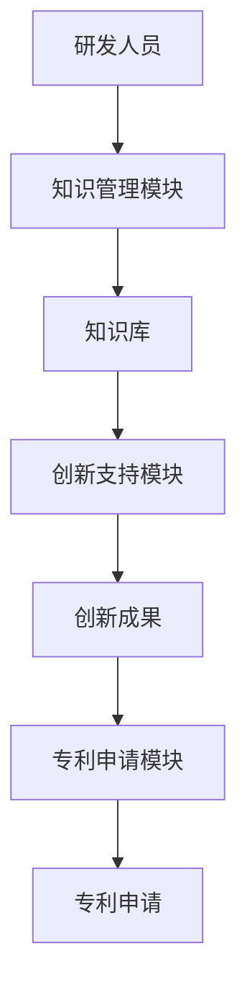

                 


# 构建企业级AI研发助手：加速创新与专利申请

---

## 关键词：
- 企业级AI研发助手
- 知识管理
- 创新效率
- 专利申请
- 系统架构
- 算法原理

---

## 摘要：
本文详细探讨了如何构建一个高效的企业级AI研发助手，以加速创新过程并优化专利申请流程。通过分析当前企业在AI研发中的痛点，提出了一套基于知识管理和智能算法的解决方案。文章从核心概念、算法原理、系统架构到项目实战，全面解析了AI研发助手的构建过程，并通过实际案例展示了其在企业中的应用价值。最后，文章总结了构建此类系统的关键成功要素，并为未来的优化方向提供了参考。

---

# 第1章: 问题背景与需求分析

## 1.1 问题背景
### 1.1.1 当前企业AI研发面临的挑战
- 知识碎片化：研发人员难以高效检索和利用已有知识。
- 创新效率低：缺乏系统性支持，创新过程耗时长。
- 专利申请复杂：流程繁琐，难以快速匹配最优方案。

### 1.1.2 知识管理与创新效率的痛点
- 知识分散：研发过程中产生的知识难以集中存储和管理。
- 信息孤岛：不同部门间知识无法有效共享，导致重复劳动。
- 创新支持不足：缺乏智能化工具辅助研发人员快速找到灵感和解决方案。

### 1.1.3 专利申请流程的复杂性
- 专利检索：需要手动查找相关专利，耗时且效率低。
- 专利撰写：缺乏结构化支持，容易遗漏关键信息。
- 专利审批：流程复杂，审批周期长。

## 1.2 问题描述
### 1.2.1 研发过程中的知识碎片化问题
- 研发人员需要在大量分散的知识中寻找灵感，效率低下。
- 知识难以复用，导致重复劳动和资源浪费。

### 1.2.2 创新效率与资源分配的矛盾
- 创新过程缺乏系统性支持，导致效率低下。
- 研发资源分配不合理，难以最大化利用。

### 1.2.3 专利申请的流程化与合规性要求
- 专利申请流程复杂，需要遵循严格的法律和规范。
- 缺乏智能化工具支持，导致申请效率低。

## 1.3 问题解决与目标设定
### 1.3.1 AI研发助手的核心目标
- 提供知识管理与检索功能，支持研发人员高效利用已有知识。
- 提供创新支持工具，加速研发过程。
- 提供专利申请辅助功能，优化专利申请流程。

### 1.3.2 解决方案的关键要素
- 知识库构建：建立结构化的知识库，支持高效检索。
- AI算法：利用自然语言处理和机器学习技术，提供智能支持。
- 专利管理系统：整合专利申请流程，提供一站式服务。

### 1.3.3 边界与外延
- 边界：仅关注AI研发过程中的知识管理、创新支持和专利申请，不涉及其他业务领域。
- 外延：未来可以扩展到其他研发领域，如生物医药、材料科学等。

## 1.4 核心概念结构与组成
### 1.4.1 系统组成要素分析
- 研发人员：知识的创造者和使用者。
- 知识库：知识的存储和管理平台。
- 创新成果：研发过程中产生的创新点。
- 专利申请：专利的生成和审批流程。

### 1.4.2 要素之间的关系与依赖
- 研发人员通过知识库检索和添加知识。
- 知识库支持创新成果的生成。
- 创新成果生成专利申请。

### 1.4.3 核心概念的属性特征对比表

| 核心概念 | 属性 | 描述 |
|----------|------|------|
| 研发人员 | 职责 | 知识创造、检索、应用 |
| 知识库   | 内容 | 文档、专利、技术资料 |
| 创新成果 | 类型 | 技术方案、创新点 |
| 专利申请 | 状态 | 待审批、已受理、已授权 |

---

# 第2章: 核心概念与系统架构

## 2.1 核心概念原理
### 2.1.1 AI研发助手的功能模块
- 知识管理模块：知识库的构建、检索和更新。
- 创新支持模块：提供创新灵感、技术路线图、竞争分析。
- 专利申请模块：专利检索、生成、提交和跟踪。

### 2.1.2 知识管理与检索机制
- 知识存储：结构化存储，支持多种检索方式。
- 知识关联：基于语义的关联，提供相关知识推荐。
- 知识更新：实时更新，确保知识库的准确性。

### 2.1.3 专利申请流程
- 专利检索：基于关键词和分类号进行检索。
- 专利撰写：提供模板和结构化支持。
- 专利提交：自动填写信息，简化提交流程。

## 2.2 核心概念的ER实体关系图
```mermaid
er
    entity 研发人员 {
        id
        名称
        部门
    }
    entity 知识库 {
        id
        内容
        类型
        创建时间
    }
    entity 创新成果 {
        id
        名称
        描述
        创建时间
    }
    entity 专利申请 {
        id
        名称
        描述
        状态
        提交时间
    }
    研发人员 --> 知识库: 添加/查询知识
    知识库 --> 创新成果: 支持创新
    创新成果 --> 专利申请: 生成专利申请
```

## 2.3 系统架构设计
### 2.3.1 系统组成
- 知识管理模块：负责知识的存储和检索。
- 创新支持模块：提供创新灵感和技术支持。
- 专利申请模块：整合专利申请流程。

### 2.3.2 系统架构图


---

接下来的章节将详细介绍算法原理与实现、系统分析与架构设计、项目实战等内容。

