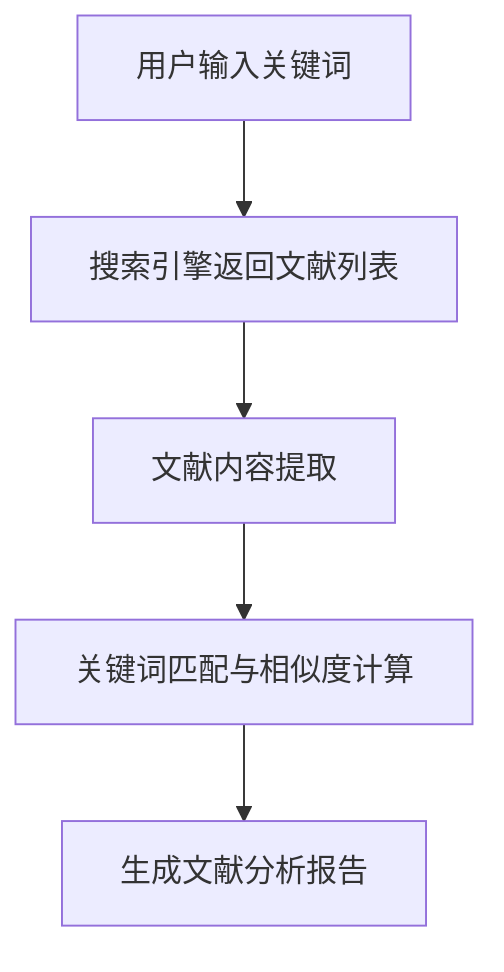
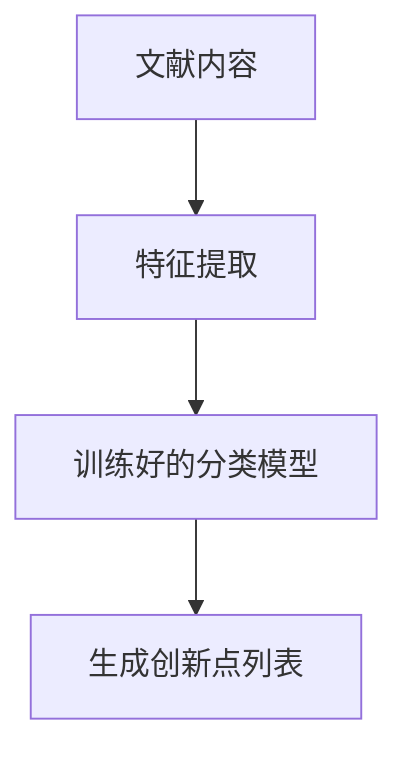
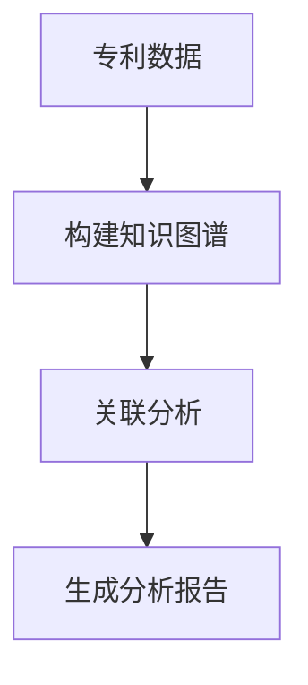
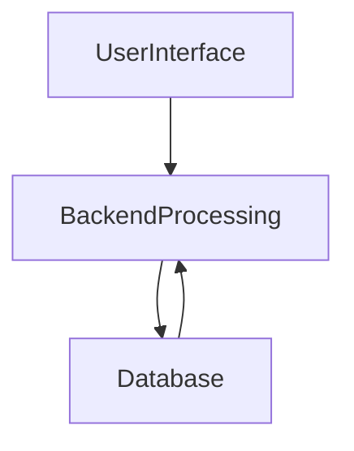
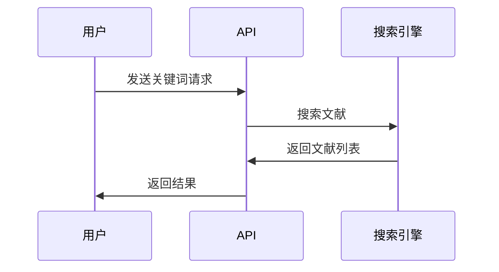

                 


# 构建企业级AI研发助手：加速创新与专利申请流程

## 关键词：企业级AI研发助手，专利申请流程，AI加速创新，技术实现，企业研发效率

## 摘要：  
企业级AI研发助手是一种利用人工智能技术优化研发流程、加速创新并简化专利申请流程的工具。本文详细探讨了AI研发助手的核心技术基础、系统设计与架构、项目实战、最佳实践以及未来展望，为企业构建高效的研发辅助系统提供指导。

---

# 第一部分: 企业级AI研发助手的背景与概述

## 第1章: 问题背景与问题描述

### 1.1 企业级AI研发助手的背景

#### 1.1.1 企业研发面临的挑战
企业在研发过程中常常面临以下挑战：
- 研发效率低下，尤其是在专利申请、文献检索和创新想法生成方面。
- 知识管理分散，难以高效利用已有研究成果。
- 专利申请流程复杂，涉及大量重复性工作。

#### 1.1.2 AI技术在企业研发中的作用
人工智能技术能够通过以下方式提升研发效率：
- 自动化处理文献检索和专利分析。
- 帮助生成创新想法并评估其可行性。
- 提供智能化的专利撰写和申请建议。

#### 1.1.3 专利申请流程的痛点与需求
传统专利申请流程存在以下痛点：
- 手工收集和分析文献耗时耗力。
- 创新点提取不够精准，影响专利质量。
- 缺乏智能化工具辅助撰写和校对。

### 1.2 问题描述与目标

#### 1.2.1 传统专利申请流程的效率问题
传统专利申请流程通常包括以下几个步骤：
1. 确定创新点。
2. 收集相关文献。
3. 撰写专利申请书。
4. 提交专利申请。

这些步骤耗时长、效率低，容易出错。

#### 1.2.2 AI研发助手的目标与核心任务
AI研发助手的目标是通过自动化和智能化技术，优化专利申请流程，具体包括：
- 智能化文献检索和分析。
- 自动提取创新点并生成专利申请模板。
- 提供专利撰写建议和校对服务。

#### 1.2.3 边界与外延：AI研发助手的功能范围
AI研发助手的功能范围包括：
- 文献检索与分析。
- 创新点提取与建议。
- 专利撰写辅助。
- 专利申请流程管理。

### 1.3 核心概念与联系

#### 1.3.1 核心概念原理：AI研发助手的组成与功能
AI研发助手主要由以下模块组成：
- 文献检索模块。
- 创新点提取模块。
- 专利撰写辅助模块。
- 专利申请管理模块。

#### 1.3.2 核心概念属性对比表
| 功能模块          | 输入         | 输出         | 描述                       |
|-------------------|--------------|--------------|----------------------------|
| 文献检索模块      | 关键词       | 文献列表     | 根据输入关键词检索相关文献 |
| 创新点提取模块     | 文献内容     | 创新点列表   | 提取文献中的创新点         |
| 专利撰写辅助模块   | 创新点       | 专利申请模板 | 生成专利申请书的模板       |
| 专利申请管理模块   | 申请模板     | 提交结果     | 协助完成专利申请流程       |

#### 1.3.3 ER实体关系图（使用 Mermaid）

```mermaid
er
    entity 专利数据 {
        id
        专利名称
        申请人
        申请日期
        状态
    }
    
    entity 文献数据 {
        id
        文献标题
        作者
        出版日期
    }
    
    entity 创新点 {
        id
        创新描述
        相关文献
    }
    
    entity 专利申请流程 {
        id
        当前阶段
        负责人
    }
    
    relation 文献数据 --> 创新点：文献支持的创新点
    relation 创新点 --> 专利数据：创新点生成的专利
    relation 专利申请流程 --> 专利数据：流程管理的专利
```

---

## 第2章: 技术基础

### 2.1 自然语言处理（NLP）

#### 2.1.1 NLP的核心技术与应用
自然语言处理技术在AI研发助手中的应用包括：
- 文本分词。
- 实体识别。
- 情感分析。

#### 2.1.2 基于NLP的文献检索与分析
文献检索与分析的流程如下：



#### 2.1.3 NLP算法的数学模型
文本相似度计算通常使用余弦相似度：

$$ \text{相似度} = \frac{\vec{A} \cdot \vec{B}}{|\vec{A}| \cdot |\vec{B}|} $$

---

### 2.2 机器学习

#### 2.2.1 机器学习的核心算法与应用
机器学习在AI研发助手中的应用包括：
- 分类算法：用于文献分类。
- 回归算法：用于预测专利申请的成功率。

#### 2.2.2 基于机器学习的创新点提取
创新点提取的流程如下：



#### 2.2.3 机器学习模型的训练与优化
训练一个分类模型的过程：

1. 数据预处理。
2. 模型选择。
3. 模型训练。
4. 模型评估与优化。

---

### 2.3 知识图谱

#### 2.3.1 知识图谱的构建与应用
知识图谱在AI研发助手中的应用包括：
- 知识关联分析。
- 知识推理。

#### 2.3.2 基于知识图谱的专利分析
专利分析的流程：



---

## 第3章: 系统设计与架构

### 3.1 系统架构设计

#### 3.1.1 系统功能模块划分
AI研发助手的主要功能模块包括：
- 用户界面模块。
- 后台处理模块。
- 数据库模块。

#### 3.1.2 系统架构图（使用 Mermaid）



---

### 3.2 接口设计

#### 3.2.1 API接口定义
AI研发助手提供以下API接口：
- 文献检索接口。
- 创新点提取接口。
- 专利申请管理接口。

#### 3.2.2 API交互流程
文献检索的API交互流程：



---

## 第4章: 项目实战

### 4.1 环境搭建

#### 4.1.1 开发环境配置
需要安装以下工具：
- Python 3.8+
- Numpy
- Scikit-learn
- SpaCy

#### 4.1.2 数据集准备
准备以下数据集：
- 文献数据集。
- 专利数据集。

---

### 4.2 系统实现

#### 4.2.1 文献检索模块实现
使用Python代码实现文献检索：

```python
import requests

def search_papers(keywords):
    url = "https://api.example.com/search"
    params = {"query": keywords}
    response = requests.get(url, params=params)
    return response.json()
```

---

## 第5章: 最佳实践与优化

### 5.1 实战经验分享

#### 5.1.1 高效管理专利数据
使用知识图谱管理专利数据，提高检索效率。

#### 5.1.2 提升模型效果
定期更新模型，引入更多数据。

#### 5.1.3 优化用户体验
设计直观的用户界面，简化操作流程。

---

## 第6章: 未来展望与挑战

### 6.1 未来展望

#### 6.1.1 技术发展趋势
- 更智能的NLP技术。
- 更高效的机器学习算法。
- 更强大的知识图谱构建能力。

#### 6.1.2 市场需求变化
随着企业对研发效率的需求增加，AI研发助手的市场前景广阔。

### 6.2 挑战与应对策略

#### 6.2.1 技术挑战
- 数据隐私问题。
- 模型泛化能力不足。

#### 6.2.2 市场挑战
- 用户接受度低。
- 竞争对手的威胁。

---

## 总结

构建企业级AI研发助手是一项复杂的系统工程，需要结合自然语言处理、机器学习和知识图谱等技术。通过本文的详细讲解，读者可以深入了解AI研发助手的技术基础、系统设计、项目实战以及未来展望，为企业提升研发效率和加速创新提供有力支持。

