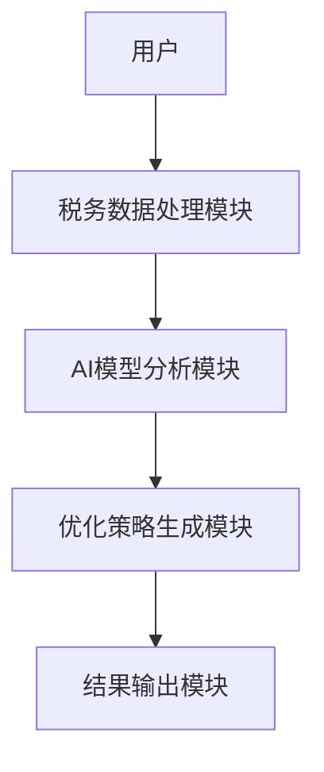
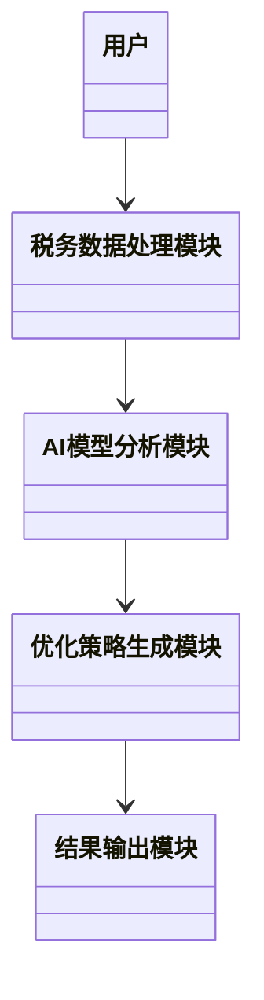
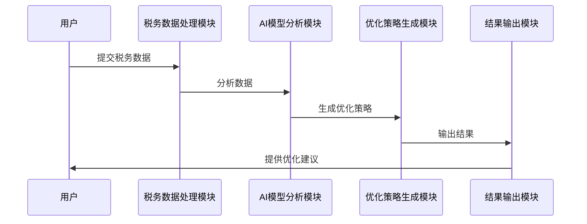

                 


# 《构建企业级AI税务顾问：优化税收策略》

> 关键词：企业级AI税务顾问、AI优化、税收策略、机器学习、深度学习、系统架构

> 摘要：本文将深入探讨如何利用人工智能技术构建企业级税务顾问系统，通过优化税收策略实现企业税务管理的智能化。从问题背景到解决方案，从系统架构到算法实现，本文将系统性地分析和设计一套高效的企业级AI税务顾问系统，结合实际案例和代码实现，为读者提供完整的解决方案。

---

# 第一部分：企业级AI税务顾问背景与核心概念

# 第1章：企业级AI税务顾问的背景与问题背景

## 1.1 问题背景与问题描述

### 1.1.1 税务管理的复杂性与挑战

在现代企业中，税务管理是一项复杂且重要的任务。企业需要遵守各国的税法法规，合理规划税务策略以降低税负，同时避免税务风险。然而，税务法规的复杂性、多变性以及企业业务的多样性，使得传统的税务管理方式难以满足企业的需求。以下是一些主要挑战：

- **复杂性**：各国税法差异大，涉及增值税、企业所得税、个人所得税等多种税种。
- **多变性**：税法经常更新，企业需要及时调整税务策略。
- **多样性**：企业业务模式多样化，税务规划需要考虑多种因素。
- **合规性**：企业需要确保税务操作的合规性，避免税务风险。

### 1.1.2 企业税务优化的痛点

企业在税务管理中面临以下痛点：

- **人工成本高**：传统税务管理依赖大量人工操作，效率低且易出错。
- **信息不对称**：企业难以及时获取最新的税法信息和政策解读。
- **决策延迟**：由于信息处理的复杂性，税务决策往往延迟，错失优化机会。
- **缺乏个性化**：传统税务管理难以根据企业的具体情况提供个性化的优化建议。

### 1.1.3 AI技术在税务管理中的应用潜力

人工智能技术，尤其是机器学习和深度学习，为企业级税务顾问的构建提供了新的可能性。AI技术可以通过以下方式优化税务管理：

- **自动化处理**：AI可以自动处理大量税务数据，提高效率。
- **实时分析**：AI能够实时分析税务数据，提供实时的优化建议。
- **个性化策略**：AI可以根据企业的具体情况，提供个性化的税务优化策略。
- **预测与预警**：AI可以预测税务风险，并提前预警，帮助企业规避风险。

## 1.2 问题解决与边界定义

### 1.2.1 AI税务顾问的目标与范围

AI税务顾问的目标是通过人工智能技术，帮助企业实现税务管理的智能化，优化税务策略，降低税负，规避税务风险。其范围包括：

- 税务数据的采集与处理
- 税务数据分析与建模
- 税务优化策略生成
- 税务报告与可视化

### 1.2.2 系统边界与功能外延

AI税务顾问系统的边界包括：

- **输入**：企业税务数据，包括销售收入、成本、费用、利润等。
- **输出**：优化后的税务策略，包括税务申报、税务缴纳、税务规划等。
- **功能外延**：除了优化税务策略外，还可以提供税务培训、税务咨询等服务。

### 1.2.3 核心问题的解决方案框架

AI税务顾问的核心问题解决框架包括以下步骤：

1. **数据采集**：采集企业的税务数据。
2. **数据预处理**：清洗和标准化数据。
3. **模型训练**：基于历史数据训练机器学习模型。
4. **策略生成**：根据模型预测结果生成优化策略。
5. **结果输出**：输出优化后的税务策略。

## 1.3 核心概念与系统结构

### 1.3.1 系统组成与核心要素

AI税务顾问系统由以下核心要素组成：

- **数据层**：包括税务数据、业务数据等。
- **算法层**：包括机器学习模型、深度学习模型等。
- **策略层**：包括优化策略、预测模型等。
- **输出层**：包括税务报告、可视化界面等。

### 1.3.2 系统功能模块划分

系统功能模块包括：

- 数据采集模块
- 数据处理模块
- 模型训练模块
- 策略生成模块
- 结果输出模块

### 1.3.3 系统架构的初步设想

系统架构的初步设想如下：

- **数据采集模块**：负责采集企业税务数据。
- **数据处理模块**：对采集到的数据进行清洗和预处理。
- **模型训练模块**：基于处理后的数据训练机器学习模型。
- **策略生成模块**：根据模型预测结果生成优化策略。
- **结果输出模块**：输出优化后的税务策略，并提供可视化报告。

## 1.4 本章小结

本章从企业税务管理的痛点出发，分析了AI技术在税务管理中的应用潜力，并提出了AI税务顾问的目标、范围和核心要素。通过系统架构的初步设想，为后续的详细设计奠定了基础。

---

# 第二部分：AI税务顾问的核心概念与系统架构

# 第2章：AI税务顾问的核心概念与系统架构

## 2.1 核心概念与原理

### 2.1.1 AI税务顾问的核心算法原理

AI税务顾问的核心算法基于机器学习和深度学习技术。以下是几种常用的算法及其原理：

1. **线性回归**：用于预测连续型变量，例如预测企业的税负率。
2. **决策树**：用于分类和回归，可以帮助企业识别影响税负的关键因素。
3. **随机森林**：一种基于决策树的集成学习方法，具有较高的准确性和稳定性。
4. **支持向量机（SVM）**：用于分类问题，可以用于税务风险分类。
5. **深度学习模型**：如神经网络，可以用于复杂的非线性关系建模。

### 2.1.2 税务数据分析与优化模型

税务数据分析与优化模型主要包括以下步骤：

1. **数据清洗**：去除异常值和缺失值。
2. **特征工程**：提取和选择影响税负的关键特征。
3. **模型训练**：基于训练数据训练机器学习模型。
4. **模型评估**：通过交叉验证评估模型的性能。
5. **模型优化**：调整模型参数，提高预测准确性。

### 2.1.3 系统功能模块的逻辑关系

系统功能模块的逻辑关系如下：

1. **数据采集模块**：采集企业税务数据。
2. **数据处理模块**：对数据进行清洗和预处理。
3. **模型训练模块**：基于处理后的数据训练机器学习模型。
4. **策略生成模块**：根据模型预测结果生成优化策略。
5. **结果输出模块**：输出优化后的税务策略，并提供可视化报告。

## 2.2 系统架构设计

### 2.2.1 系统功能模块的实体关系图

以下是系统功能模块的实体关系图：



### 2.2.2 系统功能模块的类图

以下是系统功能模块的类图：



## 2.3 系统功能与接口设计

### 2.3.1 系统功能模块的接口定义

系统功能模块的接口定义如下：

- **数据采集模块**：提供接口用于采集企业税务数据。
- **数据处理模块**：提供接口用于数据清洗和预处理。
- **模型训练模块**：提供接口用于训练机器学习模型。
- **策略生成模块**：提供接口用于生成优化策略。
- **结果输出模块**：提供接口用于输出优化结果。

### 2.3.2 系统交互流程图

以下是系统交互流程图：



## 2.4 本章小结

本章详细介绍了AI税务顾问的核心算法原理和系统架构设计，通过实体关系图和类图展示了系统的功能模块和逻辑关系。系统交互流程图进一步明确了各模块之间的交互流程。

---

# 第三部分：AI税务顾问的算法原理与数学模型

# 第3章：AI税务优化算法的原理与实现

## 3.1 算法原理概述

### 3.1.1 基于机器学习的税务优化模型

基于机器学习的税务优化模型主要包括以下步骤：

1. **数据采集**：采集企业的税务数据。
2. **数据预处理**：清洗和标准化数据。
3. **特征工程**：提取和选择影响税负的关键特征。
4. **模型训练**：基于训练数据训练机器学习模型。
5. **模型评估**：通过交叉验证评估模型的性能。
6. **模型优化**：调整模型参数，提高预测准确性。

### 3.1.2 深度学习模型的优化策略

深度学习模型的优化策略主要包括以下步骤：

1. **数据预处理**：对数据进行清洗和标准化。
2. **模型构建**：构建神经网络模型。
3. **模型训练**：使用训练数据训练模型。
4. **模型调优**：调整模型参数，优化模型性能。
5. **模型评估**：通过测试数据评估模型的性能。

### 3.1.3 算法的核心思想与流程

算法的核心思想是通过机器学习和深度学习技术，基于企业的税务数据，训练模型并生成优化策略。具体流程如下：

1. **数据采集**：采集企业的税务数据。
2. **数据预处理**：清洗和标准化数据。
3. **特征工程**：提取和选择影响税负的关键特征。
4. **模型训练**：基于训练数据训练机器学习模型。
5. **模型评估**：通过交叉验证评估模型的性能。
6. **模型优化**：调整模型参数，提高预测准确性。
7. **策略生成**：根据模型预测结果生成优化策略。
8. **结果输出**：输出优化后的税务策略，并提供可视化报告。

## 3.2 算法的数学模型与公式

### 3.2.1 优化目标的数学表达式

优化目标的数学表达式如下：

$$ \text{目标函数} = \min_{x} f(x) $$

### 3.2.2 约束条件的数学表达式

约束条件的数学表达式如下：

$$ \text{约束条件} = \begin{cases} g(x) \leq 0 \\ h(x) = 0 \end{cases} $$

### 3.2.3 算法的优化过程

算法的优化过程如下：

$$ x_{k+1} = x_k - \alpha \nabla f(x_k) $$

其中，$x_k$ 表示第 $k$ 次迭代的参数，$\alpha$ 表示学习率，$\nabla f(x_k)$ 表示目标函数在 $x_k$ 处的梯度。

---

# 第四部分：项目实战

# 第4章：企业级AI税务顾问系统实战

## 4.1 项目背景与目标

### 4.1.1 项目背景

本项目旨在构建一个企业级AI税务顾问系统，通过人工智能技术优化企业的税务策略，降低税负，规避税务风险。

### 4.1.2 项目目标

项目目标包括：

1. 实现税务数据的自动化采集与处理。
2. 构建机器学习模型，生成优化策略。
3. 提供可视化的税务报告。

## 4.2 项目环境与工具

### 4.2.1 环境安装

以下是项目所需的环境和工具：

- **Python**：版本3.8及以上。
- **机器学习库**：包括Scikit-learn、XGBoost、TensorFlow等。
- **数据处理工具**：Pandas、NumPy等。
- **可视化工具**：Matplotlib、Seaborn等。

### 4.2.2 核心代码实现

以下是核心代码实现：

```python
import pandas as pd
from sklearn.model_selection import train_test_split
from sklearn.ensemble import RandomForestRegressor
from sklearn.metrics import mean_squared_error

# 数据加载
data = pd.read_csv('tax_data.csv')

# 数据预处理
X = data.drop('tax', axis=1)
y = data['tax']

# 数据分割
X_train, X_test, y_train, y_test = train_test_split(X, y, test_size=0.2, random_state=42)

# 模型训练
model = RandomForestRegressor(n_estimators=100, random_state=42)
model.fit(X_train, y_train)

# 模型预测
y_pred = model.predict(X_test)

# 模型评估
mse = mean_squared_error(y_test, y_pred)
print(f'Mean Squared Error: {mse}')
```

### 4.2.3 项目案例分析

以下是一个具体的项目案例分析：

- **案例背景**：某企业需要优化其税务策略，降低税负。
- **数据采集**：采集企业的销售收入、成本、费用等数据。
- **数据处理**：清洗和预处理数据。
- **模型训练**：基于随机森林模型训练模型。
- **策略生成**：根据模型预测结果生成优化策略。
- **结果输出**：输出优化后的税务策略，并提供可视化报告。

## 4.3 本章小结

本章通过一个具体的项目案例，详细讲解了企业级AI税务顾问系统的实战过程，包括项目环境的搭建、核心代码的实现以及案例分析。通过实际操作，读者可以更好地理解系统的实现过程。

---

# 第五部分：系统分析与架构设计

# 第5章：企业级AI税务顾问系统的系统分析与架构设计

## 5.1 系统分析

### 5.1.1 问题场景介绍

系统分析需要从以下几个方面进行：

- **功能需求**：系统需要实现税务数据的采集、处理、分析和优化。
- **性能需求**：系统需要高效处理大量数据。
- **用户需求**：用户需要直观的税务报告和优化建议。

### 5.1.2 项目介绍

本项目旨在构建一个企业级AI税务顾问系统，通过人工智能技术优化企业的税务策略，降低税负，规避税务风险。

## 5.2 系统功能设计

### 5.2.1 领域模型

以下是系统的领域模型：


### 5.2.2 系统架构设计

以下是系统的架构设计：

```mermaid
graph TD
    用户 ->> 税务数据处理模块: 提交税务数据
    税务数据处理模块 ->> AI模型分析模块: 分析数据
    AI模型分析模块 ->> 优化策略生成模块: 生成优化策略
    优化策略生成模块 ->> 结果输出模块: 输出结果
    结果输出模块 ->> 用户: 提供优化建议
```

### 5.2.3 系统接口设计

系统接口设计包括以下内容：

- **数据接口**：提供接口用于数据的采集和处理。
- **模型接口**：提供接口用于模型的训练和预测。
- **结果接口**：提供接口用于结果的输出和可视化。

### 5.2.4 系统交互设计

系统交互设计包括以下内容：

- **用户交互**：用户提交税务数据，系统处理数据并生成优化策略。
- **系统交互**：系统各模块之间的交互流程。

## 5.3 本章小结

本章详细分析了企业级AI税务顾问系统的功能需求、系统架构和接口设计，为系统的实现提供了理论基础。

---

# 第六部分：最佳实践与小结

# 第6章：企业级AI税务顾问系统的最佳实践与小结

## 6.1 最佳实践

### 6.1.1 数据质量管理

数据质量是AI税务顾问系统的核心，需要确保数据的准确性和完整性。

### 6.1.2 模型优化策略

模型优化是提高系统性能的关键，需要通过交叉验证和调参优化模型性能。

### 6.1.3 系统安全性

系统安全性是保障企业数据安全的重要因素，需要采取多种措施确保系统的安全性。

## 6.2 小结

通过本文的详细讲解，读者可以系统性地了解企业级AI税务顾问系统的构建过程，包括系统背景、核心概念、算法原理、系统架构以及项目实战。通过实际案例的分析，读者可以更好地理解系统的实现过程。

## 6.3 注意事项

- **数据隐私**：企业在处理税务数据时，需要注意数据隐私问题，确保数据的安全性。
- **模型可解释性**：模型的可解释性是企业决策的重要因素，需要确保模型的可解释性。
- **系统维护**：系统需要定期维护和更新，确保系统的稳定性和性能。

## 6.4 拓展阅读

- **机器学习与深度学习**：进一步学习机器学习和深度学习的相关知识，提高模型的性能。
- **税务法规**：深入学习各国的税法法规，了解税务管理的最新动态。
- **系统架构设计**：学习更多的系统架构设计方法，优化系统的性能和可扩展性。

---

# 结语

企业级AI税务顾问系统的构建是一个复杂而重要的任务，通过本文的详细讲解，读者可以系统性地了解系统的构建过程，并通过实际案例的分析，更好地理解系统的实现过程。未来，随着人工智能技术的不断发展，企业级AI税务顾问系统将发挥更大的作用，为企业提供更优质的税务管理服务。

