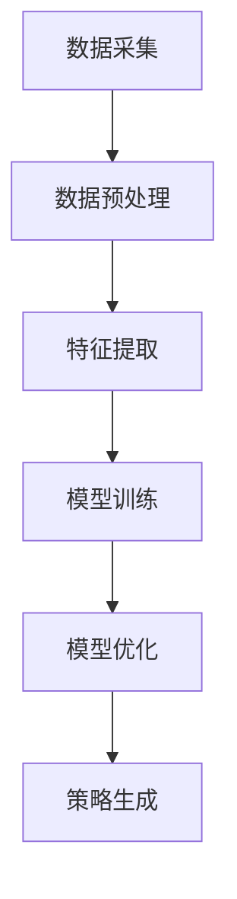
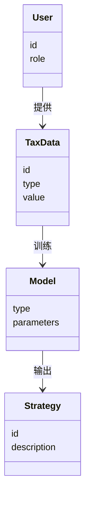
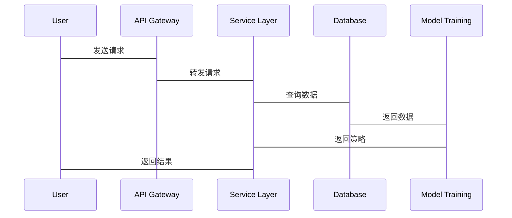

                 


# 构建企业级AI税务顾问：优化税收策略与合规

> 关键词：企业级AI税务顾问、税收策略优化、税务合规、人工智能、机器学习、自然语言处理、税务数据挖掘

> 摘要：本文详细探讨了如何利用人工智能技术构建企业级AI税务顾问系统，以优化企业的税收策略并确保税务合规。文章从背景介绍、核心概念与技术、算法原理、系统分析与架构设计、项目实战到最佳实践，全面分析了构建该系统的各个方面。通过详细的技术分析和实际案例，本文为读者提供了构建高效、智能的税务顾问系统的思路和方法。

---

## 第1章: 背景与概述

### 1.1 问题背景

#### 1.1.1 传统税务处理的痛点
传统的税务处理流程通常依赖于人工操作，存在以下问题：
- 数据分散：企业的税务数据可能分布在多个系统中，难以统一管理和分析。
- 处理复杂：税务法规复杂多变，人工处理容易出错。
- 效率低下：手动处理大量税务数据耗时耗力，且效率难以提升。

#### 1.1.2 企业对智能税务工具的需求
随着企业规模的扩大和业务的复杂化，企业对智能税务工具的需求日益增加。企业需要一个能够实时分析税务数据、提供优化建议的工具，以提高效率和准确性。

#### 1.1.3 AI技术在税务领域的应用潜力
人工智能技术在税务领域的应用潜力巨大。通过机器学习、自然语言处理等技术，可以实现税务数据的自动化分析、智能优化和实时监控，从而帮助企业更好地应对税务挑战。

### 1.2 问题描述

#### 1.2.1 税务合规与优化的复杂性
税务合规涉及复杂的法规和多方面的业务，企业需要确保其税务处理符合相关法规，同时优化税收策略以降低税负。

#### 1.2.2 数据驱动的税务决策需求
企业需要基于实时数据进行税务决策，以应对市场变化和法规更新。然而，传统方法难以快速响应和处理大量数据。

#### 1.2.3 企业级AI税务顾问的目标与范围
企业级AI税务顾问的目标是通过AI技术，为企业提供智能化的税务处理和优化服务。其范围包括税务数据的采集、分析、建模、优化和合规监控。

### 1.3 问题解决

#### 1.3.1 AI技术如何优化税务策略
AI技术可以通过机器学习算法分析历史税务数据，识别潜在的优化机会，提供个性化的税收策略建议。

#### 1.3.2 数据分析在税务合规中的作用
数据分析可以帮助企业发现税务处理中的潜在问题，确保合规性，并优化税务申报和缴纳流程。

#### 1.3.3 企业级AI税务顾问的核心价值
企业级AI税务顾问通过智能化的数据分析和优化建议，帮助企业在合规的前提下降低税负，提高税务处理效率。

### 1.4 边界与外延

#### 1.4.1 企业级AI税务顾问的适用场景
企业级AI税务顾问适用于大型企业，尤其是跨国企业，帮助其应对复杂的税务法规和多变的市场环境。

#### 1.4.2 与其他税务工具的区分
与其他税务工具相比，企业级AI税务顾问具有更强的智能化和自动化能力，能够处理复杂的税务问题并提供优化建议。

#### 1.4.3 系统边界与功能范围
系统边界包括企业的税务数据、外部税务法规和AI模型。功能范围涵盖数据采集、模型训练、策略优化和合规监控。

---

## 第2章: 核心概念与技术

### 2.1 核心概念的定义与关系

#### 2.1.1 数据采集
数据采集是企业级AI税务顾问的第一步，涉及从企业内部系统和外部渠道获取相关税务数据。

#### 2.1.2 模型训练
通过机器学习算法对采集到的数据进行训练，构建能够识别税务问题和提供优化建议的AI模型。

#### 2.1.3 策略优化
基于训练好的模型，生成个性化的税收优化策略，帮助企业在合规的前提下降低税负。

### 2.2 概念属性特征对比

| 概念       | 特性                     | 优势                           |
|------------|--------------------------|--------------------------------|
| 数据采集   | 实时性、多样性           | 提供全面的税务数据               |
| 模型训练   | 可扩展性、准确性         | 提供高精度的预测和建议           |
| 策略优化   | 个性化、动态性           | 提供高效的优化方案               |

### 2.3 ER实体关系图

```mermaid
erDiagram
    user++> role : 操作
    user++> tax_data : 访问
    tax_data++> model : 训练
    model++> strategy : 输出
```

---

## 第3章: 算法原理

### 3.1 算法流程图



### 3.2 Python实现代码

```python
# 数据预处理
def preprocess_data(data):
    # 数据清洗和特征提取
    cleaned_data = data.dropna()
    return cleaned_data

# 模型训练
def train_model(X, y):
    from sklearn.ensemble import RandomForestClassifier
    model = RandomForestClassifier(n_estimators=100)
    model.fit(X, y)
    return model

# 策略生成
def generate_strategy(model, new_data):
    # 预测结果
    prediction = model.predict(new_data)
    # 生成策略
    strategy = "优化建议：降低税负"
    return strategy
```

### 3.3 数学模型与公式

#### 3.3.1 概率分布
$$ P(y|x) = \frac{P(x|y)P(y)}{P(x)} $$

#### 3.3.2 损失函数
$$ \text{损失} = \sum_{i=1}^{n} (y_i - \hat{y_i})^2 $$

---

## 第4章: 系统分析与架构设计

### 4.1 问题场景

企业税务处理流程复杂，涉及多个部门和系统，需要一个统一的平台进行管理和优化。

### 4.2 系统功能设计



### 4.3 系统架构设计


### 4.4 接口设计

- RESTful API：`POST /api/tax/optimization`
- 输入：`JSON`格式的税务数据
- 输出：`JSON`格式的优化策略

### 4.5 交互设计



---

## 第5章: 项目实战

### 5.1 环境安装

安装Python和必要的库：
```bash
pip install numpy pandas scikit-learn
```

### 5.2 核心代码实现

```python
# 环境安装
import numpy as np
import pandas as pd
from sklearn.ensemble import RandomForestClassifier

# 数据加载
data = pd.read_csv('tax_data.csv')

# 数据预处理
processed_data = preprocess_data(data)

# 模型训练
X = processed_data.drop('target', axis=1)
y = processed_data['target']
model = train_model(X, y)

# 策略生成
new_data = pd.read_csv('new_tax_data.csv')
strategy = generate_strategy(model, new_data)

print(strategy)
```

### 5.3 案例分析

通过实际案例分析，展示系统如何处理复杂的税务问题并生成优化策略。

---

## 第6章: 最佳实践

### 6.1 小结

企业级AI税务顾问通过智能化的数据分析和优化建议，帮助企业提高税务处理效率和合规性。

### 6.2 注意事项

- 数据隐私保护：确保税务数据的安全性和隐私性。
- 模型优化：定期更新模型，适应法规变化和业务需求。
- 团队协作：税务顾问需要跨团队协作，确保系统的顺利运行。

### 6.3 拓展阅读

推荐书籍和资源，供读者进一步学习和研究。

---

## 第7章: 总结

企业级AI税务顾问的构建是一个复杂但极具价值的过程。通过本文的详细分析，读者可以深入了解如何利用AI技术优化税收策略并确保合规。未来，随着技术的不断发展，企业级AI税务顾问将发挥更大的作用，帮助企业应对更复杂的税务挑战。

