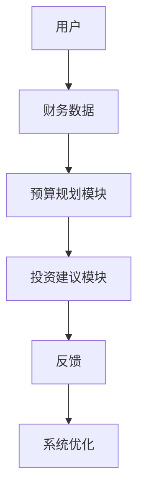
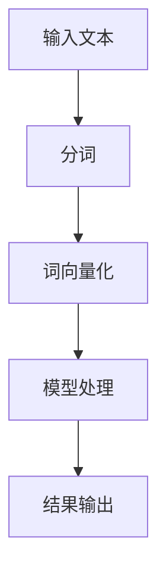
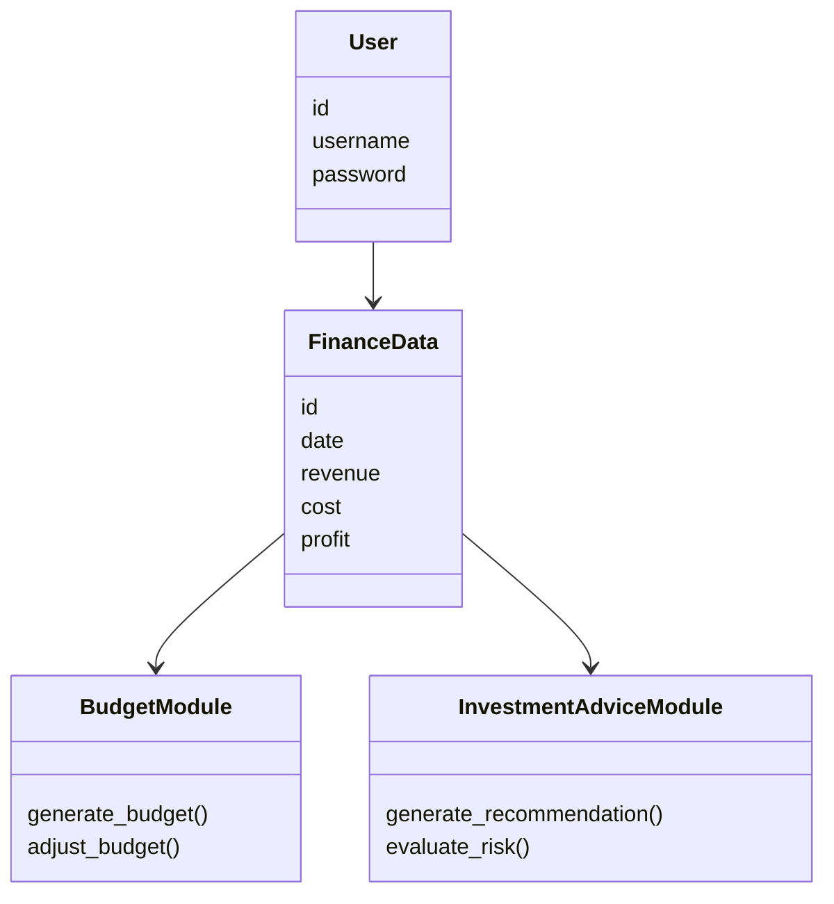

                 


# 构建企业级AI财务顾问：智能预算规划与投资建议

> 关键词：企业级AI财务顾问、智能预算规划、投资建议、AI算法、系统架构、项目实战

> 摘要：本文详细探讨了构建企业级AI财务顾问的各个方面，从背景与目标到系统架构设计，再到项目实战。文章首先介绍了企业级AI财务顾问的背景和目标，然后深入分析了其核心概念与联系，详细讲解了自然语言处理和财务预测模型的算法原理。接着，文章从系统架构与设计的角度，阐述了系统功能设计、架构设计和交互流程。最后，通过项目实战部分，详细展示了环境安装、核心代码实现、案例分析以及项目小结。本文旨在为企业级AI财务顾问的构建提供全面的技术指导和实践参考。

---

# 第一部分：构建企业级AI财务顾问的背景与目标

## 第1章：企业级AI财务顾问的背景与目标

### 1.1 企业级AI财务顾问的背景

#### 1.1.1 传统财务顾问的局限性
传统的财务顾问主要依赖人工分析和经验判断，存在以下局限性：
- **效率低**：人工分析需要大量时间，难以满足企业对实时财务分析的需求。
- **主观性高**：依赖个人经验，容易受到主观因素影响，导致决策偏差。
- **覆盖范围有限**：难以同时处理海量数据，难以实现多维度、多层次的财务分析。

#### 1.1.2 AI技术在财务领域的应用前景
随着AI技术的快速发展，其在财务领域的应用前景广阔：
- **智能化**：AI可以通过深度学习和自然语言处理技术，实现财务数据的智能化分析。
- **自动化**：AI可以自动处理财务数据，生成预算规划和投资建议，减少人工干预。
- **精准性**：通过大数据分析和预测模型，AI可以提供更精准的财务分析和决策支持。

#### 1.1.3 企业级AI财务顾问的核心价值
企业级AI财务顾问的核心价值体现在以下几个方面：
- **提高效率**：通过自动化处理财务数据，显著提高财务分析的效率。
- **增强决策能力**：通过智能分析和预测，提供更精准的预算规划和投资建议。
- **降低风险**：通过实时监控和预警机制，帮助企业规避财务风险。

### 1.2 企业级AI财务顾问的目标

#### 1.2.1 提供智能预算规划服务
智能预算规划服务的目标是：
- **自动化预算生成**：基于历史数据和市场趋势，自动生成预算方案。
- **动态调整**：根据实时数据和市场变化，动态调整预算方案，确保预算的灵活性和准确性。

#### 1.2.2 提供投资建议服务
投资建议服务的目标是：
- **智能化投资分析**：通过AI算法分析市场趋势和企业财务数据，提供个性化的投资建议。
- **风险控制**：通过预测模型和风险评估，帮助企业规避投资风险，优化投资组合。

#### 1.2.3 实现企业财务数据的智能化管理
企业财务数据的智能化管理目标是：
- **数据整合**：将分散在不同系统中的财务数据进行整合，实现数据的统一管理。
- **数据挖掘**：通过数据挖掘技术，发现数据中的潜在规律和趋势，为企业决策提供支持。
- **数据安全**：确保财务数据的安全性和隐私性，防止数据泄露和篡改。

### 1.3 企业级AI财务顾问的框架

#### 1.3.1 系统架构概述
企业级AI财务顾问的系统架构可以分为以下几个层次：
- **数据层**：负责数据的采集、存储和管理。
- **算法层**：负责AI算法的设计和实现，包括自然语言处理和预测模型。
- **应用层**：负责与用户的交互，展示分析结果和提供决策支持。
- **接口层**：负责与其他系统的接口对接，确保数据的流通和系统的协同工作。

#### 1.3.2 功能模块划分
系统的主要功能模块包括：
- **数据采集模块**：负责从企业内部系统和其他数据源采集财务数据。
- **数据处理模块**：对采集到的财务数据进行清洗、转换和预处理。
- **智能分析模块**：利用AI算法对财务数据进行分析，生成预算规划和投资建议。
- **用户界面模块**：提供友好的用户界面，展示分析结果和交互功能。

#### 1.3.3 数据流与交互流程
以下是数据流与交互流程的简单描述：
1. **数据采集**：用户输入财务数据或系统自动采集数据。
2. **数据处理**：对数据进行清洗和预处理，确保数据的准确性和一致性。
3. **智能分析**：利用AI算法对数据进行分析，生成预算规划和投资建议。
4. **结果展示**：将分析结果通过用户界面展示给用户，并提供交互功能，如调整预算参数或查看详细报告。

---

# 第二部分：企业级AI财务顾问的核心概念与联系

## 第2章：企业级AI财务顾问的核心概念

### 2.1 AI财务顾问的定义与特点

#### 2.1.1 定义
企业级AI财务顾问是一种基于人工智能技术的财务决策支持系统，能够根据企业的财务数据和市场信息，提供智能预算规划和投资建议。

#### 2.1.2 核心特点对比

| 特性         | 传统财务顾问                  | 企业级AI财务顾问              |
|--------------|-------------------------------|------------------------------|
| **处理能力** | 依赖人工分析，处理能力有限    | 自动化处理，处理能力强大      |
| **决策依据** | 主要依赖经验判断              | 基于数据和算法，决策依据客观  |
| **响应速度** | 响应速度较慢                 | 实时响应，快速提供决策支持    |
| **覆盖范围** | 覆盖范围有限，难以同时处理多任务 | 能够同时处理海量数据，覆盖范围广 |

### 2.2 企业级AI财务顾问的实体关系图



---

## 第3章：自然语言处理在财务顾问中的应用

### 3.1 自然语言处理技术

#### 3.1.1 NLP基础
自然语言处理（NLP）是人工智能的一个重要分支，旨在让计算机能够理解、处理和生成人类语言。在财务顾问中，NLP主要用于分析财务报告、新闻和市场评论等文本数据。

#### 3.1.2 NLP在财务文本分析中的应用
以下是NLP在财务文本分析中的具体应用：
- **关键词提取**：从财务报告中提取关键信息，如收入、利润、成本等。
- **情感分析**：分析市场评论的情感倾向，帮助判断市场情绪。
- **实体识别**：识别财务报告中的公司名称、行业术语等。

#### 3.1.3 预训练语言模型
目前常用的预训练语言模型包括BERT和GPT。这些模型可以通过微调（fine-tuning）任务，适应特定的财务文本分析任务。

### 3.2 自然语言处理流程图



---

## 第4章：财务预测模型的构建

### 4.1 时间序列预测模型

#### 4.1.1 ARIMA模型
ARIMA（Autoregressive Integrated Moving Average）是一种常用的时间序列预测模型，适用于具有趋势和季节性的数据。

##### ARIMA模型公式
$$ARIMA(p, d, q)$$
其中，p为自回归阶数，d为差分阶数，q为移动平均阶数。

#### 4.1.2 LSTM模型
LSTM（Long Short-Term Memory）是一种基于循环神经网络（RNN）的变体，特别适用于处理长序列数据。

##### LSTM模型公式
$$
    i_t = \sigma(w_i x_t + u_i h_{t-1} + b_i)
$$
$$
    f_t = \sigma(w_f x_t + u_f h_{t-1} + b_f)
$$
$$
    o_t = \sigma(w_o x_t + u_o h_{t-1} + b_o)
$$
$$
    c_t = f_t \odot c_{t-1} + i_t \odot tanh(w_c x_t + u_c h_{t-1} + b_c)
$$
$$
    h_t = o_t \odot tanh(c_t)
$$

---

## 第5章：财务预测模型的数学模型和公式

### 5.1 ARIMA模型的应用

#### ARIMA模型步骤
1. **数据准备**：收集并整理财务数据，确保数据的完整性和准确性。
2. **数据检查**：通过可视化工具检查数据的平稳性，确定是否需要进行差分处理。
3. **模型选择**：根据数据的特性选择合适的ARIMA参数。
4. **模型训练**：利用训练数据训练ARIMA模型。
5. **模型预测**：使用训练好的模型对未来的财务数据进行预测。

### 5.2 LSTM模型的应用

#### LSTM模型步骤
1. **数据准备**：将财务数据转换为适合LSTM模型的格式，通常是时间序列数据。
2. **数据预处理**：对数据进行标准化或归一化处理。
3. **模型构建**：定义LSTM模型的结构，包括输入层、LSTM层、全连接层和输出层。
4. **模型训练**：利用训练数据训练LSTM模型。
5. **模型预测**：使用训练好的模型对未来的财务数据进行预测。

---

# 第三部分：企业级AI财务顾问的系统架构与设计

## 第6章：系统架构与设计

### 6.1 系统功能设计

#### 6.1.1 领域模型类图



### 6.2 系统架构设计

#### 6.2.1 系统架构图

```mermaid
graph TD
    User[用户] --> API Gateway[API网关]
    API Gateway --> Service1[预算规划服务]
    Service1 --> Database[数据库]
    Service1 --> Service2[投资建议服务]
    Service2 --> Database
    Service2 --> ExternalAPI[外部API]
```

---

## 第7章：系统接口设计与交互流程

### 7.1 系统接口设计

#### 7.1.1 接口定义
以下是系统的主要接口：
- **数据接口**：负责与数据库和其他系统的数据交互。
- **API接口**：提供给前端调用的接口，如生成预算、获取投资建议等。

### 7.2 系统交互流程图

```mermaid
graph TD
    User[用户] --> API Gateway[API网关]
    API Gateway --> BudgetModule[预算规划模块]
    BudgetModule --> Database[数据库]
    BudgetModule --> InvestmentAdviceModule[投资建议模块]
    InvestmentAdviceModule --> ExternalAPI[外部API]
    ExternalAPI --> Result[结果]
    Result --> User[用户]
```

---

# 第四部分：企业级AI财务顾问的项目实战

## 第8章：项目实战

### 8.1 环境安装

#### 8.1.1 安装Python
```bash
python --version
pip install --upgrade pip
```

#### 8.1.2 安装必要的库
```bash
pip install numpy pandas scikit-learn transformers
```

### 8.2 核心代码实现

#### 8.2.1 数据处理代码

```python
import pandas as pd
import numpy as np

# 数据加载
data = pd.read_csv('financial_data.csv')

# 数据清洗
data.dropna(inplace=True)
data = data[~data.duplicated()]
```

#### 8.2.2 预测模型代码

```python
from sklearn.model_selection import train_test_split
from sklearn.metrics import mean_squared_error
from keras.models import Sequential
from keras.layers import LSTM, Dense

# 数据准备
X_train, X_test, y_train, y_test = train_test_split(data_features, data_labels, test_size=0.2)

# 模型构建
model = Sequential()
model.add(LSTM(50, return_sequences=True, input_shape=(timesteps, features)))
model.add(Dense(1))
model.compile(loss='mean_squared_error', optimizer='adam')

# 模型训练
model.fit(X_train, y_train, epochs=50, batch_size=32, validation_data=(X_test, y_test))
```

### 8.3 案例分析与详细解读

#### 8.3.1 预算规划案例

**案例背景**：某企业需要制定下一年度的预算计划，希望通过AI财务顾问生成预算方案。

**实现步骤**：
1. **数据采集**：收集企业的历史财务数据和市场数据。
2. **数据处理**：清洗和预处理数据，确保数据的准确性和一致性。
3. **模型训练**：利用ARIMA或LSTM模型训练预算生成模型。
4. **预算生成**：基于训练好的模型，生成预算方案。
5. **预算调整**：根据企业的实际情况对预算方案进行调整。

**结果展示**：生成预算方案，并提供可视化的预算对比图。

### 8.4 项目小结

通过本项目，我们成功构建了一个企业级AI财务顾问系统，能够为企业提供智能预算规划和投资建议。系统的核心部分包括数据处理、模型训练和结果展示，通过实际案例验证了系统的有效性和实用性。

---

# 第五部分：总结与展望

## 第9章：总结与展望

### 9.1 构建企业级AI财务顾问的挑战

尽管AI技术在财务领域的应用前景广阔，但在实际应用中仍然面临一些挑战：
- **数据质量**：数据的准确性和完整性直接影响模型的性能。
- **模型解释性**：复杂的AI模型往往缺乏足够的解释性，难以满足企业的合规性要求。
- **实时性**：实时处理海量数据对系统的性能和稳定性提出了更高的要求。

### 9.2 未来改进方向

未来，我们可以从以下几个方面进一步优化企业级AI财务顾问：
- **模型优化**：通过改进算法和模型结构，提高预测的准确性和稳定性。
- **数据融合**：引入更多的数据源，如社交媒体数据和行业报告，提高分析的全面性。
- **用户界面优化**：通过增强用户体验，提高系统的易用性和交互性。

### 9.3 学习与实践

建议读者进一步学习以下内容：
- **深入学习AI算法**：掌握更多AI算法，如强化学习和图神经网络。
- **实践项目**：通过实际项目加深对AI财务顾问的理解和应用。

---

通过以上内容，我们详细探讨了构建企业级AI财务顾问的各个方面，从背景与目标到系统架构设计，再到项目实战。希望本文能够为企业级AI财务顾问的构建提供全面的技术指导和实践参考。

