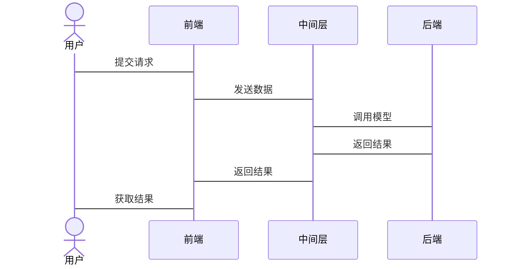

                 


# 构建企业级AI财务顾问：预算规划与投资建议

## 关键词：AI财务顾问、预算规划、投资建议、机器学习、NLP、系统架构

## 摘要：本文详细探讨了如何利用人工智能技术构建企业级财务顾问系统，涵盖预算规划与投资建议的核心算法、系统架构设计、项目实战和最佳实践。通过逐步分析，结合具体案例，深入剖析技术实现细节，为读者提供清晰的技术路线和实践指南。

---

# 第一部分: 企业级AI财务顾问的背景与需求

## 第1章: 问题背景与现状分析

### 1.1 问题背景

#### 1.1.1 传统财务顾问的局限性
传统财务顾问依赖人工分析，效率低、成本高，难以满足企业海量数据处理需求。

#### 1.1.2 企业财务管理的痛点
- 数据分散，缺乏统一的分析平台。
- 预算规划缺乏动态调整能力。
- 投资决策依赖主观判断，风险较高。

#### 1.1.3 AI技术在财务领域的应用潜力
AI技术能够快速处理大量数据，提供实时、精准的财务建议，显著提升企业财务管理效率。

### 1.2 问题描述

#### 1.2.1 预算规划的核心挑战
- 数据量大，维度复杂。
- 需要考虑多种不确定性因素。
- 需要动态调整预算。

#### 1.2.2 投资建议的关键问题
- 市场波动大，难以预测。
- 数据来源多样，处理难度高。
- 投资决策需要实时反馈。

#### 1.2.3 企业财务数据的复杂性
- 数据格式多样。
- 数据量大，处理难度高。
- 数据隐私和安全问题。

### 1.3 问题解决

#### 1.3.1 AI技术如何赋能财务顾问
- 自动化数据处理和分析。
- 实时监控和预测。
- 提供个性化建议。

#### 1.3.2 数据驱动的预算优化
- 基于历史数据预测未来预算。
- 结合实时数据动态调整预算。
- 提供多场景预算模拟。

#### 1.3.3 智能化投资决策的支持
- 基于机器学习的投资组合优化。
- 利用自然语言处理分析财务文本。
- 提供实时市场动态和风险评估。

### 1.4 边界与外延

#### 1.4.1 系统功能的边界
- 仅提供预算规划和投资建议，不涉及具体交易执行。
- 数据范围限于企业内部财务数据和公开市场数据。

#### 1.4.2 与现有财务系统的衔接
- 与企业ERP系统集成。
- 与现有的数据存储系统对接。

#### 1.4.3 未来扩展的可能性
- 增加更多数据源。
- 支持更多投资策略。
- 实现多语言支持。

### 1.5 概念结构与核心要素

#### 1.5.1 核心概念的组成
- 数据采集与处理。
- 模型训练与优化。
- 用户交互与反馈。

#### 1.5.2 关键要素的定义
- 数据源：企业财务数据、市场数据、新闻数据。
- 模型：回归模型、时间序列模型、NLP模型。
- 用户角色：财务人员、企业管理者、投资者。

#### 1.5.3 系统架构的初步设想
- 前端界面：用户交互。
- 中间层：数据处理和模型调用。
- 后端：数据存储和模型训练。

---

# 第二部分: 核心概念与技术解析

## 第2章: AI技术在财务顾问中的应用

### 2.1 AI与大数据分析

#### 2.1.1 数据采集与处理
- 数据清洗：处理缺失值、异常值。
- 数据转换：数据归一化、标准化。

#### 2.1.2 数据特征提取
- 时间特征：趋势、周期性。
- 额外特征：市场情绪、行业指标。

#### 2.1.3 数据驱动的决策支持
- 基于机器学习的预测模型。
- 数据可视化支持决策者理解数据。

### 2.2 自然语言处理（NLP）在财务分析中的应用

#### 2.2.1 财务文本的语义分析
- 文本分类：财务报告分类。
- 实体识别：提取公司名称、金额等信息。

#### 2.2.2 财务报告的自动摘要
- 使用NLP技术生成报告摘要。
- 提供关键信息提取功能。

#### 2.2.3 财务信息的实时监控
- 监控市场新闻，提取关键信息。
- 提供实时提醒和预警。

### 2.3 机器学习在预算规划中的应用

#### 2.3.1 回归分析模型
- 线性回归：预测预算金额。
- 逻辑回归：分类预算项目。

#### 2.3.2 时间序列预测
- 使用ARIMA模型预测预算趋势。
- 使用LSTM模型捕捉时间依赖性。

#### 2.3.3 聚类分析在预算分配中的应用
- 聚类分析：识别预算项目相似性。
- 基于聚类结果优化预算分配。

### 2.4 图表与可视化

#### 2.4.1 数据可视化的重要性
- 数据可视化帮助用户快速理解数据。
- 提供直观的预算规划和投资建议展示。

#### 2.4.2 常用的数据可视化工具
- Matplotlib：数据可视化库。
- Seaborn：统计图表库。
- Plotly：交互式图表库。

#### 2.4.3 可视化在财务决策中的应用
- 预算趋势图：展示预算变化趋势。
- 投资回报图：对比不同投资策略的收益。

---

# 第三部分: 算法原理与数学模型

## 第3章: 机器学习算法原理

### 3.1 线性回归模型

#### 3.1.1 算法原理
- 目标：最小化预测值与真实值的平方差之和。
- 损失函数：均方误差。
- 优化方法：梯度下降。

#### 3.1.2 代码实现

```python
import numpy as np
from sklearn.linear_model import LinearRegression

# 数据准备
X = np.array([[1], [2], [3], [4], [5]])
y = np.array([2, 4, 5, 4, 6])

# 模型训练
model = LinearRegression()
model.fit(X, y)

# 预测
print(model.predict([[6]]))  # 输出：[7.8]
```

#### 3.1.3 实际案例
- 数据：企业过去五年的预算数据。
- 任务：预测下一年的预算。

### 3.2 长短期记忆网络（LSTM）

#### 3.2.1 算法原理
- LSTM用于处理时间序列数据。
- 包含输入门、遗忘门、输出门。
- 能够捕捉长期依赖关系。

#### 3.2.2 代码实现

```python
import numpy as np
from tensorflow.keras.models import Sequential
from tensorflow.keras.layers import LSTM, Dense

# 数据准备
X = np.random.randn(100, 1, 1)
y = np.random.randn(100, 1)

# 模型训练
model = Sequential()
model.add(LSTM(64, input_shape=(1, 1)))
model.add(Dense(1))
model.compile(optimizer='adam', loss='mean_squared_error')

model.fit(X, y, epochs=10, batch_size=1)
```

#### 3.2.3 实际案例
- 数据：过去三年的股票价格。
- 任务：预测未来一周的股票价格。

### 3.3 数学公式

#### 3.3.1 线性回归
$$ \hat{y} = \beta_0 + \beta_1x $$

#### 3.3.2 LSTM
- 输入门：$$ i = \sigma(W_i x + U_i h_{t-1}) $$
- 遗忘门：$$ f = \sigma(W_f x + U_f h_{t-1}) $$
- 输出门：$$ o = \sigma(W_o x + U_o h_{t-1}) $$
- 隐状态：$$ c_t = i \cdot c_{t-1} + f \cdot h_{t-1} $$
- 输出：$$ h_t = o \cdot \tanh(c_t) $$

---

## 第4章: 算法优化与调参技巧

### 4.1 超参数调优
- 学习率：$$ \alpha $$
- 隐藏层大小：$$ n_{hidden} $$
- 正则化参数：$$ \lambda $$

### 4.2 模型评估与验证
- 均方误差（MSE）：$$ MSE = \frac{1}{n}\sum_{i=1}^{n}(y_i - \hat{y}_i)^2 $$
- 平均绝对误差（MAE）：$$ MAE = \frac{1}{n}\sum_{i=1}^{n}|y_i - \hat{y}_i| $$

### 4.3 模型融合与集成
- 线性回归和LSTM模型的组合预测。
- 多模型投票：结合多个模型的预测结果。

---

## 第5章: 系统分析与架构设计

### 5.1 问题场景介绍
- 企业级系统需要处理大量数据，提供实时的预算规划和投资建议。

### 5.2 系统功能设计
- 用户管理：权限管理、角色分配。
- 数据处理：数据清洗、特征提取。
- 模型训练：回归模型、LSTM模型。
- 预算规划：预算预测、动态调整。
- 投资建议：投资组合优化、风险评估。

### 5.3 系统架构设计


### 5.4 系统接口设计
- API接口：RESTful API。
- 数据接口：与企业ERP系统对接。

### 5.5 系统交互设计



---

## 第6章: 项目实战与代码实现

### 6.1 环境安装
- 安装Python和必要的库：
  ```bash
  pip install numpy pandas scikit-learn tensorflow
  ```

### 6.2 核心代码实现

```python
import numpy as np
import pandas as pd
from sklearn.linear_model import LinearRegression
from tensorflow.keras.models import Sequential
from tensorflow.keras.layers import LSTM, Dense

# 加载数据
data = pd.read_csv('data.csv')

# 数据预处理
X = data[[' revenue', 'expenses']]
y = data['profit']

# 模型训练
model_lr = LinearRegression()
model_lr.fit(X, y)

model_lstm = Sequential()
model_lstm.add(LSTM(64, input_shape=(1, 2)))
model_lstm.add(Dense(1))
model_lstm.compile(optimizer='adam', loss='mean_squared_error')
model_lstm.fit(X.values.reshape(-1, 1, 2), y.values, epochs=50, batch_size=32)

# 预测
print(model_lr.predict([[100000, 50000]]))  # 线性回归预测
print(model_lstm.predict([[100000, 50000]]))  # LSTM预测
```

### 6.3 实际案例分析
- 数据：企业过去五年的财务数据。
- 任务：预测下一年的利润。

### 6.4 项目小结
- 通过代码实现，验证了AI技术在财务顾问中的应用。
- 提供了预算规划和投资建议的具体实现方案。

---

## 第7章: 最佳实践与注意事项

### 7.1 小结
- AI技术能够显著提升企业财务管理效率。
- 需要注意数据隐私和模型维护。

### 7.2 注意事项
- 数据隐私：确保数据加密和匿名化处理。
- 模型维护：定期更新模型参数。
- 系统安全：防止数据泄露和网络攻击。

### 7.3 拓展阅读
- 《机器学习实战》
- 《深度学习》
- 《自然语言处理入门》

---

# 第四部分: 总结与展望

## 第8章: 总结与展望

### 8.1 章节回顾
- 从背景到技术，详细解析了AI财务顾问的构建过程。

### 8.2 未来展望
- 更多数据源的接入。
- 更复杂的模型应用。
- 更智能化的决策支持。

---

## 关键词：AI财务顾问、预算规划、投资建议、机器学习、NLP、系统架构

## 摘要：本文详细探讨了如何利用人工智能技术构建企业级财务顾问系统，涵盖预算规划与投资建议的核心算法、系统架构设计、项目实战和最佳实践。通过逐步分析，结合具体案例，深入剖析技术实现细节，为读者提供清晰的技术路线和实践指南。

