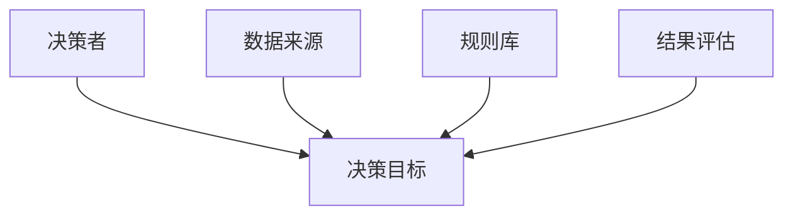
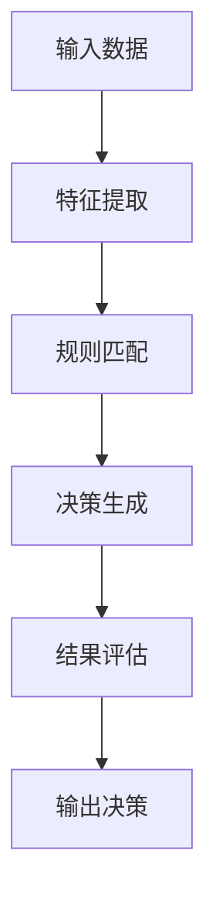
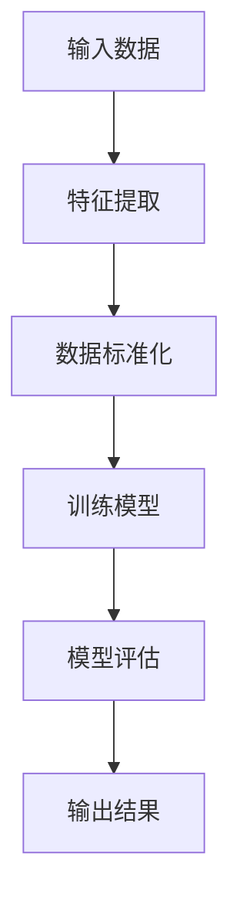
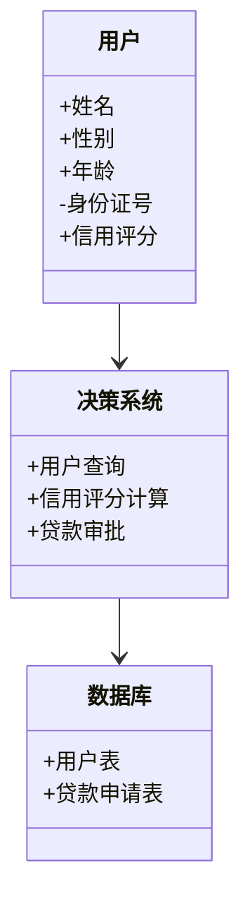
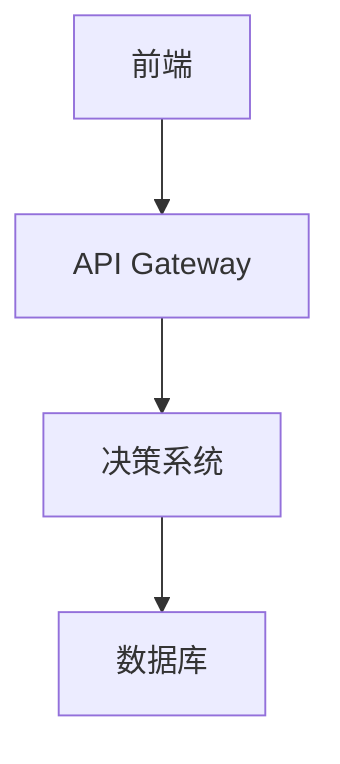
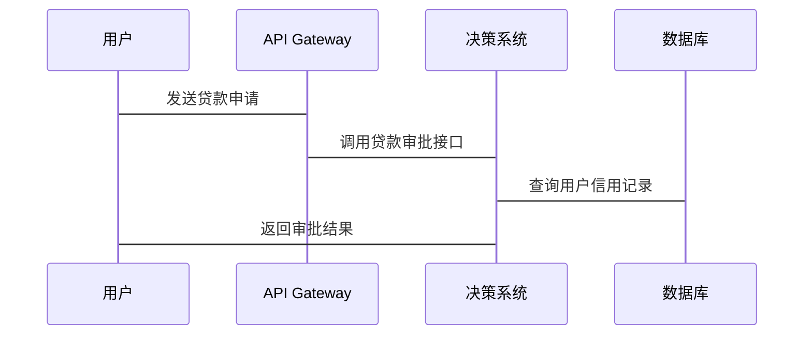

                 


# 构建企业级AI道德决策框架：确保AI系统的公平性与透明度

## 关键词：企业级AI，道德决策框架，公平性，透明度，算法偏见，伦理决策，系统架构

## 摘要：随着人工智能技术的快速发展，AI系统在企业中的应用日益广泛。然而，AI决策中的伦理问题，如偏见、隐私和透明度问题，正在引起广泛关注。本文详细探讨如何构建企业级AI道德决策框架，确保系统的公平性和透明度。通过分析核心概念、算法原理、系统架构和实际案例，本文为读者提供一套实用的方法论，帮助企业在AI决策过程中实现道德合规，提升系统可信度。

---

# 第一部分: AI道德决策框架的背景与核心概念

## 第1章: AI系统的道德决策框架概述

### 1.1 AI技术的现状与挑战
#### 1.1.1 AI技术的快速发展
人工智能技术近年来取得了显著进展，从自然语言处理到计算机视觉，AI已经渗透到各个行业。企业利用AI优化决策过程，提升效率，降低成本。

#### 1.1.2 AI在企业中的广泛应用
AI被广泛应用于金融、医疗、教育等领域。例如，金融机构使用AI进行风险评估和欺诈检测；医疗行业利用AI辅助诊断和治疗方案制定。

#### 1.1.3 AI决策中的伦理问题
AI系统的决策可能引入偏见，例如招聘系统可能因为训练数据中的性别偏见而影响 hiring。此外，AI决策的不透明性也让用户和监管机构感到担忧。

### 1.2 道德决策框架的重要性
#### 1.2.1 公平性与透明度的定义
公平性指AI系统在决策过程中不歧视任何群体；透明度指用户能够理解AI的决策过程和依据。

#### 1.2.2 道德决策框架的核心作用
通过设计和实施道德决策框架，企业可以确保AI系统的决策符合伦理标准，减少法律和声誉风险。

#### 1.2.3 企业级AI系统的责任边界
企业需要明确AI系统的责任范围，确保在出现问题时能够及时响应和纠正。

### 1.3 问题背景与挑战
#### 1.3.1 AI决策中的偏见问题
偏见源于训练数据中的历史歧视或算法设计的局限性。例如， facial recognition系统可能对某些肤色的人识别率较低。

#### 1.3.2 数据隐私与安全风险
AI系统处理大量敏感数据，存在数据泄露和滥用的风险。

#### 1.3.3 用户信任与合规性要求
用户对AI系统的信任建立在系统公平、透明的基础上。企业需要满足日益严格的法规要求，如GDPR。

### 1.4 道德决策框架的构建意义
#### 1.4.1 提升系统可信度
通过确保公平性和透明度，用户更愿意信任AI系统。

#### 1.4.2 降低法律与伦理风险
合规的道德决策框架有助于减少因偏见或不透明性引发的法律纠纷。

#### 1.4.3 促进企业可持续发展
企业通过道德决策框架提升品牌形象，增强用户忠诚度，促进长期发展。

### 1.5 本章小结
本章介绍了AI技术的现状及其在企业中的应用，分析了道德决策框架的重要性，明确了构建框架的意义和挑战。

---

## 第2章: 道德决策框架的核心概念与联系

### 2.1 道德决策框架的定义与属性
#### 2.1.1 定义
道德决策框架是一套用于指导和约束AI系统决策的规则和机制，确保决策符合伦理标准。

#### 2.1.2 核心属性对比（表格形式）

| 属性 | 描述 |
|------|------|
| 公平性 | 确保AI决策不歧视特定群体 |
| 透明度 | 向用户解释决策过程和依据 |
| 责任性 | 明确决策的责任归属 |
| 可控性 | 允许人工干预和调整 |

### 2.2 道德决策框架的实体关系图


### 2.3 道德决策框架的流程图


### 2.4 核心概念的联系与区别
#### 2.4.1 比较分析
公平性关注结果的平等，而透明度关注决策过程的可解释性。两者相辅相成，共同确保AI决策的道德合规性。

#### 2.4.2 实体关系图的详细解读
决策者（如企业）通过数据来源（如用户行为数据）和规则库（如公平性规则）生成决策目标（如贷款审批结果），并由结果评估模块确保决策符合伦理标准。

### 2.5 本章小结
本章详细介绍了道德决策框架的核心概念，通过图表展示了各实体之间的关系和流程。

---

# 第三部分: 道德决策框架的算法原理

## 第3章: 支持向量机在道德决策中的应用

### 3.1 支持向量机（SVM）原理
#### 3.1.1 算法概述
支持向量机是一种监督学习算法，常用于分类和回归问题。其核心思想是通过找到一个超平面，将数据分为两类，最大化两类之间的距离。

#### 3.1.2 算法流程图


#### 3.1.3 支持向量机的数学模型
$$ \text{目标函数: } \min_{w,b,\xi} \frac{1}{2}||w||^2 + C \sum_{i=1}^n \xi_i $$
$$ \text{约束条件: } y_i (w \cdot x_i + b) \geq 1 - \xi_i $$
其中，$$w$$是权重向量，$$b$$是偏置，$$\xi_i$$是松弛变量，$$C$$是惩罚系数。

#### 3.1.4 支持向量机的Python实现
```python
from sklearn import svm
model = svm.SVC()
model.fit(X_train, y_train)
y_pred = model.predict(X_test)
```

#### 3.1.5 支持向量机在道德决策中的应用
例如，在招聘系统中，使用SVM模型分析候选人的性别、种族等特征，确保决策过程中没有偏见。

---

## 第4章: 决策树算法在道德决策中的应用

### 4.1 决策树算法原理
#### 4.1.1 算法概述
决策树是一种基于树状结构的分类算法，通过特征选择和分裂策略构建决策树，最终生成决策规则。

#### 4.1.2 决策树的数学模型
$$ \text{信息增益: } IG(D, A) = H(D) - \sum_{v \in vals(A)} \frac{|D_v|}{|D|} H(D_v) $$
其中，$$H(D)$$是数据集$$D$$的熵，$$D_v$$是特征$$A$$取值$$v$$时的子数据集。

#### 4.1.3 决策树的Python实现
```python
from sklearn import tree
model = tree.DecisionTreeClassifier()
model.fit(X_train, y_train)
y_pred = model.predict(X_test)
```

#### 4.1.4 决策树在道德决策中的应用
例如，在医疗诊断中，使用决策树算法分析患者的症状和病史，确保诊断过程的公平性和透明度。

---

## 第5章: 道德决策框架的算法比较与选择

### 5.1 算法比较
从准确率、训练时间、可解释性等角度比较SVM和决策树在道德决策中的表现。

### 5.2 算法选择策略
根据具体场景和需求选择合适的算法。例如，对于需要高透明度的场景，决策树可能更适合。

### 5.3 本章小结
本章分析了SVM和决策树在道德决策中的应用，帮助读者选择合适的算法。

---

# 第四部分: 道德决策框架的系统分析与架构设计

## 第6章: 道德决策框架的系统分析

### 6.1 问题场景介绍
企业需要构建一个公平、透明的AI决策系统，确保在招聘、信贷审批等场景中没有偏见。

### 6.2 系统功能设计
#### 6.2.1 领域模型类图


### 6.3 系统架构设计
#### 6.3.1 系统架构图


#### 6.3.2 系统接口设计
API接口用于接收用户请求，调用决策系统，返回决策结果。

#### 6.3.3 系统交互序列图


### 6.4 系统实现
详细描述系统各模块的实现细节，包括数据预处理、模型训练和部署等。

### 6.5 本章小结
本章通过系统分析，明确了道德决策框架的系统架构和实现方案。

---

## 第7章: 道德决策框架的项目实战

### 7.1 项目背景与目标
构建一个公平、透明的贷款审批系统，确保AI决策过程中没有性别歧视。

### 7.2 项目实施步骤
#### 7.2.1 环境安装
安装必要的Python库，如scikit-learn、pandas、numpy等。

#### 7.2.2 数据准备
收集贷款申请数据，包括用户基本信息和贷款审批结果。

#### 7.2.3 数据预处理
清洗数据，处理缺失值和异常值，进行特征工程。

#### 7.2.4 模型训练
使用SVM或决策树算法训练模型，确保模型公平性。

#### 7.2.5 模型评估
通过准确率、召回率等指标评估模型性能。

#### 7.2.6 模型部署
将模型部署到生产环境，提供API接口供前端调用。

### 7.3 核心代码实现
#### 7.3.1 数据预处理
```python
import pandas as pd
data = pd.read_csv('loan_data.csv')
data = data.dropna()
```

#### 7.3.2 模型训练
```python
from sklearn import svm
model = svm.SVC()
model.fit(X_train, y_train)
```

#### 7.3.3 模型评估
```python
from sklearn.metrics import accuracy_score
print(accuracy_score(y_test, y_pred))
```

#### 7.3.4 API接口实现
```python
from flask import Flask
app = Flask(__name__)
@app.route('/api/loan_approval', methods=['POST'])
def loan_approval():
    # 处理请求
    return '审批结果'
```

### 7.4 案例分析与结果解读
通过具体案例分析模型的公平性和透明度，解释决策过程和依据。

### 7.5 项目小结
本章通过一个实际案例，详细讲解了如何构建公平、透明的AI决策系统。

---

## 第8章: 道德决策框架的最佳实践与注意事项

### 8.1 最佳实践
#### 8.1.1 数据预处理阶段
确保数据的多样性和代表性，避免偏见。

#### 8.1.2 模型选择阶段
选择适合的算法，并进行模型调优。

#### 8.1.3 模型部署阶段
确保模型的可解释性，提供透明的决策过程。

### 8.2 注意事项
#### 8.2.1 数据隐私保护
确保数据处理符合相关法律法规。

#### 8.2.2 模型解释性
使用可解释性模型，如决策树，提高用户信任。

#### 8.2.3 持续监控与优化
定期监控模型性能，及时发现和修复问题。

### 8.3 本章小结
本章总结了构建道德决策框架的最佳实践和注意事项，为读者提供实用的建议。

---

## 第9章: 总结与展望

### 9.1 本书内容回顾
总结全书内容，强调构建道德决策框架的重要性和方法。

### 9.2 未来发展方向
探讨AI技术的未来发展，提出构建更加智能、公平的道德决策框架的方向。

### 9.3 结语
呼吁企业和社会共同努力，推动AI技术的健康发展，确保AI系统的公平性和透明度。

---

## 附录: 参考资料与工具

### 附录A: 参考文献
列出本书参考的相关文献和资料。

### 附录B: 工具与资源
推荐相关的工具和资源，如AI框架、数据集等。

---

通过以上详细的内容，您可以根据需要逐步展开每个部分，撰写一篇完整的关于“构建企业级AI道德决策框架：确保AI系统的公平性与透明度”的技术博客文章。

