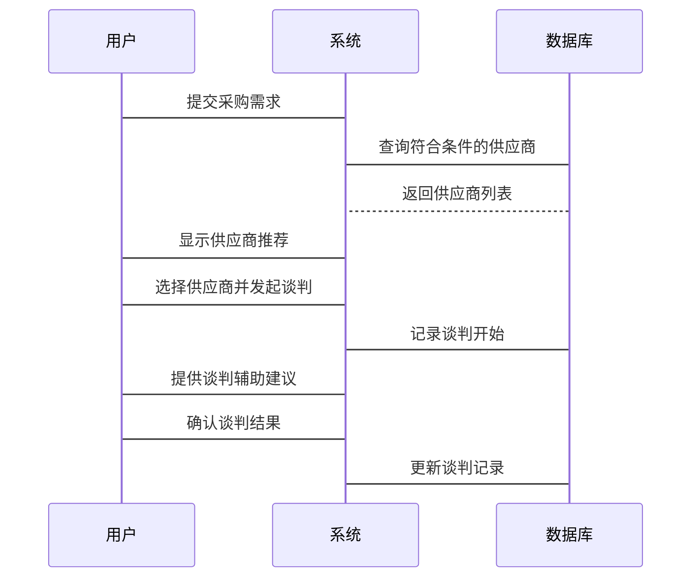

                 


# 构建企业级AI采购助手：优化供应商选择与谈判

## 关键词：企业级AI采购助手，供应商选择，谈判优化，自然语言处理，多目标优化，AI算法，采购流程

## 摘要：本文详细探讨了构建企业级AI采购助手的技术与方法，从优化供应商选择到智能谈判，通过自然语言处理和多目标优化算法，为企业采购流程提供智能化解决方案。

---

# 第1章: 引言

## 1.1 企业采购的挑战与痛点
### 1.1.1 传统采购流程的低效性
- 信息不对称导致供应商选择困难
- 谈判过程耗时且结果不确定
- 数据孤岛导致决策缺乏依据

### 1.1.2 供应商选择的复杂性
- 多目标优化问题
- 供应商评估指标的多样性
- 市场变化对供应商选择的影响

### 1.1.3 谈判过程的不确定性
- 谈判策略的选择
- 价格、质量、交付时间的平衡
- 谈判中的博弈论应用

## 1.2 AI技术在采购中的应用潜力
### 1.2.1 数据驱动的决策优势
- AI如何利用大数据优化采购决策
- 从历史数据中提取采购模式
- 数据分析在供应商评估中的应用

### 1.2.2 自然语言处理在供应商评估中的应用
- 文本挖掘技术分析供应商文档
- 谈判文本的情感分析
- 基于BERT的供应商匹配

### 1.2.3 智能谈判助手的可能性
- AI辅助谈判策略生成
- 谈判中的动态调整
- 自然语言生成技术在谈判中的应用

## 1.3 本章小结
- 总结企业采购中的主要挑战
- 强调AI技术在采购中的潜力
- 为后续章节奠定基础

---

# 第2章: 企业级AI采购助手的核心概念

## 2.1 问题背景与问题描述
### 2.1.1 供应商选择的多目标优化问题
- 问题定义：如何在多个目标（如成本、质量、交付时间）之间找到最优平衡
- 指标权重的确定
- 供应商评估模型的构建

### 2.1.2 谈判过程中的信息不对称问题
- 信息不对称的表现形式
- 信息获取的成本与效率
- 信息对谈判结果的影响

### 2.1.3 企业采购的边界与外延
- 采购范围的界定
- 采购策略的制定
- 采购流程的优化

## 2.2 核心概念与联系
### 2.2.1 AI采购助手的概念结构
- 核心功能模块：数据采集、分析、推荐、谈判辅助
- 功能模块之间的关系
- 用户需求与系统功能的匹配

### 2.2.2 核心要素的对比分析
- 供应商评估指标的对比
- 不同供应商的历史表现分析
- 谈判策略的对比与优化

### 2.2.3 ER实体关系图的构建
```mermaid
erd
    title 采购系统ER图
    界面层
        类
            采购需求
                属性: 需求ID, 产品类别, 数量要求, 交付时间
            供应商
                属性: 供应商ID, 公司名称, 联系方式, 信用评分
            谈判记录
                属性: 记录ID, 时间戳, 谈判结果, 备注
```

## 2.3 本章小结
- 明确企业级AI采购助手的核心概念
- 分析关键问题和解决思路
- 为后续技术实现奠定基础

---

# 第3章: 技术基础与算法原理

## 3.1 数据采集与预处理
### 3.1.1 数据来源的多样性
- 供应商的历史交易数据
- 供应商文档（如报价单、合同）
- 市场数据（如价格波动、行业趋势）

### 3.1.2 数据清洗与特征提取
- 数据清洗步骤：去除重复数据、处理缺失值、异常值
- 特征提取：文本特征、数值特征、时间特征
- 数据标注与格式化：结构化数据处理

### 3.1.3 数据存储与管理
- 数据库设计：关系型数据库与NoSQL数据库的选择
- 数据分区与索引优化
- 数据安全与隐私保护

## 3.2 自然语言处理技术
### 3.2.1 供应商文档的文本分析
- 文本分词与实体识别
- 主题模型构建（如LDA）
- 情感分析在供应商评价中的应用

### 3.2.2 谈判文本的情感分析
- 基于BERT的情感分析模型
- 谈判文本的语义理解
- 情感分析结果对谈判策略的影响

### 3.2.3 基于BERT的文本匹配
- 文本匹配任务：供应商文档与需求匹配
- BERT模型的微调与应用
- 文本匹配的评估指标

## 3.3 多目标优化算法
### 3.3.1 供应商选择的多目标优化模型
- 多目标优化的基本概念
- 建立多目标优化模型：目标函数与约束条件
- 优化算法的选择：遗传算法、粒子群算法、模拟退火算法

### 3.3.2 基于遗传算法的优化策略
- 遗传算法的工作流程：编码、选择、交叉、变异
- 初始化种群与适应度评估
- 优化过程中的参数调整

### 3.3.3 谈判策略的动态调整
- 动态优化的必要性
- 基于实时数据的策略调整
- 多目标优化在谈判中的应用

## 3.4 本章小结
- 介绍数据采集与预处理的关键步骤
- 分析自然语言处理技术在采购中的应用
- 探讨多目标优化算法的实现与优化策略

---

# 第4章: 供应商选择的多目标优化模型

## 4.1 模型概述
### 4.1.1 多目标优化的基本概念
- 多目标优化问题的定义
- 常见的多目标优化算法
- 多目标优化与单目标优化的区别

### 4.1.2 基于权重的优化策略
- 权重分配的方法：主观赋权法、客观赋权法
- 基于权重的多目标优化模型
- 权重调整对结果的影响

### 4.1.3 购买成本、交付周期和质量的平衡
- 三个目标的相互关系
- 如何在不同目标之间找到平衡点
- 平衡策略的选择与优化

## 4.2 数学模型与公式
### 4.2.1 多目标优化模型
$$ \text{min} \quad f_1(x) $$
$$ \text{min} \quad f_2(x) $$
$$ \text{subject to} \quad g_i(x) \leq 0, i=1,2,...,m $$

### 4.2.2 基于遗传算法的优化模型
$$ \text{适应度函数} = w_1 \cdot f_1 + w_2 \cdot f_2 $$

### 4.2.3 基于粒子群算法的优化模型
$$ v_i = w \cdot v_i + c_1 \cdot r_1 \cdot (p_i - x_i) + c_2 \cdot r_2 \cdot (p_g - x_i) $$

## 4.3 本章小结
- 介绍多目标优化的基本概念与模型
- 探讨基于权重的优化策略
- 分析购买成本、交付周期和质量的平衡问题

---

# 第5章: 谈判过程中的自然语言处理应用

## 5.1 谈判文本的情感分析
### 5.1.1 情感分析的基本原理
- 基于词袋模型的情感分析
- 基于深度学习的情感分析
- 情感分析的评估指标

### 5.1.2 基于BERT的情感分析模型
- BERT模型的结构与特点
- 情感分析任务的微调策略
- 情感分析结果的解释与应用

### 5.1.3 情感分析在谈判中的应用
- 谈判文本的情感分析结果对策略的影响
- 情感分析结果的动态调整
- 情感分析与谈判结果的相关性分析

## 5.2 自然语言生成技术在谈判中的应用
### 5.2.1 自然语言生成的基本原理
- 基于模板的生成策略
- 基于预训练模型的生成策略
- 生成结果的可控制性

### 5.2.2 基于GPT的谈判文本生成
- GPT模型的结构与特点
- 谈判文本生成的条件设置
- 生成结果的评估与优化

### 5.2.3 自然语言生成在谈判中的实际应用
- 谈判文本的自动生成与优化
- 自动生成谈判要点与策略
- 自然语言生成对谈判效率的提升

## 5.3 本章小结
- 介绍谈判过程中的自然语言处理应用
- 分析情感分析与自然语言生成技术在谈判中的作用
- 探讨技术对谈判结果的潜在影响

---

# 第6章: 系统设计与实现

## 6.1 系统架构设计
### 6.1.1 问题场景介绍
- 系统的目标与功能
- 用户需求与系统功能的匹配
- 系统的可扩展性与可维护性

### 6.1.2 系统架构设计


### 6.1.3 系统架构的优点
- 分层设计的优势
- 服务的独立性与复用性
- 数据层的高效访问与管理

## 6.2 系统功能设计
### 6.2.1 领域模型设计


### 6.2.2 系统功能模块
- 数据采集模块
- 数据分析模块
- 供应商推荐模块
- 谈判辅助模块

## 6.3 系统接口设计
### 6.3.1 接口设计
- 数据接口：与供应商数据库的连接
- API接口：与其他系统的集成
- 用户界面接口：与用户的交互

### 6.3.2 接口实现
- RESTful API的设计
- 接口的安全性与权限控制
- 接口的文档编写与测试

## 6.4 系统交互设计
### 6.4.1 交互流程


### 6.4.2 交互优化
- 用户界面的友好性设计
- 交互流程的简化与优化
- 系统的响应速度与稳定性

## 6.5 本章小结
- 介绍系统架构设计与实现
- 分析系统功能与接口设计
- 探讨系统的交互流程与优化

---

# 第7章: 项目实战

## 7.1 环境安装与配置
### 7.1.1 开发环境的选择
- 操作系统：Linux/MacOS/Windows
- 开发工具：PyCharm、VS Code
- 依赖管理：virtualenv、pip

### 7.1.2 数据库安装与配置
- 关系型数据库：MySQL、PostgreSQL
- NoSQL数据库：MongoDB
- 数据库连接与操作

### 7.1.3 机器学习框架安装
- TensorFlow、Keras、Scikit-learn
- 自然语言处理工具：spaCy、NLTK
- 预训练模型：Hugging Face Transformers

## 7.2 核心代码实现
### 7.2.1 数据采集与预处理
```python
import pandas as pd
import numpy as np

# 数据加载
data = pd.read_csv('procurement_data.csv')

# 数据清洗
data.dropna(inplace=True)
data = data[~data['供应商ID'].duplicated()]

# 特征提取
from sklearn.preprocessing import StandardScaler
scaler = StandardScaler()
scaled_data = scaler.fit_transform(data[['价格', '交付时间', '质量评分']])
```

### 7.2.2 自然语言处理模型实现
```python
from transformers import BertTokenizer, BertModel
import torch

# 加载BERT模型
model = BertModel.from_pretrained('bert-base-uncased')
tokenizer = BertTokenizer.from_pretrained('bert-base-uncased')

# 文本编码
inputs = tokenizer("供应商A的报价单优于供应商B。", return_tensors="pt")
with torch.no_grad():
    outputs = model(**inputs)
```

### 7.2.3 多目标优化算法实现
```python
import numpy as np
from scipy.optimize import minimize

# 定义目标函数
def objective(x):
    return (x[0] + x[1])**2

# 约束条件
def constraint(x):
    return x[0] + x[1] - 1 <= 0

# 求解
cons = {'type': 'ineq', 'fun': constraint}
solution = minimize(objective, [0.5, 0.5], constraints=cons)
```

## 7.3 实际案例分析
### 7.3.1 案例背景
- 某公司采购电子元件的需求
- 多家供应商的报价与交付时间
- 谈判过程中的价格调整

### 7.3.2 案例分析与实现
- 数据采集与处理
- 供应商推荐结果
- 谈判辅助建议

## 7.4 项目小结
- 总结项目实施的关键步骤
- 分析项目中的技术难点与解决方案
- 提出改进建议与未来方向

---

# 第8章: 总结与展望

## 8.1 本章总结
- 回顾全文内容
- 强调AI技术在采购中的应用价值
- 总结项目实施的经验与教训

## 8.2 未来展望
- AI技术的进一步发展与应用
- 更多行业中的采购助手应用
- 技术的持续优化与创新

## 8.3 最佳实践 Tips
- 数据质量的重要性
- 算法选择与调优的注意事项
- 系统设计中的可扩展性与可维护性

## 8.4 本章小结
- 总结全文，强调AI技术在采购中的重要性
- 展望未来，提出进一步的研究方向
- 提供实际应用中的最佳实践建议

---

# 附录

## 附录A: 常用AI工具与库
- TensorFlow、Keras、PyTorch
- spaCy、NLTK、Gensim
- Hugging Face Transformers

## 附录B: 数据集与API接口
- 公共采购数据集
- 开放API接口列表
- 数据预处理工具

## 附录C: 参考文献与拓展阅读
- 相关学术论文
- 技术博客与在线资源
- 书籍推荐

---

# 结束语

通过本文的详细讲解，读者可以全面了解如何构建企业级AI采购助手，并通过实际案例分析掌握技术实现的关键点。希望本文能够为企业的采购流程优化提供有价值的参考与启发。

