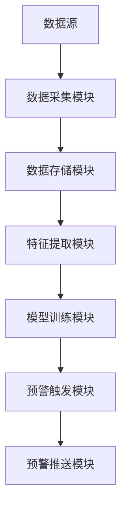

                 


# 构建企业级AI风控助手：实时监控与风险预警

## 关键词：AI风控助手、实时监控、风险预警、企业风险管理、机器学习算法、系统架构设计

## 摘要：  
本文详细探讨了构建企业级AI风控助手的核心技术与实践方法，涵盖实时监控、风险预警、AI模型应用、系统架构设计等多个方面。通过理论分析与实践案例结合，为读者提供从概念到实现的全面指导，帮助企业在复杂多变的商业环境中有效识别和管理风险。

---

## 正文

### 第一部分: 企业级AI风控助手概述

#### 第1章: 企业风险管理与AI风控助手概述

##### 1.1 企业风险管理的背景与挑战
企业风险管理（Enterprise Risk Management，ERM）是企业运营的核心环节，旨在识别、评估和应对潜在风险，以确保企业稳健发展。然而，随着业务规模的扩大和市场环境的复杂化，传统的人工风险管理方式已难以满足企业需求，主要面临以下挑战：

- **数据多样性与实时性要求**：企业需要处理来自不同业务线的海量数据，并要求实时或近实时的监控能力。
- **风险复杂性**：现代企业的风险来源多样，包括市场风险、信用风险、操作风险等，传统的单一维度分析难以覆盖所有风险场景。
- **效率与成本问题**：传统的人工分析效率低下，且容易因人为疏忽导致风险漏判或误判。

##### 1.2 AI风控助手的定义与核心功能
AI风控助手是一种基于人工智能技术的辅助工具，通过机器学习算法和实时数据分析，帮助企业实现风险的智能化识别、评估和预警。其核心功能包括：

- **实时监控**：对企业的各项业务数据进行实时采集和分析，快速识别潜在风险。
- **风险预警**：根据预设的阈值和模型预测结果，生成风险预警信息并推送至相关人员。
- **智能决策支持**：基于历史数据和实时信息，为企业提供风险应对策略建议。
- **自适应学习**：通过反馈机制不断优化模型，提升风险识别的准确性和预警的及时性。

##### 1.3 企业级AI风控助手的目标与价值
企业级AI风控助手的目标是通过技术手段提升企业风险管理的效率和准确性，降低潜在风险对企业的影响。其价值体现在以下几个方面：

- **降低风险损失**：通过实时监控和预警，及时发现并应对潜在风险，避免或减少损失。
- **提高决策效率**：AI风控助手能够快速分析海量数据，为企业管理层提供及时、准确的风险评估报告。
- **优化资源配置**：基于风险分析结果，优化企业资源分配，提高整体运营效率。

---

#### 第2章: 实时监控与风险预警的基础

##### 2.1 数据采集与处理
实时监控的基础是高质量的数据。企业需要从多种来源采集数据，包括：

- **内部数据**：如财务数据、业务操作日志、员工行为数据等。
- **外部数据**：如市场数据、行业趋势、法律法规变化等。

数据采集后，需要进行清洗和预处理，去除噪声数据，确保数据的完整性和准确性。

##### 2.2 风险特征工程
特征工程是将原始数据转化为具有代表性的特征，以便更好地进行风险分析。常见的风险特征包括：

- **时间特征**：如交易时间、事件发生的时间间隔等。
- **行为特征**：如用户行为模式、交易频率等。
- **数值特征**：如交易金额、账户余额等。
- **文本特征**：如交易描述、评论内容等。

##### 2.3 风险评估与预警机制
风险评估是基于特征数据，利用统计方法或机器学习算法对风险进行量化。常见的风险评估方法包括：

- **阈值法**：设定一个临界值，当某些特征超过该值时触发预警。
- **评分法**：对各个风险因素进行评分，综合计算总风险评分。

预警机制需要结合企业的业务特点，设置合理的预警级别和响应流程。

##### 2.4 实时计算与分析技术
实时监控需要高效的计算能力，常用的技术包括：

- **流数据处理**：如Apache Kafka、Apache Pulsar等，用于实时数据的高效传输。
- **分布式计算框架**：如Apache Flink、Apache Spark，用于大规模数据的并行处理。
- **时间序列分析**：通过分析历史数据，预测未来风险趋势。

---

#### 第3章: AI模型在风险预警中的应用

##### 3.1 风险分类与预测模型
分类模型用于将风险分为不同的类别，如正常、低风险、中风险、高风险。常用算法包括逻辑回归、随机森林、支持向量机（SVM）等。

##### 3.2 回归分析与风险量化
回归分析用于预测风险的量化程度，如预测某项业务的违约概率。常用算法包括线性回归、岭回归、Lasso回归等。

##### 3.3 时间序列分析与风险趋势预测
时间序列分析用于预测未来风险趋势，如预测某项业务在未来一段时间内的风险变化。常用方法包括ARIMA、Prophet、LSTM等。

---

#### 第4章: 算法原理与数学模型

##### 4.1 逻辑回归模型
逻辑回归是一种常用的分类算法，其核心思想是通过logit函数将线性回归的结果映射到概率空间。

$$ P(y=1|x) = \frac{1}{1 + e^{- (\beta_0 + \beta_1 x_1 + \cdots + \beta_n x_n)}} $$

##### 4.2 随机森林模型
随机森林是一种基于决策树的集成算法，通过随机采样和特征选择，构建多个决策树并进行投票或平均，以提高模型的准确性和鲁棒性。

##### 4.3 LSTM模型
LSTM（长短期记忆网络）是一种处理时间序列数据的深度学习模型，能够有效捕捉数据中的长距离依赖关系。

---

#### 第5章: 系统架构设计

##### 5.1 系统功能设计
- **数据采集模块**：负责实时采集企业内外部数据。
- **特征提取模块**：对采集到的数据进行特征提取和工程处理。
- **模型训练模块**：基于特征数据，训练风险预测模型。
- **预警触发模块**：根据模型预测结果，触发风险预警。

##### 5.2 系统架构图


##### 5.3 接口设计
- 数据接口：提供数据的输入输出接口，支持多种数据格式。
- 模型接口：提供模型训练和预测的API接口，方便其他系统调用。
- 预警接口：提供预警信息的推送接口，支持多种通知方式。

---

#### 第6章: 项目实战

##### 6.1 环境配置
- 安装必要的工具和库，如Python、Jupyter、Pandas、Scikit-learn等。

##### 6.2 核心代码实现
```python
import pandas as pd
from sklearn.model_selection import train_test_split
from sklearn.linear_model import LogisticRegression

# 加载数据
data = pd.read_csv('risk_data.csv')

# 数据分割
X = data.drop('label', axis=1)
y = data['label']

X_train, X_test, y_train, y_test = train_test_split(X, y, test_size=0.2)

# 模型训练
model = LogisticRegression()
model.fit(X_train, y_train)

# 模型预测
y_pred = model.predict(X_test)
```

##### 6.3 案例分析
以某企业的信用风险预警为例，通过模型预测客户违约概率，帮助企业提前采取措施，降低坏账率。

---

#### 第7章: 最佳实践与注意事项

##### 7.1 小结
本文详细介绍了构建企业级AI风控助手的核心技术与实践方法，从数据采集到模型训练，再到系统架构设计，为读者提供了全面的指导。

##### 7.2 注意事项
- 数据隐私与安全：在处理企业数据时，必须遵守相关法律法规，确保数据的安全性。
- 模型可解释性：复杂的模型可能难以解释，建议在实际应用中选择适当的模型。
- 系统可扩展性：随着企业的发展，系统需要具备良好的扩展性，以应对数据量和业务复杂度的增加。

##### 7.3 拓展阅读
- 推荐阅读《机器学习实战》、《深度学习》等书籍，深入理解相关算法和技术。

---

以上是《构建企业级AI风控助手：实时监控与风险预警》的技术博客文章的详细目录和内容结构。通过理论与实践相结合，本文为读者提供了从概念到实现的全面指导，帮助企业构建高效的AI风控系统。

