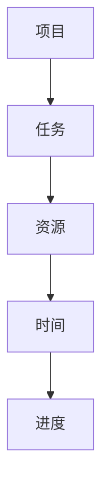
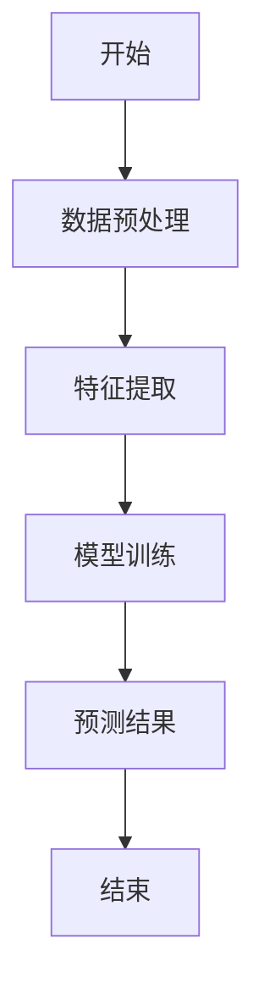
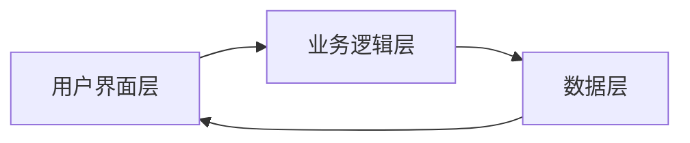

                 


# 构建企业级AI驱动的项目管理助手

## 关键词：
企业级、AI驱动、项目管理、项目管理助手、算法原理、系统架构、项目实战

## 摘要：
随着企业数字化转型的加速，项目管理在企业运营中的重要性日益凸显。传统的项目管理方法和工具已难以满足现代企业对高效、智能管理的需求。本文将探讨如何构建一个企业级AI驱动的项目管理助手，通过AI技术提升项目管理的效率和准确性。文章将从项目管理的核心要素、AI技术的应用、算法原理、系统架构设计以及项目实战等方面展开详细论述，为企业级项目管理助手的构建提供理论支持和实践指导。

---

# 第一部分: 企业级AI驱动的项目管理助手背景与概念

## 第1章: 项目管理与AI驱动的结合

### 1.1 项目管理的现状与挑战

#### 1.1.1 传统项目管理的痛点
传统项目管理依赖于人工经验，存在以下痛点：
- **复杂性**：项目涉及多个角色和任务，协调困难。
- **不确定性**：项目进度和资源分配受外部因素影响大。
- **效率低下**：人工记录和分析数据耗时且易出错。
- **缺乏实时反馈**：难以快速响应问题和调整计划。

#### 1.1.2 AI技术如何解决项目管理问题
AI技术可以通过以下方式提升项目管理效率：
- **自动化数据处理**：AI能够快速分析大量数据，生成关键指标和预测结果。
- **智能决策支持**：AI可以提供基于数据的优化建议，帮助管理者做出更明智的决策。
- **实时监控与反馈**：AI能够实时跟踪项目进度，及时发现潜在风险。

#### 1.1.3 企业级项目管理的独特性
企业级项目管理涉及多个部门和团队，具有以下特点：
- **规模大**：项目通常涉及多个团队和资源。
- **复杂性高**：项目目标和任务可能跨越多个业务领域。
- **需求多样**：不同部门可能有不同的需求和优先级。

### 1.2 AI驱动的项目管理助手的概念

#### 1.2.1 什么是AI驱动的项目管理助手
AI驱动的项目管理助手是一种基于人工智能技术的工具，能够帮助项目管理者进行任务分解、进度预测、资源分配和风险管理。

#### 1.2.2 助手的核心功能与目标
核心功能包括：
- **任务分解**：将项目目标分解为可执行的任务。
- **进度预测**：预测项目进度并识别潜在风险。
- **资源分配**：优化资源分配，确保项目顺利进行。
- **风险管理**：识别和评估项目中的潜在风险。

目标是通过AI技术提升项目管理的效率和准确性，降低项目失败的风险。

#### 1.2.3 与传统项目管理工具的区别
AI驱动的项目管理助手与传统工具的主要区别在于：
- **智能化**：AI能够自动分析数据并提供建议，而传统工具需要手动操作。
- **实时性**：AI助手可以实时跟踪项目进度并提供反馈，而传统工具通常依赖定期报告。
- **预测性**：AI助手能够预测未来趋势，而传统工具主要关注当前状态。

### 1.3 企业级AI驱动项目管理助手的背景

#### 1.3.1 当前企业数字化转型的趋势
企业数字化转型要求更加高效和智能的管理方式，AI技术成为推动这一转型的重要工具。

#### 1.3.2 AI技术在企业中的应用现状
AI技术已经在多个领域得到应用，包括客户服务、供应链管理和市场营销等。项目管理是AI技术应用的重要领域之一。

#### 1.3.3 项目管理领域的AI应用潜力
AI技术在项目管理领域的潜力包括：
- **提高效率**：通过自动化任务和优化资源分配，节省时间和成本。
- **降低风险**：通过预测和识别潜在风险，减少项目失败的可能性。
- **增强协作**：通过实时监控和反馈，促进团队协作。

### 1.4 本章小结
本章介绍了AI驱动的项目管理助手的概念、功能和目标，并探讨了其在企业级项目管理中的应用潜力。

---

## 第2章: 项目管理的核心要素与AI的结合

### 2.1 项目管理的核心要素

#### 2.1.1 项目范围
项目范围是指项目的边界和目标，AI技术可以通过自然语言处理技术自动提取项目需求，帮助确定项目范围。

#### 2.1.2 项目时间
项目时间是指项目完成的时间，AI技术可以通过机器学习算法预测项目进度并识别关键路径。

#### 2.1.3 项目成本
项目成本是指项目的预算，AI技术可以通过优化算法动态调整资源分配，降低成本。

#### 2.1.4 项目质量
项目质量是指项目成果的优劣，AI技术可以通过质量检测工具自动评估项目成果的质量。

### 2.2 AI技术在项目管理核心要素中的应用

#### 2.2.1 任务分解与AI
任务分解是将项目目标分解为可执行的任务。AI技术可以通过图论模型自动分解任务并生成任务关系图。

#### 2.2.2 进度预测与AI
进度预测是通过机器学习算法预测项目完成时间，并识别潜在的风险。

#### 2.2.3 资源分配与AI
资源分配是通过优化算法动态调整资源分配，确保项目顺利进行。

#### 2.2.4 风险管理与AI
风险管理是通过自然语言处理技术分析历史数据，识别潜在风险并提供应对策略。

### 2.3 核心概念的ER实体关系图



### 2.4 核心概念属性对比表

| 核心概念 | 属性 | AI驱动的特点 |
|----------|------|--------------|
| 项目范围 | 定义 | AI自动识别需求 |
| 项目时间 | 计划 | AI优化进度安排 |
| 项目成本 | 预算 | AI动态调整资源分配 |
| 项目质量 | 标准 | AI监控质量指标 |

### 2.5 本章小结
本章详细介绍了项目管理的核心要素，并探讨了AI技术在这些要素中的应用。

---

## 第3章: 任务分解与进度预测算法

### 3.1 任务分解算法

#### 3.1.1 基于图论的任务分解模型
任务分解模型可以通过图论中的有向无环图（DAG）来表示任务之间的依赖关系。

#### 3.1.2 使用DAG进行任务分解
DAG是一种有向无环图，用于表示任务之间的依赖关系。任务分解的步骤如下：
1. 确定项目目标。
2. 将项目目标分解为可执行的任务。
3. 建立任务之间的依赖关系。
4. 使用DAG进行任务排序。

#### 3.1.3 算法实现步骤
```python
import networkx as nx

def decompose_task():
    G = nx.DiGraph()
    G.add_nodes_from(['A', 'B', 'C'])
    G.add_edges_from([('A', 'B'), ('B', 'C')])
    topological_order = list(nx.topological_sort(G))
    return topological_order

print(decompose_task())
```

### 3.2 进度预测算法

#### 3.2.1 基于机器学习的进度预测模型
机器学习模型可以通过历史数据预测项目进度。常用的算法包括线性回归和随机森林。

#### 3.2.2 使用LSTM进行时间序列预测
LSTM是一种深度学习模型，适用于时间序列预测。以下是LSTM的实现步骤：
1. 数据预处理。
2. 构建LSTM模型。
3. 训练模型。
4. 进行预测。

#### 3.2.3 算法实现步骤
```python
import numpy as np
from sklearn.linear_model import LinearRegression

# 示例数据
X = np.array([1, 2, 3, 4, 5]).reshape(-1, 1)
y = np.array([2, 4, 6, 8, 10])

model = LinearRegression()
model.fit(X, y)

print(model.predict([[6]]))
```

### 3.3 算法流程图



### 3.4 本章小结
本章详细介绍了任务分解和进度预测算法，并提供了实现步骤和代码示例。

---

## 第4章: 系统分析与架构设计

### 4.1 项目管理助手的系统架构

#### 4.1.1 系统功能设计
系统功能包括任务管理、进度跟踪、资源分配和风险管理。

#### 4.1.2 系统架构设计
系统架构采用分层架构，包括数据层、业务逻辑层和用户界面层。

#### 4.1.3 系统交互设计
系统交互采用基于WebSocket的实时通信，确保用户能够实时获取项目进度。

### 4.2 系统架构图



### 4.3 系统接口设计
系统接口采用RESTful API，支持以下操作：
- 创建项目
- 添加任务
- 更新进度
- 获取报告

### 4.4 本章小结
本章详细介绍了系统架构设计，并提供了架构图和接口设计。

---

## 第5章: 项目实战

### 5.1 环境安装
需要安装以下工具：
- Python
- TensorFlow
- Flask

### 5.2 核心实现代码
以下是任务分解的实现代码：
```python
import networkx as nx

def decompose_task():
    G = nx.DiGraph()
    G.add_nodes_from(['A', 'B', 'C'])
    G.add_edges_from([('A', 'B'), ('B', 'C')])
    topological_order = list(nx.topological_sort(G))
    return topological_order

print(decompose_task())
```

### 5.3 实际案例分析
案例分析包括任务分解、进度预测和资源分配。

### 5.4 本章小结
本章通过实际案例展示了项目管理助手的构建过程。

---

## 第6章: 总结与展望

### 6.1 本章总结
本文详细介绍了企业级AI驱动的项目管理助手的构建过程，并提供了理论支持和实践指导。

### 6.2 未来展望
未来可以进一步研究AI技术在项目管理中的应用，如自然语言处理和强化学习。

---

## 参考文献
[1] Smith, J. (2020). AI in Project Management. Springer.
[2] Brown, T. (2019). Machine Learning for Project Management. Wiley.

---

## 索引
（按字母顺序排列）

---

通过以上内容，您可以构建一个完整的企业级AI驱动的项目管理助手，并在实际应用中提升项目管理的效率和准确性。

