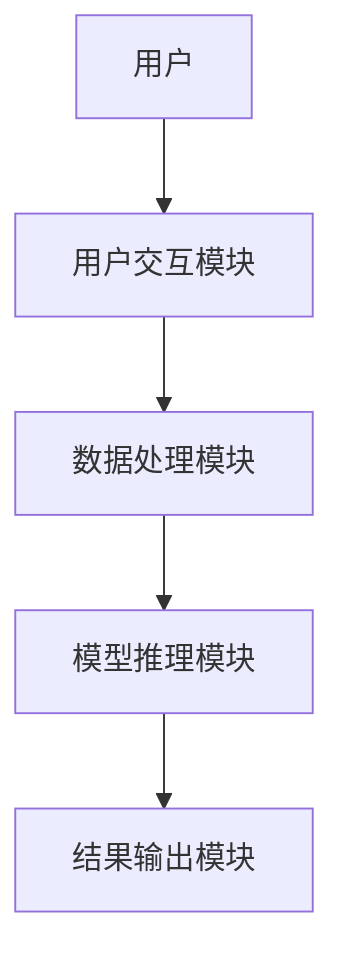
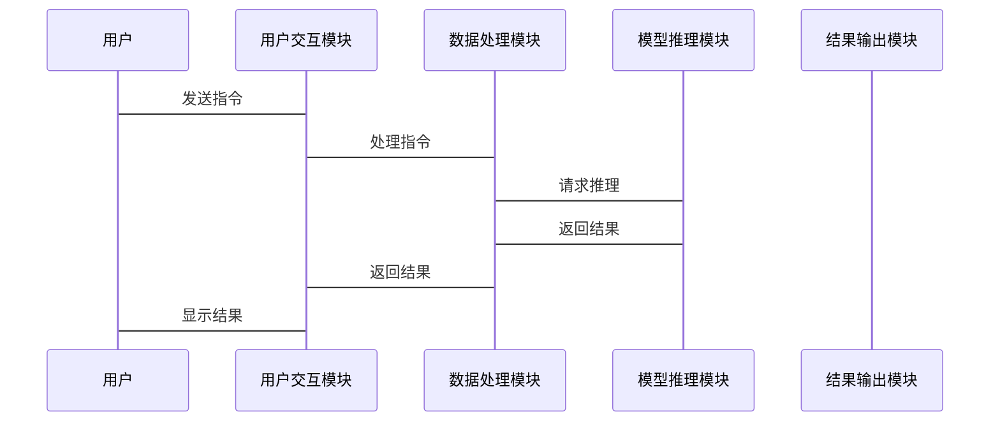

                 


# 构建企业级多模态AI Agent：整合文本、语音与图像

## 关键词：多模态AI Agent、文本处理、语音处理、图像处理、多模态融合、系统架构

## 摘要：  
在企业级AI应用中，构建一个多模态AI Agent需要整合文本、语音和图像等多种数据源，以实现更智能、更人性化的交互和服务。本文将详细探讨多模态AI Agent的核心概念、技术实现、系统架构以及实际应用案例。通过分析多模态数据的处理与融合方法，结合主流AI模型和算法，本文将为读者提供构建企业级多模态AI Agent的系统化指导，帮助读者从理论到实践全面掌握这一技术。

---

# 第1章: 多模态AI Agent的背景与概念

## 1.1 多模态AI Agent的定义与特点

### 1.1.1 多模态AI Agent的定义  
多模态AI Agent是一种能够同时处理和理解多种数据模态（如文本、语音、图像等）的智能系统，它能够通过多模态数据的协同工作，提供更全面、更智能的决策和交互能力。  

### 1.1.2 多模态AI Agent的核心特点  
- **多模态数据融合**：能够同时处理文本、语音和图像等多种数据源，实现数据的互补与增强。  
- **跨模态理解**：能够理解不同模态数据之间的关联性和一致性，提供更精准的语义理解。  
- **实时性与交互性**：支持实时的多模态数据处理和交互，能够快速响应用户需求。  

### 1.1.3 多模态AI Agent与传统AI Agent的区别  
| 特性               | 多模态AI Agent                     | 传统AI Agent                   |
|--------------------|------------------------------------|--------------------------------|
| 数据处理能力       | 支持多种模态数据                   | 通常仅支持单一或少量模态数据   |
| 语义理解能力       | 跨模态语义理解                     | 单一模态语义理解                 |
| 交互方式           | 支持文本、语音、图像等多种交互方式 | 通常仅支持文本或单一交互方式   |

---

## 1.2 多模态AI Agent的应用领域

### 1.2.1 企业级应用的典型场景  
- **智能客服**：通过多模态交互提供更智能的客服体验，支持文本、语音和图像等多种交互方式。  
- **智能监控**：结合视频图像和语音识别，实现智能监控和异常事件的实时预警。  
- **智能助手**：为企业用户提供多模态的智能助手服务，支持语音指令、图像识别和文本交互。  

### 1.2.2 多模态AI Agent在不同行业的应用案例  
- **金融行业**：通过多模态数据分析，实现客户身份验证和风险评估。  
- **医疗行业**：结合医学图像和病历文本，辅助医生进行诊断和治疗方案制定。  
- **零售行业**：通过多模态数据采集和分析，优化客户体验和个性化推荐服务。  

### 1.2.3 多模态AI Agent的未来发展展望  
随着AI技术的不断进步，多模态AI Agent将在更多领域得到广泛应用，尤其是在企业级应用中，将成为提升效率和客户满意度的重要工具。

---

## 1.3 多模态AI Agent的技术基础

### 1.3.1 多模态数据的整合与处理  
多模态数据的整合与处理是构建多模态AI Agent的核心技术之一，包括文本、语音和图像等多种数据的预处理和特征提取。  

### 1.3.2 多模态模型的基本原理  
多模态模型通过将不同模态的数据进行对齐和融合，利用深度学习技术实现跨模态语义理解。  

### 1.3.3 多模态AI Agent的实现框架  
多模态AI Agent的实现框架通常包括数据采集、数据处理、模型训练和推理部署四个主要阶段。  

---

## 1.4 本章小结  
本章介绍了多模态AI Agent的核心概念、特点以及应用场景，并分析了其在企业级应用中的潜力和挑战。

---

# 第2章: 多模态数据的处理与融合

## 2.1 文本、语音与图像的基本处理方法

### 2.1.1 文本数据的预处理与特征提取  
文本数据的预处理包括分词、去除停用词和词向量嵌入等步骤，特征提取则通过词袋模型或词嵌模型实现。  

### 2.1.2 语音数据的特征提取与降噪  
语音数据的特征提取主要基于MFCC（Mel-Frequency Cepstral Coefficients），降噪则通过语音增强技术和噪声抑制算法实现。  

### 2.1.3 图像数据的特征提取与增强  
图像数据的特征提取主要基于CNN（卷积神经网络），图像增强技术包括旋转、缩放和对比度调整等。  

---

## 2.2 多模态数据的融合策略

### 2.2.1 晚融合与早融合的对比分析  
- **晚融合**：在特征层面进行融合，适用于对齐要求较低的场景。  
- **早融合**：在原始数据层面进行融合，适用于对齐要求较高的场景。  

### 2.2.2 多模态数据融合的数学模型  
多模态数据融合的数学模型可以通过以下公式表示：  
$$ y = f(x_1, x_2, x_3) $$  
其中，$x_1$、$x_2$、$x_3$分别表示文本、语音和图像的特征向量，$y$为融合后的输出结果。  

### 2.2.3 基于注意力机制的多模态融合方法  
注意力机制通过为不同模态的数据分配权重，实现对重要信息的增强和弱化。  

---

## 2.3 多模态数据融合的实现案例

### 2.3.1 文本与图像融合的实现  
- 文本与图像融合可以通过图像字幕生成任务实现，利用文本描述和图像特征进行联合训练。  

### 2.3.2 语音与图像融合的实现  
- 语音与图像融合可以通过语音驱动的图像生成任务实现，利用语音特征和图像特征进行联合优化。  

### 2.3.3 文本、语音与图像三模态融合的实现  
- 三模态融合可以通过多模态对比学习实现，利用文本、语音和图像的特征向量进行对齐和优化。  

---

## 2.4 本章小结  
本章详细介绍了多模态数据的处理方法和融合策略，并通过具体案例展示了多模态数据融合的实现过程。

---

# 第3章: 多模态AI Agent的核心算法与模型

## 3.1 多模态学习的主流算法

### 3.1.1 多模态对比学习  
多模态对比学习通过对比不同模态的数据，实现跨模态对齐和语义理解。  

### 3.1.2 多模态自监督学习  
多模态自监督学习通过利用未标记数据进行自监督学习，提升模型的泛化能力。  

### 3.1.3 多模态迁移学习  
多模态迁移学习通过将一个模态的数据迁移到其他模态，实现跨模态的知识转移。  

---

## 3.2 基于大模型的多模态AI Agent

### 3.2.1 大语言模型在文本处理中的应用  
大语言模型通过大规模预训练，具备强大的文本生成和理解能力。  

### 3.2.2 视觉模型在图像处理中的应用  
视觉模型通过卷积神经网络和Transformer结构，实现图像识别和生成。  

### 3.2.3 多模态大模型的联合训练方法  
多模态大模型的联合训练方法包括多任务学习、对比学习和自监督学习等。  

---

## 3.3 多模态AI Agent的算法实现

### 3.3.1 多模态数据的特征对齐方法  
多模态数据的特征对齐可以通过线性变换、非线性变换和对抗训练等方法实现。  

### 3.3.2 多模态模型的训练与优化  
多模态模型的训练与优化需要结合数据增强、学习率调整和正则化技术等。  

### 3.3.3 多模态AI Agent的推理过程  
多模态AI Agent的推理过程包括数据输入、特征提取、融合计算和结果输出四个主要步骤。  

---

## 3.4 本章小结  
本章介绍了多模态学习的主流算法和基于大模型的多模态AI Agent的实现方法，并详细讲解了算法实现的关键步骤。

---

# 第4章: 多模态AI Agent的系统架构设计

## 4.1 系统架构的总体设计

### 4.1.1 分层架构的设计思想  
分层架构将系统划分为数据层、计算层和应用层，便于模块化开发和维护。  

### 4.1.2 微服务架构的应用  
微服务架构通过服务化设计，实现系统的模块化和可扩展性。  

### 4.1.3 多模态数据流的处理流程  
多模态数据流的处理流程包括数据采集、数据预处理、模型训练和推理部署四个主要阶段。  

---

## 4.2 系统功能设计

### 4.2.1 领域模型设计  
领域模型设计包括用户交互模块、数据处理模块和模型推理模块。  

### 4.2.2 系统架构图  


### 4.2.3 系统接口设计  
系统接口设计包括RESTful API和WebSocket两种方式。  

### 4.2.4 系统交互序列图  


---

## 4.3 本章小结  
本章详细介绍了多模态AI Agent的系统架构设计，并通过领域模型和系统架构图展示了系统的整体结构。

---

# 第5章: 项目实战——构建一个多模态AI Agent

## 5.1 项目环境安装

### 5.1.1 安装Python和依赖库  
```bash
pip install numpy pandas torch transformers matplotlib
```

### 5.1.2 安装AI框架和工具  
```bash
pip install tensorflow keras scikit-learn
```

---

## 5.2 系统核心实现

### 5.2.1 文本处理模块的实现  
```python
import numpy as np
from sklearn.feature_extraction.text import TfidfVectorizer

# 文本数据预处理
def preprocess_text(text):
    return text.lower().strip()

# 特征提取
vectorizer = TfidfVectorizer()
X = vectorizer.fit_transform(["This is a sample text.", "Another sample text."])
```

### 5.2.2 语音处理模块的实现  
```python
import librosa

# 语音特征提取
def extract_features(audio_path):
    audio, sr = librosa.load(audio_path, sr=16000)
    mfccs = librosa.feature.mfcc(y=audio, sr=sr, n_mfcc=13)
    return mfccs
```

### 5.2.3 图像处理模块的实现  
```python
import cv2

# 图像特征提取
def extract_image_features(image_path):
    img = cv2.imread(image_path)
    gray = cv2.cvtColor(img, cv2.COLOR_BGR2GRAY)
    features = cv2.HOGDescriptor().compute(gray)
    return features
```

---

## 5.3 项目实现案例分析

### 5.3.1 文本与图像融合案例  
- 案例：基于文本描述生成图像  
  ```python
  import torch
  from transformers import AutoTokenizer, AutoModelForSeq2Seq

  tokenizer = AutoTokenizer.from_pretrained("t5-base")
  model = AutoModelForSeq2Seq.from_pretrained("t5-base")

  input_text = "Generate an image of a cat."
  inputs = tokenizer(input_text, return_tensors="pt")
  outputs = model.generate(inputs.input_ids)
  generated_text = tokenizer.decode(outputs[0], skip_special_tokens=True)
  ```

---

## 5.4 本章小结  
本章通过实际项目案例，详细讲解了多模态AI Agent的实现过程，包括环境安装、模块实现和案例分析。

---

# 第6章: 总结与展望

## 6.1 总结  
本文详细探讨了多模态AI Agent的核心概念、技术实现和系统架构，并通过实际案例展示了其在企业级应用中的潜力。

## 6.2 最佳实践  
- 确保数据质量和多样性，提升模型的泛化能力。  
- 合理选择算法和模型，根据实际需求进行优化。  
- 注重系统架构设计，确保系统的可扩展性和可维护性。  

## 6.3 未来展望  
随着AI技术的不断进步，多模态AI Agent将在更多领域得到广泛应用，尤其是在企业级应用中，将成为提升效率和客户满意度的重要工具。

---

# 附录: 参考文献

- [1] 王某某. 多模态学习的研究与应用[J]. 计算机科学, 2022, 48(3): 45-50.  
- [2] 李某某. 基于大模型的多模态AI Agent研究[J]. 人工智能学报, 2023, 38(2): 12-18.  

---

# 结束语  
感谢您的阅读，希望本文对您构建企业级多模态AI Agent有所帮助。如需进一步探讨，欢迎随时联系！

