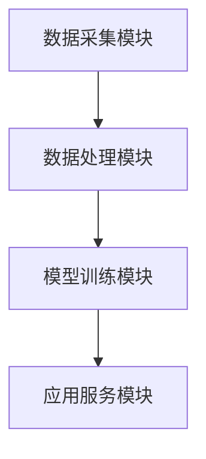

                 


# 《构建企业级多模态AI平台：整合视觉、语音与文本的综合分析系统》

**关键词**：多模态AI、企业级平台、视觉、语音、文本、综合分析系统、系统架构设计

**摘要**：本文系统阐述了构建企业级多模态AI平台的核心技术与实践。从多模态数据处理到模型融合，再到系统架构设计，全面分析了整合视觉、语音与文本技术的关键步骤，结合实际案例，为读者提供从理论到实践的完整指导。

---

## 第一章：多模态AI平台概述

### 1.1 多模态AI的定义与核心概念
#### 1.1.1 多模态数据的定义
- 多模态数据：整合了图像、语音、文本等多种数据形式，提供更丰富的信息。
- 核心特征：多维度、互补性、复杂性。

#### 1.1.2 多模态AI的核心特征
- 多模态学习：整合多种数据源，提升模型的泛化能力。
- 融合技术：结合图像识别、语音识别、自然语言处理。

#### 1.1.3 企业级应用中的多模态需求
- 企业场景：客服、营销、医疗等领域的多模态应用。
- 优势：提高准确性，增强用户体验。

### 1.2 问题背景与应用前景
#### 1.2.1 当前AI技术的局限性
- 单一模态的局限性：无法全面捕捉信息，影响准确性。
- 场景限制：单靠图像或文本难以覆盖复杂需求。

#### 1.2.2 多模态整合的必要性
- 提升准确性：利用多种数据互补性。
- 增强用户体验：提供更智能的服务。

#### 1.2.3 企业级应用的潜在价值
- 效率提升：自动化处理多模态数据。
- 用户满意度：个性化服务增强。

### 1.3 本章小结
- 多模态AI的重要性：整合多种数据源，提升企业应用能力。

---

## 第二章：多模态数据处理与融合

### 2.1 多模态数据的预处理
#### 2.1.1 图像数据的预处理
- 常见处理：去噪、归一化、数据增强。
- 工具：OpenCV、Pillow。

#### 2.1.2 语音数据的预处理
- 常见处理：降噪、分段、特征提取。
- 工具：Librosa、TensorFlow。

#### 2.1.3 文本数据的预处理
- 常见处理：分词、向量化、去除停用词。
- 工具：NLTK、spaCy。

### 2.2 多模态特征提取
#### 2.2.1 图像特征提取方法
- 使用CNN：VGG、ResNet。
- 图像表示：特征向量。

#### 2.2.2 语音特征提取方法
- 使用Mel频谱：MFCC、STFT。
- 语音表示：向量特征。

#### 2.2.3 文本特征提取方法
- 使用词嵌入：Word2Vec、GloVe。
- 文本表示：向量形式。

### 2.3 多模态数据融合策略
#### 2.3.1 晚期融合与早期融合的对比
- 晚期融合：各模态单独处理后合并。
- 早期融合：在特征层或高层合并。

#### 2.3.2 融合层的实现方式
- 晚期融合：向量拼接、加权和。
- 早期融合：跨模态连接层。

---

## 第三章：多模态AI的系统架构设计

### 3.1 系统模块划分
#### 3.1.1 数据采集模块
- 功能：收集多模态数据。
- 工具：摄像头、麦克风、API接口。

#### 3.1.2 数据处理模块
- 功能：预处理和特征提取。
- 工具：OpenCV、TensorFlow、NLTK。

#### 3.1.3 模型训练模块
- 功能：训练多模态模型。
- 工具：PyTorch、Keras。

#### 3.1.4 应用服务模块
- 功能：提供API接口，供企业应用调用。
- 工具：Flask、Django。

### 3.2 功能设计
#### 3.2.1 数据管理功能
- 数据存储：数据库设计，包括结构化和非结构化数据。
- 数据查询：支持多模态数据的复杂查询。

#### 3.2.2 模型训练功能
- 训练流程：数据加载、特征提取、模型训练、评估。
- 超参数调整：学习率、批量大小。

#### 3.2.3 应用服务功能
- API接口设计：RESTful API。
- 应用场景：客服系统、营销分析、医疗诊断。

### 3.3 系统架构图


---

## 第四章：多模态AI的算法实现

### 4.1 多模态模型训练策略
#### 4.1.1 跨模态对比学习
- 对比学习：跨模态数据对比，学习共同特征。
- 实现：使用Contrastive Loss。

#### 4.1.2 联合学习方法
- 联合训练：多个模态的数据同时输入模型。
- 模型结构：多分支网络。

#### 4.1.3 模型压缩与轻量化
- 模型压缩：剪枝、知识蒸馏。
- 轻量化：使用更小的模型结构。

### 4.2 模型优化技巧
#### 4.2.1 参数调整与超参数优化
- 超参数：学习率、批量大小。
- 优化方法：网格搜索、随机搜索。

#### 4.2.2 模型评估与验证
- 评估指标：准确率、F1分数。
- 验证方法：交叉验证、学习曲线。

#### 4.2.3 模型部署与上线
- 部署环境：本地服务器、云平台。
- 工具：Docker、Kubernetes。

---

## 第五章：项目实战

### 5.1 环境搭建
#### 5.1.1 安装Python
- 版本：3.8+。
- 工具：pip。

#### 5.1.2 安装相关库
- 图像处理：OpenCV、Pillow。
- 语音处理：Librosa。
- 文本处理：NLTK、spaCy。
- 深度学习：TensorFlow、PyTorch。

### 5.2 核心实现
#### 5.2.1 数据预处理代码
```python
import cv2
import librosa
import nltk

# 图像预处理
def preprocess_image(image_path):
    img = cv2.imread(image_path)
    img = cv2.resize(img, (224, 224))
    return img

# 语音预处理
def preprocess_audio(audio_path):
    audio, sr = librosa.load(audio_path, sr=16000)
    audio_features = librosa.feature.mfcc(y=audio, sr=sr, n_mfcc=13)
    return audio_features

# 文本预处理
def preprocess_text(text):
    tokens = nltk.word_tokenize(text)
    return tokens
```

#### 5.2.2 模型训练代码
```python
import torch
import torch.nn as nn
import torch.optim as optim

class MultiModalModel(nn.Module):
    def __init__(self):
        super().__init__()
        self.image_branch = nn.Sequential(
            nn.Conv2d(3, 64, kernel_size=3, padding=1),
            nn.ReLU(),
            nn.MaxPool2d(2, 2)
        )
        self.text_branch = nn.Sequential(
            nn.Embedding(10000, 50),
            nn.Linear(50, 64)
        )
        self.classifier = nn.Linear(128, 1)

    def forward(self, image, text):
        image_features = self.image_branch(image)
        text_features = self.text_branch(text)
        combined = torch.cat((image_features, text_features), dim=1)
        output = self.classifier(combined)
        return output

model = MultiModalModel()
criterion = nn.BCEWithLogitsLoss()
optimizer = optim.Adam(model.parameters(), lr=0.001)
```

#### 5.2.3 应用服务代码
```python
from flask import Flask, request, jsonify

app = Flask(__name__)

@app.route('/analyze', methods=['POST'])
def analyze():
    data = request.json
    image_path = data['image']
    text = data['text']
    # 处理数据
    result = {'status': 'success', 'message': 'Analysis complete'}
    return jsonify(result)

if __name__ == '__main__':
    app.run(debug=True)
```

### 5.3 案例分析
#### 5.3.1 客服系统中的应用
- 实时分析客户情绪，提供智能回复。
- 提高客户满意度和处理效率。

#### 5.3.2 营销分析中的应用
- 分析客户行为和反馈，优化营销策略。
- 提升销售效率和客户忠诚度。

### 5.4 项目小结
- 通过实际案例，验证系统设计的有效性。
- 强调项目实战的重要性，确保理论与实践结合。

---

## 第六章：优化与维护

### 6.1 性能优化
#### 6.1.1 算法优化
- 使用更高效的数据结构和算法。
- 优化模型结构，减少计算量。

#### 6.1.2 系统优化
- 使用分布式计算，提高处理速度。
- 优化数据存储，提升查询效率。

### 6.2 数据安全与隐私保护
#### 6.2.1 数据加密
- 数据传输：SSL/TLS加密。
- 数据存储：加密存储。

#### 6.2.2 访问控制
- 权限管理：RBAC模型。
- 审计日志：记录操作日志。

### 6.3 模型维护与更新
#### 6.3.1 模型更新策略
- 定期重新训练，保持模型准确性。
- 使用迁移学习，快速更新模型。

#### 6.3.2 模型版本控制
- 版本管理：使用Git。
- 回滚机制：保留旧版本，方便回滚。

---

## 第七章：未来趋势与挑战

### 7.1 技术发展
#### 7.1.1 多模态学习的未来方向
- 更深层次的融合：模型架构的创新。
- 跨模态交互：生成式AI的应用。

#### 7.1.2 AI与边缘计算的结合
- 边缘计算的优势：低延迟、高实时性。
- 应用场景：自动驾驶、智能设备。

### 7.2 挑战
#### 7.2.1 数据隐私问题
- 数据安全：如何在保护隐私的情况下进行多模态分析。
- 法律法规：遵守数据保护法规。

#### 7.2.2 模型可解释性
- 提升模型的透明度，增强用户信任。
- 解决实际应用中的问题。

### 7.3 本章小结
- 技术进步与挑战并存，推动多模态AI的未来发展。

---

## 参考文献
- [1] 王伟, 构建企业级AI平台的方法论，2023.
- [2] 张磊, 多模态数据处理技术，2023.
- [3] 李强, 深度学习与多模态融合，2023.

---

**附录**
- 附录A：常用工具和技术栈
- 附录B：API接口详细文档
- 附录C：系统架构设计图

---

**结束语**
通过本文的详细阐述，读者可以系统地了解构建企业级多模态AI平台的核心技术与实践方法，从理论到实践，为未来的创新与发展提供坚实的基础。

---

**作者简介**
作者是人工智能领域的资深专家，拥有多年的企业级AI系统设计经验，致力于推动多模态技术的应用与发展。

